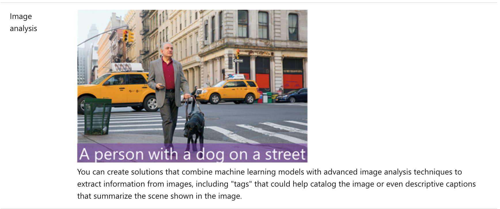

This notebook is refer from the Microsoft resources: [Get started with artificial intelligence on Azure](https://docs.microsoft.com/en-gb/learn/paths/get-started-with-artificial-intelligence-on-azure/).

### Trophy 1: Get started with artificial intelligence on Azure

Artificial Intelligence (AI) empowers amazing new solutions and experiences; and Microsoft Azure provides easy to use services to help you get started.

### Topic 1: Introduction to AI

AI enables us to build amazing software that can improve health care, enable people to overcome physical disadvantages, empower smart infrastructure, create incredible entertainment experiences, and even save the planet!

Watch the following video to see some ways that AI can be used.

#### 1.1 What is AI?
Simply put, AI is the creation of software that imitates human behaviors and capabilities. Key elements include:

- **Machine learning** - This is often the foundation for an AI system, and is the way we "teach" a computer model to make prediction and draw conclusions from data.

- **Anomaly detection** - The capability to automatically detect errors or unusual activity in a system.
Computer vision - The capability of software to interpret the world visually through cameras, video, and images.

- **Natural language processing** - The capability for a computer to interpret written or spoken language, and respond in kind.

- **Conversational AI** - The capability of a software "agent" to participate in a conversation.


### Topic 2: Understand machine learning

Machine Learning is the foundation for most AI solutions.

Let's start by looking at a real-world example of how machine learning can be used to solve a difficult problem.

Sustainable farming techniques are essential to maximize food production while protecting a fragile environment. The Yield, an agricultural technology company based in Australia, uses sensors, data and machine learning to help farmers make informed decisions related to weather, soil and plant conditions.

View the following video to learn more.

#### 2.1 How machine learning works

So how do machines learn?

The answer is, from data. In today's world, we create huge volumes of data as we go about our everyday lives. From the text messages, emails, and social media posts we send to the photographs and videos we take on our phones, we generate massive amounts of information. More data still is created by millions of sensors in our homes, cars, cities, public transport infrastructure, and factories.

Data scientists can use all of that data to train machine learning models that can make predictions and inferences based on the relationships they find in the data.

For example, suppose an environmental conservation organization wants volunteers to identify and catalog different species of wildflower using a phone app. The following animation shows how machine learning can be used to enable this scenario.


1. A team of botanists and data scientists collects samples of wildflowers.

2. The team labels the samples with the correct species.

3. The labeled data is processed using an algorithm that finds relationships between the features of the samples and the labeled species.

4. The results of the algorithm are encapsulated in a model.

5. When new samples are found by volunteers, the model can identify the correct species label.


### Topic 3: Understand anomaly detection

Imagine you're creating a software system to monitor credit card transactions and detect unusual usage patterns that might indicate fraud. Or an application that tracks activity in an automated production line and identifies failures. Or a racing car telemetry system that uses sensors to proactively warn engineers about potential mechanical failures before they happen.

These kinds of scenario can be addressed by using anomaly detection - a machine learning based technique that analyzes data over time and identifies unusual changes.

Let's explore how anomaly detection might help in the racing car scenario.


1. Sensors in the car collect telemetry, such as engine revolutions, brake temperature, and so on.

2. An anomaly detection model is trained to understand expected fluctuations in the telemetry measurements over time.

3. If a measurement occurs outside of the normal expected range, the model reports an anomaly that can be used to alert the race engineer to call the driver in for a pit stop to fix the issue before it forces retirement from the race.

#### 3.1 Anomaly detection in Microsoft Azure

In Microsoft Azure, the **Anomaly Detector** service provides an application programming interface (API) that developers can use to create anomaly detection solutions.

To learn more, view the [Anomaly Detector service web site](https://azure.microsoft.com/services/cognitive-services/anomaly-detector/).


### Topic 4: Understand computer vision

Computer Vision is an area of AI that deals with visual processing. Let's explore some of the possibilities that computer vision brings.

The **Seeing AI** app is a great example of the power of computer vision. Designed for the blind and low vision community, the Seeing AI app harnesses the power of AI to open up the visual world and describe nearby people, text and objects.

To find out more, check out the [Seeing AI web page](https://www.microsoft.com/ai/seeing-ai).

#### 4.1 Computer Vision models and capabilities

Most computer vision solutions are based on machine learning models that can be applied to visual input from cameras, videos, or images. The following table describes common computer vision tasks.





#### 4.2 Computer vision services in Microsoft Azure

Microsoft Azure provides the following cognitive services to help you create computer vision solutions:


#### 4.3 Try this

To see an example of a how computer vision can be used to analyze images, follow these steps:

1. Open another browser tab and go to https://aidemos.microsoft.com/computer-vision.

2. Use the demo interface to try each of the steps. For each step, you can select images and review the information returned by the Computer Vision service.


### Topic 5: Understand natural language processing

Natural language processing (NLP) is the area of AI that deals with creating software that understands written and spoken language.

NLP enables you to create software that can:

- Analyze and interpret text in documents, email messages, and other sources.

- Interpret spoken language, and synthesize speech responses.

- Automatically translate spoken or written phrases between languages.

-Interpret commands and determine appropriate actions.

For example, *Starship Commander*, is a virtual reality (VR) game from Human Interact, that takes place in a science fiction world. The game uses natural language processing to enable players to control the narrative and interact with in-game characters and starship systems.

#### 5.1 Natural language processing in Microsoft Azure


#### 5.2 Try this

To see an example of a how you can use natural language to interact with an AI system, follow these steps:

1. Open another browser tab and go to https://aidemos.microsoft.com/luis/demo.

2. Use the demo interface to control the lighting in the virtual home. You can type instructions, use the microphone button to speak commands, or select any of the suggested phrases to see how the system responds.


### Topic 6: Understand conversational AI

**Conversational AI is the term used to describe solutions where AI agents participate in conversations with humans**. Most commonly, conversational AI solutions use *bots* to manage dialogs with users. These dialogs can take place through web site interfaces, email, social media platforms, messaging systems, phone calls, and other channels.

Bots can be the basis of AI solutions for:

- Customer support for products or services.

- Reservation systems for restaurants, airlines, cinemas, and other appointment based businesses.

- Health care consultations and self-diagnosis.

- Home automation and personal digital assistants.

#### 6.1 Conversational AI in Microsoft Azure


#### 6.2 Try this

The Microsoft healthcare bot is built on Azure Bot Service and enables developers to quickly create conversational AI solutions for health care. To see an example of the healthcare bot:

1. Open another browser tab and go to https://www.microsoft.com/research/project/health-bot/.

2. Select the option to *Try a demo of an example end-user experience*.

3. Use the web chat interface to interact with the bot.


### Topic 7: Understand responsible AI

Artificial Intelligence is a powerful tool that can be used to greatly benefit the world. However, like any tool, it must be used responsibly.

At Microsoft, AI software development is guided by a set of six principles, designed to ensure that AI applications provide amazing solutions to difficult problems without any unintended negative consequences.

#### 7.1 Fairness

AI systems should treat all people fairly. For example, suppose you create a machine learning model to support a loan approval application for a bank. The model should make predictions of whether or not the loan should be approved without incorporating any bias based on gender, ethnicity, or other factors that might result in an unfair advantage or disadvantage to specific groups of applicants.

Azure Machine Learning includes the capability to interpret models and quantify the extent to which each feature of the data influences the model's prediction. This capability helps data scientists and developers identify and mitigate bias in the model.

#### 7.2 Reliability and safety

AI systems should perform reliably and safely. For example, consider an AI-based software system for an autonomous vehicle; or a machine learning model that diagnoses patient symptoms and recommends prescriptions. Unreliability in these kinds of system can result in substantial risk to human life.

AI-based software application development must be subjected to rigorous testing and deployment management processes to ensure that they work as expected before release.

#### 7.3 Privacy and security

AI systems should be secure and respect privacy. The machine learning models on which AI systems are based rely on large volumes of data, which may contain personal details that must be kept private. Even after the models are trained and the system is in production, it uses new data to make predictions or take action that may be subject to privacy or security concerns.

#### 7.4 Inclusiveness

AI systems should empower everyone and engage people. AI should bring benefits to all parts of society, regardless of physical ability, gender, sexual orientation, ethnicity, or other factors.

#### 7.5 Transparency

AI systems should be understandable. Users should be made fully aware of the purpose of the system, how it works, and what limitations may be expected.

#### 7.6 Accountability

People should be accountable for AI systems. Designers and developers of AI-based solution should work within a framework of governance and organizational principles that ensure the solution meets ethical and legal standards that are clearly defined.


### Topic 8: Explore responsible AI in practice

The principles of responsible AI can help you understand some of the challenges facing developers as they try to create ethical AI solutions. It's easy to read about the principles, or watch a video; but it's much harder to put the principles into practice.

#### 8.1 Try this

Here's an activity to help you learn more about how principles apply to an AI system that interacts with human users.

1. Open another browser tab and go to https://aidemos.microsoft.com/guidelines-for-human-ai-interaction/demo.

2. Select cards from each of the decks, which represent four phases in a Human-AI interaction:

    - Initially

    - During the interaction

    - When something goes wrong

    - Over time
    
3. For each card, view the examples provided.

4. Try to identify which of the six principles the examples reflect (an example might reflect more than one principle).

#### 8.2 Further resources

For more resources to help you put the responsible AI principles into practice, see https://www.microsoft.com/ai/responsible-ai-resources.


### Topic 9: Knowledge check


### Topic 10: Summary

Artificial Intelligence enables the creation of powerful solutions to many kinds of problem. AI systems can exhibit human characteristics to analyze the world around them, make predictions or inferences, and act on them in ways that we could only imagine a short time ago.

With this power, comes responsibility. As developers of AI solution, we must apply principles that ensure that everyone benefits from AI without disadvantaging any individual or section of society.


```{r echo=FALSE, eval=FALSE, message=FALSE}
rmarkdown::render(input = "AI01_azure_start.Rmd", output_format = "github_document", output_file = "README.md")
```

