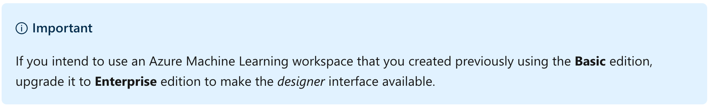
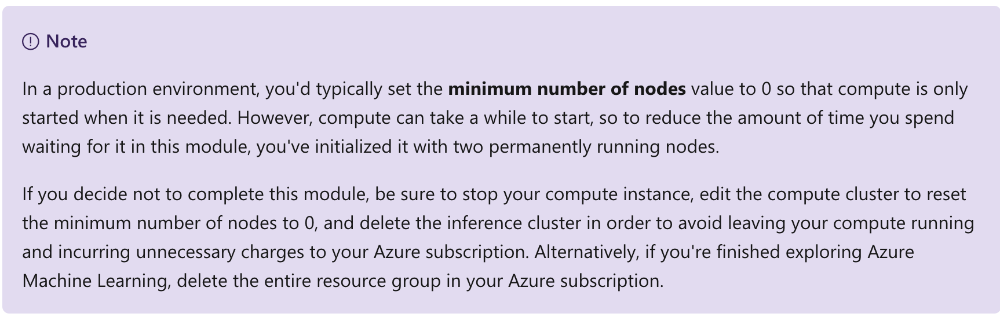
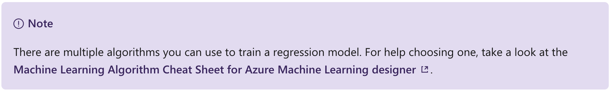
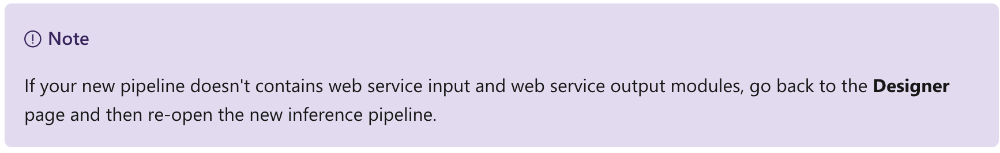
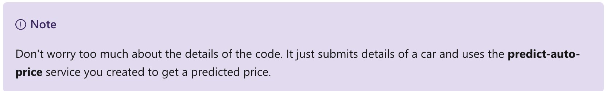
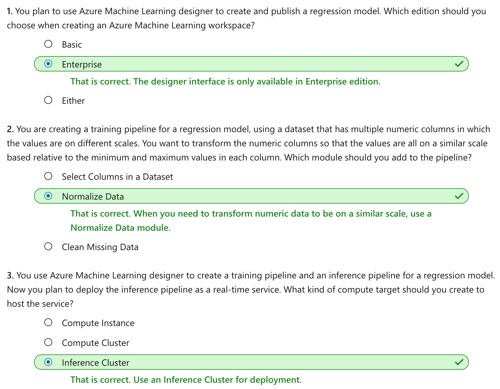

This notebook is refer from the Microsoft resources: [Create no-code predictive models with Azure Machine Learning](https://docs.microsoft.com/en-gb/learn/paths/create-no-code-predictive-models-azure-machine-learning/).

### Module 2: Create a Regression Model with Azure Machine Learning designer

Regression is a supervised machine learning technique used to predict numeric values. Learn how to create regression models using Azure Machine Learning designer.


### Topic 1: Introduction

Regression is a form of machine learning that is used to predict a numeric label based on an item's features. For example, an automobile sales company might use the characteristics of car (such as engine size, number of seats, mileage, and so on) to predict its likely selling price. In this case, the characteristics of the car are the features, and the selling price is the label.


Regression is an example of a *supervised* machine learning technique in which you train a model using data that includes both the features and known values for the label, so that the model learns to *fit* the feature combinations to the label. Then, after training has been completed, you can use the trained model to predict labels for new items for which the label is unknown.

You can use Microsoft Azure Machine Learning designer to create regression models by using a drag and drop visual interface, without needing to write any code.

In this module, you'll learn how to:

- Use Azure Machine Learning designer to train a regression model.

- Use a regression model for inferencing.

- Deploy a regression model as a service.

To complete this module, you'll need a Microsoft Azure subscription. If you don't already have one, you can sign up for a free trial at https://azure.microsoft.com


### Topic 2: Create an Azure Machine Learning workspace

Azure Machine Learning is a cloud-based platform for building and operating machine learning solutions in Azure. It includes a wide range of features and capabilities that help data scientists prepare data, train models, publish predictive services, and monitor their usage. One of these features is a visual interface called designer, that you can use to train, test, and deploy machine learning models without writing any code.

#### 2.1 Create an Azure Machine Learning workspace

To use Azure Machine Learning, you create a workspace in your Azure subscription. You can then use this workspace to manage data, compute resources, code, models, and other artifacts related to your machine learning workloads.

If you do not already have one, follow these steps to create a workspace:

1. Sign into the [Azure portal](https://portal.azure.com/) using your Microsoft credentials.

2. Select **＋Create** a resource, search for Machine Learning, and create a new **Machine Learning** resource the following settings:

    - **Workspace Name**: A unique name of your choice
    
    - **Subscription**: Your Azure subscription
    
    - **Resource group**: Create a new resource group with a unique name
    
    - **Location**: Choose any available location
    
    - **Workspace edition**: Enterprise
    
3. Wait for your workspace to be created (it can take a few minutes). Then go to it in the portal.

4. On the **Overview** page for your workspace, launch Azure Machine Learning Studio (or open a new browser tab and navigate to https://ml.azure.com), and sign into Azure Machine Learning studio using your Microsoft account.

5. In Azure Machine Learning studio, toggle the ☰ icon at the top left to view the various pages in the interface. You can use these pages to manage the resources in your workspace.

You can manage your workspace using the Azure portal, but for data scientists and Machine Learning operations engineers, Azure Machine Learning studio provides a more focused user interface for managing workspace resources.




### Topic 3: Create compute resources

To train and deploy models using Azure Machine Learning designer, you need compute on which to run the training process, test the model, and host the model in a deployed service.

#### 3.1 Create compute targets

Compute targets are cloud-based resources on which you can run model training and data exploration processes.

1. In [Azure Machine Learning studio](https://ml.azure.com/), view the **Compute** page (under **Manage**). This is where you manage the compute targets for your data science activities. There are four kinds of compute resource you can create:

    - **Compute Instances**: Development workstations that data scientists can use to work with data and models.

    - **Compute Clusters**: Scalable clusters of virtual machines for on-demand processing of experiment code.

    - **Inference Clusters**: Deployment targets for predictive services that use your trained models.

    - **Attached Compute**: Links to existing Azure compute resources, such as Virtual Machines or Azure Databricks clusters.

2. On the **Compute Instances** tab, add a new compute instance with the following settings. You'll use this to test your model:

    - **Compute name**: enter a unique name

    - **Virtual Machine type**: CPU

    - **Virtual Machine size**: Standard_DS2_v2
    
3. While the compute instance is being created, switch to the **Compute Clusters** tab, and add a new compute cluster with the following settings. You'll use this to train a machine learning model:

    - **Compute name**: enter a unique name
    
    - **Virtual Machine size**: Standard_DS2_v2
    
    - **Virtual Machine priority**: Dedicated
    
    - **Minimum number of nodes**: 2
    
    - **Maximum number of nodes**: 2
    
    - **Idle seconds before scale down**: 120
    
4. While the compute cluster is being created, switch to the **Inference Clusters** tab, and add a new cluster with the following settings. You'll use this to deploy your model as a service.

    - **Compute name**: enter a unique name

    - **Kubernetes Service**: Create new

    - **Region**: Select a different region than the one used for your workspace

    - **Virtual Machine size**: Standard_DS2_v2 (Use the filter to find this in the list)

    - **Cluster purpose**: Dev-test

    - **Number of nodes**: 2

    - **Network configuration**: Basic

    - **Enable SSL configuration**: Unselected
    
5. Verify that the inference cluster is in the Creating state - it will take a while to be created, so leave it for now.



The compute targets will take some time to be created. You can move onto the next unit while you wait.


### Topic 4: Explore data

To train a regression model, you need a dataset that includes historical *features* (characteristics of the entity for which you want to make a prediction) and known label values (the numeric value that you want to train a model to predict).

#### 4.1 Create a pipeline

To use the Azure Machine Learning designer, you create a pipeline that you will use to train a machine learning model. This pipeline starts with the dataset from which you want to train the model.

1. in [Azure Machine Learning studio](https://ml.azure.com/), view the **Designer** page (under **Author**), and select **+** to create a new pipeline.

2. In the **Settings** pane, change the default pipeline name (**Pipeline-Created-on-date**) to **Auto Price Training** (if the **Settings** pane is not visible, select the ⚙ icon next to the pipeline name at the top).

3. Observe that you need to specify a compute target on which to run the pipeline. In the **Settings** pane, use **Select compute target** to select the compute cluster you created previously.

#### 4.2 Add and explore a dataset

In this module, you'll train a regression model that predicts the price of an automobile based on its characteristics. Azure Machine Learning includes a sample dataset that you can use for this model.

1. On the left side of the designer, select the **Datasets** (⌕) tab, and drag the **Automobile price data (Raw)** dataset from the Samples section onto the canvas.

2. Select the **Automobile price data (Raw)** dataset on the canvas, and view its settings (the settings pane for the dataset may open automatically and cover the canvas). On the **outputs** tab, select the **Visualize** icon (which looks like a column chart).

3. Review the schema of the data, noting that you can see the distributions of the various columns as histograms.

4. Scroll to the right of the dataset until you see the **Price** column. This is the label your model will predict.

5. Select the column header for the **price** column and view the details that are displayed in the pane to the right. These include various statistics for the column values, and a histogram showing the distribution of the column values.

6. Scroll back to the left and select the **normalized-losses** column header. Then review the statistics for this column noting, there are quite a few missing values in this column. This will limit its usefulness in predicting the **price** label; so you might want to exclude it from training.

7. View the statistics for the **bore**, **stroke**, and **horsepower** columns, noting the number of missing values. These columns have significantly fewer missing values than **normalized-losses**, so they may still be useful in predicting **price** if you exclude the rows where the values are missing from training.

8. Compare the values in the **stroke**, **peak-rpm**, and **city-mpg** columns. These are all measured in different scales, and its possible that the larger values for **peak-rpm** might bias the training algorithm and create an over-dependency on this column compared to columns with lower values, such as **stroke**. Typically, data scientists mitigate this possible bias by *normalizing* the numeric columns so they're on the similar scales.

9. Close the **Automobile price data (Raw) result visualization** window, and then close or resize the settings pane using the X or ↗↙ icon so that you can see the dataset on the canvas like this:


#### 4.3 Add data transformations

You typically apply data transformations to prepare the data for modeling. In the case of the automobile price data, you'll add transformations to address the issues you identified when exploring the data.

1. In the pane on the left, view the **Modules** (⊞) tab and expand the **Data Transformation** section, which contains a wide range of modules you can use to transform data before model training.

2. Drag a **Select Columns in Dataset** module to the canvas, below the **Automobile price data (Raw)** module. Then connect the output at the bottom of the **Automobile price data (Raw)** module to the input at the top of the **Select Columns in Dataset** module, like this:


3. Select the **Select Columns in Dataset** module, and in its **Settings** pane on the right, select **Edit column**. Then in the **Select columns** window, select **By name** and use the + links to add all columns other than **normalized-losses**, like this:


In the rest of this exercise, you're going to create a pipeline that looks like this:


Follow the remaining steps, using the image above for reference as you add and configure the required modules.

4. Drag a **Clean Missing Data** module from the **Data Transformations** section, and place it under the **Select Columns in Dataset** module. Then connect the output from the Select Columns in Dataset module to the input of the **Clean Missing Data** module.

5. Select the **Clean Missing Data** module, and in the settings pane on the right, click **Edit column**. Then in the **Select columns** window, select **With rules**, in the **Include** list select **Column names**, in the box of column names enter bore, stroke, and horsepower (making sure you match the spelling and capitalization exactly), like this:


6. With the **Clean Missing Data** module still selected, in the settings pane, set the following configuration settings:

    - **Minimum missing value ratio**: 0.0

    - **Maximum missing value ratio**: 1.0
    
    - **Cleaning mode**: Remove entire row
    
7. Drag a **Normalize Data** module to the canvas, below the **Clean Missing Data** module. Then connect the left-most output from the **Clean Missing Data** module to the input of the **Normalize Data** module.

8. Select the **Normalize Data** module and view its settings, noting that it requires you to specify the transformation method and the columns to be transformed. Then, set the transformation to **MinMax** and edit the columns by applying a rule to include the following **Column names** (ensuring you match the spelling, capitalization, and hyphenation exactly):

    - **symboling**
    
    - **wheel-base**
    
    - **length**
    
    - **width**
    
    - **height**
    
    - **curb-weight**
    
    - **engine-size**
    
    - **bore**
    
    - **stroke**
    
    - **compression-ratio**
    
    - **horsepower**
    
    - **peak-rpm**
    
    - **city-mpg**
    
    - **highway-mpg**


#### 4.4 Run the pipeline

To apply your data transformations, you need to run the pipeline as an experiment.

1. Ensure your pipeline looks similar to this:


2. Select **Submit**, and run the pipeline as a new experiment named **auto-price-training** on your compute cluster.

3. Wait for the run to finish. This may take 5 minutes or more. When the run has completed, the modules should look like this:


#### 4.5 View the transformed data

The dataset is now prepared for model training.

1. Select the completed **Normalize Data** module, and in its **Settings** pane on the right, on the **Outputs + logs** tab, select the **Visualize** icon for the **Transformed dataset**.

2. View the data, noting that the **normalized-losses** column has been removed, all rows contain data for **bore**, **stroke**, and **horsepower**, and the numeric columns you selected have been normalized to a common scale.

3. Close the normalized data result visualization.


### Topic 5: Create and run a training pipeline

After you've used data transformations to prepare the data, you can use it to train a machine learning model.

#### 5.1 Add training modules
It's common practice to train the model using a subset of the data, while holding back some data with which to test the trained model. This enables you to compare the labels that the model predicts with the actual known labels in the original dataset.

In this exercise, you're going to extend the **Auto Price Training** pipeline as shown here:


Follow the steps below, using the image above for reference as you add and configure the required modules.

1. Open the **Auto Price Training** pipeline you created in the previous unit if it's not already open.

2. In the pane on the left, on the **Modules** tab, in the **Data Transformations** section, drag a **Split Data** module onto the canvas under the **Normalize Data** module. Then connect the *Transformed Dataset* (left) output of the **Normalize Data** module to the input of the **Split Data** module.

3. Select the **Split Data** module, and configure its settings as follows:

    - **Splitting mode**: Split Rows
    
    - **Fraction of rows in the first output dataset**: 0.7
    
    - **Random seed**: 123
    
    - **Stratified split**: False
    
4. Expand the **Model Training** section in the pane on the left, and drag a **Train Model** module to the canvas, under the **Split Data** module. Then connect the *Result dataset1* (left) output of the **Split Data** module to the *Dataset* (right) input of the **Train Model** module.

5. The model we're training will predict the **price** value, so select the **Train Model** module and modify its settings to set the **Label column** to **price** (matching the case and spelling exactly!)

6. The **price** label the model will predict is a numeric value, so we need to train the model using a *regression* algorithm. Expand the **Machine Learning Algorithms** section, and under **Regression**, drag a **Linear Regression** module to the canvas, to the left of the **Split Data** module and above the **Train Model** module. Then connect its output to the **Untrained model** (left) input of the **Train Model** module.



7. To test the trained model, we need to use it to *score* the validation dataset we held back when we split the original data - in other words, predict labels for the features in the validation dataset. Expand the **Model Scoring & Evaluation** section and drag a **Score Model** module to the canvas, below the **Train Model** module. Then connect the output of the **Train Model** module to the **Trained model** (left) input of the **Score Model** module; and drag the **Results dataset2** (right) output of the **Split Data** module to the **Dataset** (right) input of the **Score Model** module.

8. Ensure your pipeline looks like this:


#### 5.2 Run the training pipeline

Now you're ready to run the training pipeline and train the model.

1. Select **Submit**, and run the pipeline using the existing experiment named **auto-price-training**.

2. Wait for the experiment run to complete. This may take 5 minutes or more.

3. When the experiment run has completed, select the **Score Model** module and in the settings pane, on the **Outputs + logs** tab, under **Data outputs** in the **Scored dataset** section, use the **Visualize** icon to view the results.

3. Scroll to the right, and note that next to the **price** column (which contains the known true values of the label) there is a new column named **Scored labels**, which contains the predicted label values.

4. Close the **Score Model result visualization** window.

The model is predicting values for the price label, but how reliable are its predictions? To assess that, you need to evaluate the model.


### Topic 6: Evaluate a regression model

To evaluate a regression model, you could simply compare the predicted labels to the actual labels in the validation dataset to held back during training, but this is an imprecise process and doesn't provide a simple metric that you can use to compare the performance of multiple models.

#### 6.1 Add an Evaluate Model module

1. Open the **Auto Price Training** pipeline you created in the previous unit if it's not already open.

2. In the pane on the left, on the **Modules** tab, in the **Model Scoring & Evaluation** section, drag an **Evaluate Model** module to the canvas, under the **Score Model** module, and connect the output of the **Score Model** module to the **Scored dataset** (left) input of the **Evaluate Model** module.

3. Ensure your pipeline looks like this:


4. Select **Submit**, and run the pipeline using the existing experiment named **auto-price-training**.

5. Wait for the experiment run to complete.

6. When the experiment run has completed, select the **Evaluate Model** module and in the settings pane, on the **Outputs + logs** tab, under **Data outputs** in the **Evaluation results** section, use the **Visualize** icon to view the results. These include the following regression performance metrics:

    - **Mean Absolute Error (MAE)**: The average difference between predicted values and true values. This value is based on the same units as the label, in this case dollars. The lower this value is, the better the model is predicting.

    - **Root Mean Squared Error (RMSE)**: For this metric, the mean difference between predicted and true values is squared, and then the square root is calculated. The result is a metric based on the same unit as the label (dollars). When compared to the MAE (above), a larger difference indicates greater variance in the individual errors (for example, with some errors being very small, while others are large). If the MAE and RMSE are approximately the same, then all individual errors are of a similar magnitude.

    - **Relative Squared Error (RSE)**: A relative metric between 0 and 1 based on the square of the differences between predicted and true values. The closer to 0 this metric is, the better the model is performing. Because this metric is relative, it can be used to compare models where the labels are in different units.

    - **Relative Absolute Error (RAE)**: A relative metric between 0 and 1 based on the absolute differences between predicted and true values. The closer to 0 this metric is, the better the model is performing. Like RSE, this metric can be used to compare models where the labels are in different units.

    - **Coefficient of Determination (R2)**: This metric is more commonly referred to as R-Squared, and summarizes how much of the variance between predicted and true values is explained by the model. The closer to 1 this value is, the better the model is performing.

7. Close the **Evaluate Model result visualization** window.

You can try a different regression algorithm and compare the results by connecting the same outputs from the **Split Data** module to a second **Train model** module (with a different algorithm) and a second **Score Model** module; and then connecting the outputs of both **Score Model** modules to the same **Evaluate Model** module for a side-by-side comparison.

When you've identified a model with evaluation metrics that meet your needs, you can prepare to use that model with new data.


### Topic 7: Create an inference pipeline

After creating and running a pipeline to train the model, you need a second pipeline that performs the same data transformations for new data, and then uses the trained model to inference (in other words, predict) label values based on its features. This will form the basis for a predictive service that you can publish for applications to use.

#### 7.1 Create and run an inference pipeline

1. In Azure Machine Learning Studio, click the **Designer** page to view all of the pipelines you have created. Then open the **Auto Price Training** pipeline you created previously.

2. In the **Create inference pipeline** drop-down list, click **Real-time inference pipeline**. After a few seconds, a new version of your pipeline named **Auto Price Training-real time inference** will be opened.

3. Rename the new pipeline to **Predict Auto Price**, and then review the new pipeline. It contains a web service input for new data to be submitted, and a web service output to return results. Some of the transformations and training steps have been encapsulated in this pipeline so that the statistics from your training data will be used to normalize any new data values, and the trained model will be used to score the new data.



You are going to make the following changes to the inference pipeline:


- Replace the **Automobile price data (Raw)** dataset with an **Enter Data Manually** module that does not include the label column (**price**)

- Modify the **Select Columns in Dataset** module to remove any reference to the (now absent) price column.

- Remove the **Evaluate Model** module.

- Insert an **Execute Python Script** module before the web service output to return only the predicted label.

Follow the remaining steps below, using the image and information above for reference as you modify the pipeline.

4. The inference pipeline assumes that new data will match the schema of the original training data, so the **Automobile price data (Raw)** dataset from the training pipeline is included. However, this input data includes the **price** label that the model predicts, which is unintuitive to include in new car data for which a price prediction has not yet been made. Delete this module and replace it with an **Enter Data Manually** module from the **Data Input and Output** section of the **Modules** tab, containing the following CSV data, which includes feature values without labels for three cars (copy and paste the entire block of text):

CSV:

```
symboling,normalized-losses,make,fuel-type,aspiration,num-of-doors,body-style,drive-wheels,engine-location,wheel-base,length,width,height,curb-weight,engine-type,num-of-cylinders,engine-size,fuel-system,bore,stroke,compression-ratio,horsepower,peak-rpm,city-mpg,highway-mpg
3,NaN,alfa-romero,gas,std,two,convertible,rwd,front,88.6,168.8,64.1,48.8,2548,dohc,four,130,mpfi,3.47,2.68,9,111,5000,21,27
3,NaN,alfa-romero,gas,std,two,convertible,rwd,front,88.6,168.8,64.1,48.8,2548,dohc,four,130,mpfi,3.47,2.68,9,111,5000,21,27
1,NaN,alfa-romero,gas,std,two,hatchback,rwd,front,94.5,171.2,65.5,52.4,2823,ohcv,six,152,mpfi,2.68,3.47,9,154,5000,19,26
```

5. Connect the new **Enter Data Manually** module to the same **dataset** input of the **Select Columns in Dataset** module as the **Web Service Input**.

6. Now that you've changed the schema of the incoming data to exclude the **price** field, you need to remove any explicit uses of this field in the remaining modules. Select the **Select Columns in Dataset** module and then in the settings pane, edit the columns to remove the **Price** field.

7. The inference pipeline includes the **Evaluate Model** module, which is not useful when predicting from new data, so delete this module.

8. The output from the **Score Model** module includes all of the input features as well as the predicted label. To modify the output to include only the prediction:

- Delete the connection between the **Score Model** module and the **Web Service Output**.

- Add an **Execute Python Script** module from the **Python Language** section, replacing all of the the default python script with the following code (which selects only the **Scored Labels** column and renames it to **predicted_price**):

Python:

```
import pandas as pd

def azureml_main(dataframe1 = None, dataframe2 = None):

    scored_results = dataframe1[['Scored Labels']]
    scored_results.rename(columns={'Scored Labels':'predicted_price'},
                        inplace=True)
    return scored_results
```

- Connect the output from the **Score Model** module to the **Dataset1** (left-most) input of the **Execute Python Script**, and connect the output of the **Execute Python Script** module to the **Web Service Output**.

9. Verify that your pipeline looks similar to the following:


10. Submit the pipeline as a new experiment named **predict-auto-price** on your compute cluster. This may take a while!

11. When the pipeline has completed, select the **Execute Python Script** module, and in the settings pane, on the **Output + logs** tab, visualize the **Result dataset** to see the predicted prices for the three cars in the input data.

12. Close the visualization window.

Your inference pipeline predicts prices for cars based on their features. Now you're ready to publish the pipeline so that client applications can use it.


### Topic 8: Deploy a predictive service

After you've created and tested an inference pipeline for real-time inferencing, which you can publish it as a service for client applications to use.

To publish a real-time inference pipeline as a service, you must deploy it to an Azure Kubernetes Service (AKS) cluster. In this exercise, you'll use the AKS inference cluster you created previously in this module.

#### 8.1 Deploy a service

1. View the **Predict Auto Price** inference pipeline you created in the previous unit.

2. At the top right, select **Deploy**, and set up a new real-time endpoint named **predict-auto-price** on the inference cluster you created previously.
3. Wait for the web service to be deployed - this can take several minutes. The deployment status is shown at the top left of the designer interface.

#### 8.2 Test the service

Now you can test your deployed service from a client application - in this case, you'll use the code in the cell below to simulate a client application.

1. On the **Endpoints** page, open the **predict-auto-price** real-time endpoint.

2. When the **predict-auto-price** endpoint opens, view the **Consume** tab and note the following information there. You need this to connect to your deployed service from a client application.

- The REST endpoint for your service

- The Primary Key for your service

3. Observe that you can use the ⧉ link next to these values to copy them to the clipboard.

4. With the **Consume** page for the **predict-auto-price** service page open in your browser, open a new browser tab and open a second instance of [Azure Machine Learning studio](https://ml.azure.com/). Then in the new tab, view the **Notebooks** page.

5. On the **Notebooks** page, create a new file with the following settings:

- **File name**: auto_test.ipynb

- **File type**: Notebook

- **Overwrite if already exists**: Selected

- **Select target directory**: Select the folder with your user name under **User files**

6. When the new notebook has been created, ensure that the compute instance you created previously is selected in the **Compute** box, and that it has a status of **Running**.

7. Edit the notebook inline, and in the cell that has been created in the notebook, paste the following code:

Python:

```
endpoint = 'YOUR_ENDPOINT' #Replace with your endpoint
key = 'YOUR_KEY' #Replace with your key

import urllib.request
import json
import os

# Prepare the input data
data = {
    "Inputs": {
        "WebServiceInput0":
        [
            {
                    'symboling': 3,
                    'normalized-losses': None,
                    'make': "alfa-romero",
                    'fuel-type': "gas",
                    'aspiration': "std",
                    'num-of-doors': "two",
                    'body-style': "convertible",
                    'drive-wheels': "rwd",
                    'engine-location': "front",
                    'wheel-base': 88.6,
                    'length': 168.8,
                    'width': 64.1,
                    'height': 48.8,
                    'curb-weight': 2548,
                    'engine-type': "dohc",
                    'num-of-cylinders': "four",
                    'engine-size': 130,
                    'fuel-system': "mpfi",
                    'bore': 3.47,
                    'stroke': 2.68,
                    'compression-ratio': 9,
                    'horsepower': 111,
                    'peak-rpm': 5000,
                    'city-mpg': 21,
                    'highway-mpg': 27,
            },
        ],
    },
    "GlobalParameters":  {
    }
}
body = str.encode(json.dumps(data))
headers = {'Content-Type':'application/json', 'Authorization':('Bearer '+ key)}
req = urllib.request.Request(endpoint, body, headers)

try:
    response = urllib.request.urlopen(req)
    result = response.read()
    json_result = json.loads(result)
    y = json_result["Results"]["WebServiceOutput0"][0]["predicted_price"]
    print('Predicted price: {:.2f}'.format(y))

except urllib.error.HTTPError as error:
    print("The request failed with status code: " + str(error.code))

    # Print the headers to help debug the error
    print(error.info())
    print(json.loads(error.read().decode("utf8", 'ignore')))
```



8. Switch to the browser tab containing the **Consume** page for the **predict-auto-price** service, and copy the REST endpoint for your service. The switch back to the tab containing the notebook and paste the key into the code, replacing YOUR_ENDPOINT.

9. Switch to the browser tab containing the **Consume** page for the **predict-auto-price** service, and copy the Primary Key for your service. The switch back to the tab containing the notebook and paste the key into the code, replacing YOUR_KEY.

10. Save the notebook. Then use the ▷ button next to the cell to run the code.

11. Verify that predicted price is returned.


### Topic 9: Knowledge check




### Topic 10: Summary

In this module, you learned how to use Azure Machine Learning designer to train and publish a regression model.

#### Reset resources

The web service you created is hosted in an *Azure Kubernetes Cluster*. If you don't intend to experiment with it further, you should delete the endpoint and cluster to avoid accruing unnecessary Azure charges. You should also stop the compute instance until you need it again.

1. In [Azure Machine Learning studio](https://ml.azure.com/), on the **Endpoints** tab, select the **predict-auto-price** endpoint. Then select **Delete** (🗑) and confirm that you want to delete the endpoint.

2. On the **Compute** page, on the **Compute Instances** tab, select your compute instance and then select **Stop**.

3. On the **Compute** page, on the **Compute clusters** tab, open your compute cluster and select **Edit**. Then set the **Minimum number of nodes** setting to **0** and select **Update**.

4. On the **Compute** page, on the **Inference clusters** tab, select your inference cluster and select **Delete**, and confirm you want to delete the cluster.

If you have finished exploring Azure Machine Learning, you can delete the resource group containing your Azure Machine Learning workspace from your Azure subscription:

1. In the [Azure portal](https://portal.azure.com/), in the **Resource groups** page, open the resource group you specified when creating your Azure Machine Learning workspace.

2. Click **Delete resource group**, type the resource group name to confirm you want to delete it, and select **Delete**.


```{r echo=FALSE, eval=FALSE, message=FALSE}
rmarkdown::render(input = "AI03_NC_regression.Rmd", output_format = "github_document", output_file = "README.md")
```

