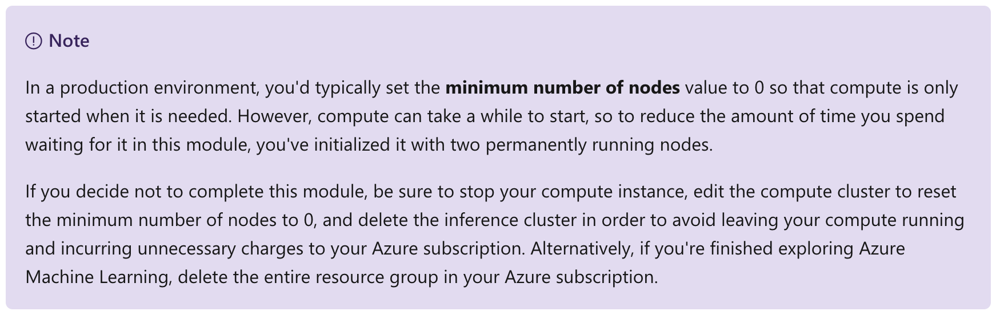

This notebook is refer from the Microsoft resources: [Create no-code predictive models with Azure Machine Learning](https://docs.microsoft.com/en-gb/learn/paths/create-no-code-predictive-models-azure-machine-learning/).

### Module 3: Create a classification model with Azure Machine Learning designer

Classification is a supervised machine learning technique used to predict categories or classes. Learn how to create classification models using Azure Machine Learning designer.


### Topic 1: Introduction

*Classification* is a form of machine learning that is used to predict which category, or class, an item belongs to. For example, a health clinic might use the characteristics of a patient (such as age, weight, blood pressure, and so on) to predict whether the patient is at risk of diabetes. In this case, the characteristics of the patient are the features, and the label is a classification of either **0** or **1**, representing non-diabetic or diabetic.


Classification is an example of a *supervised* machine learning technique in which you train a model using data that includes both the features and known values for the label, so that the model learns to *fit* the feature combinations to the label. Then, after training has been completed, you can use the trained model to predict labels for new items for which the label is unknown.

You can use Microsoft Azure Machine Learning designer to create classification models by using a drag and drop visual interface, without needing to write any code.

In this module, you'll learn how to:

- Use Azure Machine Learning designer to train a classification model.

- Use a classification model for inferencing.

- Deploy a classification model as a service.

To complete this module, you'll need a Microsoft Azure subscription. If you don't already have one, you can sign up for a free trial at https://azure.microsoft.com.


### Topic 2: Create an Azure Machine Learning workspace

Azure Machine Learning is a cloud-based platform for building and operating machine learning solutions in Azure. It includes a wide range of features and capabilities that help data scientists prepare data, train models, publish predictive services, and monitor their usage. One of these features is a visual interface called *designer*, that you can use to train, test, and deploy machine learning models without writing any code.

#### 2.1 Create an Azure Machine Learning workspace

To use Azure Machine Learning, you create a *workspace* in your Azure subscription. You can then use this workspace to manage data, compute resources, code, models, and other artifacts related to your machine learning workloads.

If you do not already have one, follow these steps to create a workspace:

1. Sign into the [Azure portal](https://portal.azure.com/) using your Microsoft credentials.

2. Select **＋Create a resource**, search for **Machine Learning**, and create a new Machine Learning resource the following settings:

    - **Workspace Name**: A unique name of your choice
    
    - **Subscription**: Your Azure subscription
    
    - **Resource group**: Create a new resource group with a unique name
    
    - **Location**: Choose any available location
    
    - **Workspace edition**: Enterprise
    
3. Wait for your workspace to be created (it can take a few minutes). Then go to it in the portal.

4. On the **Overview** page for your workspace, launch Azure Machine Learning Studio (or open a new browser tab and navigate to https://ml.azure.com), and sign into Azure Machine Learning studio using your Microsoft account.

5. In Azure Machine Learning studio, toggle the ☰ icon at the top left to view the various pages in the interface. You can use these pages to manage the resources in your workspace.

You can manage your workspace using the Azure portal, but for data scientists and Machine Learning operations engineers, Azure Machine Learning studio provides a more focused user interface for managing workspace resources.


### Topic 3: Create compute resources

To train and deploy models using Azure Machine Learning designer, you need compute on which to run the training process, test the model, and host the model in a deployed service.

#### 3.1 Create compute targets

Compute targets are cloud-based resources on which you can run model training and data exploration processes.

1. In [Azure Machine Learning studio](https://ml.azure.com/), view the **Compute** page (under **Manage**). This is where you manage the compute targets for your data science activities. There are four kinds of compute resource you can create:

    - **Compute Instances**: Development workstations that data scientists can use to work with data and models.

    - **Compute Clusters**: Scalable clusters of virtual machines for on-demand processing of experiment code.

    - **Inference Clusters**: Deployment targets for predictive services that use your trained models.

    - **Attached Compute**: Links to existing Azure compute resources, such as Virtual Machines or Azure Databricks clusters.

2. On the **Compute Instances** tab, add a new compute instance with the following settings. You'll use this to test your model:

    - **Compute name**: enter a unique name

    - **Virtual Machine type**: CPU

    - **Virtual Machine size**: Standard_DS2_v2

3. While the compute instance is being created, switch to the **Compute Clusters** tab, and add a new compute cluster with the following settings. You'll use this to train a machine learning model:

    - **Compute name**: enter a unique name

    - **Virtual Machine size**: Standard_DS2_v2

    - **Virtual Machine priority**: Dedicated

    - **Minimum number of nodes**: 2

    - **Maximum number of nodes**: 2

    - **Idle seconds before scale down**: 120

4. While the compute cluster is being created, switch to the **Inference Clusters** tab, and add a new cluster with the following settings. You'll use this to deploy your model as a service.

    - **Compute name**: enter a unique name

    - **Kubernetes Service**: Create new

    - **Region**: Select a different region than the one used for your workspace

    - **Virtual Machine size**: Standard_DS2_v2 (Use the filter to find this in the list)

    - **Cluster purpose**: Dev-test

    - **Number of nodes**: 2

    - **Network configuration**: Basic

    - **Enable SSL configuration**: Unselected
    
5. Verify that the inference cluster is in the Creating state - it will take a while to be created, so leave it for now.



The compute targets will take some time to be created. You can move onto the next unit while you wait.


### Topic 4: Explore data

To train a classification model, you need a dataset that includes historical *features* (characteristics of the entity for which you want to make a prediction) and known *label* values (the class indicator that you want to train a model to predict).

#### 4.1 Create a dataset

In Azure Machine Learning, data for model training and other operations is usually encapsulated in an object called a *dataset*.

1. In [Azure Machine Learning studio](https://ml.azure.com/), view the **Datasets** page. Datasets represent specific data files or tables that you plan to work with in Azure ML.

2. Create a dataset from web files, using the following settings:

    - **Basic Info**:

        - **Web URL**: https://aka.ms/diabetes-data

        - **Name**: diabetes-data

        - **Dataset type**: Tabular

        - **Description**: Diabetes data

    - **Settings and preview**:

        - **File format**: Delimited

        - **Delimiter**: Comma

        - **Encoding**: UTF-8

        - **Column headers**: Use headers from first file

        - **Skip rows**: None

    - **Schema**:

        - Include all columns other than **Path**

        - Review the automatically detected types

    - **Confirm details**:

        - Do not profile the dataset after creation

3. After the dataset has been created, open it and view the **Explore** page to see a sample of the data. This data represents details from patients who have been tested for diabetes.


#### 4.2 Create a pipeline

To get started with Azure Machine Learning designer, first you must create a pipeline and add the dataset you want to work with.

1. In [Azure Machine Learning studio](https://ml.azure.com/) for your workspace, view the **Designer** page and select + to create a new pipeline.

2. In the **Settings** pane, change the default pipeline name (**Pipeline-Created-on-date**) to **Diabetes Training** (if the **Settings** pane is not visible, click the ⚙ icon next to the pipeline name at the top).

3. Note that you need to specify a compute target on which to run the pipeline. In the **Settings** pane, click **Select compute target** and select the **aml-cluster** compute cluster you created previously.

4. On the left side of the designer, select the **Datasets** (⌕) tab, expand the **Datasets** section, and drag the **diabetes-data** dataset you created in the previous exercise onto the canvas.

5. Select the **diabetes-data** dataset on the canvas, and view its settings (the settings pane for the dataset may open automatically and cover the canvas). On the **outputs** tab, select the **Visualize** icon (which looks like a column chart).

6. Review the schema of the data, noting that you can see the distributions of the various columns as histograms.

7. Scroll to the right and select the column heading for the **Diabetic** column, and note that it contains two values **0** and **1**. These values represent the two possible classes for the label that your model will predict, with a value of **0** meaning that the patient does not have diabetes, and a value of **1** meaning that the patient is diabetic.

8. Scroll back to the left and review the other columns, which represent the features that will be used to predict the label. Note that most of these columns are numeric, but each feature is on its own scale. For example, **Age** values range from 21 to 77, while **DiabetesPedigree** values range from 0.078 to 2.3016. When training a machine learning model, it is sometimes possible for larger values to dominate the resulting predictive function, reducing the influence of features that on a smaller scale. Typically, data scientists mitigate this possible bias by normalizing the numeric columns so they're on the similar scales.

9. Close the **diabetes-data result visualization** window, and then close or resize the settings pane using the X or ↗↙ icon so that you can see the dataset on the canvas like this:
The diabetes-data dataset on the designer canvas


#### 4.3 Add Transformations

Before you can train a model, you typically need to apply some preprocessing transformations to the data.

1. In the pane on the left, view the **Modules** (⊞) tab and expand the **Data Transformation** section, which contains a wide range of modules you can use to transform data before model training.

2. Drag a **Normalize Data** module to the canvas, below the **diabetes-data** dataset. Then connect the output from the bottom of the **diabetes-data** dataset to the input at the top of the **Normalize Data** module, like this:


3. Select the **Normalize Data** module and view its settings, noting that it requires you to specify the transformation method and the columns to be transformed.

4. Set the transformation to **MinMax** and edit the columns to include the following columns by name, as shown in the image:

    - **Pregnancies**

    - **PlasmaGlucose**

    - **DiastolicBloodPressure**

    - **TricepsThickness**

    - **SerumInsulin**

    - **BMI**

    - **DiabetesPedigree**

    - **Age**


The data transformation is normalizing the numeric columns to put them on the same scale, which should help prevent columns with large values from dominating model training. You'd usually apply a whole bunch of pre-processing transformations like this to prepare your data for training, but we'll keep things simple in this exercise.

#### 4.4 Run the pipeline

To apply your data transformations, you need to run the pipeline as an experiment.

1. Ensure your pipeline looks similar to this:


2. Select **Submit**, and run the pipeline as a new experiment named **diabetes-training** on your compute cluster.

3. Wait for the run to finish - this may take a few minutes.

#### 4.5 View the transformed data

The dataset is now prepared for model training.

1. Select the completed **Normalize Data** module, and in its **Settings** pane on the right, on the **Outputs + logs** tab, select the **Visualize** icon for the **Transformed dataset**.

2. View the data, noting that the numeric columns you selected have been normalized to a common scale.

3. Close the normalized data result visualization.


### Topic 5: Create and run a training pipeline

After you've used data transformations to prepare the data, you can use it to train a machine learning model.

#### 5.1 Add training modules

It's common practice to train the model using a subset of the data, while holding back some data with which to test the trained model. This enables you to compare the labels that the model predicts with the actual known labels in the original dataset.

In this exercise, you're going to extend the **Diabetes Training** pipeline as shown here:


Follow the steps below, using the image above for reference as you add and configure the required modules.

1. Open the **Diabetes Training** pipeline you created in the previous unit if it's not already open.

2. In the pane on the left, on the **Modules** tab, in the **Data Transformations** section, drag a **Split Data** module onto the canvas under the **Normalize Data** module. Then connect the Transformed Dataset (left) output of the **Normalize Data** module to the input of the **Split Data** module.

3. Select the **Split Data** module, and configure its settings as follows:

    - Splitting mode Split Rows

    - Fraction of rows in the first output dataset: 0.7

    - Random seed: 123

    - Stratified split: False
    
4. Expand the **Model Training** section in the pane on the left, and drag a **Train Model** module to the canvas, under the **Split Data** module. Then connect the Result dataset1 (left) output of the **Split Data** module to the Dataset (right) input of the **Train Model** module.

5. The model we're training will predict the **Diabetic** value, so select the **Train Model** module and modify its settings to set the **Label column** to **Diabetic** (matching the case and spelling exactly!)

6. The **Diabetic** label the model will predict is a class (0 or 1), so we need to train the model using a classification algorithm. Specifically, there are two possible classes, so we need a binary classification algorithm. Expand the **Machine Learning Algorithms** section, and under **Classification**, drag a **Two-Class Logistic Regression** module to the canvas, to the left of the **Split Data** module and above the **Train Model** module. Then connect its output to the **Untrained model** (left) input of the **Train Model** module.


7. To test the trained model, we need to use it to score the validation dataset we held back when we split the original data - in other words, predict labels for the features in the validation dataset. Expand the **Model Scoring & Evaluation** section and drag a **Score Model** module to the canvas, below the Train Model module. Then connect the output of the **Train Model** module to the **Trained model** (left) input of the **Score Model** module; and connect the **Results dataset2** (right) output of the **Split Data** module to the **Dataset** (right) input of the Score Model module.

8. Ensure your pipeline looks like this:


#### 5.2 Run the training pipeline

Now you're ready to run the training pipeline and train the model.

1. Select **Submit**, and run the pipeline using the existing experiment named **diabetes-training**.

2. Wait for the experiment run to finish. This may take 5 minutes or more.

3. When the experiment run has finished, select the **Score Model** module and in the settings pane, on the **Outputs + Logs** tab, under **Data outputs** in the **Scored dataset** section, use the **Visualize** icon to view the results.

4. Scroll to the right, and note that next to the **Diabetic** column (which contains the known true values of the label) there is a new column named **Scored Labels**, which contains the predicted label values, and a **Scored Probabilities** columns containing a probability value between 0 and 1. This indicates the probability of a positive prediction, so probabilities greater than 0.5 result in a predicted label of **1** (diabetic), while probabilities between 0 and 0.5 result in a predicted label of **0** (not diabetic).

5. Close the **Score Model result visualization** window.

The model is predicting values for the **Diabetic** label, but how reliable are its predictions? To assess that, you need to evaluate the model.


### Topic 6: Evaluate a classification model

The validation data you held back and used to score the model includes the known values for the label. So to validate the model, you can compare the true values for the label to the label values that were predicted when you scored the validation dataset. Based on this comparison, you can calculate various metrics that describe how well the model performs.

#### 6.1 Add an Evaluate Model module

1. Open the **Diabetes Training** pipeline you created in the previous unit if it's not already open.

2. In the pane on the left, on the **Modules** tab, in the **Model Scoring & Evaluation** section, drag an **Evaluate Model** module to the canvas, under the **Score Model** module, and connect the output of the **Score Model** module to the **Scored dataset** (left) input of the **Evaluate Model** module.

3. Ensure your pipeline looks like this:


4. Select **Submit**, and run the pipeline using the existing experiment named **diabetes-training**.

5. Wait for the experiment run to finish.

6. When the experiment run has finished, select the **Evaluate Model** module and in the settings pane, on the **Outputs + Logs** tab, under **Data outputs** in the **Evaluation results** section, use the **Visualize** icon to view the performance metrics. These metrics can help data scientists assess how well the model predicts based on the validation data.

7. View the confusion matrix for the model, which is a tabulation of the predicted and actual value counts for each possible class. For a binary classification model like this one, where you're predicting one of two possible values, the confusion matrix is a 2x2 grid showing the predicted and actual value counts for classes **0** and **1**, similar to this:


The confusion matrix shows cases where both the predicted and actual values were 1 (known as true positives) at the top left, and cases where both the predicted and the actual values were 0 (true negatives) at the bottom right. The other cells show cases where the predicted and actual values differ (false positives and false negatives). The cells in the matrix are colored so that the more cases represented in the cell, the more intense the color - with the result that you can identify a model that predicts accurately for all classes by looking for a diagonal line of intensely colored cells from the top left to the bottom right (in other words, the cells where the predicted values match the actual values). For a multi-class classification model (where there are more than two possible classes), the same approach is used to tabulate each possible combination of actual and predicted value counts - so a model with three possible classes would result in a 3x3 matrix with a diagonal line of cells where the predicted and actual labels match.

8. Review the metrics to the left of the confusion matrix, which include:

    - **Accuracy**: The ratio of correct predictions (true positives + true negatives) to the total number of predictions. In other words, what proportion of diabetes predictions did the model get right?

    - **Precision**: The fraction of positive cases correctly identified (the number of true positives divided by the number of true positives plus false positives). In other words, out of all the patients that the model predicted as having diabetes, how many are actually diabetic?

    - **Recall**: The fraction of the cases classified as positive that are actually positive (the number of true positives divided by the number of true positives plus false negatives). In other words, out of all the patients who actually have diabetes, how many did the model identify?

    - **F1 Score**: An overall metric that essentially combines precision and recall.

    - We'll return to **AUC** later.

Of these metric, accuracy is the most intuitive. However, you need to be careful about using simple accuracy as a measurement of how well a model works. Suppose that only 3% of the population is diabetic. You could create a model that always predicts 0 and it would be 97% accurate - just not very useful! For this reason, most data scientists use other metrics like precision and recall to assess classification model performance.

9. Above the list of metrics, note that there's a **Threshold** slider. Remember that what a classification model predicts is the probability for each possible class. In the case of this binary classification model, the predicted probability for a positive (that is, diabetic) prediction is a value between 0 and 1. By default, a predicted probability for diabetes above 0.5 results in a class prediction of 1, while a prediction below this threshold means that there's a greater probability of the patient not having diabetes (remember that the probabilities for all classes add up to 1), so the predicted class would be 0. Try moving the threshold slider and observe the effect on the confusion matrix. If you move it all the way to the left (0), the Recall metric becomes 1, and if you move it all the way to the right (1), the Recall metric becomes 0.

10. Look above the Threshold slider at the **ROC curve** (ROC stands for received operator characteristic, but most data scientists just call it a ROC curve). Another term for recall is **True positive rate**, and it has a corresponding metric named **False positive rate**, which measures the number of negative cases incorrectly identified as positive compared the number of actual negative cases. Plotting these metrics against each other for every possible threshold value between 0 and 1 results in a curve. In an ideal model, the curve would go all the way up the left side and across the top, so that it covers the full area of the chart. The larger the area under the curve (which can be any value from 0 to 1), the better the model is performing - this is the **AUC** metric listed with the other metrics below. To get an idea of how this area represents the performance of the model, imagine a straight diagonal line from the bottom left to the top right of the ROC chart. This represents the expected performance if you just guessed or flipped a coin for each patient - you could expect to get around half of them right, and half of them wrong, so the area under the diagonal line represents an AUC of 0.5. If the AUC for your model is higher than this for a binary classification model, then the model performs better than a random guess.

11.Close the **Evaluate Model result visualization** window.

The performance of this model isn't all that great, partly because we performed only minimal feature engineering and pre-processing. You could try a different classification algorithm, such as **Two-Class Decision Forest**, and compare the results. You can connect the outputs of the **Split Data** module to multiple **Train Model** and **Score Model** modules, and you can connect a second **Score Model** module to the **Evaluate Model** module to see a side-by-side comparison. The point of the exercise is simply to introduce you to classification and the Azure Machine Learning designer interface, not to train a perfect model!


### Topic 7: Create an inference pipeline

After creating and running a pipeline to train the model, you need a second pipeline that performs the same data transformations for new data, and then uses the trained model to *inference* (in other words, predict) label values based on its features. This pipeline will form the basis for a predictive service that you can publish for applications to use.

#### 7.1 Create an inference pipeline

1. In Azure Machine Learning Studio, click the **Designer** page to view all of the pipelines you have created. Then open the **Diabetes Training** pipeline you created previously.

2. In the **Create inference pipeline** drop-down list, click **Real-time inference** pipeline. After a few seconds, a new version of your pipeline named **Diabetes Training-real time inference** will be opened.

3. Rename the new pipeline to **Predict Diabetes**, and then review the new pipeline. It contains a web service input for new data to be submitted, and a web service output to return results. Some of the transformations and training steps have been encapsulated in this pipeline so that the statistics from your training data will be used to normalize any new data values, and the trained model will be used to score the new data.


You are going to make the following changes to the inference pipeline:


- Replace the **diabetes-data** dataset with an **Enter Data Manually** module that does not include the label column (**Diabetic**).

- Remove the **Evaluate Model** module.

- Insert an **Execute Python Script** module before the web service output to return only the patient ID, predicted label value, and probability.

Follow the remaining steps below, using the image and information above for reference as you modify the pipeline.

4. The inference pipeline assumes that new data will match the schema of the original training data, so the **diabetes-data** dataset from the training pipeline is included. However, this input data includes the **Diabetic** label that the model predicts, which is unintuitive to include in new patient data for which a diabetes prediction has not yet been made. Delete this module and replace it with an **Enter Data Manually** module from the **Data Input and Output** section on the **Modules** tab, containing the following CSV data, which includes feature values without labels for three new patient observations:

CSV:

```
PatientID,Pregnancies,PlasmaGlucose,DiastolicBloodPressure,TricepsThickness,SerumInsulin,BMI,DiabetesPedigree,Age
1882185,9,104,51,7,24,27.36983156,1.350472047,43
1662484,6,73,61,35,24,18.74367404,1.074147566,75
1228510,4,115,50,29,243,34.69215364,0.741159926,59
```

5. Connect the new **Enter Data Manually** module to the same **Dataset** input of the **Apply Transformation** module as the **Web Service Input**.

6. The inference pipeline includes the **Evaluate Model** module, which is not useful when predicting from new data, so delete this module.

7. The output from the **Score Model** module includes all of the input features as well as the predicted label and probability score. To limit the output to only the prediction and probability:

    - Delete the connection between the **Score Model** module and the **Web Service Output**.

    - Add an **Execute Python Script** module from the **Python Language** section, replacing all of the the default python script with the following code (which selects only the **PatientID**, **Scored Labels** and **Scored Probabilities** columns and renames them appropriately):

Python:

```
import pandas as pd

def azureml_main(dataframe1 = None, dataframe2 = None):

    scored_results = dataframe1[['PatientID', 'Scored Labels', 'Scored Probabilities']]
    scored_results.rename(columns={'Scored Labels':'DiabetesPrediction',
                                'Scored Probabilities':'Probability'},
                        inplace=True)
    return scored_results
```

    - Connect the output from the **Score Model** module to the **Dataset1** (left-most) input of the **Execute Python Script**, and connect the output of the **Execute Python Script** module to the **Web Service Output**.
    
8. Verify that your pipeline looks similar to the following:


9. Run the pipeline as a new experiment named **predict-diabetes** on your compute cluster. This may take a while!

10. When the pipeline has finished, select the **Execute Python Script** module, and in the settings pane, on the **Output + Logs** tab, visualize the **Result dataset** to see the predicted labels and probabilities for the three patient observations in the input data.

Your inference pipeline predicts whether or not patients are at risk for diabetes based on their features. Now you're ready to publish the pipeline so that client applications can use it.


### Topic 8: Deploy a predictive service

After you've created and tested an inference pipeline for real-time inferencing, you can publish it as a service for client applications to use.

To publish a real-time inference pipeline as a service, you must deploy it to an Azure Kubernetes Service (AKS) cluster. In this exercise, you'll use the AKS inference cluster you created previously in this module.

#### 8.1 Deploy a service

1. View the **Predict Diabetes** inference pipeline you created in the previous unit.

2. At the top right, select **Deploy**, and set up a new real-time endpoint named **predict-diabetes** on the inference cluster you created previously.

3. Wait for the web service to be deployed - this can take several minutes. The deployment status is shown at the top left of the designer interface.

#### 8.2 Test the service

Now you can test your deployed service from a client application - in this case, you'll use the code in the cell below to simulate a client application.

1. On the **Endpoints** page, open the **predict-diabetes** real-time endpoint.

2. When the **predict-diabetes** endpoint opens, view the **Consume** tab and note the following information there. You need this to connect to your deployed service from a client application.

    - The REST endpoint for your service

    - the Primary Key for your service
    
3. Note that you can use the ⧉ link next to these values to copy them to the clipboard.

4. With the **Consume** page for the **predict-diabetes** service page open in your browser, open a new browser tab and open a second instance of [Azure Machine Learning studio](https://ml.azure.com/). Then in the new tab, view the **Notebooks** page.

5. On the **Notebooks** page, create a new file with the following settings:

    - **File name**: diabetes_test.ipynb
    
    - **File type**: Notebook

    - **Overwrite if already exists**: Selected

    - **Select target directory**: Select the folder with your user name under User files
    
6. When the new notebook has been created, ensure that the compute instance you created previously is selected in the **Compute** box, and that it has a status of **Running**.

7. Edit the notebook inline, and in the cell that has been created in the notebook, paste the following code:

Python:

```
endpoint = 'YOUR_ENDPOINT' #Replace with your endpoint
key = 'YOUR_KEY' #Replace with your key

import urllib.request
import json
import os

data = {
    "Inputs": {
        "WebServiceInput0":
        [
            {
                    'PatientID': 1882185,
                    'Pregnancies': 9,
                    'PlasmaGlucose': 104,
                    'DiastolicBloodPressure': 51,
                    'TricepsThickness': 7,
                    'SerumInsulin': 24,
                    'BMI': 27.36983156,
                    'DiabetesPedigree': 1.3504720469999998,
                    'Age': 43,
            },
        ],
    },
    "GlobalParameters":  {
    }
}

body = str.encode(json.dumps(data))


headers = {'Content-Type':'application/json', 'Authorization':('Bearer '+ key)}

req = urllib.request.Request(endpoint, body, headers)

try:
    response = urllib.request.urlopen(req)
    result = response.read()
    json_result = json.loads(result)
    output = json_result["Results"]["WebServiceOutput0"][0]
    print('Patient: {}\nPrediction: {}\nProbability: {:.2f}'.format(output["PatientID"],
                                                            output["DiabetesPrediction"],
                                                            output["Probability"]))
except urllib.error.HTTPError as error:
    print("The request failed with status code: " + str(error.code))

    # Print the headers to help debug
    print(error.info())
    print(json.loads(error.read().decode("utf8", 'ignore')))
```


8. Switch to the browser tab containing the **Consume** page for the **predict-diabetes** service, and copy the REST endpoint for your service. The switch back to the tab containing the notebook and paste the key into the code, replacing YOUR_ENDPOINT.

9. Switch to the browser tab containing the **Consume** page for the **predict-diabetes** service, and copy the Primary Key for your service. The switch back to the tab containing the notebook and paste the key into the code, replacing YOUR_KEY.

10. Save the notebook. Then use the ▷ button next to the cell to run the code.

11. Verify that predicted diabetes diagnosis is returned.


### Topic 9: Knowledge check


### Topic 10: Summary

In this module, you learned how to use Azure Machine Learning designer to train and publish a classification model.

#### Reset resources

The web service you created is hosted in an Azure Kubernetes Cluster. If you don't intend to experiment with it further, you should delete the endpoint and cluster to avoid accruing unnecessary Azure charges. You should also stop the compute instance until you need it again.

1. In [Azure Machine Learning studio](https://ml.azure.com/), on the **Endpoints** tab, select the **predict-diabetes** endpoint. Then select **Delete** (🗑) and confirm that you want to delete the endpoint.

2. On the **Compute** page, on the **Compute Instances** tab, select your compute instance and then select **Stop**.

3. On the **Compute** page, on the **Compute clusters** tab, open your compute cluster and select **Edit**. Then set the **Minimum number of nodes** setting to **0** and select **Update**.

4. On the **Compute** page, on the **Inference clusters** tab, select your inference cluster and select **Delete**, and confirm you want to delete the cluster.

If you have finished exploring Azure Machine Learning, you can delete the resource group containing your Azure Machine Learning workspace from your Azure subscription:

1. In the [Azure portal](https://portal.azure.com/), in the **Resource groups** page, open the resource group you specified when creating your Azure Machine Learning workspace.

2. Click **Delete resource group**, type the resource group name to confirm you want to delete it, and select **Delete**.


```{r echo=FALSE, eval=FALSE, message=FALSE}
rmarkdown::render(input = "AI04_NC_classification.Rmd", output_format = "github_document", output_file = "README.md")
```

