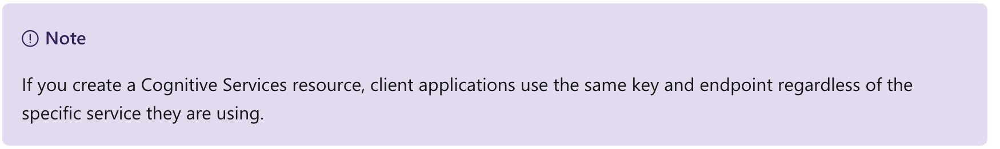
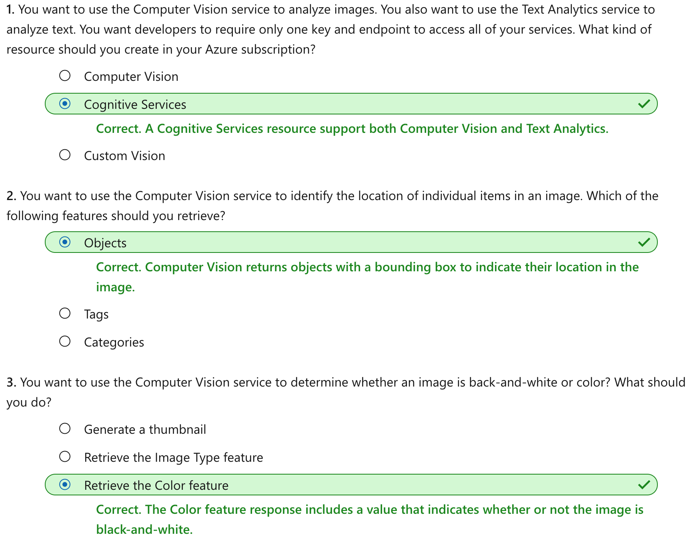

This notebook is refer from the Microsoft resources: [Explore computer vision in Microsoft Azure](https://docs.microsoft.com/en-gb/learn/paths/explore-computer-vision-microsoft-azure/).

### Trophy 3: Explore computer vision in Microsoft Azure

Computer vision is an area of artificial intelligence (AI) in which software systems are designed to perceive the world visually, though cameras, images, and video. There are multiple specific types of computer vision problem that AI engineers and data scientists can solve using a mix of custom machine learning models and platform-as-a-service (PaaS) solutions - including many cognitive services in Microsoft Azure.

### Module 1: Analyze images with the Computer Vision service

The Computer Vision service enables software engineers to create intelligent solutions that extract information from images; a common task in many artificial intelligence (AI) scenarios.

### Topic 1: Introduction

*Computer vision* is one of the core areas of artificial intelligence (AI), and focuses on creating solutions that enable AI-enabled applications to "see" the world and make sense of it.

Of course, computers don't have biological eyes that work the way ours do, but they are capable of processing images; either from a live camera feed or from digital photographs or videos. This ability to process images is the key to creating software that can emulate human visual perception.

To an AI application, an image is just an array of pixel values. These numeric values can be used as *features* to train machine learning models that make predictions about the image and its contents.

In Microsoft Azure, the **Computer Vision** cognitive service uses pre-trained models to analyze images, enabling software developers to easily build applications that can:

- Interpret an image and suggest an appropriate caption.

- Suggest relevant *tags* that could be used to index an image.

- Categorize an image.

- Identify objects in an image.

- Detect faces and people in an image.

- Recognize celebrities and landmarks in an image.

- Read text in an image.

In this module, you'll explore some of these capabilities as you learn how to use the Computer Vision service to analyze images.


### Topic 2: Get started with image analysis on Azure

The Computer Vision service and API in the Microsoft Azure Cognitive Services offerings, provides pre-built algorithms that can process images that you upload. The service can return specific information about the content of the image supplied.

#### 2.1 Azure resources for Computer Vision

The first step towards using the Computer Vision service is to create a resource for it in your Azure subscription. You can use either of the following resource types:

- **Computer Vision**: A specific resource for the Computer Vision service. Use this resource type if you don't intend to use any other cognitive services, or if you want to track utilization and costs for your Computer Vision resource separately.

- **Cognitive Services**: A general cognitive services resource that includes Computer Vision along with many other cognitive services; such as Text Analytics, Translator Text, and others. Use this resource type if you plan to use multiple cognitive services and want to simplify administration and development.

Whichever type of resource you choose to create, it will provide two pieces of information that you will need to use it:

- A **key** that is used to authenticate client applications.

- An **endpoint** that provides the HTTP address at which your resource can be accessed.



#### 2.2 Analyzing an image for insights

Exploring the many features that Computer Vision offers as pre-built functionality, will help you understand the variety of information that the service can provide.

##### 2.2.1 Describing an image

Computer Vision has the ability to analyze an image, evaluate the objects that are detected, and then generate a human-readable phrase or sentence that can describe what was detected in the image. Depending on the image contents, you may find multiple results, or phrases, returned. Each returned phrase will have a confidence score next to it, based on how confident the algorithm is in the supplied description. The highest confidence phrases will be listed first, or at the top of the returned results.

To help you understand this concept, consider the following image of the Empire State building in New York. The returned phrases are listed below the image in the order of confidence.


- A black and white photo of a city

- A black and white photo of a large city

- A large white building in a city

##### 2.2.2 Tagging visual features

The image descriptions generated by Computer Vision are based on a set of thousands of recognizable objects, which can be used to suggest *tags* for the image. These tags can be associated with the image as metadata that summarizes attributes of the image; and can be particularly useful if you want to index an image along with a set of key terms that might be used to search for images with specific attributes or contents.

For example, the tags returned for the Empire State building image include:

- skyscraper

- tower

- building

##### 2.2.3 Detecting objects

The object detection capability is similar to tagging, in that the service can identify common objects; but rather than tagging, or providing tags for the recognized objects only, this service can also return what is known as bounding box coordinates. Not only will you get the type of object, but you will also receive a set of coordinates that indicate the top, left, width, and height of the object detected, which you can use to identify the location of the object in the image, like this:


If you provide an image that contains a family in a park with a dog, for example, the object detection would return the dog as an identified object and list the coordinates for the dog's location in the image but it will also return a person, or people object, with all the coordinates where the people were detected. In this way, you can know if the image contains multiple instances of a certain object, and where in the image they are located.

Consider a security system that uses cameras for perimeter security. If you have motion detection enabled, you don't want to be alerted every time a squirrel or a small animal wanders past the area of view. Instead, you would expect the system to recognize people and alert you only when a person is detected. The bounding box coordinates could help the system to move and focus the camera on that specific area of the video, or even take a picture of only the person.

##### 2.2.4 Detecting brands

This feature provides the ability to identify commercial brands. The service has an existing database of thousands of globally recognized logos from commercial brands of products.

When you call this service and pass it an image, it will perform a detection task and determine if any of the identified objects in the image are recognized brands. Recall that it compares the brands against its database of popular brands spanning clothing, consumer electronics, and many more categories. If a known brand is detected, the service will return a response that contains the brand name, a confidence score (from 0 to 1 indicating how positive the identification is), and a bounding box (coordinates) for where in the image the detected brand was found.

##### 2.2.5 Categorizing an image

Computer Vision can actually categorize an entire image. The service uses a parent/child hierarchy with a "current" limited set of categories. When analyzing an image, detected objects are compared to the existing categories to determine the best way to provide the categorization. As an example, one of the parent categories is **people_**. the image of a person on a roof with have a category of **people_**.


You would see a slightly different categorization returned for the following image, **people_group**, because there are multiple people in the image:


Review the 86-category list [here](https://docs.microsoft.com/en-us/azure/cognitive-services/computer-vision/category-taxonomy).

##### 2.2.6 Detecting faces

There is a dedicated Face API, Computer Vision includes a subset of that functionality to aid in face detection. The capabilities include detecting the face but also includes the ability to determine age, gender, and a bounding box rectangle for the location of the face(s). For more detailed information on the detected faces, use the [Face Service](https://docs.microsoft.com/en-us/azure/cognitive-services/face/) instead.

##### 2.2.7 Detecting image types

The Computer Vision service includes the ability to detect the *content type* of images. In other words, it can determine if the image is likely to be clip art or a line drawing. If clip art is detected the service will return a value from 0 to 3 indicating how likely the image is of the type *clip art*. For line drawings, the service will only return a boolean value, either 0 or 1, indicating if it believes the image is a line drawing. The value 0 indicates a false, meaning the service hasn't detected the image as being a line drawing.

##### 2.2.8 Detecting domain-specific content

The Computer Vision service supports two specialized domain models:

- **Celebrities** - The service includes a model that has been trained to identify thousands of well-known celebrities from the worlds of sports, entertainment, and business.

- **Landmarks** - The service can identify famous landmarks, such as the Eiffel Tower and the Statue of Liberty.

##### 2.2.9 Detecting color scheme

When you pass an image to the Detect Color API, Computer Vision will analyze the image for three main attributes. The attributes are:

- dominant foreground color

- dominant background color

- dominant colors for whole image.

The colors are limited to the following 12 colors:

- black

- brown

- blue

- gray

- green

- orange

- pink

- purple

- red

- teal

- white

- yellow

##### 2.2.10 Generating a thumbnail

You can pass images to the Computer Vision service and have it generate reduced-size representations of the images, known as thumbnails. Thumbnails help conserve space and you might find them used in a grocery store scenario where thumbnail images are used to represent fruit categories. Clicking the thumbnail image might lead to another page with a larger image and detailed descriptions and prices, for example.

The Computer Vision thumbnail generation algorithm works as follows:

1. Remove distracting elements from the image and identify the area of interest (the area of the image in which the main subject appears).

2. Crop the image based on the identified area of interest.

3. Change the aspect ratio to fit the target thumbnail dimensions.

#### Other features

Computer Vision can extract text from images using Optical Character Recognition (OCR) and provide some content moderation. These additional features are not covered in this content. For more information, visit the [OCR page](https://docs.microsoft.com/en-us/azure/cognitive-services/computer-vision/concept-recognizing-text#ocr-optical-character-recognition-api) for text extraction or the [adult content page](https://docs.microsoft.com/en-us/azure/cognitive-services/computer-vision/concept-detecting-adult-content) for content moderation.


### Topic 3: Exercise - Analyze images with the Computer Vision service

The best way to learn about the capabilities of the Computer Vision service is to explore it for yourself.

#### 3.1 Before you start

To complete this exercise, you'll need the following:

- A Microsoft Azure subscription. If you don't already have one, you can sign up for a free trial at https://azure.microsoft.com .

- A Visual Studio Codespace based on the **MicrosoftDocs/ai-fundamentals** GitHub repository. This service provides a hosted instance of Visual Studio Code, in which you'll be able to run the notebooks for the lab exercises.

If you haven't already created a Visual Studio Codespace based on the MicrosoftDocs/ai-fundamentals repository, follow these steps to create one:

1. Open [Visual Studio Codespaces](https://online.visualstudio.com/environments/new?name=ai-fundamentals&repo=MicrosoftDocs%2Fai-fundamentals) in a new browser tab; and if prompted, sign in using the Microsoft account associated with your Azure subscription.

2. Create a Codespace with the following settings (if you don't already have a Visual Studio Codespaces billing plan, you'll be prompted to create one):

    - **Codespace Name**: A name for your codespace - for example, ai-fundamentals.

    - **Git Repository**: MicrosoftDocs/ai-fundamentals

    - **Instance Type**: Standard (Linux) 4 cores, 8GB RAM

    - **Suspend idle Codespace after**: 30 minutes
    
3. Wait for the codespace to be created. This will take around 3 minutes, during which time:

    - A script will initialize and configure your codespace.

    - A list of notebook (.ipynb) files will appear in the pane on the left.
    
4. After the Codespace has been created, you can close the **Welcome** and **Creation Log** panes. You can also change the color scheme to suit your preference - just click the ⚙ icon at the bottom left and select a new **Color Theme**. A light color theme is recommended to make it easier to read the Python code in the notebooks.

#### 3.1 Exercise notebook

After you have set up the Visual Studio environment, open the **Image Analysis with Computer Vision.ipynb** notebook to complete the exercise.


### Topic 4: Knowledge check




### Topic 5: Summary

The Computer Vision service provides many capabilities that you can use to analyze images, including generating a descriptive caption, extracting relevant tags, identifying objects, determining image type and metadata, detecting human faces, known brands, and celebrities, and others.

You can find out more about using the Computer Vision service in the [service documentation](https://docs.microsoft.com/en-us/azure/cognitive-services/computer-vision).


```{r echo=FALSE, eval=FALSE, message=FALSE}
rmarkdown::render(input = "AI06_CV_analyze_image.Rmd", output_format = "github_document", output_file = "README.md")
```

