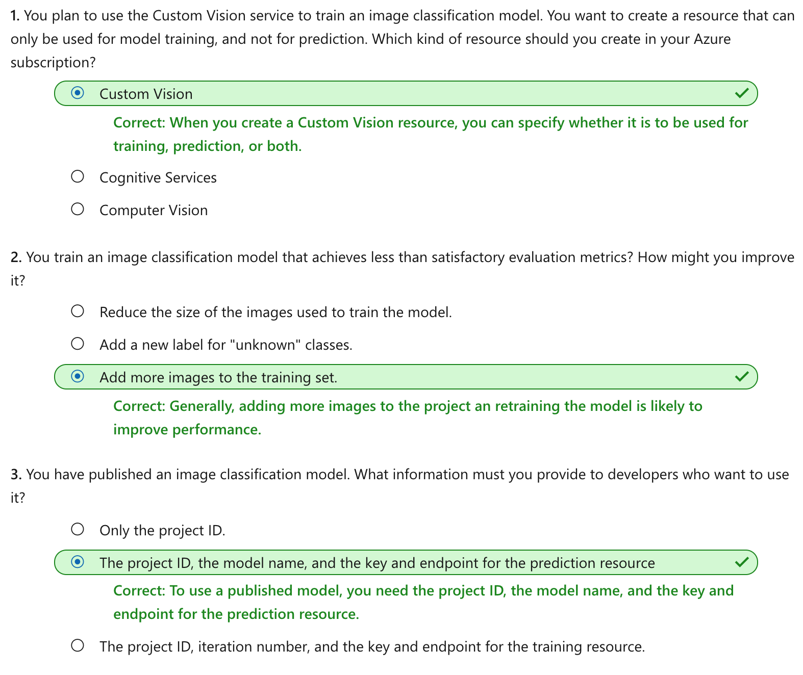

Classify images with the Custom Vision service
================

This notebook is refer from the Microsoft resources: [Explore computer vision in Microsoft Azure](https://docs.microsoft.com/en-gb/learn/paths/explore-computer-vision-microsoft-azure/).

### Module 2: Classify images with the Custom Vision service

Image classification is a common workload in artificial intelligence (AI) applications. It harnesses the predictive power of machine learning to enable AI systems to identify real-world items based on images.

### Topic 1: Introduction

*Classification* is a machine learning technique that you can use to predict which category, or *class*, something belongs to. Classification machine learning models use a set of inputs, which we call *features*, to calculate a probability score for each possible class and predict a *label* that indicates the most likely class that an object belongs to.

For example, the features of a flower might include the measurements of its petals, stem, sepals, and other quantifiable characteristics. A machine learning model could be trained by applying an algorithm to these measurements that calculates the most likely species of the flower - its class.

To create a classification model, you need data that consists of features for which the labels are already known. You use this to train the model so that it determines a relationship between the features and the corresponding label. Then, after the model has been trained, you can use it with new sets of features to predict unknown label values.

#### 1.1 Image classification

*Image classification* is a machine learning technique in which the object being classified is an image, such as a photograph.

As with any form of classification, creating an image classification solution involves training a machine learning model using a set of existing data for which the class is already known. In this case, the existing data consists of a set of categorized images. Digital images are made up of an array of pixel values, and these are used as features to train the model based on the known image classes.

Most modern image classification solutions are based on *deep learning* techniques that make use of *convolutional neural networks* (CNNs) to uncover patterns in the pixels that correspond to particular classes. Training an effective CNN is a complex task that requires considerable expertise in data science and machine learning. However, common techniques used to train image classification models have been encapsulated into the **Custom Vision** cognitive service in Microsoft Azure; making it easy to train a model and publish it as a software service with minimal knowledge of deep learning techniques.

#### 1.2 Uses of image classification

Some potential uses for image classification might include:

-   **Product identification** - performing visual searches for specific products in online searches or even, in-store using a mobile device.

-   **Disaster investigation** - evaluating key infrastructure for major disaster preparation efforts. For example, aerial surveillance images may show bridges and classify them as such. Anything classified as a bridge could then be marked for emergency preparation and investigation.

-   **Medical diagnosis** - evaluating images from X-ray or MRI devices could quickly classify specific issues found as cancerous tumors, or many other medical conditions related to medical imaging diagnosis.

### Topic 2: Get started with image classification on Azure

You can perform image classification using the Custom Vision service, available as part of the Azure Cognitive Services offerings. This is generally easier and quicker than writing your own model training code, and enables people with little or no machine learning expertise to create an effective image classification solution.

#### 2.1 Azure resources for Custom Vision

Creating an image classification solution with Custom Vision consists of two main tasks. First you must use existing images to train the model, and then you must publish the model so that client applications can use it to generate predictions.

For each of these tasks, you need a resource in your Azure subscription. You can use the following types of resource:

-   **Custom Vision**: A dedicated resource for the custom vision service, which can be either a *training* or a *prediction* resource.

-   **Cognitive Services**: A general cognitive services resource that includes Custom Vision along with many other cognitive services. You can use this type of resource for *training*, *prediction*, or *both*.

The separation of training and prediction resources is useful when you want to track resource utilization for model training separately from client applications using the model to predict image classes. However, it can make development of an image classification solution a little confusing.

The simplest approach is to use a general Cognitive Services resource for both training and prediction. This means you only need to concern yourself with one *endpoint* (the HTTP address at which your service is hosted) and *key* (a secret value used by client applications to authenticate themselves).

If you choose to create a Custom Vision resource, you will be prompted to choose *training*, *prediction*, or *both* - and it's important to note that if you choose "both", then **two** resources are created - one for training and one for prediction.

It's also possible to take a mix-and-match approach in which you **use a dedicated Custom Vision resource for training, but deploy your model to a Cognitive Services resource for prediction**. For this to work, **the training and prediction resources must be created in the same region**.

#### 2.2 Model training

To train a classification model, you must upload images to your training resource and label them with the appropriate class labels. Then, you must train the model and evaluate the training results.

You can perform these tasks in the *Custom Vision portal*, or if you have the necessary coding experience you can use one of the Custom Vision service programming language-specific software development kits (SDKs).

One of the key considerations when using images for classification, is to ensure that you have sufficient images of the objects in question and those images should be of the **object from many different angles**.

#### 2.3 Model evaluation

Model training process is an iterative process in which the Custom Vision service repeatedly trains the model using some of the data, but holds some back to evaluates the model. At the end of the training process, the performance for the trained model is indicated by the following evaluation metrics:

-   **Precision**: What percentage of class predictions did the model correctly identify? For example, if there are 10 images of apples, and the model found 7 of them, then the precision is 0.7 (70%).

-   **Recall**: What percentage of the class predictions made by the model were correct? For example, if the model predicted that 10 images are oranges, of which eight were actually oranges, then the recall is 0.8 (80%).

-   **Average Precision (AP)**: An overall metric that takes into account both precision and recall)

#### 2.4 Using the model for prediction

After you've trained the model, and you're satisfied with its evaluated performance, you can publish the model to your prediction resource. When you publish the model, you can assign it a name (the default is "IterationX", where X is the number of times you have trained the model).

To use you model, client application developers need the following information:

-   **Project ID**: The unique ID of the Custom Vision project you created to train the model.

-   **Model name**: The name you assigned to the model during publishing.

-   **Prediction endpoint**: The HTTP address of the endpoints for the *prediction* resource to which you published the model (**not** the training resource).

-   **Prediction key**: The authentication key for the *prediction* resource to which you published the model (**not** the training resource).

### Topic 3: Exercise - Create an image classification solution

The best way to learn about image classification with the Custom Vision service is to explore it for yourself.

#### 3.1 Before you start

To complete this exercise, you'll need the following:

-   A Microsoft Azure subscription. If you don't already have one, you can sign up for a free trial at <https://azure.microsoft.com>.

-   A Visual Studio Codespace based on the **MicrosoftDocs/ai-fundamentals** GitHub repository. This service provides a hosted instance of Visual Studio Code, in which you'll be able to run the notebooks for the lab exercises.

If you haven't already created a Visual Studio Codespace based on the **MicrosoftDocs/ai-fundamentals** repository, follow these steps to create one:

1.  Open [Visual Studio Codespaces](https://online.visualstudio.com/environments/new?name=ai-fundamentals&repo=MicrosoftDocs%2Fai-fundamentals) in a new browser tab; and if prompted, sign in using the Microsoft account associated with your Azure subscription.

2.  Create a Codespace with the following settings (if you don't already have a Visual Studio Codespaces billing plan, you'll be prompted to create one):

    -   **Codespace Name**: A name for your codespace - for example, **ai-fundamentals**.

    -   **Git Repository**: MicrosoftDocs/ai-fundamentals

    -   **Instance Type**: Standard (Linux) 4 cores, 8GB RAM

    -   **Suspend idle Codespace after**: 30 minutes

3.  Wait for the codespace to be created. This will take around 3 minutes, during which time:

    -   A script will initialize and configure your codespace.

    -   A list of notebook (.ipynb) files will appear in the pane on the left.

4.  After the Codespace has been created, you can close the **Welcome** and **Creation Log** panes. You can also change the color scheme to suit your preference - just click the ⚙ icon at the bottom left and select a new **Color Theme**. A light color theme is recommended to make it easier to read the Python code in the notebooks.

#### 3.2 Exercise notebook

After you have set up the Visual Studio environment, open the **Image Classification.ipynb** notebook to complete the exercise.

### Topic 4: Knowledge check

### Topic 5: Summary

Image classification is used to assign images to categories, or classes. Patterns in image pixel values are used to determine which class a particular image belongs, and a model is trained to match the patterns in the pixel values to a set of class labels. You can use the Custom Vision cognitive service to train image classification models and deploy them as services for applications to use.

You can find out more about the Custom Vision service in the [service documentation](https://docs.microsoft.com/en-us/azure/cognitive-services/custom-vision-service).
