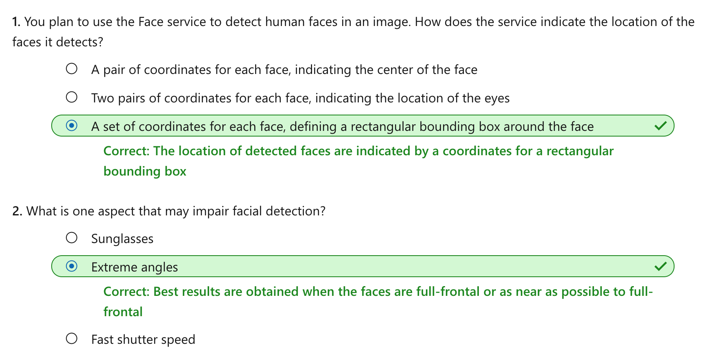

Detect and analyze faces with the Face service
================

This notebook is refer from the Microsoft resources: [Explore computer vision in Microsoft Azure](https://docs.microsoft.com/en-gb/learn/paths/explore-computer-vision-microsoft-azure/).

### Module 4: Detect and analyze faces with the Face service

Face detection, analysis, and recognition is an important capability for artificial intelligence (AI) solutions. The Face cognitive service in Azure makes it easy integrate these capabilities into your applications.

### Topic 1: Introduction

Face detection and analysis is an area of artificial intelligence (AI) in which we use algorithms to locate and analyze human faces in images or video content.

#### 1.1 Face detection

Face detection involves identifying regions of an image that contain a human face, typically by returning *bounding box* coordinates that form a rectangle around the face, like this:

#### 1.2 Facial analysis

Moving beyond simple face detection, some algorithms can also return other information, such as facial landmarks (nose, eyes, eyebrows, lips, and others).

These facial landmarks can be used as features with which to train a machine learning model from which you can infer information about a person, such as their gender, age, or emotional state, like this:

#### 1.3 Facial recognition

A further application of facial analysis is to train a machine learning model to identify known individuals from their facial features. This usage is more generally known as facial recognition, and involves using multiple images of each person you want to recognize to train a model so that it can detect those individuals in new images on which it wasn't trained.

#### 1.4 Uses of face detection and analysis

There are many applications for face detection, analysis, and recognition. For example,

-   Security - facial recognition can be used in building security applications, and increasingly it is used in smart phones operating systems for unlocking devices.

-   Social media - facial recognition can be used to automatically tag known friends in photographs.

-   Intelligent monitoring - for example, an automobile might include a system that monitors the driver's face to determine if the driver is looking at the road, looking at a mobile device, or shows signs of tiredness.

-   Advertising - analyzing faces in an image can help direct advertisements to an appropriate demographic audience.

-   Missing persons - using public cameras systems, facial recognition can be used to identify if a missing person is in the image frame.

-   Identity validation - useful at ports of entry kiosks where a person holds a special entry permit.

### Topic 2: Get started with Face analysis on Azure

Microsoft Azure provides multiple cognitive services that you can use to detect and analyze faces, including:

-   The **Custom Vision** service, which offers face detection and some basic face analysis, such as determining gender and age.

-   The **Video Indexer** service, which you can use to detect and identify faces in a video.

-   The **Face** service, which offers pre-built algorithms that can detect, recognize, and analyze faces. Of these, the Face service offers the widest range of facial analysis capabilities, so we'll focus on that service in this module.

#### 2.1 The Face service

Azure Face Service currently supports the following functionality:

-   Face Detection

-   Face Verification

-   Find Similar Faces

-   Group faces based on similarities

-   Identify people

While you can ask the service to return the rectangle coordinates for any human faces that are found in an image, you can also request a series of attributes related to faces such as:

-   the head pose - orientation in a 3D space

-   the gender of the detected faces

-   a guess at an age

-   what emotion is displayed

-   if there is facial hair or the person is wearing glasses

-   whether the face in the image has makeup applied

-   whether the person in the image is smiling

-   blur - how blurred the face is (which can be an indication of how likely the face is to be the main focus of the image)

-   exposure - aspects such as underexposed or over exposed and applies to the face in the image and not the overall image exposure

-   noise - refers to visual noise in the image. If you have taken a photo with a high ISO setting for darker settings, you would notice this noise in the image. The image looks grainy or full of tiny dots that make the image less clear

-   occlusion - determines if there may be objects blocking the face in the image

#### 2.2 Azure resources for the Face service

To use the Face service, you must create one of the following types of resource in your Azure subscription:

-   **Face**: A specific resource for the Face service. Use this resource type if you don't intend to use any other cognitive services, or if you want to track utilization and costs for the Face service separately.

-   **Cognitive Services**: A general cognitive services resource that includes Computer Vision along with many other cognitive services; such as Computer Vision, Text Analytics, Translator Text, and others. Use this resource type if you plan to use multiple cognitive services and want to simplify administration and development.

Whichever type of resource you choose to create, it will provide two pieces of information that you will need to use it:

-   A **key** that is used to authenticate client applications.

-   An **endpoint** that provides the HTTP address at which your resource can be accessed.

#### 2.3 Tips for more accurate results

There are some considerations that can help improve the accuracy of the detection in the images.

For still images, such as photographs, consider:

-   image format - supported images are JPEG, PNG, GIF, and BMP

-   file size - 4 MB or smaller

-   face size range - from 36 x 36 up to 4096 x 4096. Smaller or larger faces will not be detected

-   other issues - face detection can be impaired by extreme face angles, occlusion (objects blocking the face such as sunglasses or a hand). Best results are obtained when the faces are full-frontal or as near as possible to full-frontal

Improving detection when using video feeds can be accomplished by considering the following aspects:

-   smoothing - if your video camera applies this effect, turn it off. The potential blur between frames tends to reduce clarity of the image in individual frames.

-   shutter speed - faster shutter speeds improves clarity of the images in each frame because the motion is reduced.

-   shutter angle - if your camera supports shutter angle, use a lower shutter angle to produce clearer frames, resulting in better clarity for recognition.

### Topic 3: Exercise - Detect and analyze faces with the Face service

The best way to learn about the Face service is to explore it for yourself.

#### 3.1 Before you start

To complete this exercise, you'll need the following:

-   A Microsoft Azure subscription. If you don't already have one, you can sign up for a free trial at <https://azure.microsoft.com> .

-   A Visual Studio Codespace based on the **MicrosoftDocs/ai-fundamentals** GitHub repository. This service provides a hosted instance of Visual Studio Code, in which you'll be able to run the notebooks for the lab exercises. If you haven't already created a Visual Studio Codespace based on the **MicrosoftDocs/ai-fundamentals** repository, follow these steps to create one:

1.  Open [Visual Studio Codespaces](https://online.visualstudio.com/environments/new?name=ai-fundamentals&repo=MicrosoftDocs%2Fai-fundamentals) in a new browser tab; and if prompted, sign in using the Microsoft account associated with your Azure subscription.

2.  Create a Codespace with the following settings (if you don't already have a Visual Studio Codespaces billing plan, you'll be prompted to create one):

    -   **Codespace Name**: A name for your codespace - for example, ai-fundamentals.

    -   **Git Repository**: MicrosoftDocs/ai-fundamentals

    -   **Instance Type**: Standard (Linux) 4 cores, 8GB RAM

    -   **Suspend idle Codespace after**: 30 minutes

3.  Wait for the codespace to be created. This will take around 3 minutes, during which time:

    -   A script will initialize and configure your codespace.

    -   A list of notebook (.ipynb) files will appear in the pane on the left.

4.  After the Codespace has been created, you can close the **Welcome** and **Creation Log** panes. You can also change the color scheme to suit your preference - just click the ⚙ icon at the bottom left and select a new **Color Theme**. A light color theme is recommended to make it easier to read the Python code in the notebooks.

#### 3.2 Exercise notebook

After you have set up the Visual Studio environment, open the **Face Analysis.ipynb** notebook to complete the exercise.

### Topic 4: Knowledge check

### Topic 5: Summary

While the Computer Vision and Video Indexer services offer face detection features, the Face service and associated APIs provide more capabilities. Which you should choose will ultimately depend on the insights you want to gain from facial detection. Computer Vision only provides basic face detection. If you want to look for data around facial landmarks, the Face service is the proper choice.

You can find out more about the Face service in the [service documentation](https://docs.microsoft.com/en-us/azure/cognitive-services/face/).
