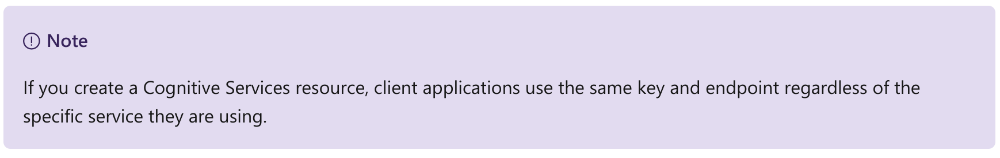
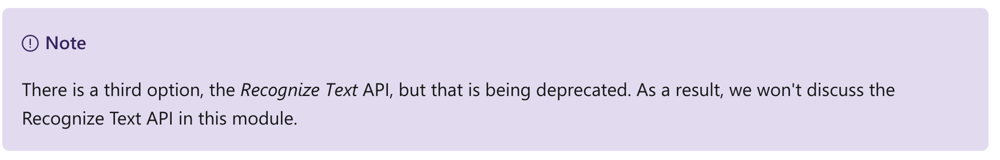
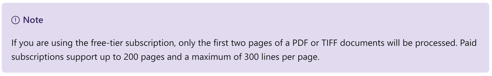
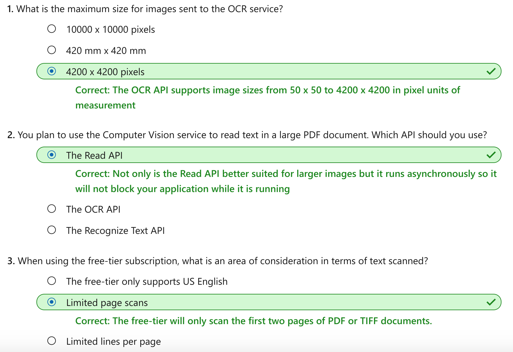

Read text with the Computer Vision service
================

This notebook is refer from the Microsoft resources: [Explore computer vision in Microsoft Azure](https://docs.microsoft.com/en-gb/learn/paths/explore-computer-vision-microsoft-azure/).

### Module 4: Read text with the Computer Vision service

Optical character recognition (OCR) enables artificial intelligence (AI) systems to read text in images, enabling applications to extract information from photographs, scanned documents, and other sources of digitized text.

### Topic 1: Introduction

The ability for computer systems to process written or printed text is an area of artificial intelligence (AI) where *computer vision* intersects with *natural language processing*. You need computer vision capabilities to "read" the text, and then you need natural language processing capabilities to make sense of it.

The basic foundation of processing printed text is *optical character recognition* (OCR), in which a model can be trained to recognize individual shapes as letters, numerals, punctuation, or other elements of text. Much of the early work on implementing this kind of capability was performed by postal services to support automatic sorting of mail based on postal codes. Since then, the state-of-the-art for reading text has moved on, and it's now possible to build models that can detect printed or handwritten text in an image and read it line-by-line or even word-by-word.

At the other end of the scale, there is *machine reading comprehension* (MRC), in which an AI system not only reads the text characters, but can use a semantic model to interpret the text is about.

In this module, we'll focus on the use of OCR technologies to detect text in images and convert it into a text-based data format, which can then be stored, printed, or used as the input for further processing or analysis.

#### 1.1 Uses of OCR

The ability to recognize printed and handwritten text in images, is beneficial in many scenarios such as:

-   note taking

-   digitizing forms, such as medical records or historical documents

-   scanning printed or handwritten checks for bank deposits

### Topic 2: Get started with OCR on Azure

The ability to extract text from images is handled by the Computer Vision service, which also provides image analysis capabilities.

#### 2.1 Azure resources for Computer Vision

The first step towards using the Computer Vision service is to create a resource for it in your Azure subscription. You can use either of the following resource types:

-   **Computer Vision**: A specific resource for the Computer Vision service. Use this resource type if you don't intend to use any other cognitive services, or if you want to track utilization and costs for your Computer Vision resource separately.
-   **Cognitive Services**: A general cognitive services resource that includes Computer Vision along with many other cognitive services; such as Text Analytics, Translator Text, and others. Use this resource type if you plan to use multiple cognitive services and want to simplify administration and development.

Whichever type of resource you choose to create, it will provide two pieces of information that you will need to use it:

A **key** that is used to authenticate client applications. An **endpoint** that provides the HTTP address at which your resource can be accessed.

#### 2.2 Use the Computer Vision service to read text

Many times an image contains text. It can be typewritten text or handwritten. Some common examples are images with road signs, scanned documents that are in an image format such as JPEG or PNG file formats, or even just a picture taken of a white board that was used during a meeting.

The Computer Vision service provides two application programming interfaces (APIs) that you can use to read text in images: the **OCR** API and the **Read** API.

##### 2.2.1 The OCR API

The OCR API is designed for quick extraction of small amounts of text in images. It operates synchronously to provide immediate results, and can recognize text in numerous languages.

When you use the OCR API to process an image, it returns a hierarchy of information that consists of:

-   **Regions** in the image that contain text

-   **Lines** of text in each region

-   **Words** in each line of text

For each of these elements, the OCR API also returns *bounding box* coordinates that define a rectangle to indicate the location in the image where the region, line, or word appears.

The OCR API does have some requirements and limitations that you need to be aware of.

-   image format - JPEG, PNG, GIF, and BMP formats are supported

-   image size - must be between 50 x 50 and 4200 x 4200 pixels

-   rotation angle - the text in the image can be rotated 0, 90, 180, 270 degrees and small angles up to 40 degrees

-   dominant text - if text is dominant in the image, false positives may occur from partially recognized words

##### 2.2.2 The Read API

The OCR method can have issues with false positives when the image is considered text-dominate. The Read API uses the latest recognition models and is optimized for images that have a significant amount of text or has considerable visual noise.

The Read API is a better option for scanned documents that have a lot of text. The Read API also has the ability to automatically determine the proper recognition model to use, taking into consideration lines of text and supporting images with printed text as well as recognizing handwriting.

Because the Read API can work with larger documents, it works asynchronously so as not to block your application while it is reading the content and returning results to your application. This means that to use the Read API, your application must use a three-step process:

1.  Submit an image to the API, and retrieve an *operation ID* in response.

2.  Use the operation ID to check on the status of the image analysis operation, and wait until it has completed.

3.  Retrieve the results of the operation.

The results from the Read API are arranged into the following hierarchy:

-   **Pages** - One for each page of text, including information about the page size and orientation.

-   **Lines** - The lines of text on a page.

-   **Words** - The words in a line of text.

Each line and word includes bounding box coordinates indicating its position on the page.

Like the OCR option, there are specific requirements around the images that the service can work with. The Read API formats are expanded over OCR as listed here:

-   image format - supported formats are JPEG, PNG, BMP, PDF, TIFF

-   image size - for images, 50 x 50 and 10000 x 10000 pixels. PDF pages must be 17 inches x 17 inches or smaller

-   file size - less than 20 MB

### Topic 3: Exercise - Read text with the Computer Vision service

The best way to learn how to read text with the Computer Vision service is to explore it for yourself.

#### 3.1 Before you start

To complete this exercise, you'll need the following:

-   A Microsoft Azure subscription. If you don't already have one, you can sign up for a free trial at <https://azure.microsoft.com>.

-   A Visual Studio Codespace based on the **MicrosoftDocs/ai-fundamentals** GitHub repository. This service provides a hosted instance of Visual Studio Code, in which you'll be able to run the notebooks for the lab exercises.

If you haven't already created a Visual Studio Codespace based on the **MicrosoftDocs/ai-fundamentals** repository, follow these steps to create one:

1.  Open [Visual Studio Codespaces](https://online.visualstudio.com/environments/new?name=ai-fundamentals&repo=MicrosoftDocs%2Fai-fundamentals) in a new browser tab; and if prompted, sign in using the Microsoft account associated with your Azure subscription.

2.  Create a Codespace with the following settings (if you don't already have a Visual Studio Codespaces billing plan, you'll be prompted to create one):

    -   **Codespace Name**: A name for your codespace - for example, ai-fundamentals.

    -   **Git Repository**: MicrosoftDocs/ai-fundamentals

    -   **Instance Type**: Standard (Linux) 4 cores, 8GB RAM

    -   **Suspend idle Codespace after**: 30 minutes

3.  Wait for the codespace to be created. This will take around 3 minutes, during which time:

    -   A script will initialize and configure your codespace.

    -   A list of notebook (.ipynb) files will appear in the pane on the left.

4.  After the Codespace has been created, you can close the **Welcome** and **Creation Log** panes. You can also change the color scheme to suit your preference - just click the ⚙ icon at the bottom left and select a new **Color Theme**. A light color theme is recommended to make it easier to read the Python code in the notebooks.

#### 3.2 Exercise notebook

After you have set up the Visual Studio environment, open the **Optical Character Recognition.ipynb** notebook to complete the exercise.

### Topic 4: Knowledge check

### Topic 5: Summary

Optical character recognition (OCR) has been around for a long time. The ability to recognize and extract text from documents, was one of the earliest uses. The ability to do the same extraction from images, is where the OCR API and the Read API can help.

Both of the APIs provide the ability to extract text from images. The text can be typewritten or handwritten and can be at different angles within the image. The main factor in choosing which API use is determined by the amount of text that needs to be processed. The Read API is the service that is optimized for large text scenarios.

You can find out more about reading text with the Computer Vision service in the [service documentation](https://docs.microsoft.com/en-us/azure/cognitive-services/computer-vision/concept-recognizing-text).
