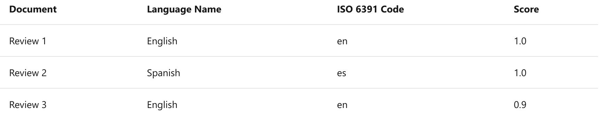
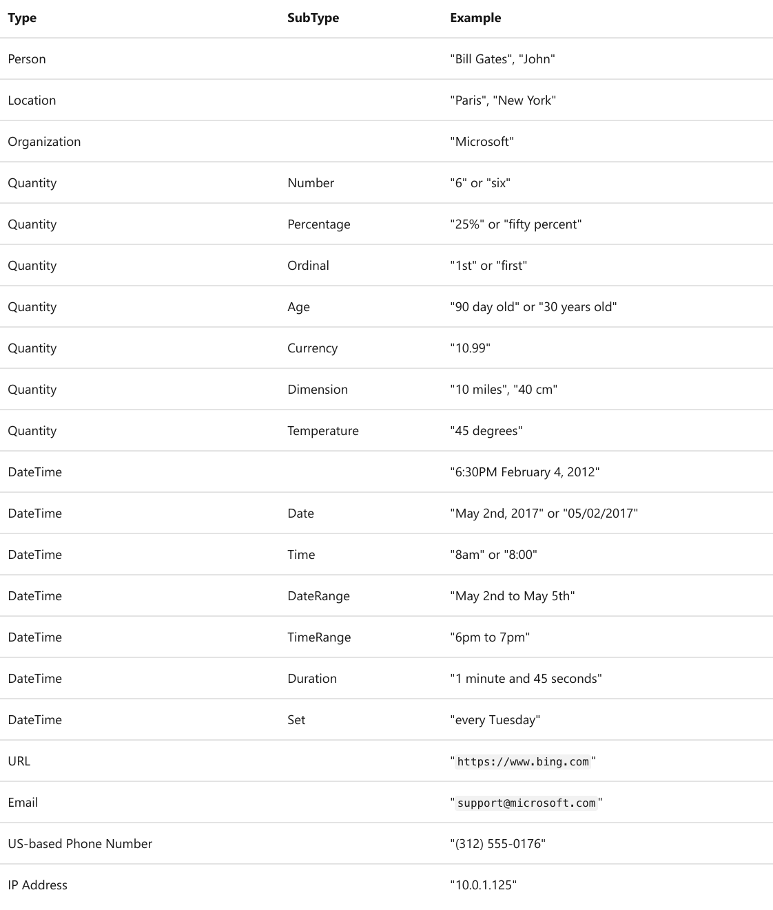
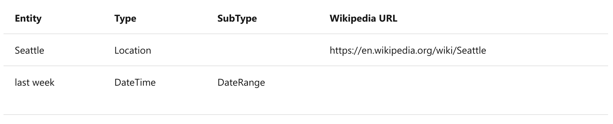
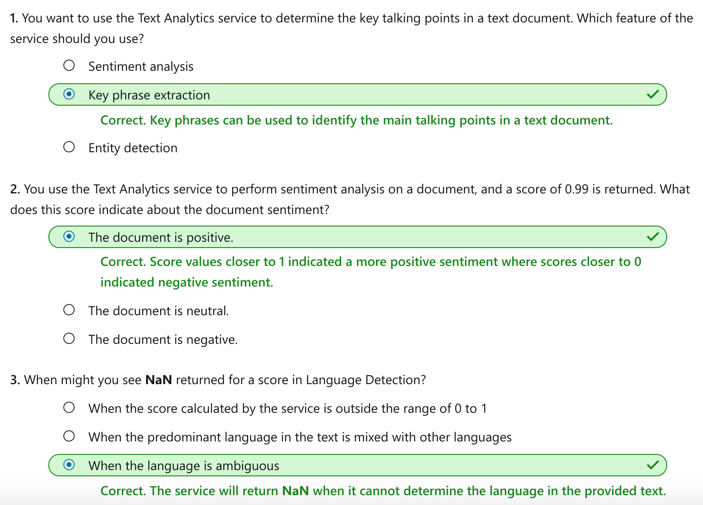

This notebook is refer from the Microsoft resources: [Explore natural language processing](https://docs.microsoft.com/en-gb/learn/paths/explore-natural-language-processing/).

### Trophy 4: Explore natural language processing

Natural language processing supports applications that can see, hear, speak with, and understand users. Using text analytics, translation, and language understanding services, Microsoft Azure makes it easy to build applications that support natural language.

### Module 1: Analyze text with the Text Analytics service

The Text Analytics service is a cloud-based service that provides advanced natural language processing over raw text for sentiment analysis, key phrase extraction, named entity recognition, and language detection.

### Topic 1: Introduction

Analyzing text is a process where you evaluate different aspects of a document or phrase, in order to gain insights into the content of that text. For the most part, humans are able to read some text and understand the meaning behind it. Even without considering grammar rules for the language the text is written in, specific insights can be identified in the text.

As an example, you might read some text and identify some key phrases that indicate the main talking points of the text. You might also recognize names of people or well-known landmarks such as the Eiffel Tower. Although difficult at times, you might also be able to *get a sense for how the person was feeling when they wrote the text*, also commonly known as **sentiment**.

#### 1.1 Text Analytics Techniques

Text analytics is a process where an artificial intelligence (AI) algorithm, running on a computer, evaluates these same attributes in text, to determine specific insights. A person will typically rely on their own experiences and knowledge to achieve the insights. A computer must be provided with similar knowledge to be able to perform the task. There are some commonly used techniques that can be used to build software to analyze text, including:

- Statistical analysis of terms used in the text. For example, removing common "stop words" (words like "the" or "a", which reveal little semantic information about the text), and performing *frequency analysis* of the remaining words (counting how often each word appears) can provide clues about the main subject of the text.

- Extending frequency analysis to multi-term phrases, commonly known as *N-grams* (a two-word phrase is a *bi-gram*, a three-word phrase is a *tri-gram*, and so on).

- Applying *stemming* or *lemmatization* algorithms to **normalize words** before counting them - for example, so that words like "power", "powered", and "powerful" are interpreted as being the same word.

- Applying *linguistic structure* rules to analyze sentences - for example, breaking down sentences into tree-like structures such as a *noun phrase*, which itself contains *nouns*, *verbs*, *adjectives*, and so on.

- **Encoding words** or terms **as numeric features** that can be used to train a machine learning model. For example, to **classify a text document based on the terms it contains**. This technique is often used to perform **sentiment analysis**, **in which a document is classified as positive or negative**.

- Creating *vectorized* models that **capture semantic relationships between words by assigning them to locations in n-dimensional space**. This modeling technique might, for example, assign values to the words "flower" and "plant" that locate them close to one another, while "skateboard" might be given a value that positions it much further away.

While these techniques can be used to great effect, programming them can be complex. In Microsoft Azure, the **Text Analytics** cognitive service can help simplify application development by using pre-trained models that can:

- Determine the language of a document or text (for example, French or English).

- Perform sentiment analysis on text to determine a positive or negative sentiment.

- Extract key phrases from text that might indicate its main talking points.

- Identify and categorize entities in the text. Entities can be people, places, organizations, or even everyday items such as dates, times, quantities, and so on.

In this module, you'll explore some of these capabilities and gain an understanding of how you might apply them to applications such as:

- A social media feed analyzer to detect sentiment around a political campaign or a product in market.

- A document search application that extracts key phrases to help summarize the main subject matter of documents in a catalog.

- A tool to extract brand information or company names from documents or other text for identification purposes.

These examples are just a small sample of the many areas that Text Analytics can help with.


### Topic 2: Get started with Text Analytics on Azure

The Text Analytics service is a part of the Azure Cognitive Services offerings that can perform advanced natural language processing over raw text.

#### 2.1 Azure resources for the Text Analytics service

To use the Text Analytics service in an application, you must provision an appropriate resource in your Azure subscription. You can choose to provision either of the following types of resource:

- A **Text Analytics** resource - choose this resource type if you only plan to use the Text Analytics service, or if you want to manage access and billing for the resource separately from other services.

- A **Cognitive Services** resource - choose this resource type if you plan to use the Text Analytics service in combination with other cognitive services, and you want to manage access and billing for these services together.

#### 2.2 Language detection

Use the language detection capability of the Text Analytics service to identify the language in which text is written. You can submit multiple documents at a time for analysis. For each document submitted to it, the service will detect:

- The language name (for example "English").

- The ISO 6391 language code (for example, "en").

- A score indicating a level of confidence in the language detection.

For example, consider a scenario where you own and operate a restaurant where customers can complete surveys and provide feedback on the food, the service, staff, and so on. Suppose you have received the following reviews from customers:

- **Review 1**: "A fantastic place for lunch. The soup was delicious."

- **Review 2**: "Comida maravillosa y gran servicio."

- **Review 3**: "The croque monsieur avec frites was terrific. Bon appetit!"

You can use the Text Analytics service to detect the language for each of these reviews; and it might respond with the following results:



Notice that the language detected for review 3 is English, despite the text containing a mix of English and French. *The language detection service will focus on the **predominant** language in the text*. The service uses an algorithm to determine the predominant language, such as length of phrases or total amount of text for the language compared to other languages in the text. The predominant language will be the value returned, along with the language code. **The confidence score may be less than 1 as a result of the mixed language text**.

##### 2.2.1 Ambiguous or mixed language content

There may be text that is ambiguous in nature, or that has mixed language content. These situations can present a challenge to the service. An ambiguous content example would be a case where the document contains limited text, or only punctuation. For example, using the service to analyze the text ":-)", results in a value of **unknown for the language** name and the language identifier, and a score of **NaN** (which is used to indicate not a number).

#### 2.3 Sentiment analysis

The Text Analytics service can evaluate text and return sentiment scores and labels for each sentence. This capability is useful for detecting positive and negative sentiment in social media, customer reviews, discussion forums and more.

Using the pre-built machine learning classification model, the service evaluates the text and returns a sentiment score in the range of 0 to 1, with values closer to 1 being a positive sentiment. Scores that are close to the middle of the range (0.5) are considered neutral or indeterminate.

For example, the following two restaurant reviews could be analyzed for sentiment:

```
"We had dinner at this restaurant last night and the first thing I noticed was how courteous the staff was. We were greeted in a friendly manner and taken to our table right away. The table was clean, the chairs were comfortable, and the food was amazing."
```

and

```
"Our dining experience at this restaurant was one of the worst I've ever had. The service was slow, and the food was awful. I'll never eat at this establishment again."
```

The sentiment score for the first review might be around 0.9, indicating a positive sentiment; while the score for the second review might be closer to 0.1, indicating a negative sentiment.

##### 2.3.1 Indeterminate sentiment

A score of **0.5** might indicate that the sentiment of the text is indeterminate, and could result from **text that does not have sufficient context to discern a sentiment or insufficient phrasing**. For example, a list of words in a sentence that has no structure, could result in an indeterminate score. Another example where a score may be 0.5 is in the case where the wrong language code was used. A language code (such as "en" for English, or "fr" for French) is used to inform the service which language the text is in. **If you pass text in French but tell the service the language code is en for English, the service will return a score of precisely 0.5**.

#### 2.4 Key phrase extraction

Key phrase extraction is the concept of evaluating the text of a document, or documents, and then identifying the main talking points of the document(s). Consider the restaurant scenario discussed previously. Depending on the volume of surveys that you have collected, it can take a long time to read through the reviews. Instead, you can use the key phrase extraction capabilities of the Text Analytics service to summarize the main points.

You might receive a review such as:

```
"We had dinner here for a birthday celebration and had a fantastic experience. We were greeted by a friendly hostess and taken to our table right away. The ambiance was relaxed, the food was amazing, and service was terrific. If you like great food and attentive service, you should try this place."
```

Key phrase extraction can provide some context to this review by extracting the following phrases:

- attentive service

- great food

- birthday celebration

- fantastic experience

- table

- friendly hostess

- dinner

- ambiance

- place

Not only can you use sentiment analysis to determine that this review is positive, you can use the key phrases to identify important elements of the review.

#### 2.5 Entity recognition

You can provide the Text Analytics service with unstructured text and it will return a list of *entities* in the text that it recognizes. The service can also provide links to more information about that entity on the web. An entity is essentially an item of a particular type or a category; and in some cases, subtype, such as those as shown in the following table.



The service also supports *entity linking* to help disambiguate entities by linking to a specific reference. For recognized entities, the service returns a URL for a relevant *Wikipedia* article.

For example, suppose you use the Text Analytics service to detect entities in the following restaurant review extract:

```
"I ate at the restaurant in Seattle last week."
```




### Topic 3: Exercise - Analyze text with the Text Analytics service

The best way to learn how to analyze text with the Text Analysis service is to explore it for yourself.

#### 3.1 Before you start

To complete this exercise, you'll need the following:

- A Microsoft Azure subscription. If you don't already have one, you can sign up for a free trial at https://azure.microsoft.com.

- A Visual Studio Codespace based on the **MicrosoftDocs/ai-fundamentals** GitHub repository. This service provides a hosted instance of Visual Studio Code, in which you'll be able to run the notebooks for the lab exercises.

If you haven't already created a Visual Studio Codespace based on the **MicrosoftDocs/ai-fundamentals** repository, follow these steps to create one:

1. Open [Visual Studio Codespaces](https://online.visualstudio.com/environments/new?name=ai-fundamentals&repo=MicrosoftDocs%2Fai-fundamentals) in a new browser tab; and if prompted, sign in using the Microsoft account associated with your Azure subscription.

2. Create a Codespace with the following settings (if you don't already have a Visual Studio Codespaces billing plan, you'll be prompted to create one):

    - **Codespace Name**: A name for your codespace - for example, **ai-fundamentals**.

    - **Git Repository**: MicrosoftDocs/ai-fundamentals

    - **Instance Type**: Standard (Linux) 4 cores, 8GB RAM

    - **Suspend idle Codespace after**: 30 minutes
    
3. Wait for the codespace to be created. This will take around 3 minutes, during which time:

    - A script will initialize and configure your codespace.

    - A list of notebook (.ipynb) files will appear in the pane on the left.

4. After the Codespace has been created, you can close the **Welcome** and **Creation Log** panes. You can also change the color scheme to suit your preference - just click the ⚙ icon at the bottom left and select a new **Color Theme**. A light color theme is recommended to make it easier to read the Python code in the notebooks.

#### 3.2 Exercise notebook

After you have set up the Visual Studio environment, open the **Text Analytics.ipynb** notebook to complete the exercise.


### Topic 4: Knowledge check




### Topic 5: Summary

The Text Analytics service provides advanced natural language processing over raw text, and includes four main functions: sentiment analysis, key phrase extraction, language detection, and named entity recognition.

You can find out more about analyzing text with the Text Analytics service in the [service documentation](https://docs.microsoft.com/en-us/azure/cognitive-services/text-analytics/).


```{r echo=FALSE, eval=FALSE, message=FALSE}
rmarkdown::render(input = "AI12_NLP_analyze_text.Rmd", output_format = "github_document", output_file = "README.md")
```

