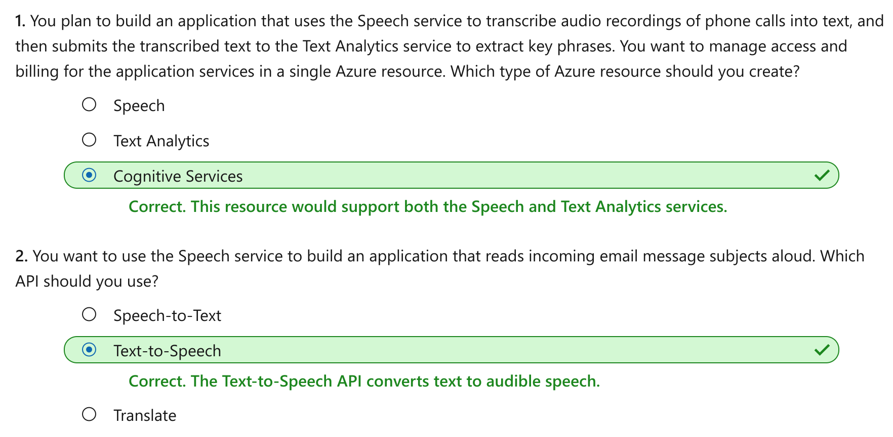

Recognize and synthesize speech
================

This notebook is refer from the Microsoft resources: [Explore natural language processing](https://docs.microsoft.com/en-gb/learn/paths/explore-natural-language-processing/).

### Module 2: Recognize and synthesize speech

Learn how to recognize and synthesize speech by using Azure Cognitive Services.

### Topic 1: Introduction

Increasingly, we expect artificial intelligence (AI) solutions to accept vocal commands and provide spoken responses. Consider the growing number of home and auto systems that you can control by speaking to them - issuing commands such as "turn off the lights", and soliciting verbal answers to questions such as "will it rain today?"

To enable this kind of interaction, the AI system must support two capabilities:

-   **Speech recognition** - the ability to detect and interpret spoken input.

-   **Speech synthesis** - the ability to generate spoken output.

#### 1.1 Speech recognition

Speech recognition is concerned with taking the spoken word and converting it into data that can be processed - often by transcribing it into a text representation. The spoken words can be in the form of a *recorded voice in an audio file*, or *live audio from a microphone*. **Speech patterns are analyzed in the audio to determine recognizable patterns that are mapped to words**. To accomplish this feat, the software typically uses multiple types of model, including:

-   An **acoustic model** that **converts the audio signal into phonemes** (representations of specific sounds).

-   A **language model** that **maps phonemes to words**, usually using a *statistical algorithm* that predicts the most probable sequence of words based on the phonemes.

The recognized words are typically converted to text, which you can use for various purposes, such as.

-   Providing closed captions for recorded or live videos

-   Creating a transcript of a phone call or meeting

-   Automated note dictation

-   Determining intended user input for further processing

#### 1.2 Speech synthesis

Speech synthesis is in many respects the reverse of speech recognition. It is concerned with vocalizing data, usually by converting text to speech. A speech synthesis solution typically requires the following information:

-   The text to be spoken.

-   The voice to be used to vocalize the speech.

To synthesize speech, the system typically *tokenizes* the text to break it down into individual words, and assigns phonetic sounds to each word. It then breaks the phonetic transcription into *prosodic* units (such as phrases, clauses, or sentences) to create phonemes that will be converted to audio format. These phonemes are then synthesized as audio by applying a voice, which will determine parameters such as pitch and timbre; and generating an audio wave form that can be output to a speaker or written to a file.

You can use the output of speech synthesis for many purposes, including:

-   Generating spoken responses to user input.

-   Creating voice menus for telephone systems.

-   Reading email or text messages aloud in hands-free scenarios.

-   Broadcasting announcements in public locations, such as railway stations or airports.

### Topic 2: Get started with speech on Azure

Microsoft Azure offers both speech recognition and speech synthesis capabilities through the **Speech** cognitive service, which includes the following application programming interfaces (APIs):

-   The **Speech-to-Text** API

-   The **Text-to-Speech** API

#### 2.1 Azure resources for the Speech service

To use the Speech service in an application, you must provision an appropriate resource in your Azure subscription. You can choose to provision either of the following types of resource:

-   A **Speech** resource - choose this resource type if you only plan to use the Speech service, or if you want to manage access and billing for the resource separately from other services.

-   A **Cognitive** Services resource - choose this resource type if you plan to use the Speech service in combination with other cognitive services, and you want to manage access and billing for these services together.

#### 2.2 The speech-to-text API

You can use the speech-to-text API to perform real-time or batch transcription of audio into a text format. The audio source for transcription can be a real-time audio stream from a microphone or an audio file.

The model that is used by the speech-to-text API, is based on the Universal Language Model that was trained by Microsoft. The data for the model is Microsoft-owned and deployed to Microsoft Azure. The model is optimized for two scenarios, **conversational** and **dictation**. You can also create and train your own custom models including acoustics, language, and pronunciation if the pre-built models from Microsoft do not provide what you need.

##### 2.2.1 Real-time transcription

Real-time speech-to-text allows you to transcribe text in audio streams. You can use real-time transcription for presentations, demos, or any other scenario where a person is speaking.

In order for real-time transcription to work, your application will need to be listening for **incoming audio from a microphone, or other audio input source such as an audio file**. Your application code streams the audio to the service, which returns the transcribed text.

##### 2.2.2 Batch transcription

Not all speech-to-text scenarios are real time. You may have audio recordings stored on a file share, a remote server, or even on Azure storage. You can point to audio files with a shared access signature (SAS) URI and asynchronously receive transcription results.

Batch transcription should be run in an asynchronous manner because the batch jobs are scheduled on a *best-effort* basis. Normally a job will start executing within minutes of the request but there is no estimate for when a job changes into the running state.

#### 2.3 The text-to-speech API

The text-to-speech API enables you to convert text input to audible speech, which can either be played directly through a computer speaker or written to an audio file.

##### 2.3.1 Speech synthesis voices

When you use the text-to-speech API, you can specify the voice to be used to vocalize the text. This capability offers you the flexibility to personalize your speech synthesis solution and give it a specific character.

The service includes multiple pre-defined voices with support for multiple languages and regional pronunciation, including standard voices as well as *neural* voices that leverage *neural networks* to overcome common limitations in speech synthesis with regard to intonation, resulting in a more natural sounding voice. You can also develop custom voices and use them with the text-to-speech API

#### 2.4 Supported Languages

Both the speech-to-text and text-to-speech APIs support a variety of languages. Use the links below to find details about the supported languages:

-   [Speech-to-text languages](https://docs.microsoft.com/en-us/azure/cognitive-services/speech-service/language-support#speech-to-text).

-   [Text-to-speech languages](https://docs.microsoft.com/en-us/azure/cognitive-services/speech-service/language-support#text-to-speech).

### Topic 3: Exercise - Use the Speech service

The best way to learn how to use the Speech service for speech recognition and synthesis is to explore it for yourself.

#### 3.1 Before you start

To complete this exercise, you'll need the following:

-   A Microsoft Azure subscription. If you don't already have one, you can sign up for a free trial at <https://azure.microsoft.com>.

-   A Visual Studio Codespace based on the **MicrosoftDocs/ai-fundamentals** GitHub repository. This service provides a hosted instance of Visual Studio Code, in which you'll be able to run the notebooks for the lab exercises.

If you haven't already created a Visual Studio Codespace based on the **MicrosoftDocs/ai-fundamentals** repository, follow these steps to create one:

1.  Open [Visual Studio Codespaces](https://online.visualstudio.com/environments/new?name=ai-fundamentals&repo=MicrosoftDocs%2Fai-fundamentals) in a new browser tab; and if prompted, sign in using the Microsoft account associated with your Azure subscription.

2.  Create a Codespace with the following settings (if you don't already have a Visual Studio Codespaces billing plan, you'll be prompted to create one):

    -   **Codespace Name**: A name for your codespace - for example, **ai-fundamentals**.

    -   **Git Repository**: MicrosoftDocs/ai-fundamentals

    -   **Instance Type**: Standard (Linux) 4 cores, 8GB RAM

    -   **Suspend idle Codespace after**: 30 minutes

3.  Wait for the codespace to be created. This will take around 3 minutes, during which time:

    -   A script will initialize and configure your codespace.

    -   A list of notebook (.ipynb) files will appear in the pane on the left.

4.  After the Codespace has been created, you can close the **Welcome** and **Creation Log** panes. You can also change the color scheme to suit your preference - just click the ⚙ icon at the bottom left and select a new **Color Theme**. A light color theme is recommended to make it easier to read the Python code in the notebooks.

#### 3.2 Exercise notebook

After you have set up the Visual Studio environment, open the **Speech.ipynb** notebook to complete the exercise.

### Topic 4: Knowledge check

### Topic 5: Summary

Speech recognition is concerned with taking the spoken word and converting it into a text representation, while speech synthesis is the process of converting text data to audible speech. Both of these tasks are supported by the Speech cognitive service.

You can find out more about the Speech service in the [service documentation](https://docs.microsoft.com/en-us/azure/cognitive-services/speech-service/).
