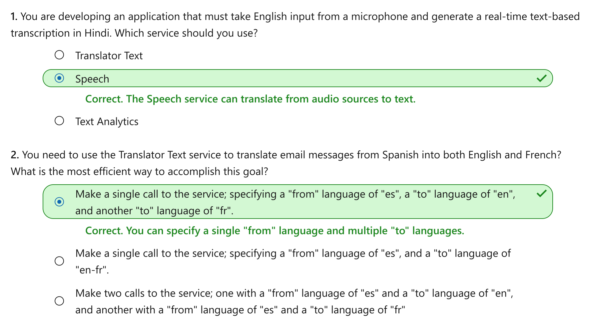

Translate text and speech
================

This notebook is refer from the Microsoft resources: [Explore natural language processing](https://docs.microsoft.com/en-gb/learn/paths/explore-natural-language-processing/).

### Module 3: Translate text and speech

Automated translation capabilities in an AI solution enables closer collaboration by removing language barriers.

### Topic 1: Introduction

As organizations and individuals increasingly need to collaborate with people in other cultures and geographic locations, the removal of language barriers has become a significant problem.

One solution is to find bilingual, or even multilingual, people to translate between languages. However the scarcity of such skills, and the number of possible language combinations can make this approach difficult to scale. Increasingly, automated translation, sometimes known as **machine translation**, is being employed to solve this problem.

#### 1.1 Literal and semantic translation

Early attempts at machine translation applied **literal translations**. A literal translation is where **each word is translated to the corresponding word in the target language**. This approach presents some issues. For one case, there may not be an equivalent word in the target language. Another case is where literal translation can change the meaning of the phrase or not get the context correct.

For example, the French phrase "*éteindre la lumière*" can be translated to English as "*turn off the light*". However, in French you might also say "*fermer la lumiere*" to mean the same thing. The French verb *fermer* literally means to "*close*", so a literal translation based only on the words would indicate, in English, "*close the light*"; which for the average English speaker, doesn't really make sense, so to be useful, a translation service should take into account the semantic context and return an English translation of "*turn off the light*".

Artificial intelligence systems must be able to understand, not only the words, but also the **semantic context** in which they are used. In this way, the service can return a more accurate translation of the input phrase or phrases. The grammar rules, formal versus informal, and colloquialisms all need to be considered.

#### 1.2 Text and speech translation

**Text translation** can be used to **translate documents from one language to another**, translate email communications that come from foreign governments, and even provide the ability to translate web pages on the Internet. Many times you will see a *Translate* option for posts on social media sites, or the Bing search engine can offer to translate entire web pages that are turned in search results.

**Speech translation** is used to **translate between spoken languages**, sometimes directly (speech-to-speech translation) and sometimes by translating to an intermediary text format (speech-to-text translation).

### Topic 2: Get started translation in Azure

Microsoft Azure provides cognitive services that support translation. Specifically, you can use the following services:

-   The **Translator Text** service, which supports **text-to-text** translation.

-   The **Speech** service, which enables **speech-to-text** and **speech-to-speech** translation.

#### 2.1 Azure resources for Translator Text and Speech

Before you can use the Translator Text or Speech services, you must provision appropriate resources in your Azure subscription.

There are dedicated **Translator Text** and **Speech** resource types for these services, which you can use if you want to manage access and billing for each service individually.

Alternatively, you can create a **Cognitive Services** resource that provides access to both services through a single Azure resource, consolidating billing and enabling applications to access both services through a single endpoint and authentication key.

#### 2.2 Text translation with the Translator Text service

The Translator Text service is easy to integrate in your applications, websites, tools, and solutions. The service uses a Neural Machine Translation (NMT) model for translation, which analyzes the semantic context of the text and renders a more accurate and complete translation as a result.

##### 2.2.1 Translator Text service language support

The Text Translator service supports **text-to-text** translation between **more than 60 languages**. When using the service, you must **specify** the **language** you are translating **from** and the language you are translating **to** using ISO 639-1 language codes, such as *en* for English, *fr* for French, and *zh* for Chinese. Alternatively, you can specify **cultural variants** of languages by extending the language code with the appropriate 3166-1 cultural code - for example, *en-US* for US English, *en-GB* for British English, or *fr-CA* for Canadian French.

When using the Text Translator service, **you can specify one from language with multiple to languages**, enabling you to **simultaneously translate a source document into multiple languages**.

##### 2.2.2 Optional Configurations

The Translator Text API offers some optional configuration to help you fine-tune the results that are returned, including:

-   **Profanity filtering**. Without any configuration, the service will translate the input text, without filtering out profanity. Profanity levels are typically culture-specific but you can control profanity translation by either marking the translated text as profane or by omitting it in the results.

-   **Selective translation**. You can tag content so that it isn't translated. For example, you may want to tag code, a brand name, or a word/phrase that doesn't make sense when localized.

#### 2.3 Speech translation with the Speech service

The Speech service includes the following application programming interfaces (APIs):

-   **Speech-to-text** - used to transcribe speech from an audio source to text format.

-   **Text-to-speech** - used to generate spoken audio from a text source.

-   **Speech Translation** - used to translate speech in one language to text or speech in another.

You can use the **Speech Translation** API to translate spoken audio from a streaming source, such as a microphone or audio file, and return the translation as text or an audio stream. This enables scenarios such as real-time closed captioning for a speech or simultaneous two-way translation of a spoken conversation.

##### 2.3.1 Speech service language support

As with the Translator Text service, you can specify one source language and one or more target languages to which the source should be translated. You can translate speech into [over 60 languages](https://docs.microsoft.com/en-us/azure/cognitive-services/speech-service/language-support#speech-translation).

The source language must be specified using the extended language and culture code format, such as *es-US* for American Spanish. This requirement helps ensure that the source is understood properly, allowing for localized pronunciation and linguistic idioms.

**The target languages must be specified using a two-character language code**, such as *en* for English or *de* for German.

### Topic 3: Exercise - Translate text and speech

The best way to learn how to use the Translator Text and Speech services for translation is to explore them for yourself.

Before you start To complete this exercise, you'll need the following:

A Microsoft Azure subscription. If you don't already have one, you can sign up for a free trial at <https://azure.microsoft.com> . A Visual Studio Codespace based on the MicrosoftDocs/ai-fundamentals GitHub repository. This service provides a hosted instance of Visual Studio Code, in which you'll be able to run the notebooks for the lab exercises. If you haven't already created a Visual Studio Codespace based on the MicrosoftDocs/ai-fundamentals repository, follow these steps to create one:

Open Visual Studio Codespaces in a new browser tab; and if prompted, sign in using the Microsoft account associated with your Azure subscription. Create a Codespace with the following settings (if you don't already have a Visual Studio Codespaces billing plan, you'll be prompted to create one): Codespace Name: A name for your codespace - for example, ai-fundamentals. Git Repository: MicrosoftDocs/ai-fundamentals Instance Type: Standard (Linux) 4 cores, 8GB RAM Suspend idle Codespace after: 30 minutes Wait for the codespace to be created. This will take around 3 minutes, during which time: A script will initialize and configure your codespace. A list of notebook (.ipynb) files will appear in the pane on the left. After the Codespace has been created, you can close the Welcome and Creation Log panes. You can also change the color scheme to suit your preference - just click the ⚙ icon at the bottom left and select a new Color Theme. A light color theme is recommended to make it easier to read the Python code in the notebooks. Exercise notebook After you have set up the Visual Studio environment, open the Translation.ipynb notebook to complete the exercise.

### Topic 4: Knowledge check

### Topic 5: Summary

The ability to automate translation between languages helps remove barriers to collaboration across cultural and geographical boundaries.

The Translator Text and Speech cognitive services in Azure provide cloud-based intelligence to support text and speech translation, enabling a wide range of scenarios for real-time and batch-process translation.

You can find out more about the using these services for translation in the [Translator text service documentation](https://docs.microsoft.com/en-us/azure/cognitive-services/translator/) and the [Speech service documentation](https://docs.microsoft.com/en-us/azure/cognitive-services/speech-service/).
