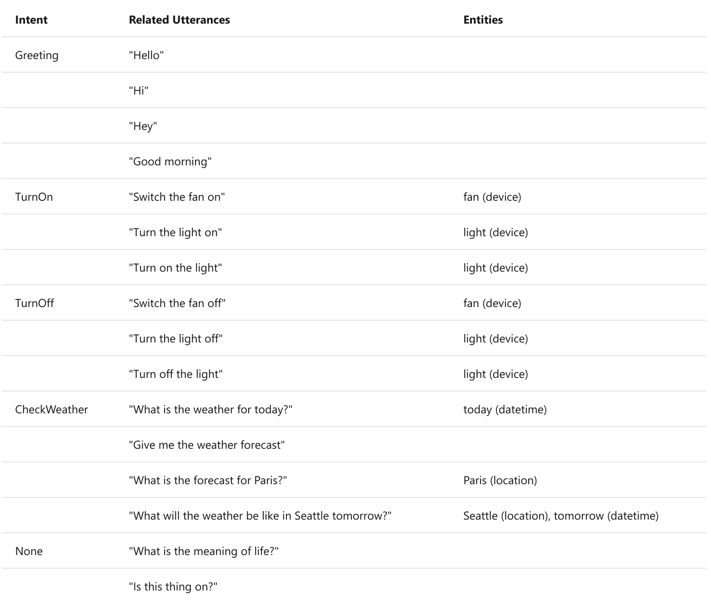
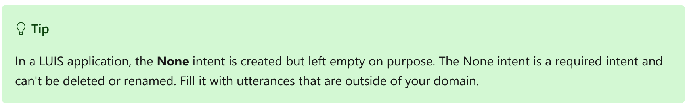
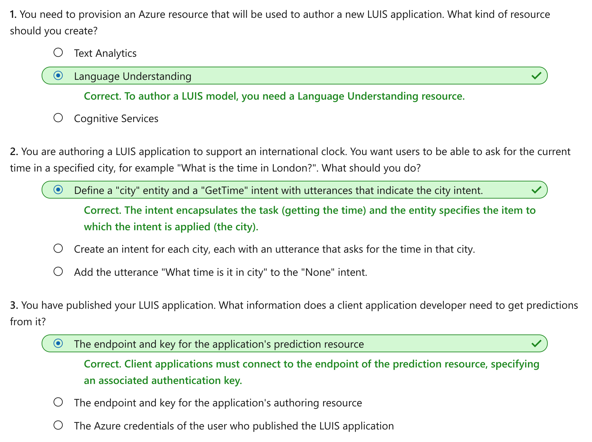

Create a language model with LUIS
================

This notebook is refer from the Microsoft resources: [Explore natural language processing](https://docs.microsoft.com/en-gb/learn/paths/explore-natural-language-processing/).

### Module 3: Create a language model with LUIS

In this module, we'll introduce you to Language Understanding Intelligent Service (LUIS) and show how to create a LUIS application.

### Topic 1: Introduction

In 1950, the British mathematician Alan Turing devised the *Imitation Game*, which has become known as the *Turing Test* and hypothesizes that if a dialog is natural enough, you may not know whether you're conversing with a human or a computer. As artificial intelligence (AI) grows ever more sophisticated, this kind of conversational interaction with applications and digital assistants is becoming more and more common, and in specific scenarios can result in human-like interactions with AI agents. Common scenarios for this kind of solution include customer support applications, reservation systems, and home automation among others.

To realize the aspiration of the imitation game, computers need not only to be able to accept language as input (either in text or audio format), but also to be able to interpret the semantic meaning of the input - in other words, understand what is being said.

On Microsoft Azure, language understanding is supported through the **Language Understanding Intelligent Service**, more commonly known as **LUIS**. To work with LUIS, you need to take into account three core concepts: *utterances*, *entities*, and *intents*.

#### 1.1 Utterances

**An utterance is an example of something a user might say, and which your application must interpret**. For example, when using a home automation system, a user might use the following utterances:

    "Switch the fan on."

    "Turn on the light."

#### 1.2 Entities

**An entity is an item to which an utterance refers**. For example, fan and light in the following utterances:

    "Switch the *fan* on."

    "Turn on the *light*."

You can think of the **fan** and **light** entities as being specific instances of a general **device** entity.

#### 1.3 Intents

**An intent represents the purpose, or goal, expressed in a user's utterance**. For example, for both of the previously considered utterances, the intent is to turn a device on; so in your LUIS application, you might define a **TurnOn** intent that is related to these utterances.

A LUIS application defines a model consisting of intents and entities. Utterances are used to train the model to identify the most likely intent and the entities to which it should be applied based on a given input. The home assistant application we've been considering might include multiple intents, like the following examples:

In this table there are numerous utterances used for each of the intents. The intent should be a concise way of grouping the utterance tasks. Of special interest is the **None intent**. You should consider always using the None intent to help handle utterances that do not map any of the utterances you have entered. **The None intent is considered a fallback**, and is typically used to provide a generic response to users when their requests don't match any other intent.

After defining the entities and intents with sample utterances in your LUIS application, you can train a language model to predict intents and entities from user input - even if it doesn't match the sample utterances exactly. You can then use the model from a client application to retrieve predictions and respond appropriately.

### Topic 2: Getting started with LUIS

Creating a language understanding application with LUIS consists of two main tasks. **First you must define entities, intents, and utterances with which to train the language model** - referred to as *authoring* the model. **Then you must publish the model** so that client applications can use it for intent and entity *prediction* based on user input.

#### 2.1 Azure resources for LUIS

For each of the authoring and prediction tasks, you need a resource in your Azure subscription. You can use the following types of resource:

-   **Language Understanding**: A dedicated resource for LUIS, which can be either an *authoring* or a *prediction* resource.

-   **Cognitive Services**: A general cognitive services resource that includes LUIS along with many other cognitive services. You can **only** use this type of resource **for prediction**.

The separation of authoring and prediction resources is useful when you want to track resource utilization for language model training separately from client applications using the model to generate predictions. However, it can make development of a language understanding solution a little confusing.

If you choose to create a **Language Understanding resource**, you will be prompted to choose *authoring*, *prediction*, or *both* - and it's important to note that if you choose "both", then **two** resources are created - one for authoring and one for prediction.

Alternatively, you can use a dedicated Language Understanding resource for authoring, but deploy your model to a generic Cognitive Services resource for prediction. When your client application uses other cognitive services in addition to LUIS, this approach enables you to manage access to all of the cognitive services being used, including the LUIS prediction service, through a single endpoint and key.

#### 2.2 Authoring

After you've created an authoring resource, you can use it to author and train a LUIS application by defining the entities and intents that your application will predict as well as utterances for each intent that can be used to train the predictive model.

LUIS provides a comprehensive collection of prebuilt *domains* that include pre-defined intents and entities for common scenarios; which you can use as a starting point for your model. You can also create your own entities and intents.

When you create entities and intents, you can do so in any order. You can create an intent, and select words in the sample utterances you define for it to create entities for them; or you can create the entities ahead of time and then map them to words in utterances as you're creating the intents.

You can write code to define the elements of your model, but in most cases it's easiest to author your model using the **LUIS portal** - a web-based interface for creating and managing LUIS applications.

##### 2.2.1 Creating intents

Define intents based on actions a user would want to perform with your application. For each intent, you should include a variety of utterances that provide examples of how a user might express the intent.

If an intent can be applied to multiple entities, be sure to include sample utterances for each potential entity; and ensure that each entity is identified in the utterance.

##### 2.2.2 Creating entities

There are four types of entities:

-   **Machine-Learned**: Entities that are learned by your model during training from context in the sample utterances you provide.

-   **List**: Entities that are defined as a hierarchy of lists and sublists. For example, a **device** list might include sublists for **light** and **fan**. For each list entry, you can specify synonyms, such as **lamp** for **light**.

-   **RegEx**: Entities that are defined as a *regular expression* that describes a pattern - for example, you might define a pattern like **\[0-9\]{3}-\[0-9\]{3}-\[0-9\]{4}** for telephone numbers of the form 555-123-4567.

-   **Pattern.any**: Entities that are used with *patterns* to define complex entities that may be hard to extract from sample utterances.

##### 2.2.3 Training the model

After you have defined the intents and entities in your model, and included a suitable set of sample utterances; the next step is to train the model. Training is the process of using your sample utterances to teach your model to match natural language expressions that a user might say to probable intents and entities.

After training the model, you can test it by submitting text and reviewing the predicted intents. Training and testing is an iterative process. After you train your model, you test it with sample utterances to see if the intents and entities are recognized correctly. If they're not, make updates, retrain, and test again.

#### 2.3 Predicting

When you are satisfied with the results from the training and testing, you can publish your LUIS application to a prediction resource for consumption.

Client applications can use the model by connecting to the endpoint for the prediction resource, specifying the appropriate authentication key; and submit user input to get predicted intents and entities. The predictions are returned to the client application, which can then take appropriate action based on the predicted intent.

### Topic 3: Exercise - Create a LUIS application

The best way to learn how to use LUIS is to explore it for yourself.

#### 3.1 Before you start

To complete this exercise, you'll need the following:

-   A Microsoft Azure subscription. If you don't already have one, you can sign up for a free trial at <https://azure.microsoft.com>.

-   A Visual Studio Codespace based on the **MicrosoftDocs/ai-fundamentals** GitHub repository. This service provides a hosted instance of Visual Studio Code, in which you'll be able to run the notebooks for the lab exercises.

If you haven't already created a Visual Studio Codespace based on the **MicrosoftDocs/ai-fundamentals** repository, follow these steps to create one:

1.  Open [Visual Studio Codespace](https://online.visualstudio.com/environments/new?name=ai-fundamentals&repo=MicrosoftDocs%2Fai-fundamentals) in a new browser tab; and if prompted, sign in using the Microsoft account associated with your Azure subscription.

2.  Create a Codespace with the following settings (if you don't already have a Visual Studio Codespaces billing plan, you'll be prompted to create one):

    -   **Codespace Name**: A name for your codespace - for example, **ai-fundamentals**.

    -   **Git Repository**: MicrosoftDocs/ai-fundamentals

    -   **Instance Type**: Standard (Linux) 4 cores, 8GB RAM

    -   **Suspend idle Codespace after**: 30 minutes

3.  Wait for the codespace to be created. This will take around 3 minutes, during which time:

    -   A script will initialize and configure your codespace.

    -   A list of notebook (.ipynb) files will appear in the pane on the left.

4.  After the Codespace has been created, you can close the **Welcome** and **Creation Log** panes. You can also change the color scheme to suit your preference - just click the ⚙ icon at the bottom left and select a new **Color Theme**. A light color theme is recommended to make it easier to read the Python code in the notebooks.

#### 3.2 Exercise notebook

After you have set up the Visual Studio environment, open the **Language Understanding.ipynb** notebook to complete the exercise.

### Topic 4: Knowledge check

### Topic 5: Summary

You can use the LUIS to build a model that predicts intents and entities from natural language utterances. A client application can then use this trained model to respond to natural language user input.

You can find out more about LUIS in the [service documentation](https://docs.microsoft.com/en-us/azure/cognitive-services/luis/).
