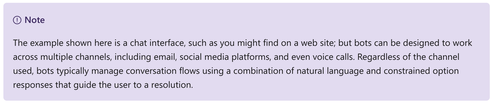
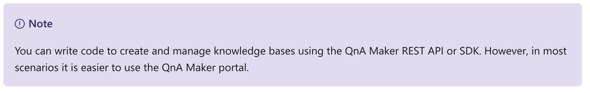
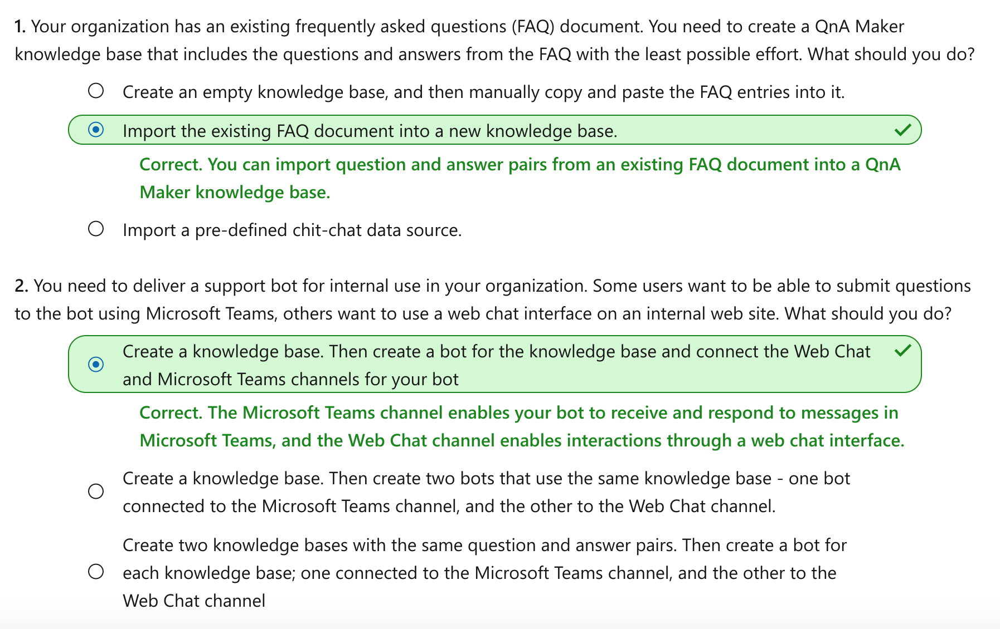

This notebook is refer from the Microsoft resources: [Explore conversational AI](https://docs.microsoft.com/en-gb/learn/paths/explore-conversational-ai/).

### Trophy 5: Explore conversational AI

Conversational AI is an artificial intelligence workload that deals with dialogs between AI agents and human users.

### Module 1: Build a bot with QnA Maker and Azure Bot Service

Bots are a popular way to provide support through multiple communication channels. This module describes how to use the QnA Maker service and Azure Bot Service to create a bot that answers user questions.


### Topic 1: Introduction

In today's connected world, people use a variety of technologies to communicate. For example:

- Voice calls

- Messaging services

- Online chat applications

- Email

- Social media platforms

- Collaborative workplace tools

We've become so used to ubiquitous connectivity, that we expect the organizations we deal with to be easily contactable and immediately responsive through the channels we already use. Additionally, we expect these organizations to engage with us individually, and be able to answer complex questions at a personal level.

#### 1.1 Conversational AI

While many organizations publish support information and answers to frequently asked questions (FAQs) that can be accessed through a web browser or dedicated app. The complexity of the systems and services they offer means that answers to specific questions are hard to find. Often, these organizations find their support personnel being overloaded with requests for help through phone calls, email, text messages, social media, and other channels.

Increasingly, organizations are turning to artificial intelligence (AI) solutions that make use of AI agents, commonly known as *bots* to provide a first-line of automated support through the full range of channels that we use to communicate. Bots are designed to interact with users in a conversational manner, as shown in this example of a chat interface:




Conversations typically take the form of messages exchanged in turns; and one of the most common kinds of conversational exchange is a question followed by an answer. This pattern forms the basis for many user support bots, and can often be based on existing FAQ documentation. To implement this kind of solution, you need:

- A *knowledge* base of question and answer pairs - usually with some built-in natural language processing model to enable questions that can be phrased in multiple ways to be understood with the same semantic meaning.

- A *bot* service that provides an interface to the knowledge base through one or more channels.


### Topic 2: Get started with QnA Maker and Azure Bot Service

You can easily create a user support bot solution on Microsoft Azure using a combination of two core technologies:

- **QnA Maker**. This cognitive service enables you to create and publish a knowledge base with built-in natural language processing capabilities.

- **Azure Bot Service**. This service provides a framework for developing, publishing, and managing bots on Azure.

#### 2.1 Creating a QnA Maker knowledge base

The first challenge in creating a user support bot is to use the QnA Maker service to create a knowledge base. The service provides a dedicated *QnA Maker portal* web-based interface that you can use to create, train, publish, and manage knowledge bases.



##### 2.1.1 Provision a QnA Maker Azure resource

To create a knowledge base, you must first provision a **QnA Maker** resource in your Azure subscription. You can do this directly in the Azure portal before you start creating your knowledge base, or you can start developing your knowledge base in the QnA Maker portal and provision the resource when prompted.

##### 2.1.2 Define questions and answers

After provisioning a QnA Maker resource, you can use the QnA Maker portal to create a knowledge base that consists of question-and-answer pairs. These questions and answers can be:

- Generated from an existing FAQ document or web page.

- Imported from a pre-defined *chit-chat* data source.

- Entered and edited manually.

In many cases, a knowledge base is created using a combination of all of these techniques; starting with a base dataset of questions and answers from an existing FAQ document, adding common conversational exchanges from a chit-chat source, and extending the knowledge base with additional manual entries.

Questions in the knowledge base can be assigned *alternative phrasing* to help consolidate questions with the same meaning. For example, you might include a question like:

```
What is your head office location?
```

You can anticipate different ways this question could be asked by adding an alternative phrasing such as:

```
Where is your head office located?
```

##### 2.1.3 Train and test the knowledge base

After creating a set of question-and-answer pairs, you must train your knowledge base. This process analyzes your literal questions and answers and applies a built-in natural language processing model to match appropriate answers to questions, even when they are not phrased exactly as specified in your question definitions.

After training, you can use the built-in test interface in the QnA Maker portal to test your knowledge base by submitting questions and reviewing the answers that are returned.

##### 2.1.4 Publish the knowledge base

When you're satisfied with your trained knowledge base, you can publish it so that client applications can use it over its REST interface. To access the knowledge base, client applications require:

- The knowledge base ID

- The knowledge base endpoint

- The knowledge base authorization key

#### 2.2 Build a bot with the Azure Bot Service

After you've created and published a knowledge base, you can deliver it to users through a bot.

##### 2.2.1 Create a bot for your knowledge base

You can create a custom bot by using the Microsoft Bot Framework SDK to write code that controls conversation flow and integrates with your QnA Maker knowledge base. However, an easier approach is to use the automatic bot creation functionality of QnA Maker, which enables you create a bot for your published knowledge base and publish it as an Azure Bot Service application with just a few clicks.

##### 2.2.2 Extend and configure the bot

After creating your bot, you can manage it in the Azure portal, where you can:

- Extend the bot's functionality by adding custom code.

- Test the bot in an interactive test interface.

- Configure logging, analytics, and integration with other services.

For simple updates, you can edit bot code directly in the Azure portal. However, for more comprehensive customization, you can download the source code and edit it locally; republishing the bot directly to Azure when you're ready.

##### 2.2.3 Connect channels

When your bot is ready to be delivered to users, you can connect it to multiple *channels*; making it possible for users to interact with it through web chat, email, Microsoft Teams, and other common communication media.


Users can submit questions to the bot through any of its channels, and receive an appropriate answer from the knowledge base on which the bot is based.


### Topic 3: Exercise - Create a bot

The best way to learn about building a bot with the QnA Service and the Azure Bot Service is to explore them for yourself.

#### 3.1 Before you start

To complete this exercise, you'll need the following:

- A Microsoft Azure subscription. If you don't already have one, you can sign up for a free trial at https://azure.microsoft.com.

- A Visual Studio Codespace based on the **MicrosoftDocs/ai-fundamentals** GitHub repository. This service provides a hosted instance of Visual Studio Code, in which you'll be able to run the notebooks for the lab exercises.

If you haven't already created a Visual Studio Codespace based on the **MicrosoftDocs/ai-fundamentals** repository, follow these steps to create one:

1. Open [Visual Studio Codespaces](https://online.visualstudio.com/environments/new?name=ai-fundamentals&repo=MicrosoftDocs%2Fai-fundamentals) in a new browser tab; and if prompted, sign in using the Microsoft account associated with your Azure subscription.

2. Create a Codespace with the following settings (if you don't already have a Visual Studio Codespaces billing plan, you'll be prompted to create one):

    - **Codespace Name**: A name for your codespace - for example, **ai-fundamentals**.
    
    - **Git Repository**: MicrosoftDocs/ai-fundamentals
    
    - **Instance Type**: Standard (Linux) 4 cores, 8GB RAM
    
    - **Suspend idle Codespace after**: 30 minutes
    
3. Wait for the codespace to be created. This will take around 3 minutes, during which time:

    - A script will initialize and configure your codespace.

    - A list of notebook (.ipynb) files will appear in the pane on the left.
    
4. After the Codespace has been created, you can close the **Welcome** and **Creation Log** panes. You can also change the color scheme to suit your preference - just click the ⚙ icon at the bottom left and select a new **Color Theme**. A light color theme is recommended to make it easier to read the Python code in the notebooks.

#### 3.2 Exercise notebook

After you have set up the Visual Studio environment, open the **QnA Bot.ipynb** notebook to complete the exercise.


### Topic 4: Knowledge check




### Topic 5: Summary

The QnA Maker service enables you to define and publish a knowledge base of questions and answers with support for natural language querying. When combined with Azure Bot Service, you can use QnA Maker to deliver a bot that responds intelligently to user questions over multiple communication channels.

The ability to create conversational AI solutions with these services makes it possible for AI agents to reduce the support workload for human personnel; enabling organizations to provide user support at global scale.


```{r echo=FALSE, eval=FALSE, message=FALSE}
rmarkdown::render(input = "AI16_conversational_ai.Rmd", output_format = "github_document", output_file = "README.md")
```

