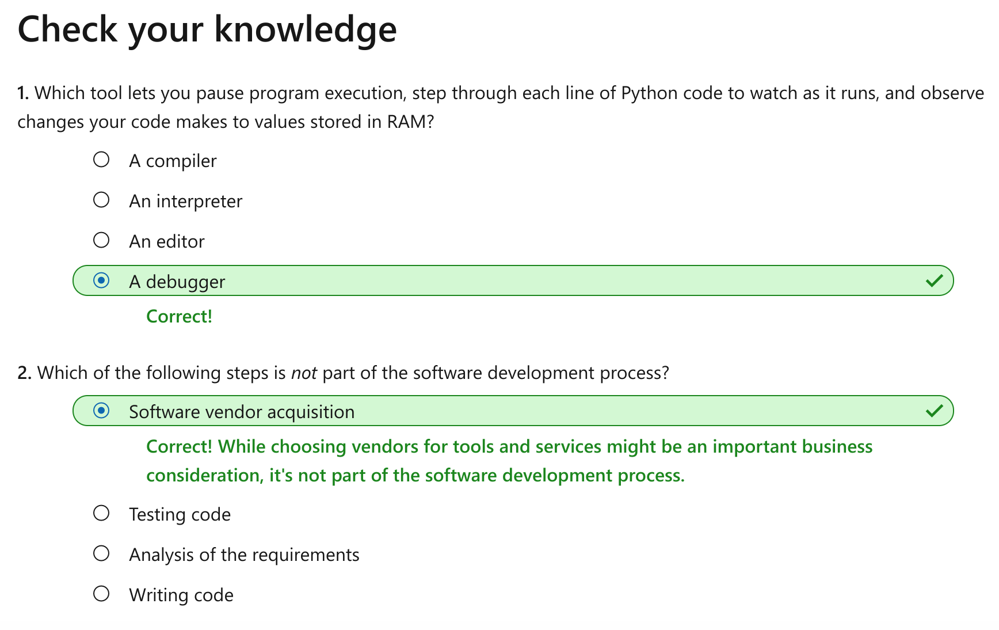

What is Python?
================

This notebook is refer from the Microsoft resources: [Take your first steps with Python](https://docs.microsoft.com/en-us/learn/paths/python-first-steps/).

### Trophy 1: Take your first steps with Python

Interested in learning a programming language but aren't sure where to start? Start here! Learn the basic syntax and thought processes required to build simple applications using Python.

In this learning path, you'll:

-   Write your first lines of Python code

-   Store and manipulate data to modify its type and appearance

-   Execute built-in functionality available from libraries of code

-   Add logic to your code to enable complex business functionality

### Module 1: What is Python?

A quick introduction to Python, programming languages, compilation, and the process of programming.

### Topic 1: Introduction

The Python programming language lets you build many types of programs like:

-   Business apps to capture, analyze, and process data.

-   Dynamic web apps that a web browser can access.

-   Games in both 2D and 3D.

-   Financial and scientific apps.

-   Cloud-based apps.

-   Mobile apps.

As programming languages go, Python is relatively simple yet powerful. This combination likely has contributed to its enormous popularity. Beyond the programming language itself, Python boasts a wealth of libraries that can reduce complex tasks into a few lines of code.

This module starts by explaining the most basic concepts to make sure you have a firm grasp on how programming works. We'll discuss:

-   The role of a programming language's syntax.

-   The need for compilation and interpretation.

-   The process of programming.

-   The tools you need to build your own software development environment.

#### 1.1 What's the best way to learn Python?

The best way to learn how to build Python programs is to write as much Python code as you can. Soon, you'll work through dozens of small code examples. When you get to that point, we'll encourage you to type along with the exercises. Completing the exercises and solving small coding challenges will help you learn more quickly.

But first, we'll cover some high-level conceptual information. In the next module, we'll help you install and configure the tools you need to get started.

After we help you get oriented, you'll start writing code. Continually practice and explore by completing exercises and challenges. These actions reinforce foundational concepts. You'll build on these concepts throughout your career.

Let's start with the most basic question: what exactly is Python? To answer what question, you must understand how a programming language lets a human communicate instructions to a computer.

#### 1.2 Learning objectives

In this module, you'll learn:

-   What a programming language does.

-   Why Python is so popular.

-   Why Python is a great choice as your first programming language.

-   Why you must compile your code into a format that computers understand.

-   The process of programming.

-   What software tools you must install.

#### 1.3 Prerequisites

-   None

### Topic 2: What is programming?

We'll start by talking about programming in general. What is a programming language? How does a programming language help you communicate commands to a computer?

#### 2.1 Hardware vs. software

Most of us understand that there are two sides to our computers and devices like phones and tablets: hardware and software.

*Hardware* describes the physical components that accept input, process that input, and emit output. Hardware might include:

-   A central processing unit (CPU).

-   Random-access memory (RAM) for short-term storage.

-   A hard drive for long-term storage.

-   A screen.

-   A microphone.

-   Connector ports like headphone jacks and USB ports.

*Software* describes the electronic instructions that tell the hardware what to do. Types of software include:

-   Operating systems that provide a foundation for device interaction.

-   Games.

-   Word processors.

-   Spreadsheets.

-   Web browsers.

People often refer to software as *programs*.

#### 2.2 What is a program?

A program is a set of instructions that do computing tasks. These instructions are compiled into a format that a computer understands. The compiled instructions are initiated or *run* by a user. **The term user can mean either a human or another program**.

The computer's CPU runs each instruction in the program line by line. The CPU:

-   Saves and retrieves information, which is in temporary or permanent storage.

-   Calculates and manipulates data.

-   Displays information on a screen.

-   Communicates with other programs via a network connection.

Even the most basic program will do one or more of the following tasks:

-   Input - Input includes information:

    -   Accepted from a user typing on a keyboard or clicking on a user interface.

    -   Stored as data in a file.

    -   Communicated from a network connection.

-   Processing - Processing includes:

    -   Performing logic.

    -   Calculation of mathematical formulas.

    -   Other manipulation or calculation of input to produce new data.

-   Output - Output includes information:

    -   Displayed on a screen to a user.

    -   Saved to a file.

    -   Sent to another program via a network connection.

A program can be:

-   A fully self-enclosed app like a game, a text editor, or billing software.

-   A script like a sophisticated macro that executes inside another program to automate some functionality.

-   A combination of live code, equations, and data visualizations used in Jupyter notebooks.

Python is frequently used for all of these purposes.

Some programs, including many you'll build as we get started, require at most a dozen lines of code. But sophisticated programs like operating systems require tens of thousands or even a million lines of code.

Some programs are small enough that a single software developer can build them. Others are so large and complex that dozens or even hundreds of developers build and maintain them. In that case, each developer works on some small part of the whole.

##### What is programming?

*Programming* is the act of writing instructions for a computer to create an app or script. Some people use different terms like *coding* or *developing* to describe programming.

A *programmer* is someone who writes those instructions using a programming language like Python. Synonyms for programmer include *coder*, *software developer*, and *developer*.

#### 2.3 What is a programming language?

Programming languages like Python let you write instructions that you want a computer to carry out.

Each programming language has a different syntax. But after you learn your first programming language and then attempt to learn another one, you'll quickly realize they all share many similar ideas.

A programming language lets someone write instructions in a way that's readable and understandable by humans. The instructions you write in a programming language are called *source code* or just *code*.

A software developer understands and modifies source code. But a computer can't understand or run source code. The source code must be compiled into a format that the computer understands. We'll talk about compilation, interpretation, and execution later in this module.

#### 2.4 What is syntax?

The *syntax* of a programming language includes keywords, operators, and grammar rules. Operators are special characters like parentheses and the equal sign. A simple line of Python code might follow a dozen different syntax rules and use several different operators.

Many programming languages use English words and phrases as keywords. Python uses English words like **if**, **return**, **while**, and **import** as keywords. Fortunately, there are fewer than 40 keywords in Python, so you don't need to know English before you can start with Python.

To become fluent in any language, you need to learn and practice new vocabulary and concepts. Learning a programming language is no exception. For any language, there's much to learn. Fortunately, each concept is simple on its own. Don't give up! You can learn it!

#### 2.5 Why are there so many programming languages?

There are dozens of different programming languages. Programmers have discovered that available languages don't always offer needed flexibility, control, and ease of use. So they decide to craft their own.

Python was created to simplify software development by masking more complex interactions with the hardware. The tradeoff is that Python offers less control over those interactions. So Python might not be ideal for some processor-intensive apps.

Other programming languages provide greater control over complex interactions with the hardware. If used properly, they can yield performance better than Python's. But they can be more difficult to understand. Many software apps don't require this degree of optimization to improve performance.

#### 2.6 Should I learn Python first?

With so many options, you might wonder if you're making the right choice by starting your programming career with Python.

Python is a language friendly to beginners. Among other things, you'll learn how to:

-   Employ basic logic.

-   Create program structure.

-   Build expressions and statements.

-   Work with data.

Many of the syntax elements and other concepts are similar for all programming languages. Starting with a language friendly to beginners is a great first step. Later, you can add more programming languages. You'll then focus on just those parts of the new languages that differ from Python.

Furthermore, there's a strong demand for Python skills in a wide range of industries.

Plenty of learning resources are available for Python. Resources include this Learning Path, videos, articles, and books. Python is also well supported. If you run into a problem, there are many communities of experienced developers who are willing to help you solve the problem.

So yes, if you're looking to get started in programming, Python is a great choice.

### Topic 3: What is compilation?

We previously said that source code must be compiled before it can run. In this unit, you'll work on understanding compilation a little better. You'll also learn how Python's compilation and execution differ from that of other traditional programming languages and execution models.

#### 3.1 What is compilation?

After you finish writing your source code, you often use a special program called a *compiler*. **This program converts source code into a format that a computer's CPU can run**.

Why do you need to compile your source code? Most programming languages seem cryptic at first. But they're more easily understood by humans than are a computer's preferred form of communication. That communication is expressed by turning on and off thousands of tiny switches. Compilers bridge these two worlds by translating instructions readable by humans into instructions understood by computers.

Those instructions are collected and compacted together into a single file, which can be run by a user.

With many programming languages, each time you change the source code, you must recompile the app to create an executable file. However, each time a user wants to run a program, that user merely opens the compiled executable file. No additional compilation is necessary.

You often must use a compiler for your specific computing platform. For example, to run your program on a Windows computer, you must compile using a Windows compiler. To run your program on a macOS computer, you must compile using a macOS compiler.

#### 3.2 How does Python work?

Python has features similar to many programming languages, but it functions differently in a few key ways.

Python has a compiler. But **the compiler doesn't translate the source code directly into a format that computers can understand**. **Instead, the compiler produces code in a special format that a Python interpreter can interpret and run**.

**An *interpreter* is a program that runs each instruction**. It tracks where it stores values in RAM. An interpreter also knows how to interact with external resources like a file system or a network.

In other words, **an interpreter is an execution environment that manages complex interactions between your intent and the computer's inner workings**.

Furthermore, each time you run your program, its Python source code is recompiled.

There are several benefits to this approach.

First, a Python interpreter is available for many computer platforms. For example, if you write Python code on Linux, it will also run on macOS and Windows. You can run a program without needing to compile your source code for a specific computing platform.

Second, you can write and execute one line of Python at a time. As you learn, you might want to experiment with a new idea without having to create a new project or file. Instead, you merely run Python in interactive mode and begin entering Python code in a terminal or command line. This code is lost when you exit Python's interactive mode. But for a quick experiment, it works well.

Finally, you can use a special software tool called a *debugger* to:

-   Edit your program as it's running.

-   Pause the execution of your program.

-   Step through each line of Python code to watch as it runs.

-   Observe changes your code makes to values stored in RAM.

You can edit the code that will be run next during program execution. Such edits usually can't be done with programming languages that aren't interpreted. This editing is just another reason why Python is considered to be friendly to beginners.

### Topic 4: What is the process of programming?

Here are some reasons for writing Python code:

-   For fun

-   To automate some part of your job

-   To analyze data

-   To work on a team to build a large-scale app for your company

Whatever your reason, you follow similar steps.

In this unit, you'll look at the process of programming and the tools you need to create your first Python programs.

#### 4.1 What is the process of programming?

Why do software developers write code in the first place? They typically act to address a need or problem that requires a solution.

As you start, your need could be an assignment or coding challenge for a course. Later, your need will likely come as a business problem to automate.

Building a new program follows a predictable series of actions:

1.  **Analyze** requirements: The first step is to understand the problem you're trying to solve. How you begin depends on whether you're building the program to satisfy a teacher, a client, or yourself. You typically want to immerse yourself in the problem. You ask critical questions about what the problem is, read any available communication or notes, and take other actions.

2.  **Design** a solution: Next, you begin to think about considerations like the program's appearance, its functionality, and what happens when an unexpected problem arises. You might draw diagrams, take notes, or mentally visualize the design of the program. You also might begin to imagine the approach you'll take for certain challenges in your code.

3.  **Write** your code: You spend the most time writing code that realizes the design you created.

4.  **Test** your code: As you write code, you test to see if the code works correctly. Later, you might add more formal testing that even involves users.

5.  **Deploy** your code: You distribute your code to others so they can begin using it to solve their problems. Or in a classroom, you might send your code to an instructor, which is a form of deployment.

6.  **Maintain** your code: Over time, users of your program might ask for new features or report bugs in your program. You fix the problems and redistribute your code to your users.

You might be your program's only user. Or you might work in a large team and distribute your program to thousands of users. In either case, the basic process is the same. Writing code is important, but it's not the only step, even when you solve coding challenges or assignments for a class.

Most tutorials and classes usually focus on writing code. They focus on coding probably because it's both the hardest step and the most fun. It's also the activity that requires deep knowledge to complete. This step has its own process:

1.  Focus on some small part of the larger problem.

2.  Write code to implement that small part.

3.  Run the program and watch it work. If it works incorrectly, figure out why.

4.  Rewrite the code to fix any problems.

5.  Keep repeating this process until you're done.

The final step, which is often called *iterating*, is popular in software development. You usually write just a few lines of code before you run the program. This way, you see if the code actually does what you want and where the code went wrong.

Fixing a problem in your code is as easy as typing or editing a document. It's like driving a car, where you make a thousand small course corrections until you get to your destination. Code fixing might seem scary at first. But compared to people like pilots, surgeons, and construction workers, software developers can make many mistakes and still be good at what they do.

#### 4.2 What programming tools should I use?

You need a Python compiler, interpreter, and editor. You could use a basic text editor like Notepad on Windows or Vim on macOS or Linux. But you'd have a better experience with a dedicated code editor.

Here are the tools to use as you get started:

**Python**: The Python installer contains many utilities and features. The most important are:

-   The Python runtime, which is the compiler and the interpreter.

-   The Python Standard Library, which is a large collection of code that implements common functionality so you don't have to. Later, we'll devote entire modules to exploring this code library.

**Visual Studio Code**: You can use a basic text editor to write code. But a dedicated code editor like Visual Studio Code lets you manage your code files, provides helpful visual hints as you code, and much more.

**Python extension for Visual Studio Code**: The Python extension enhances the default Visual Studio Code experience by customizing the editor to help you write Python.

Collectively, these software tools are typically referred to as your *developer environment*. In the next module, you'll walk through the steps to install the software tools you need to start programming with Python.

### Topic 5: Knowledge check

### Topic 6: Summary

In this module, you learned:

-   What a programming language does.

-   Why Python is so popular.

-   Why Python is a great choice as the first programming language you learn.

-   Why you must compile instructions written using a programming language into a format a computer understands.

-   The different steps to take in just about every program you write.

-   That you need to install some tools to build your own software development environment.

In the next module in this Learning Path, you'll walk through the steps to install Python, Visual Studio Code, and more. Then you'll be ready to write your first lines of code.
