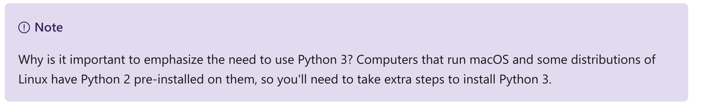
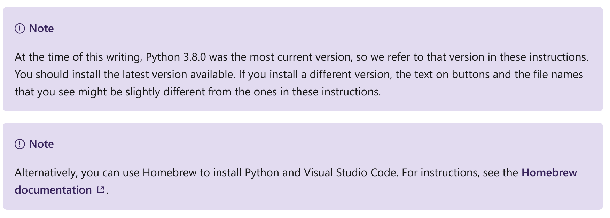
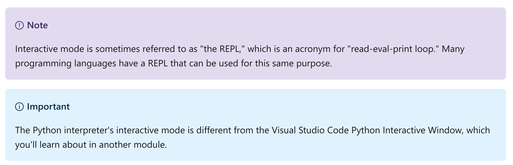
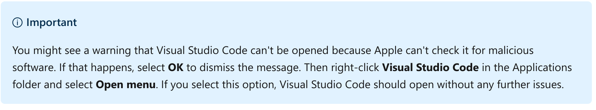
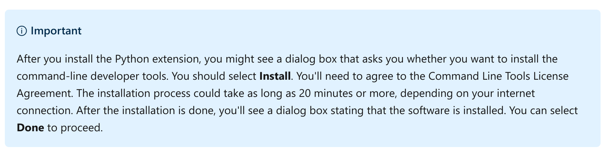
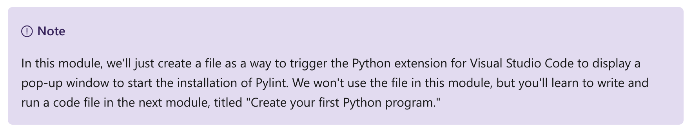
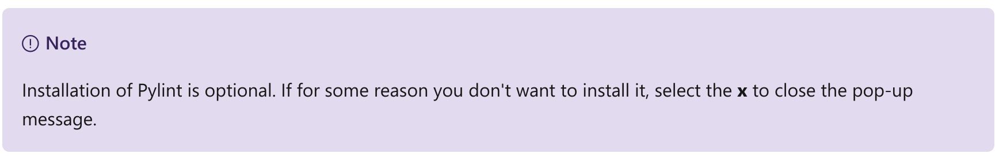
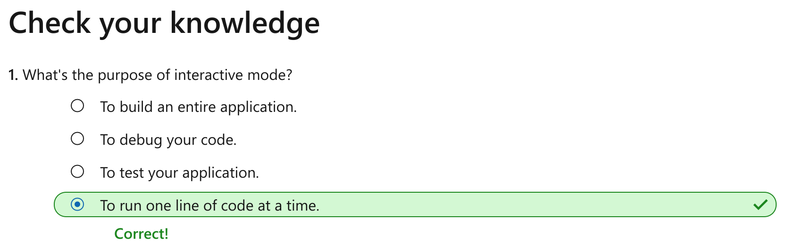

Set up your Python beginner development environment with Visual Studio Code
================

This notebook is refer from the Microsoft resources: [Take your first steps with Python](https://docs.microsoft.com/en-us/learn/paths/python-first-steps/).

### Module 2: Set up your Python beginner development environment with Visual Studio Code

Get started with learning Python by installing and configuring the tools you'll need to build real applications.

In this module, you will:

-   Determine which version of Python, if any, is installed on your computer.

-   Install Python 3.

-   Start Python interactive mode to run Python code one line at a time.

-   Install Visual Studio Code, Python, and the Python extension for Visual Studio Code on your computer.

-   Create a Python script file and write Python code in Visual Studio Code.

-   Run your Python script file code by using the Python command-line tools.

### Topic 1: Introduction

In this module, you'll build a Python development environment that will allow you to learn about Python and build many types of applications. You'll learn how to run Python code in interactive mode. You'll also learn how to use Visual Studio Code to create a Python code file, write Python code in the file, and then run that file.

By the end of this module, you'll have installed the tools on your computer to move forward with your goal of building real applications with Python.

#### 1.1 Learning objectives

In this module, you will:

-   Determine which version of Python, if any, is installed on your computer.

-   Install Python 3.

-   Start Python interactive mode to run Python code one line at a time.

-   Install Visual Studio Code, Python, and the Python extension for Visual Studio Code on your computer.

-   Create a Python script file and write Python code in Visual Studio Code.

-   Run your Python script file code by using the Python command-line tools.

#### 1.2 Prerequisites

None.

### Topic 2: Introducing Python

#### 2.1 For Mac User

As you learned in the previous module, before you can begin writing Python code, you'll need to install a few tools on your local computer. You'll need:

-   The **Python installer**, which contains the interpreter that compiles and runs your code, additional code libraries, and other useful tools for Python developers. You might already have it installed. In a moment, we'll check whether you do.

-   A **code editor**, ideally one that has features that can help you write Python code. In this module, we'll walk through the installation of Visual Studio Code, one of the most popular free code editors. We'll also install the Python extension for Visual Studio Code to add enhanced functionality.

#### 2.2 Python 2 vs. Python 3

In this module, we make an effort to distinguish between Python version 2 and Python version 3. We make this distinction because the creators of Python discourage developers from using Python 2. Significant improvements were made in Python 3, and some of those changes affected code that was written years ago in Python 2.

The key idea is that you want to use Python 3 from now on.

#### 2.3 How do I know if I already have Python 3 installed on my computer?

You might already have Python 3 installed on your computer. Sometimes an application will install Python 3 without you knowing about it.

At the top of this page, select the tab that represents your operating system.

#### 2.4 macOS

To determine if your macOS computer already has Python 3 installed:

1.  Open the Terminal app. To locate and start it, you can use the `Command + Spacebar` key combination to search by using Spotlight. In the search box, enter **Terminal**. You should see the Terminal app in the results. Use the `Return` key to start the app.

2.  Enter the following command at the command prompt:

Bash:

    python3 --version

You might see the word `Python` with a set of numbers separated by `.` characters. Here's an example of the output you might see:

Output:

    Python 3.6.7

As long as the first number is `3`, you're all set. There's nothing more to do.

Python 3 isn't pre-installed on macOS, but it's possible that you or a program you use has installed Python 3. Even if you don't have the most up-to-date version, you can still follow along with the beginner Python modules on Microsoft Learn.

It's more likely that you see this output:

Output:

    command not found

We'll walk through installation of Python 3 on macOS in the next unit.

#### 2.5 Recap

The main takeaway from this unit is that Python version 2 should no longer be used. You should write new code by using Python version 3 from now on. Use Python's `--version` flag to be sure you know which version of Python you're working with.

### Topic 3: Install Python 3

#### 3.1 For Mac User

In the previous unit, you ran a command to determine whether you had Python 3 installed. If you need to install Python 3, choose your operating system at the top of this page, and then follow the instructions.

If you determined that you already have Python 3 installed, scroll to the bottom of this page and select **Continue**.

#### 3.2 Install Python on macOS

Follow these steps to download the Python installer from the Python website.

#### Step 1: Go to the Python download website and download the installer

Go to the [Python download page](https://www.python.org/downloads/).

The website should automatically direct you to a page specifically for Mac OS X. Select the **Download Python 3.8.0** button.

You might see a window prompting you to allow downloads from python.org. Select **Allow**.

After a moment, a file named **python-3.8.0-mascosx10.9.pkg** should download to the Downloads stack in your Dock.

#### Step 2: Start the Python installer and accept options for a standard installation

Double-click the **.pkg** file that you downloaded to start the installer. The Python installer will prompt you to install, verify, and accept various options and license agreements. Take the time to read through these prompts to understand what the installer will do to your computer.

When the installation process finishes, a Finder window showing the contents of the Python folder will appear. You also should see a congratulations screen when the installation finishes. At that point you can select **Close**.

If you're prompted to move the Python installer to the trash, you can do so.

#### Step 3: Check to ensure that Python 3 installed correctly

Using Spotlight (`Command + Spacebar`), enter **terminal** and then select the `Return` key to launch Terminal.

At the Terminal prompt, enter the following command and then select the `Return` key:

Bash:

    python3 --version

You should see the word `Python` with a set of numbers separated by `.` characters. Here's an example of the output you might see:

Output:

    Python 3.8.0

As long as the first number is `3`, Python 3 installed successfully.

### Topic 4: Use Python's interactive mode to write and run code

#### 4.1 For Mac User

Now that Python 3 is installed, let's write one line of Python code to see it working. This tiny line of code won't win you any awards for software design, but it's the first step all software developers take as they begin their learning journey.

#### 4.2 Using the Python interpreter's interactive mode

In this module, you'll learn that there are two workflows for writing and running Python code:

-   Use the Python interpreter's interactive mode to write and run one line of Python code at a time.

-   Write Python code in a script file and then use command-line tools to run the contents of the script file.

Interactive mode allows you to experiment with Python without having to do additional setup, so it's great for learning new things. But it's limited: after you leave interactive mode, your code is gone forever.

#### Step 1 - Start Python's interactive mode

##### Start Python's interactive mode in macOS

At a Bash prompt, enter the following line of code, and then select the `Return` key:

Bash:

    python3

When you use it this way, the `python3` utility will start Python in interactive mode.

You should now see this prompt:

Output:

    >>>

The three arrows (`>>>`) are called a *primary prompt*. We'll discuss a *secondary prompt* later.

On the primary prompt, you can write and run one line of Python at a time. Let's try it.

#### Step 2 - Write your first line of Python code

After the primary prompt (`>>>`), enter the following Python code, and then select the `Return` key:

Python:

    print('Hello World!')

You should see this output on the next line:

Output:

    Hello World!

If you see an error message instead of the output, retype the code. Pay close attention to each character, and make sure your code looks exactly like the preceding code. Even one tiny punctuation error can cause significant problems when you write code.

In the next module, we'll examine this line of code to help you learn about Python syntax. You'll learn what each individual word and punctuation mark does in the code.

#### Step 3 - Close interactive mode

We're done working in interactive mode, but we'll use it again throughout this series of modules. For now, you can close interactive mode by entering the following command after the primary prompt (`>>>`) and then selecting the `Return` key:

Python:

    exit()

You should be returned back to your command or Bash prompt.

#### 4.3 Recap

The important takeaways from this unit:

-   Writing code requires precision. Even one small mistake can cause an error.

-   You can use interactive mode to quickly try writing Python. Each line will be interpreted and run immediately.

-   To close interactive mode, use the `exit()` command.

### Topic 5: Install Visual Studio Code

#### 5.1 For Mac User

You've already seen how you can run Python code line by line by using Python's interactive mode. Interactive mode is useful when you want to experiment with a few lines of code. The downside is that once you leave interactive mode, any code you wrote is gone forever.

As an aspiring Python developer, you'll probably prefer to write a Python *script*. A script is a text file with a **.py** file extension that you type all your Python code into. After you save the code in your script file, you use the Python interpreter to open, compile, interpret, and run the code in that file.

#### 5.2 Tools to write Python code

You typically write Python syntax in a text file and save it to your local hard drive. You can write code by using a simple text file editor, like Notepad in Windows. Notepad edits ASCII text, a simple standard text file format.

You always want to avoid any text editor that includes formatting options, like bold, underline, or italics, or any other program that has word-processing features. So you shouldn't write code in Microsoft Word or TextEdit on macOS. These programs will include additional formatting instructions that the Python compiler will understand.

Although you can use a text editor, you'll probably want to use a tool that's better suited for the unique challenges of writing code. There are many options, but many developers rely on Visual Studio Code for this purpose. It's free and available on Windows, macOS, and Linux. It has many features that make it easy to navigate code, no matter which programming language you want to work with.

Microsoft also provides the Python extension for Visual Studio Code. This extension provides features like syntax highlighting, code navigation and code formatting support, and more. One feature in particular, named IntelliSense, is invaluable when you're getting started. It provides contextual help as you type. You'll install that in the next unit.

#### 5.3 Install Visual Studio Code on macOS

This section will walk you through downloading and installing Visual Studio Code.

##### Step 1 - Download Visual Studio Code

Go to the [Visual Studio Code download page](https://code.visualstudio.com/Download).

The web page displays logos for Windows, Linux, and Mac.

Download the Mac version. Most browsers give you the option to save the file to your local computer (usually in your Downloads folder) or immediately run the file.

You should move the file to the Applications folder before you open it, as described in the next step.

##### Step 2 - Move the app from the Downloads folder to the Applications folder

Open Finder. Drag the Visual Studio Code file from the Downloads stack on the Dock to the Applications folder in Finder.

##### Step 3 - Start Visual Studio Code from the Applications folder

Double-click the **Visual Studio Code** app from the Applications folder.

### Topic 6: Install the Python extension and run your first Python script

#### 6.1 For Mac User

Now that you have Visual Studio Code installed, you'll install the Python extension for Visual Studio Code and, optionally, set up other tools and settings.

#### 6.2 Install the Python extension for Visual Studio Code

Visual Studio Code is a great lightweight general-purpose code editor. Extensions provide additional functionality for only the programming languages or features that you want to enable. The Python extension for Visual Studio Code provides visual cues and tools to help you write better Python code, and to write code faster.

##### Step 1 - Open Extensions view

You can browse through extensions and install them from within Visual Studio Code.

Bring up the Extensions view. Go to **View** and select **Extensions**, or select the **Extensions** icon in the Activity Bar on the left side of Visual Studio Code.

Extensions view will display a list of the Visual Studio Code extensions that are the most popular on the Visual Studio Code Marketplace.

##### Step 2 - Search for the Python extension

To filter the list of extensions, enter **python** in the search box at the top of the Extensions view.

Select the extension that's published by **Microsoft** (usually the first one in the list). The details about that extension will appear in a tab in the main area to the right.

##### Step 3 - Install the Python extension

In the main area, where you see the details about the Python extension, select **Install**.

When the installation is complete, the button's text will change to `Uninstall`. This lets you know that you've successfully installed the Python extension.

#### 6.3 Install Pylint

Pylint is one of the more popular Python linters. A *linter* is a useful tool that can check your code for possible bugs and coding style. If you install a linter, Visual Studio Code will check your code each time you save your code file. There are several linter tools available for Python.

The Python extension for Visual Studio Code will recommend that you install Pylint and will handle most of the installation details.

To start installation, you'll create a file with a .py file extension, which will trigger a pop-up window with an install button. We'll begin that process in the next step.

##### Step 1 - Open Explorer view in Visual Studio Code

Open Explorer view. Go to **View** and select **Explorer**, or select the **Explorer** icon in the Activity Bar on the left side of Visual Studio Code.

There are two sections in Explorer:

-   Open **Editors**, which displays all the tabs visible in the main area

-   The name of the current working folder

But because this is the first time you've opened Visual Studio Code, you'll see a section titled **No Folder Opened** instead. Below this header, you'll see the message "You have not yet opened a folder" and an **Open Folder** button.

##### Step 2 - Create a working folder

Select **Open Folder** to open your operating system's Open dialog box.

Create a folder called **hello** in your system's Documents folder. Select it.

After you select the new **hello** folder, back in Explorer view, you should see the title of the section change to **hello**.

##### Step 3 - Create a file

To create a script file in your **hello** folder, go to **File** and select **New File**.

In the main area, the new file appears.

You'll probably see one or more pop-up messages appear in the lower right corner of Visual Studio Code.

##### Step 4 - Start Pylint installation from the pop-up window

In this step, we'll focus on the pop-up window with the message "Linter pylint is not installed."

To install Pylint, select **Install**. The Visual Studio Code terminal window will open below your code file. You can use a command-line tool named pip to install Pylint.

##### Step 5 - Address other pop-up messages

You might see other pop-up messages.

The most critical of these messages is this one:

"No Python interpreter is selected. You need to select a Python interpreter to enable features such as IntelliSense, linting, and debugging."

If you click **Select Python Interpreter**, you'll see a list of Python interpreters near the top of Visual Studio Code, in the command bar. Select the most recent version that you have installed, making sure that it's version 3 or later.

Your selection will be reflected in the Visual Studio Code status bar, near the lower-left corner.

Alternatively, you might see this message:

"Tip: you can change the Python interpreter used by the Python extension by clicking on the Python version in the status bar."

This message just lets you know you have an interpreter selected, but you can change it if you want. You can change it by clicking the currently selected interpreter near the lower-left corner and then choosing from the list of Python interpreters displayed near the top of Visual Studio Code in the command bar.

Select **Got it**! to dismiss the tip, or select **Do not show again** to permanently disable it.

After you've addressed all the pop-up messages, you've successfully set up the Python extension for Visual Studio Code and are ready to begin writing Python code!

### Topic 7: Knowledge check

### Topic 8: Summary

Our goal was to create a development environment to begin writing Python code.

We installed Python version 3, Visual Studio Code, and the Python extension for Visual Studio Code. We started interactive mode, wrote Python, and ran code one line at a time. We created a Python script file in Visual Studio Code. We then used the built-in command-line interface to instruct the Python interpreter to compile and run the code.

You've taken your first steps toward learning how to use Python to build programs and write scripts to automate tasks, analyze data, and build entire web-based applications, games, and more.
