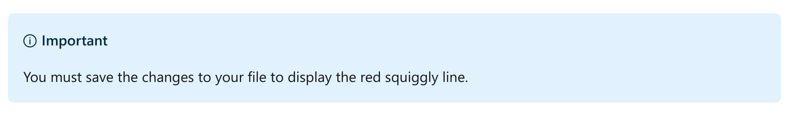

Create your first Python program
================

This notebook is refer from the Microsoft resources: [Take your first steps with Python](https://docs.microsoft.com/en-us/learn/paths/python-first-steps/).

### Module 3: Create your first Python program

Get started with Python by writing code to interact with end users.

### Topic 1: Introduction

A common goal of many programs is to take input, process it, format it, and then output it in some way. In this module, you'll write Python code to perform each of these tasks. Along the way, you'll learn many foundational ideas, such as working with data, performing operations on data, retrieving input, generating output, and more.

By the end of this module, you'll be able to build simple applications that can accept user input, combine that input with literal text, and output the result to the user. More importantly, you'll have taken vital first steps toward learning Python.

#### 1.1 Learning objectives

In this module, you will:

-   Create Python code files and execute that code in Visual Studio Code.

-   Write code to send a text message to the command line.

-   Write code to accept user input from the command line.

-   Understand why compilation and runtime errors occur, and what to do next.

-   Concatenate hard-coded text with user input to display custom-formatted messages to the user.

-   Perform mathematical addition on numeric data.

-   Convert alphanumeric data into numeric data and back again.

#### 1.2 Prerequisites

-   Python 3.x installed

-   Visual Studio Code installed

-   Python tools for Visual Studio Code installed, including all recommended tools, such as Pylint

If you need help with installing these prerequisites, follow the instructions in the module "Set up your Python beginner development environment with Visual Studio Code."

### Topic 2: Exercise - Hello world!

The easiest way to learn programming is to write dozens (if not hundreds) of tiny programs that help you understand fundamental ideas and practice crucial techniques.

#### 2.1 What you'll build

In this unit, you start building a program that prints a message to screen by using a single line of code. This activity requires you to navigate Visual Studio Code and work in the code editor.

##### Step 1 - Create a new folder for your first Python project

First, on your computer, create a folder structure where you'll store your work.

We recommend that you create a single folder to contain all of the exercises for each module. You can call this new parent folder anything you like, such as *python* or *learn*. Use the tools and techniques you're comfortable with, and create the folder in a place on your hard drive that's easy to find.

Second, in this top-level folder, create a subfolder for the exercise files you'll work with in this module. You can call the new child folder anything you like, such as *hello*.

In upcoming Python modules, when you're instructed to create a new folder, be sure to create new subfolders as children to the parent folder you're creating in this step.

##### Step 2 - Open Visual Studio Code

Use the technique you're comfortable with to open Visual Studio Code from your operating system.

##### Step 3 - Open the folder you just created

In Visual Studio Code, select **File** &gt; **Open Folder**.

In the **Open Folder** window, look for and select the folder that you created in Step 1.

The name of the folder is listed in the left pane of Explorer view.

##### Step 4 - Create and save a new file

Select **File** &gt; **New File**. This adds a new tab titled "Untitled-1" in the editor pane.

Select **File** &gt; **Save As**, and then name the file *hello.py*.

##### Step 5 - Add code to the file

The new *hello.py* file is empty. In the editor pane, type the following code:

Python:

    print("Hello World!")

##### Step 6 - Save the file and execute your program

After typing the code, select **File** &gt; **Save**.

To execute your program, select the green arrow to the right of the tabs. If you hover over the arrow, you'll see the tooltip "Run Python File in Terminal." That lets you know you're in the right place.

When the code is run, two lines appear in the **Terminal** window:

-   The first line is the command to compile and execute the code file.

Output:

    C:\python\hello>C:/Users/<user>/AppData/Local/Programs/Python/Python38-32/python.exe c:/python/hello/hello.py

-   The other line printed to the Terminal window appears below the code window:

Output:

    Hello World!

Success!

##### Wait, I got an error

It's possible to experience an error when you attempt to run the code. This can happen for many different reasons.

For example, you might have used an uppercase *P* instead of a lowercase *p* in print, as shown:

Python:

    Print("Hello World!")

An uppercase *P* would produce the following error message in your output:

Output:

    Traceback (most recent call last):
      File "c:/python/hello/hello.py", line 1, in <module>
        Print("Hello World!")
    NameError: name 'Print' is not defined

As discussed earlier, precision is critical when you're writing code. Python is case-sensitive, which means that *print* and *Print* are two different things. There's no function called `Print` with an uppercase *P*.

Fortunately, Visual Studio Code can help you spot mistakes like this before you run the code. You should see a red squiggly line under *Print*. If you hover over the word, a tooltip displays the phrase "Undefined variable 'Print'". The specific message requires more explanation, but for now you can at least spot potential problems in your code.

You can use this same technique to locate other types of issues in your code. For example, let's say you transposed the order of certain characters, such as the closing parenthesis and closing quotation mark, as shown here:

Python:

    print("Hello World!)"

If you were to run the code, you would see the following error message:

Output:

    File "c:/python/hello/hello.py", line 2

                             ^
    SyntaxError: unexpected EOF while parsing

Here again, the error message might not be meaningful yet. After you save the file, Visual Studio Code adds a red squiggly line under the closing quotation mark, which should at least provide a useful clue as you self-diagnose the error.

This doesn't work because it doesn't follow the syntax rules of Python. Syntax in code is similar to grammar in human language. We'll explain why this violates Python syntax rules in just a moment.

Some errors are easy to spot and easy to fix. Others require a bit more effort. Let's suppose you used square brackets instead of parentheses, as shown here:

Python:

    print["Hello World!"]

After you save the file, a red squiggly line appears under print. This time, when you hover over the red squiggly line, you see a paragraph with additional information.

We'll discuss what this information means in another module, but we can skip over it for now because it's a bit advanced at this point. The main takeaway is that there's a problem with the code.

When you run the program, the following error message appears in the output:

Output:

    Traceback (most recent call last):
      File "c:/python/hello/hello.py", line 1, in <module>
        print["Hello World!"]
    TypeError: 'builtin_function_or_function' object is not subscriptable

Unfortunately, this error message isn't helpful, because it doesn't describe the problem: to invoke a function, you need to replace the square brackets with parentheses.

In future situations like this, you'll need to lean on your knowledge of Python and a keen eye to spot the problem.

You gain both knowledge and a keen eye through experience. It may seem daunting at first but, with practice, you will master this information and much more.

#### 2.2 How did your program work?

You invoked a *function* named `print`. A function contains code that works together to complete a single task in a software system. The function is given a name so that you can call it by that name to invoke its functionality. The `print` function's only job is to send information to output, and that output can be displayed via a command line or terminal window.

To invoke a function, you use a set of parentheses called function invocation operators. The set of parentheses is your instruction to the Python interpreter that you want it to execute that function for us.

Later, you'll learn how to create your own functions. At first, you'll use functions that the creators of Python have created to help you write applications more quickly. Also, you'll learn how to utilize third-party libraries that dramatically expand the functionality that's available to your Python programs to perform a vast array of tasks.

Some functions allow you to pass an argument, which the function can use to complete its task. In this case, you sent the `print` function a *literal string* containing your message, `Hello World!`. You pass arguments inside of the function invocation operators.

A literal string is a hard-coded value containing alphanumeric characters. In other words, you want to print to output exactly this string of characters: `H`, `e`, `l`, `l`, `o`, an empty space, `W`, and so on. You define a literal string by using a pair of quotation marks or a pair of single quotation marks.

When the Python compiler evaluates code, it checks for syntax errors and then converts the code into a compact syntax called *bytecode*, which consists of only zeros and ones. The Python interpreter understands how to read this syntax, and it processes each instruction therein, line by line.

In our scenario, there's only one line of code. If there were more, it would work from the top to the bottom. Then, after it has executed the last line, it would exit the program and return control to the operating system.

#### 2.3 Recap

Let's take a moment to recap the most important lessons from this first unit:

-   Writing Python code is an exercise in precision. Use the correct spelling, capitalization, and symbols when you type code.

-   Use the print function to display textual information to output via a command line or terminal interface.

-   A literal string is a string of individual characters that you want to use exactly as written in your program. You define a literal string by using a pair of quotation marks or single quotation marks.

-   Visual Studio Code makes it easy to create a code file, save your work, and then run your code by selecting the green arrow icon.

-   If your code includes invalid syntax, the Python compiler stops the execution and displays an error. By using the clues provided by the compiler, you can fix the error and try again.

-   When you save your code file, Visual Studio Code analyzes the code and adds a visual clue that helps you spot potential errors before you attempt to run the program.

### Topic 3: Exercise - Hello name

Programs are more interesting when you can prompt the user for input and use that input in your programs.

#### 3.1 What you'll build

You'll build on the preceding exercise to prompt users for their name to deliver a customized message.

##### Step 1 - Comment out the code from the preceding exercise

When you comment out a line of code, you want to keep the code in your code file, but you're telling the compiler to ignore this instruction. You might want to add a line comment if you're not sure whether you want to permanently delete the line of code, and you want to defer that decision.

You can also use code comments to add brief notes to yourself or other software developers who might see the code, explaining something about the code that wouldn't be obvious by merely reading it.

To comment out the code, place a single number sign (**\#**) symbol at the beginning of the line, followed by an empty space. Your code should now match the following code example:

Python:

    # print("Hello World!")

If you save and run the program now, nothing happens because you've instructed the Python compiler to skip this line of code.

##### Step 2 - Add code below the commented code

Next, add an empty line and three new lines of code. Make sure your code matches the following code example:

Python:

    # print("Hello World!")

    print("What is your name?")
    name = input()
    print("Hello, " + name)

This code example presents three new ideas:

The first line is similar to that in the preceding exercise. You're merely printing a new literal string to output.

The second line performs three distinct operations. To begin, you're invoking the `input()` function, which retrieves keyboard input from an end user. When the user types information and selects Enter, the information is returned from the `input()` function.

Some functions, such as the `print()` function, can finish their work quietly. The function sends alphanumeric text to output and exits without returning any value. Other functions can return a value when they exit. In this case, the `input()` function returns all the alphanumeric characters that the user entered.

What should you do with the value returned from the `input()` function? You need to temporarily store it for use in the next lines of code. To do that, you create a variable.

##### Create a variable

In Python, you can create a variable by merely choosing a variable name that isn't already in use and isn't one of Python's special keywords. In this case, you create a variable called `name` that will store the alphanumeric characters that are returned from the `input()` function.

Now that you've defined a variable, you need to assign a value to it. The equal sign (=) symbol is the assignment operator. You're assigning the value retrieved from the `input()` function to the new `name` variable.

To recap line 2, you've performed three operations:

-   Called the `input()` function to retrieve user input.

-   Created a new variable called `name`.

-   Performed an assignment, setting `name` to the value returned from `input()`.

After this line of code is executed, the `name` variable holds the value that was entered by the user.

In the third line, you want to print a message that combines a literal string and the variable from line 2. Here again, you call the `print` function and pass a literal string `"Hello, "`. But you also use the plus sign (+) symbol and the variable name. Combining two or more strings is called *string concatenation*. You want to append the literal string to the variable. When the plus sign (+) symbol is used in this context, the Python compiler knows that you want to combine these two values into a new value.

After the new string value is created, it's passed to the `print` function.

##### Step 3 - Save and execute the program by using the py utility

To see your program in action, you could use the green arrow icon in Visual Studio Code, as you did in the preceding exercise. But this time, to demonstrate that there are many different ways to run your code, let's use the Visual Studio Code terminal.

In the terminal window below the code editor, place your mouse cursor on the command prompt and type the following command, and then select Enter:

dos:

    py hello.py

If you typed it successfully, you should see the following output (at the prompt, use your own name):

Output:

    What is your name?
    Bob
    Hello, Bob

The `py` command launches Python's compiler. You provide the source code file name as an argument. If you installed Python correctly and your command prompt is working in the same directory as your code files, this should work. Otherwise, you'll need to use the full path and file name of your code file.

#### 3.2 What are keywords?

Keywords are commands built into the programming language that have a special meaning in Python. You'll learn many of these keywords in upcoming modules. For a list of keywords that you can't use as variable names, see this [Python documentation](https://docs.python.org/3/reference/lexical_analysis.html#keywords?azure-portal=true).

#### 3.3 What are operators?

An operator is a character that instructs the Python compiler to perform some special operation. You've already seen several operators:

-   The opening and closing parentheses `()` are function invocation operators (when placed to the right of a function name).

-   The equal sign `=` is the assignment operator, used to assign a value to a variable.

-   The plus sign `+` is the string concatenation operator. As you'll see in the next unit, it's also the addition operator when you're working with numbers.

-   The number sign `#` is the comment operator, which instructs the compiler to ignore all code or text that comes after it on a line of a code file.

Python has dozens of operators that perform mathematical, logical, and relational operations in your code.

#### 3.4 Where do the functions come from?

As mentioned earlier, functions such as `print()` and `input()` were created by Python developers. The functions are part of the Python Standard Library, an extensive set of functionality that's available either automatically or can be easily refenced and added as needed. The library is divided into modules. Each module contains related functions. You'll learn more about accessing the full breadth of functionality in upcoming modules.

When you say you want to "learn Python," you're really saying that you want to:

-   Learn what many or all of the keywords and operators do.

-   Learn how to write code that uses the keywords and operators correctly (that is, the syntax).

-   Become familiar with a few of the most important functions and modules in the Python Standard Library, and learn how to use functions and modules from third-party libraries.

-   Learn how to structure your code to build increasingly more interesting and complex programs.

Throughout these modules and learning paths, you'll learn all of these things.

#### 3.5 Recap

Let's quickly recap the most important things to remember in this unit:

-   Use the number sign (**\#**) symbol to comment out a line of code or to add a short note. Everything after the number sign (**\#**) symbol on a particular line is ignored by the compiler and isn't executed.

-   Use the `input` function to retrieve keyboard input from an end user.

-   A variable is a friendly pointer to a value that's stored in the computer's memory.

-   Create a new variable by choosing a name that hasn't already been used in your program, and that isn't one of Python's reserved keywords.

-   Use the plus sign (+) symbol to concatenate two strings to create a new string value.

-   A keyword is a command that's part of a programming language that performs some special function.

-   An operator is a symbol that's part of a programming language that performs some special operation.

-   Functions are collections of code that perform a single task in a software system.

-   The Python Standard Library contains hundreds of functions that are spread across dozens of modules, supplying common functionality for all developers. Other third-party libraries contain additional functionality to extend the capabilities of the programming language.

### Topic 4: Exercise - Add numbers

In this exercise, you learn about the values in your program, data types, and how to convert a value of one data type into another.

#### 4.1 Build a program that performs addition

By using techniques like the ones presented in the previous exercises, you'll create a new program that prompts the end user for two values, adds them together, and displays the results. Along the way, you'll encounter new issues and solutions that will give you deeper insight into how Python works.

##### Step 1 - Create a new .py code file

Let's create a new file for the next exercise. By using the technique you've just learned, create a new file, and name it *numbers.py*.

##### Step 2 - Add code to your new file

In the new *numbers.py* file, type the following code:

Python:

    print("First Number:")
    first_number = input()
    print("Second Number:")
    second_number = input()
    sum = first_number + second_number
    print(sum)

For the most part, this code example is almost identical to what you built in previous exercises. However, you did something subtly different in this line of code:

Python:

    sum = first_number + second_number

Here you introduce a *temporary variable* to hold a computed value that you'll use later in the program. In other words, you could have written the last line of code this way instead:

Python:

    print(first_number + second_number)

If you chose to do this, you wouldn't need to introduce the `sum` variable. So then, why did you create the sum variable? Sometimes a temporary variable can make your code more readable. In this case, you know that the last line of code will grow more complex later in this exercise, and it might make that line shorter and more manageable to just eliminate the addition, concatenation, and printing all in a single line of code. These are matters of judgment, and as a developer, you'll develop a style and personal preferences about what looks readable to you the more you write code.

The Python community merely recommends that you make sure your code is readable for your own future sanity, or the sanity of others who will read your code in the future. One often-recited phrase in the Python developer community is that "you'll write your code once, but will read it many times, so optimize for readability."

##### Naming variables

You can give your variables any name you like, but it's a good practice to choose a name that describes the data that the variable points to. Sometimes it's hard to choose the right name, but it's a worthwhile task. Ideally, the name would be as short as possible and as descriptive as possible. Generally speaking, you should be able to accomplish that in one or two words.

\*\*A Python best practice is to use all lowercase letters for variable names. If you need more than one word to adequately describe the variable's purpose, separate the words with an underscore (\_) character\*\*.

##### Step 3 - Save and execute the code

Save and run the program by using one of the techniques that you learned earlier. You should see the following output:

Output:

    First Number:
    5
    Second Number:
    4
    54

This is not the desired output. You want your program to add two numbers to create a sum, but it appears that your program has concatenated two strings instead. The problem is that the `input()` function returns data represented as strings, not numbers.

In Python, every value in your programs has an associated data type that describes what kind of data it is and what you can do with it. In other words, since your two values are strings, they can only be concatenated. If you want to perform mathematical operations on two values, they both must be numeric data types.

How can you convert a string value into an integer value, and why do you need to?

##### What is a data type?

Data types exist in all programming languages. Most programming languages have many different data types, which represent different kinds of data and the kinds of operations you want to perform on the data itself. Python has both simple data types, such as string, integer, and float (which can represent numeric data containing fractions), and complex data types that represent collections of values and more.

Each data type exists to fill a need that programmers have at some point during their career. You'll use some data types frequently and others infrequently, if ever.

If the values you're working with in your program are not of the right data type, you can convert them to the desired data type by using built-in functions. In this scenario, you'll use the `int()` function to convert a string into an integer (whole) number. When the value is of the correct data type, you can use it as you'd like. For example, after you convert the string data to integer data, you can perform the addition operation on the data.

##### Step 4 - Revise code to convert input to integers

Update your code to match the following code example:

Python:

    print("First Number:")
    first_number = int(input())
    print("Second Number:")
    second_number = int(input())
    sum = first_number + second_number
    print(sum)

Note the key difference in this code example. Here, you're wrapping the call to the `input()` function with a call to the `int()` function. In other words, the Python interpreter first executes the input() function and, after a value is returned from the input() function containing user input, it's passed as an input parameter to the int() function, which converts the value from a string to an integer.

##### Step 5 - Save and execute the code

Save and run the program by using one of the techniques that you learned earlier. You should see the following output:

Output：

    First Number:
    5
    Second Number:
    4
    9

Success!

But what happens if you rerun the program and provide non-numeric values? In other words, what happens if you enter your first and last name instead of two numbers when prompted?

Output:

    First Number:
    bob
    Traceback (most recent call last):
      File "c:/python/hello/stuff.py", line 8, in <module>
        first_number = int(input())
    ValueError: invalid literal for int() with base 10: 'bob'

Here, when you reran the program, you entered a first name, `bob`, instead of a number. When you select Enter, your program encounters a runtime error and exits. Unlike a compile-time error that the Python compiler can catch when you attempt to run your program and fix before you distribute the program to end users, a runtime error occurs when users, through no fault of their own, experience an error when using the program.

Ideally, you would first perform a check to ensure that the value users enter can be converted into a number before you actually perform a data conversion. If users didn't enter a number, you could ignore their entry and ask them again to enter a number. For now, acknowledge that this is a potential issue with your program. You can address it after you learn more about Python.

##### Step 6 - Revise the code to display a label in front of the sum value

The next task is to format the last line of content to make it clear what the number `9` represents. Ideally, you would preface that number with a label, such as *Sum*:.

Update the last line of code to match the following code example:

Python:

    print("Sum: " + sum)

Do you think this will work? Why or why not?

##### Step 7 - Save and execute the code

Save and run the program by using one of the techniques that you learned earlier. You should see the following output:

Output:

    First Number:
    5
    Second Number:
    4
    Traceback (most recent call last):
      File "c:/python/hello/numbers.py", line 11, in <module>
        print("Sum: " + first_number + second_number)
    TypeError: can only concatenate str (not "int") to str

The problem seems to be related to concatenating a *string* to an *int*.

The reason this code won't work is because Python won't implicitly convert your first\_number to a string. It looks at the literal string, then sees a + and is expecting another value of type string so that it can perform a concatenation. When it encounters an integer, it throws up its hands and reports an error.

To fix this, you need to perform the addition operation first, convert the sum from an integer to a string, and then perform the concatenation.

##### Step 8 - Revise the code to convert the integer to string for concatenation

To fix the issue, modify the last line of code to match the following code example:

Python:

    print("Sum: " + str(sum))

Here you're using the `str()` function to convert the sum variable's value into a string. Then, you can perform the string concatenation so that the sum is formatted correctly.

##### Step 9 - Save and execute the code

Save and run the program by using one of the techniques that you learned earlier. You should see the following output:

Output:

    First Number:
    5
    Second Number:
    4
    Sum: 9

Success!

#### 4.2 Recap

-   Choose good variable names that lend to the readability of your code.

-   Choose to introduce temporary variables if they help increase the readability of your code. Use your best judgment and optimize for readability.

-   To perform mathematical operations on data, it must first be converted to a numeric data type. If you have a string value that represents a whole number, and you want to perform math, you can use the `int()` function to convert the value into an integer.

-   If you attempt to use `int()` to convert a string to an integer, but the string isn't a value that can be converted such as a name, the end user will experience a runtime error. Runtime errors happen when the programmer doesn't anticipate issues with data or other potential logic issues in advance.

-   When used with a numeric data type, the plus sign (+) symbol performs addition.

-   You can call a function and pass its return value to another function.

-   Use the `str()` function to convert a numeric value to a string.

### Topic 5: Challenge

Code challenges throughout these modules will reinforce what you've learned and help you gain some confidence before continuing on.

#### 5.1 What you'll build

In this challenge, you build a calorie counter that prompts the user for:

-   The current date (in any format)

-   Breakfast calories eaten

-   Lunch calories eaten

-   Dinner calories eaten

-   Snack calories eaten

The program will then sum up all of the calories and format them into a message.

Here's an example of the output from running the program:

Output:

    Today's date?
    Thursday
    Breakfast calories?
    100
    Lunch calories?
    200
    Dinner calories?
    300
    Snack calories?
    400
    Calorie content for Thursday: 1000

#### 5.2 Requirements

To solve the challenge, you need to perform the following tasks:

##### 5.2.1 Task 1 - Create a new file for your challenge

You can call your new file anything you want. Just make sure that you're comfortable creating a new *.py* file and adding code to it.

##### 5.2.2 Task 2 - Write the necessary Python code to duplicate the example output

To build the program, use the techniques that you learned earlier. If you get stuck, focus on just one part at a time. For example, first collect and display only the date information. Then move on to the next tiny step, collecting the breakfast calories information and displaying that. By breaking up one large problem into many smaller programs and testing your work along the way to make sure that it still works, your approach to problem solving will match that of most software developers.

No matter how you approach writing your code, it should produce the following output, depending on the values you enter when you're prompted:

Output:

    Today's date?
    December 7th, 2020
    Breakfast calories?
    250
    Lunch calories?
    300
    Dinner calories?
    500
    Snack calories?
    150
    Calorie content for December 7th, 2020: 1200

Whether you get stuck and need to peek at the solution or you finish successfully, continue on to view a solution to this challenge.

### Topic 6: Solution

#### Solution

The following code is one possible solution to the challenge from the previous unit.

Python:

    print("Today's date?")
    date = input()
    print("Breakfast calories?")
    breakfast = int(input())
    print("Lunch calories?")
    lunch = int(input())
    print("Dinner calories?")
    dinner = int(input())
    print("Snack calories?")
    snack = int(input())
    total = breakfast + lunch + dinner + snack
    print("Calorie content for " + date + ": " + str(total))

This code is merely one possible solution. You might have chosen different variable names, or you might have attempted to perform the addition operation on the last line of the code. However, you should have used variables, the `print()` function, the `input()` function, string concatenation, addition, and so on, to produce the desired output.

Again, your actual output might be different, depending on the values you entered at each prompt.

Output:

    Today's date?
    December 7th, 2020
    Breakfast calories?
    250
    Lunch calories?
    300
    Dinner calories?
    500
    Snack calories?
    150
    Calorie content for December 7th, 2020: 1200

If you're successful, congratulations! Continue on to the knowledge check in the next unit.

### Topic 7: Knowledge check

### Topic 8: Summary

Our goal in this module was to build a program that both accepts input from the user and displays information to the user.

By using basic Python syntax, you wrote programs that prompt a user to enter data, store the data in variables, and combine it with literal string data to display a new message to the user. You used Visual Studio Code to help create code files, identify potential errors, and execute your code. You learned about functions, variables, comments, data types, and other code constructs to realize the programs that you design in your imagination.

Although the applications that you built might seem mundane at first, you're just getting started. In upcoming modules, we'll keep layering new ideas to this foundation we've built to give you more control and flexibility in your programs. There's much more to learn. Don't give up! You can do it! Take consistent, daily baby steps to add to your knowledge little by little each day.
