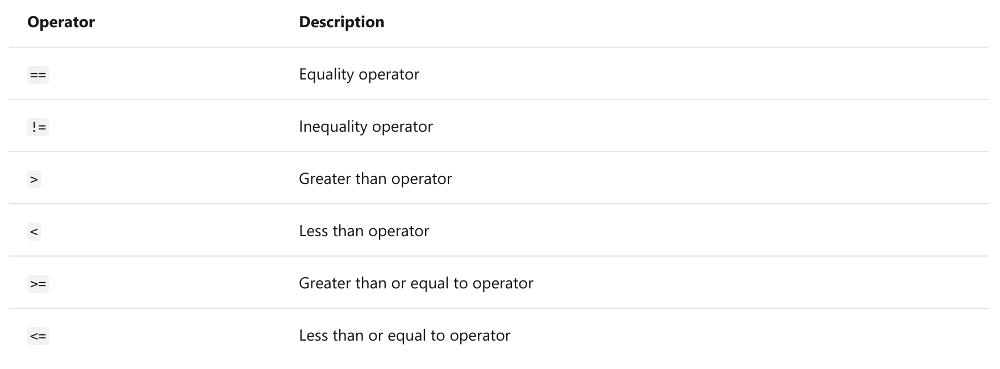
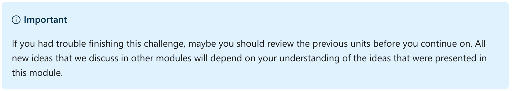
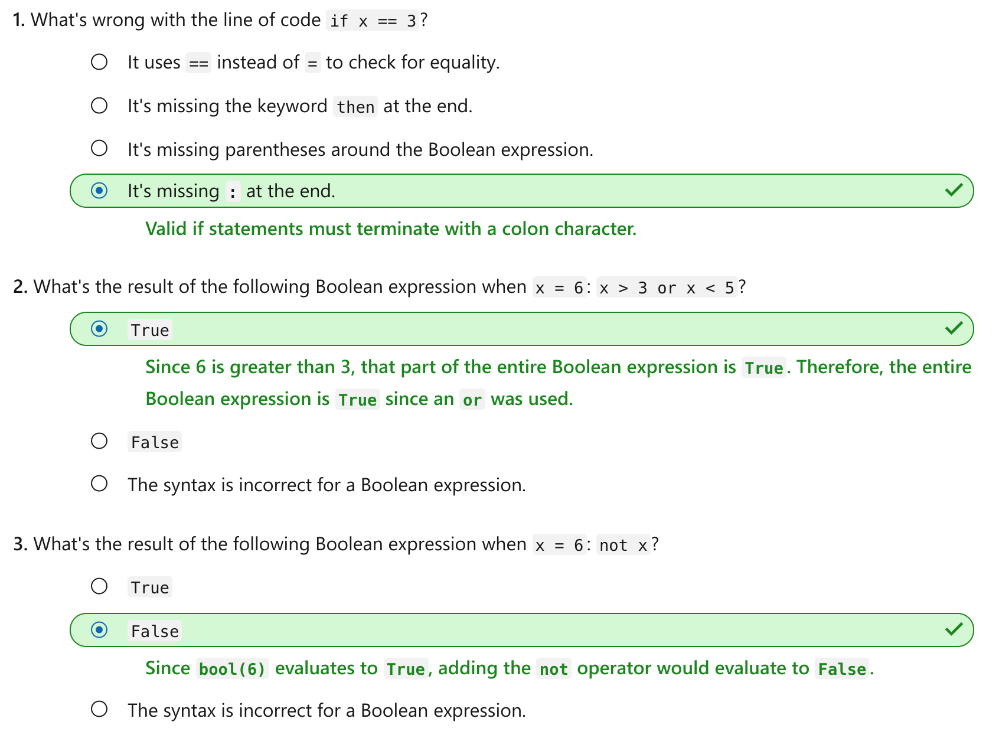

Branch code execution with the if...elif...else statement in Python
================

This notebook is refer from the Microsoft resources: [Take your first steps with Python](https://docs.microsoft.com/en-us/learn/paths/python-first-steps/).

### Module 4: Branch code execution with the if...elif...else statement in Python

Use the if statement Boolean expressions with comparison and logic operators to express decision logic.

### Topic 1: Introduction

In the previous module, you learned that Python's interpreter executes each line of code in your code file sequentially. After it successfully executes the last line of code, the program terminates.

One of the most powerful features of any programming language is the ability to branch the execution path of the program's code based on some decision. The term *branch* refers to two or more separate paths that the program can take. Instead of a sequential path, you create separate paths that are executed or ignored based on some condition you create. For example, you might want to execute certain code that performs an important task if the user inputs the value `y` or `yes` when prompted. Otherwise, you want the Python interpreter to ignore that code and possibly execute different code.

In this module, you'll learn how to use the `if` statement and also the `elif` and `else` statements to branch the execution path of your Python code. You'll use Boolean expressions to create conditions that allow your code to evaluate the values of variables to see if they match. You'll use different comparison operators to increase the usefulness of your Boolean expressions.

By the end of this module, you'll be able to add decision logic to your Python code so that you can create more interesting and complex applications.

#### 1.1 Learning objectives

In this module, you will:

-   Use the `if ... elif ... else` statements to add decision logic to your Python code.

-   Understand the Boolean data type and what it represents in Python.

-   Compose Boolean expressions by using a rich set of comparison and logic operators.

#### 1.2 Prerequisites

-   You should have your Python development environment already set up and know how to create, edit, and execute Python code stored in a `.py` file.

-   You should have exposure to the use of input and output functions like `print()` and `input()`.

-   You should know how to create and assign values to variables.

If you need to review or learn any of these concepts, visit all preceding modules in this learning path.

### Topic 2: Exercise - Branch code with the if statement

Using the `if ... elif ... else` statement is a vital part of building virtually any meaningful program. You can use it to automate complicated decision logic so that it can be applied repeatedly and consistently to your user input or data.

When we use the term *code logic* or *decision logic*, we're referring to our ability to imbue our program with the ability to make a decision based on inputs. Based on the decision, we can instruct the Python interpreter to run some code and skip over other code.

In this exercise, we'll use the `if` statement, along with optional `elif` and `else` statements, to branch the execution of our code depending on a Boolean expression.

A Boolean expression is any code that returns a *Boolean* value. A Boolean value is either `True` or `False` and is its own data type in Python, just like `str` and `int`.

In this exercise, we'll use a Boolean expression to evaluate whether two values are equal. In the next unit, we'll learn how to create more expressive Boolean expressions and work with functions that return a Boolean value.

Let's start with a simple example of an `if` statement.

#### Step 1: Create a new working folder and python code file

Using the techniques you learned in previous modules, create a new folder for your work in this module. For example, you might create a folder named `python-if`.

Inside that folder, create a file for this exercise. For example, you might create a file named `exercise1.py`.

When it's time to run your code, you can use the Python Tools for Visual Studio Code integration by selecting the green arrow. Or you can use a command in the integrated terminal by using techniques we learned about in previous modules.

#### Step 2: Add an `if` statement to the new code file

Add the following code to your code file:

Python:

    value = '7'

    if value == '7':
        print('The value is 7')

    print('Finished!')

There are three parts to the `if` statement:

-   The `if` keyword

-   The Boolean expression `value == '7'`

-   The required colon `:` character

What comes next is just as important. The next line must contain a code block that runs if the Boolean expression evaluates to `True`. In Python, a code block is defined by using indentation. In this case, we used the Tab key to insert four individual spaces. This indentation tells the Python interpreter that this code *belongs to* the `if` statement and should run when the Boolean expression evaluates to `True`.

If the Boolean expression evaluates to `False`, all of the indented code should be ignored by the Python interpreter.

When you run the code, you should see the following output:

Output:

    The value is 7
    Finished!

To see how this code operates when the Boolean expression evaluates to `False`, modify the first line of code setting `value` to the string `'6'`.

Python:

    value = '6'

When you run the code, you'll see the following output:

Output:

    Finished!

The line of code beneath the `if` statement is ignored because the Boolean expression evaluates to `False`. The final line of code that prints the term `Finished` runs because it isn't indented beneath the `if` statement.

#### Step 3: Add a tab character to the last line of code to understand the importance of indentation

Let's see what happens when we add indentation to the final line of code.

Modify the last line of code by adding a tab before the line. Your code should match the following output:

Python:

    value = '6'

    if value == '7':
        print('The value is 7')

        print('Finished!')

When you run the code this time, there's no output. That's because the last line of code is now part of the same code block that belongs to the `if` statement.

Indentation defines a code block in Python. A code block consists of one or more lines of code that are treated as a unit of work. The code block is only executed based on the statement above it, which is the `if` statement in this case. We'll come across code blocks often in Python as we learn about new constructs like loops, functions, classes, and more.

Python is picky when it comes to indentation. All lines must be indented at an equal level. If they're not, Python displays an exception when you run the code. If you remove a single empty space character before the last line of code:

Python:

    value = '6'

    if value == '7':
        print('The value is 7')

       print('Finished!')

And then attempt to run the code again, you'll see the following error:

Output:

    File "exercise1.py", line 6
        print('Finished!')
                         ^
    IndentationError: unindent does not match any outer indentation level

#### Step 4: Update the code example to include an else statement

The `else` statement is an optional part of an `if` statement that can handle the opposite case. In other words, when the Boolean expression in the `if` statement evaluates to `False`, run the code block that belongs to the `else` statement instead.

Update your code to match the following code passage. In addition to adding the `else` statement, notice that we removed the tab from the last line of code.

Python:

    value = '6'

    if value == '7':
        print('The value is 7')
    else:
        print('The value is not 7') 

    print('Finished!')

If you run the code, you'll see the following output:

Output:

    The value is not 7
    Finished!

There are two parts to the `else` statement:

-   The `else` keyword

-   The colon `:` keyboard symbol

As before, the code block following the `else` statement is just as important. All indented lines of code below the `else` statement become part of its code block and are executed with the Boolean expression if the `if` statement evaluates to `False`.

#### Step 5: Update the code example to include an `elif` statement

The `elif`, or rather, *else if* statement is another optional statement that can be added below an `if` statement. Use the `elif` to test another related Boolean expression. If that Boolean expression evaluates to `True`, the indented code below it runs. All code blocks that belong to other `if`, `elif`, and `else` statements are ignored.

Modify the code example to match the following code listing:

Python:

    value = '8'

    if value == '7':
        print('The value is 7')
    elif value == '8':
        print('The value is 8')
    else:
        print('The value is not one we''re looking for')

    print('Finished!')

Just like the `if` statement, there are three parts to the `elif` statement:

-   Must begin with the keyword `elif`

-   Must include a Boolean expression

-   Must terminate by using a colon `:` keyboard symbol

And just as before, all indented code below the `elif` is part of the code block that runs if the Boolean expression evaluates to `True`.

When you run the code, you'll see the following output:

Output:

    The value is 8

You can use as many `elif` statements as you need. If you use an `else` statement, it must come after all `elif` statements.

Modify your code to include an additional `elif` statement before the `else` statement.

Python:

    value = '8'

    if value == '7':
        print('The value is 7')
    elif value == '8':
        print('The value is 8')
    elif value == '9':
        print('The value is 9')
    else:
        print('The value is not one we''re looking for')

After any `if` or `elif` Boolean expression evaluates to `True`, the Python interpreter won't continue evaluating additional Boolean expressions. It exits the entire `if ... elif ... else` structure and continues to process the next line of code that isn't indented.

#### 2.1 Be aware of overlapping Boolean expressions

Consider the following code:

Python:

    value = '6'

    if value < '8':
        print('The value is less than 8')
    elif value < '7':
        print('The value is less than 7')
    else:
        print('The value is greater than 8')

First, we've introduced a new operator, which we'll learn more about in the next unit. The less-than operator `<` compares two numeric values. If the value on the left is less than the value on the right, the expression evaluates to `True`. Otherwise, it evaluates to `False`.

Can you spot the problem with the `if` and `elif` statements? Look closely and think through how this code will work.

The problem is that the `elif` statement will never execute because any `value` that would be `True` for the `if` statement will also be `True` for the `elif` statement. As a result, the execution path will never get to the `elif`.

This scenario would likely never manifest in a runtime error. If we were expecting to handle these differently, we would have introduced a subtle logic error into our application. We would need to swap the Boolean expressions between the `if` and the `elif` to fix the issue. It's always useful to test your application with multiple inputs to make sure you get the intended result.

#### 2.2 Nested `if` code blocks

Consider the following code example:

Python:

    first_value = True
    second_value = '6'

    if first_value:
        if second_value == '6':
            print('Got here!')

Here we evaluate two separate data values. First, we test the value of `first_value`. Since a Boolean expression is any code that equates to `True` and `first_value` equates to `True` already, we don't need to type out the entire Boolean expression like so:

Python:

    if first_value == True:

Secondly, and more pertinent to this code example, is the nesting of the second `if` statement inside the code block of the first `if` statement. As a result, the second `if` statement is evaluated only when the first `if` statement evaluates to `True`.

This nesting structure is common when you need to test several related (but different) data values before you perform some operation.

If you remove the proper indentation:

Python:

    first_value = True
    second_value = '6'

    if first_value:
    if second_value == '6':
        print('Got here!')

... it's likely you would see the following error message:

Output:

    File "c:/python/numeric-operations-decisions/exercise2.py", line 65
        if second_value == '6':
        ^
    IndentationError: expected an indented block

#### 2.3 Recap

We learned about some crucial ideas in this unit:

-   Use the `if` statement to evaluate a Boolean expression. If the expression evaluates to True, the code block beneath the `if` statement runs by the Python interpreter. Otherwise, it's ignored.

-   A code block is one or more indented lines of code. The code block *belongs* to the `if` statement and runs or is ignored based on the evaluation of the Boolean expression. Accidentally indenting (or not indenting) lines of code will undoubtedly affect how your code operates and might even produce errors. All indentation must use the same number of space characters or the Python interpreter will raise an error.

-   Add an optional `else` statement when you want to execute code that's only relevant if the Boolean expression evaluates to `False`. Otherwise, it's ignored.

-   Add an optional `elif` after the `if` statement (but before the `else` statement, if it exists) to evaluate a second and subsequent Boolean expression. Just like the `if` statement, the indented code block beneath it runs if the Boolean expression evaluates to `True`. Otherwise, it's ignored.

-   When you use the `if` statement along with one or more `elif` statements and the `else` statement, once a Boolean expression is satisfied, no other statements are evaluated. As a result, the order in which you perform your evaluations could be important.

-   You can nest `if` statements if you need to check for related (but different) conditions before you perform some operation.

### Topic 3: Exercise - Boolean expressions

As we learned in the previous unit, a Boolean value can be only one of two values, either `True` or `False`. The Boolean data type is the foundation for Boolean expressions. Boolean expressions in turn are the basis for much of the code you'll write in Python to compare, evaluate, and add branching and looping logic to your applications.

A Boolean expression is any code that returns a Boolean value.

In this exercise, you'll work with Boolean values and Boolean expressions. They provide you with a richer language to express your logic.

#### Step 1: Create a new Python code file

Create a new code file for this exercise. For example, you might create a file named `exercise2.py`.

#### Step 2: Add code to display data types of a string, integer, and Boolean value

Python has many different data types. In the previous module, you worked with a string data type and a numeric data type called *integer*. You can use a built-in function called `type()` to display the data type of any value. This function can help you understand what type of data you're working with and what you can do with that data.

To better understand the nature of Boolean values, add the following lines of code to your new code file.

Python:

    print(type('Hello world'))
    print(type(7))

    print(type(True))
    print(type(False))

    print(type('True'))
    print(type('False'))

The first two lines of code show you what to expect for a string and integer, respectively. The `type()` method says that these values are instances of a class named `str` and `int`. We'll talk about classes and instances later. For now, you can think of these values as classifications of data. Based on the classification, you can perform different tasks, whether string concatenation or arithmetic.

The next two lines of code display the Boolean data type `bool`. Notice that the values `True` and `False` must be capitalized and aren't string values.

The final two lines of code illustrate that there's a difference between the Boolean values `True` and `False` and the string values `'True'` and `'False'`.

Run the code file. You should see the following output:

Output:

    <class 'str'>
    <class 'int'>
    <class 'bool'>
    <class 'bool'>
    <class 'str'>
    <class 'str'>

#### Step 3: Comment code from the previous step, and then add code that uses the built-in `bool()` function to convert various string values to Boolean values

The `bool()` function works similarly to the `str()` and `int()` functions that we learned about in the previous module. The function accepts any value and attempts to convert it into a Boolean value.

Sometimes the result is predictable. Other times it might not be obvious what's happening.

Comment out all the previous code in your code file. Then add the following code that prints out the result of using the `bool()` function to convert different values to a Boolean.

Python:

    print(bool('True'))
    print(bool('False'))
    print(bool(''))
    print(bool(' '))
    print(bool('Hello world!'))

If you run the code, you'll see the following output:

Output:

    True
    True
    False
    True
    True

The `bool()` function converted the strings `'True'` and `'False'` to the Boolean values True and False. When the function is supplied with an empty string, it returns `False`, while any other non-empty string returns `True`.

#### Step 4: Comment out code from the previous step, and then add code that uses the built-in `bool()` function to convert various integer values to Boolean values

Comment out all the previous code in your code file. Then add the following code that prints out the result of using the `bool()` function to convert different values to a Boolean.

Python:

    print(bool(7))
    print(bool(1))
    print(bool(0))
    print(bool(-1))

If you run the code, you'll see the following output:

Output:

    True
    True
    False
    True

The `bool()` function converts any non-zero value to `True`, but it converts the value `0` to `False`.

#### What is a Boolean expression?

As we add logic to our applications, we'll evaluate Boolean expressions. A simple example illustrates the basic idea.

`1 + 1 = 3`

That's a `False` statement. But:

`1 + 1 = 2`

... is a `True` statement. In both of these examples from early math, we're evaluating the entire expression to see whether it's true or false.

In Python, a Boolean expression does the same thing. A Boolean expression expands this idea to any function call that ultimately returns `True` or `False`.

In Python, we use the *equality* operator `==` to create a Boolean expression that evaluates two values for equality. The equality operator uses two equal sign symbols.

#### Step 5: Comment out code from the previous step, and then add code to print the result of Boolean expressions

Comment out all the previous code in your code file. Then add the following code that prints out the result of two Boolean expressions.

Python:

    print(1 + 1 == 3)
    print(1 + 1 == 2)

If you add this code to your code file and run it, you see the following output:

Output:

    False
    True

If Python is your first programming language, you're likely to forget to use two equal sign symbols when you want to check for equality. A single equal sign is the *assignment operator*. It's used to assign a value to a variable. If you forget and attempt to use a single equal sign in a context where it's not appropriate, Python raises an error and a helpful suggestion.

Python:

    print(1 + 1 = 3)
    print(1 + 1 = 2)

If you add this code to your code file and run it, you see the following output:

Output:

    SyntaxError: expression cannot contain assignment, perhaps you meant "=="?

#### What is an operator?

An operator is like a mini function. Operators perform an operation on operands, which could be literal values, variable values, or any identifier like a method or class. There are dozens of operators in Python. They can be split up into one of these categories:

-   Arithmetic operators

-   Assignment operators

-   Bitwise operators

-   Comparison operators

-   Identity operators

-   Logical operators

-   Membership operators

We'll look at **comparison and logic operators** in this unit. We'll likely cover most operators as we continue through this learning path.

Some operators consist of a single symbol, like many of the operators we'll use in this unit. They operate on the values to their left and right. Other operators consist of a pair of symbols. They operate on the values in between their opening symbol and their closing symbol.

#### Comparison operators

The equality operator `==` is one of a family of operators that you can use to compare two values. The following table doesn't show all possible operators. These are the comparison operators you're likely to use most often.

The inequality operator `!=` evaluates to `True` when the operands on either side aren't the same. This concept can be a bit confusing, but sometimes you want to ensure that two values aren't equal.

#### Step 6: Comment out code from the previous step, and then add code to print the result of Boolean expressions

To exercise these comparison operators, comment out the code in your code file and add the following code:

Python:

    print(3 == 4)
    print(3 != 4)

    print(3 > 4)
    print(3 < 4)
    print(3 >= 4)
    print(3 <= 4)

When you run this code, you'll see the following output:

Output:

    False
    True
    False
    True
    False
    True

#### Logical operators

Sometimes you'll want to evaluate more than one Boolean expression. In this case, you can use the logical operators `and`, `or`, and `not`. These operators allow you to pair two Boolean expressions together to produce a final Boolean value.

Use the `and` operator to make sure both Boolean expressions evaluate to `True`. Use the `or` operator to make sure at least one Boolean expression evaluates to `True`.

The `not` operator returns the opposite Boolean value. It can be used to ensure that one or more Boolean expressions evaluate to `False`.

#### Step 7: Comment out code from the previous step, then add code to print the result of Boolean expressions

To exercise these logical operators, comment out the code in your code file and add the following code:

Python:

    first_number = 5
    second_number = 0
    true_value = True
    false_value = False

    if first_number > 1 and first_number < 10:
        print('The value is between 1 and 10.')

    if first_number > 1 or second_number < 1:
        print('At least one value is greater than 1')

    print(not true_value)
    print(not false_value)

    if not first_number > 1 and second_number < 10:
        print('Both values pass the test')
    else:
        print('Both values do NOT pass the test')

When you run this code, you'll see the following output:

Output:

    The value is between 1 and 10.
    At least one value is greater than 1
    False
    True
    Both values do NOT pass the test

#### Recap

-   Use the `bool()` function to convert strings and integers to Boolean values. Non-empty strings convert to `True` and non-zero numbers convert to `True`. The string value `'False'` and empty strings convert to `False`. The value `0` converts to `False`.

-   Python provides several comparison operators to test for equality, inequality, and greater or less than.

-   Python also provides several logical operators to ensure one or both Boolean expressions are `True`. It also provides the `not` operator to ensure Boolean expressions evaluate to `False`.

### Topic 4: Challenge - Branch code execution based on user input

Code challenges throughout these modules will reinforce what you've learned and help you gain some confidence before you continue on.

#### Step 1: Add a new file

Create a new code file for this challenge. For example, you might create a file named `challenge.py`.

#### Step 2: Write code in the new file to solve the challenge

Write a short program that prints one of several messages to the user based on their input.

First, prompt the user about whether they want to continue or not.

If the user responds with either `no` or `n`, print the phrase `Exiting`.

Match the following output in this `no` scenario. The user entered `no` when prompted.

Output:

    Would you like to continue? no
    Exiting

If the user responds with either `yes` or `y`, print the phrases `Continuing ...` and `Complete!`.

Match the following output in this `yes` scenario. The user entered `yes` when prompted.

Output:

    Would you like to continue? yes
    Continuing ...
    Complete!

If the user responds with anything else, print the phrase `Please try again and respond with yes or no`.

Match the following output in this last scenario. The user entered `bob` when prompted.

Output:

    Would you like to continue? bob 
    Please try again and respond with yes or no.

Whether you get stuck and need to peek at the solution or you finish successfully, continue on to view a solution to this challenge.

### Topic 5: Solution - Branch code execution based on user input

The following code is one possible solution for the challenge from the previous unit.

Python:

    value = input('Would you like to continue? ')

    if value == 'y' or value == 'yes':
        print('Continuing ...')
        print('Complete!')
    elif value == 'n' or value == 'no':
        print('Exiting')
    else:
        print('Please try again and respond with yes or no.')

This code is only one possible solution because we didn't specify that you had to use the logical operators. You could have solved this challenge by using nested if statements instead. Or you could have checked for the "no" scenario before the "yes" scenario. You might have selected a different variable name to use to store the user's input.

If you matched the expected output in the challenge, you were successful.

Continue on to the knowledge check in the next unit.

### Topic 6: Knowledge check

### Topic 7: Summary

Our goal was to use decision logic to branch code execution. Using the `if ... elif ... else` statements and Boolean expressions that contain comparison and logical operators, we built applications that could make decisions based on user input and branch code execution appropriately.

Now we can automate complicated decision logic so that it can be applied repeatedly and consistently to user input or data. Decision logic is a fundamental building block that's required to build virtually every type of program.

You've taken your first steps toward building more sophisticated applications that can perform logic to enforce business or game rules.
