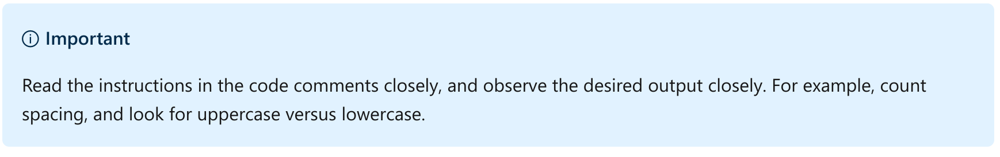
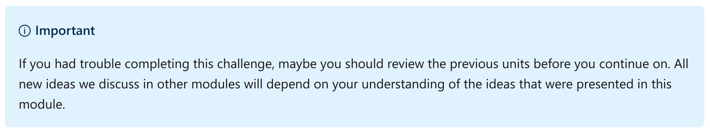
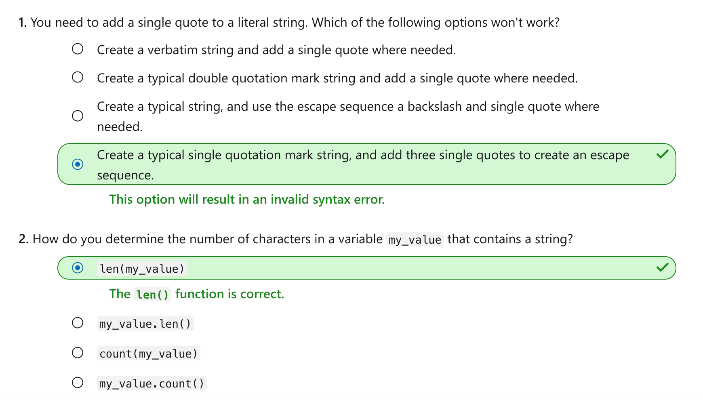

Manipulate and format string data for display in Python
================

This notebook is refer from the Microsoft resources: [Take your first steps with Python](https://docs.microsoft.com/en-us/learn/paths/python-first-steps/).

### Module 5: Manipulate and format string data for display in Python

Use built-in features of the string class and other helper methods to control string data.

### Topic 1: Introduction

Most programs you build display string output, receive string input, or manipulate strings in some way. Python provides a wide array of built-in features for string manipulation and formatting.

Suppose you need to transform data to be used in your program. The data might have extraneous empty space characters or alphanumeric characters, or might be in the wrong case. Or perhaps you need to format the data for display to the end user. You might need to add tabs, add new lines, change the case, or change the alignment.

In this module, you'll use special features of literal strings to add escape codes to insert special characters and create multi-line strings. You'll pass additional optional arguments to the `print()` function to modify how strings are displayed. You'll use over a dozen different string helper methods to find and replace substrings, add padding, and change alignment. And you'll learn how to avoid string concatenation by using a special string templating syntax.

By the end of this module, you'll be able to confidently build programs that can manipulate and format strings.

#### 1.1 Learning objectives

In this module, you will:

-   Use escape characters in literal strings to add new lines and tabs.

-   Use features of the `print()` function to format strings for display.

-   Call one of many built-in functions to strip empty spaces, add padding, and find and replace substrings. Use the `format()` function to create a format string that contains a series of replacement fields.

#### 1.2 Prerequisites:

-   You should know how to create a working folder and add code files.

-   You should know how to run a Python code file by using either tooling support in Visual Studio Code or the command line.

-   You should understand how you can pass values as arguments to a function.

-   You should have worked with the `print()` function, variables and literal strings, as well as numeric data.

-   You should be aware that you can call helper functions on a data type, a literal value, and a variable.

If you're not sure how to do any of these, take the time to review all of the previous modules in this learning path.

### Topic 2: Exercise - Format string literals

Python strings have many built-in features, including some that might not be obvious. Before we explore some advanced string formatting that uses special functions, let's make use of everything strings can do by themselves.

#### Step 1 - Create a new working folder and Python code file

Using the techniques you learned in previous modules, create a new folder for your work in this module. For example, you might create a folder named `python-format-strings`.

Inside that folder, create a file for this exercise. For example, you might create a file named `exercise1.py`.

When it's time to run your code, use Python tools for Visual Studio Code integration, by selecting the green arrow. Alternatively, you can use a command in the integrated terminal by using techniques we learned about in previous modules.

#### Step 2 - Add code to compare literal strings defined by using single and double quotation marks

Define literal strings by using either a pair of single-quote symbols (`'`) or a pair of double-quote symbols (`"`). Add the following lines of code to your new code file:

Python:

    first_string = 'A literal string'
    second_string = "A literal string"
    print(second_string == first_string)

When you run the code, you'll see the following output:

Output:

    True

You can use either single or double quotes. Here, we'll typically use single quotes.

#### Step 3 - Comment out the previous code, and add code that uses quotes inside other quotes

If you need to use a single- or double-quotation mark in the string itself, you can use a double quote inside a set of single quotes, and vice versa.

Comment out the code from the previous step, and add the following code to your code file:

Python:

    third_string = 'A single quoted literal string with a " double quote'
    fourth_string = "A double quoted literal string with a ' single quote"
    print(third_string)
    print(fourth_string)

In this case, `third_string` points to a literal string that embeds a double quote inside a string defined with single quotes. Conversely, `fourth_string` points to a literal string that embeds a single quote inside a string defined with double quotes.

When you run the code, you should see the following output:

Output:

    A single quoted literal string with a " double quote
    A double quoted literal string with a ' single quote

#### Step 4 - Comment out the previous code, and add code that uses escape sequences

But what if you need to embed a single quote in a literal string, and you want to define the string by using single quotes? Or, conversely, use a double quote inside a literal string defined with double quotes? In this case, you can use the `\` character to create an escape sequence.

There are several escape sequences available to Python strings. Comment out the code from the previous steps, and then add the code in the following code listing:

Python:

    fifth_string = 'A single quoted literal string with an \' escaped single quote'
    sixth_string = "A double quoted literal string with a \" double quote"
    seventh_string = 'A literal string with a \n new line character'
    eighth_string = 'A literal string with a \t tab character'

    print(fifth_string)
    print(sixth_string)
    print(seventh_string)
    print(eighth_string)

As the content of the literal strings themselves suggest, the `\n` escape sequence creates a new line, and the `\t` escape sequence adds a tab to the string when it's displayed.

When you run the code, you should see the following output:

Output:

    A single quoted literal string with an ' escaped single quote
    A double quoted literal string with a " double quote
    A literal string with a
     new line character
    A literal string with a          tab character

Other escape sequences exist, but these are by far the most popular.

#### Step 5 - Comment out the previous code and add code that displays raw strings

But what if you need to display the contents of an escape sequence without performing the escape sequence's command? In other words, what if you need to literally display the value `\n`? In that case, you prefix a literal string with the `r` character to produce a raw output, without any escaping. This is helpful if you need to ignore escape sequences, and display the entire string as it appears in code.

Comment out the code that you added in the previous steps, and then add the following code to the code file:

Python:

    nineth_string = r"A literal string with a \n new line character printed raw"

    print(nineth_string)

When you run the code, you should see the following output:

Output:

    A literal string with a \n new line character printed raw

#### Step 6 - Comment out the previous code, and add code that uses multi-line strings

If you need to display a string across multiple lines, you can use the new line escape sequence we just learned about. Alternatively, you can create a multi-line string by defining the string with a set of three single quotes, or a set of three double quotes.

Comment out the code from the previous step, and add the code from the following code listing:

Python:

    tenth_string = '''A literal string
    on more than one line
    sometimes known as a verbatim string'''

    eleventh_string = """Another literal string
         on more than one line
    using double quotes"""

    print(tenth_string)
    print(eleventh_string)

In some programming languages, this type of multi-line string that retains its formatting is called a "verbatim string".

When you run the code, you should see the following output:

Output:

    A literal string
    on more than one line
    sometimes known as a verbatim string
    Another literal string
         on more than one line
    using double quotes

Notice that the literal string we point to with the eleventh\_string variable includes several empty spaces. These are faithfully kept when we print out the string a few lines later.

#### Step 7 - Comment out the previous code, and add code that formats string by using the `print()` function

In this exercise, we've used various techniques inherent to strings to influence their formatting. The `print()` function also has a few built-in features that allow us to concatenate strings and influence their formatting.

Comment out the code from the previous steps, and then add the code in the following code listing. This demonstrates how you can supply the `print()` function with additional arguments to modify the output.

Python:

    first = 'Conrad'
    second = 'Grant'
    third = 'Bob'
    print(first, second)
    print(first, second, third)
    print(first, second, third, sep='-')
    print(first, second, third, sep='-', end='.')

The first and second calls of the `print()` function concatenate strings together before displaying them to the console. The `print()` function is defined in such a way that we can send in a variable number of arguments (two, three, four, or more). Each of them will be concatenated together, each separated by an empty space, and displayed to the console.

The third call to the `print()` function adds an optional named argument `sep`. This defines the character we want to use to separate the strings as they're concatenated together for display.

The fourth call to the print() function adds another optional named argument end. This defines the character we want to use at the very end of the sequence.

If you run the code, you'll see the following output.

Output:

    Conrad Grant
    Conrad Grant Bob
    Conrad-Grant-Bob
    Conrad-Grant-Bob.

#### 2.1 Functions with variable and named arguments

In a previous module, we learned how you can define functions with optional input parameters. These parameters allow the caller to decide whether to accept the default value or implementation, or supply the argument with a value.

Similarly, you can define functions with variable parameters. This allows the caller to pass in as many arguments as needed, and the function processes each parameter.

Named parameters allow the caller to use the convention `name=value`. This allows us to send the arguments in any order, and it makes the purpose of those arguments clearer to those who might read your code in the future.

In another module, you'll learn how to add variable and named parameters to the functions you define when you create your own functions.

#### 2.2 Recap

In this exercise, you learned some important details about working with strings:

-   You can define a literal string by using either a set of single-quote or double-quote symbols.

-   You can add an escape sequence to use a special character inside your string, such as a single-quote escape sequence (`\'`), double-quote escape sequence (`\"`), a new line escape sequence (`\n`), or a tab escape sequence (`\t`).

-   You can print the raw output of a string by prefixing it with the `r` character.

-   You can define a multi-line verbatim string by using either a set of three single-quote characters (`'''`) or a set of three double-quote characters (`"""`).

-   The `print()` function can concatenate a variable number of strings sent as arguments into the function. You can specify the character you want to separate each argument, as well as the ending character.

### Topic 3: Exercise - Use string helper functions

In a previous module, we learned about a helper function, `isnumeric()`, that allows us to understand the contents of a string, and whether we can convert that string into an `int` or `float`. A helper method is a function that's available to values of a particular data type, and provides additional helpful functionality. We even briefly toured a few additional `is___()` style string helper methods.

There are many other helper methods available to strings, and in this exercise we'll work with over a dozen that you'll likely use when building real-world Python programs.

#### Step 1 - Create a new code file for this exercise

Use the techniques you learned in previous modules to add a new code file in the current folder dedicated to this module. For example, you might create a new file named `exercise2.py`.

#### Step 2 - Add code to call the `capitalize()` function by using three different techniques

Add the code in the following listing to the new file:

Python:

    message = str.capitalize('first message')
    print(message)

    message = 'second message'.capitalize()
    print(message)

    message = 'third message'
    print(message.capitalize())

The `capitalize()` function ensures that the first character in a string is capitalized (uppercase). Only the first letter in the string is capitalized. If the string contains multiple words separated by empty characters, only the first character is capitalized.

While the `capitalize()` function is useful, pay attention to the three different ways in which we call it.

The first time we call it as a member of the `str` class. In other words, we access the `str` helper method by using the member access operator, a period symbol (`.`), on the name of the data type itself. Then, we call the function name, passing in our literal string as an argument.

The second time we call the function as a member of the literal string. In other words, we access the `str` helper method by using the member access operator on the literal string value itself. When we do this, we don't need to pass anything as an argument. The function operates on the literal string itself.

The third time we call the function as a member of a variable. Like the previous example, we access the str helper method by using the member access operator on the variable that points to a literal string. Again, we don't need to pass anything as an argument, because the function operates on the string our variable points to.

There are multiple ways to call these helper methods, and you'll likely use the one that makes the most sense in a particular context.

For the remainder of this exercise, we'll usually use the third example. However, the important takeaway is to understand there are different ways to achieve the same result when you're writing code. Even if we do not demonstrate it here, you can use one of several different styles when you're calling these methods.

When you run the code, you should see the following output:

Output:

    First message
    Second message
    Third message

#### Step 3 - Comment out the previous code, and add code to call functions that modify the case of the string

Similar to the `capitalize()` function, there are functions that change the case from upper to lower, or lower to upper.

Comment out the code from the previous step, and add the following code listing:

Python:

    message = 'hello world'
    print(message.lower())
    print(message.upper())

    message = message.title()
    print(message)
    print(message.swapcase())

When you run the code, you should see the following output:

Output:

    hello world
    HELLO WORLD
    Hello World
    hELLO wORLD

#### Step 4 - Comment out the previous code, and add code that counts the number of times one string is found in another

The `count()` method provides a count of the number of times a specified character is used in a string.

Comment out the code from the previous step, and add the following code listing:

Python:

    location = 'Mississippi'
    print(location.count('s'))

When you run the code, you should see the following output:

Output:

    4

What if you want to know how many letters are in a string? In that case, use a method, called `len()`. Note that this isn't a helper method in the way we've defined it, because it works on more than just the string values.

Comment out the code from earlier in this step, and add the following code listing:

Python:

    print(len('how many letters in this string?'))

When you run the code, you should see the following output:

Output:

    32

#### Step 5 - Comment out the previous code, and add code that calls functions that inspect the contents of the string

Call the `startswith()` and `endswith()` functions to inspect the contents of a string to find out if it matches what you expected it to start with or end with, respectively.

Comment out the code from the previous step, and add the following code listing:

Python:

    message = 'racecar'
    print(message.startswith('r'))
    print(message.startswith('a'))
    print(message.startswith('ra'))

    print(message.endswith('r'))
    print(message.endswith('a'))
    print(message.endswith('ar'))

When you run the code, you should see the following output:

Output:

    True
    False
    True
    True
    False
    True

#### Step 6 - Comment out the previous code, and add code that finds the position of a string inside another string

The `find()` method locates the zero-based position of one string inside another string. In other words, **starting with** the number `0`, the method tells you where the search string is located. If it **can't find the string**, it returns `-1`.

You can use the `find()` function to split a string at a specific place, to perform additional modifications to the string. In an upcoming module, you'll learn a technique called *slicing* that can use the character position to retrieve some portion of a longer string.

Comment out the code from the previous step, and add the following code listing:

Python:

    message = 'The quick brown fox jumps over the lazy dog'
    print(message.find('q'))

    print(message.find('t'))
    print(message.find('T'))

When you run the code, you should see the following output:

Output:

    4
    31
    0

Notice that the `find()` method is **case-sensitive**. The position for the lowercase `t` and the uppercase `T` is **different**.

#### Step 7 - Comment out the previous code, and add code that strips empty characters from the left or right, or both

Python provides the `lstrip()` to remove empty space characters from the **left** side of a string, and the `rstrip()` function to remove them from the **right** side of a string. Or, you can use the `strip()` function to remove **both**.

Comment out the code from the previous step, and add the following code listing:

Python:

    message = '    middle     '
    print('.' + message.lstrip() + '.')
    print('.' + message.rstrip() + '.')
    print('.' + message.strip() + '.')

Here, we concatenate a literal string that contains a period symbol (`.`) before and after the `message` variable and the call to one of the stripping functions. This enables you to see how it affects the content of the string.

When you run the code, you should see the following output:

Output:

    .middle     .
    .    middle.
    .middle.

#### Step 8 - Comment out the previous code, and add code that replaces one string found in another string

The `replace()` function swaps every instance of a string with a different string.

Comment out the code from the previous step, and add the following code listing:

Python:

    message = 'brevity is the essence of wit'
    message = message.replace('essence', 'soul')
    print(message)

When you run the code, you should see the following output:

Output:

    brevity is the soul of wit

#### Step 9 - Comment out the previous code, and add code that justifies a string by adding empty space characters

The `rjust()` and `ljust()` methods add empty space characters to a string to provide justification to the right or left, respectively.

Comment out the code from the previous step, and add the following code listing:

Python:

    message = 'howdy'
    print(message.rjust(20))
    print(message.rjust(20, '-'))
    print(message.ljust(20))
    print(message.ljust(20, '-'))

Notice that in both cases, you can add a second argument. This argument uses a different character, instead of an empty space, to add leading or trailing characters, respectively.

When you run the code, you should see the following output:

Output:

                   howdy
    ---------------howdy
    howdy
    howdy---------------

#### Recap

Python provides many helper functions to format strings or modify its contents. If you need to modify a string, before you begin writing code to manipulate a string, check whether you can use a function that already exists. Spend a few moments in Python's documentation or search online for the right helper method to achieve your desired result.

### Topic 4: Exercise - Use the `format()` function and format strings

Python has evolved through the years. You might see code examples that format strings in many different ways. In this exercise, we'll focus on the most recent enhancements to string formatting.

The `format()` helper function merges values into a literal string template, without the need for messy string concatenation. It can also format those merged values for proper display, as in the case of numbers, dates, and times.

In the Python 3.6 version, developers simplified the `format()` method into a string prefix, the letter `f`. This performs virtually all of the same functionality, with less typing.

#### Step 1 - Create a new code file for this exercise

Use the techniques you learned in previous modules to add a new code file in the current folder dedicated to this module. For example, you might create a new file `exercise3.py`.

#### Step 2 - Add the following code to illustrate the `format()` function's merge feature

Add the following code to the new file.

Python:

    medicine = 'Coughussin'
    dosage = 5
    duration = 4.5

    instructions = '{} - Take {} ML by mouth every {} hours'.format(medicine, dosage, duration)
    print(instructions)

    instructions = '{2} - Take {1} ML by mouth every {0} hours'.format(medicine, dosage, duration)
    print(instructions)

    instructions = '{medicine} - Take {dosage} ML by mouth every {duration} hours'.format(medicine = 'Sneezergen', dosage = 10, duration = 6)

    print(instructions)

In this code example, we define a format string that contains a series of replacement fields, as defined by a set of curly braces `{}`.

In the first example, the replacement fields have no values inside them. By using the member access operator, we call the `format()` function. We pass in the values we want to substitute in each replacement field, in the order in which they appear.

In the second example, we fill the replacement fields with a zero-based numeric value, which accesses the argument passed into the `format()` function. We intentionally mixed up the order to show that you can use the arguments in any position of your format string. You do this by changing the ordinal position in the replacement field.

In the third example, we fill the replacement fields with variable names. Those same variable names are passed as named arguments into the `format()` function.

When you run the code, you should see the following output:

Output:

    Coughussin - Take 5 ML by mouth every 4.5 hours
    4.5 - Take 5 ML by mouth every Coughussin hours
    Sneezergen - Take 10 ML by mouth every 6 hours

#### Step 3 - Comment out the previous code, and add code to use formatted string literals, or "f-strings"

The `format()` function is powerful and flexible. You can achieve the same functionality, with less typing, by using formatted string literals, also known as *f-strings*.

Comment out the code from the previous step, and add the following code listing:

Python:

    name = 'World'
    message = f'Hello, {name}.'
    print(message)

    count = 10
    value = 3.14
    message = f'Count to {count}.  Multiply by {value}.'
    print(message)

In the first example, we create replacement fields just like we did with the `format()` function. We fill the replacement field with the name of variable we want to substitute into the format string.

In the second example, the variable `count` is set to an `int` value, and the `variable` value is set to a `float` value. The format string takes care of the data type conversion for us, so we don't need to call `str()` around those values.

When you run the code, you should see the following output:

Output:

    Hello, World.
    Count to 10.  Multiply by 3.14.

#### Step 4 - Comment out the previous code, and add code to evaluate simple expressions in the replacement field of an f-string

You can perform just about any expression inside a replacement field. In the following example, we'll perform calculations directly inside the replacement field. You might not prefer to do this, because it's less readable than creating a temporary variable to perform the calculations. But it's helpful to know what's possible.

Comment out the code from the previous step, and add the following code listing:

Python:

    width = 5
    height = 10

    print(f'The perimeter is {(2 * width) + (2 * height)} and the area is {width * height}.')

When you run the code, you should see the following output:

Output:

    The perimeter is 30 and the area is 50.

#### Step 5 - Comment out the previous code, and add code to define format specifiers to control alignment and padding

Format string literal replacement fields have a special format specifier syntax that is almost a mini-programming language unto itself. We'll merely scratch the surface of what's possible in this step of the exercise. You can use the format specifier syntax to format numbers, dates, time, percentages, and exponents.

In this step, we'll use the format specifier syntax to add alignment and padding to our format strings.

Comment out the code from the previous step, and add the following code listing:

Python:

    value = 'hi'

    print(f'.{value:<25}.')
    print(f'.{value:>25}.')
    print(f'.{value:^25}.')
    print(f'.{value:-^25}.')

A format specifier uses a colon symbol (`:`) after the variable name, to specify how that value should be formatted.

In the first f-string, we use the less-than symbol (`<`) to align the text to the left of a string that is 25 total characters wide. The string `hi` occupies two of the 25 total characters. We add period symbols (`.`) on the left and right of the replacement field, to help us see the total width of the string.

In the second f-string, we use the greater-than symbol (`>`) to align the text to the right of a string that is 25 total characters wide.

In the third f-string, we use the caret symbol (`^`) to center the text in the middle of a string that is 25 total characters wide.

In the fourth f-string, we use the caret symbol (`^`) again. But this time, we preface it with a single dash symbol (`-`) to use instead of an empty space to fill the remaining width of the string.

When you run the code, you should see the following output:

Output:

    .hi                       .
    .                       hi.
    .           hi            .
    .-----------hi------------.

For more information, see [Python's documentation](https://docs.python.org/3/library/string.html#formatspec?azure-portal=true).

#### Recap

-   The `format()` function allows you to define a format string (essentially, a template). The string contains a series of replacement fields that are replaced with arguments you pass into the function.

-   The new format string literal, or f-string, reduces the keystrokes of the `format()` method. This allows you to use variables or expressions in the replacement fields.

-   Format specifiers are a compact syntax that allows you to format numbers, dates, and percentages, as well as alignment and spacing.

### Topic 5: Challenge - Manipulate and format strings

Throughout these modules, code challenges reinforce what you've learned and help you gain some confidence before continuing on.

#### Step 1 - Add a new file in your working directory for this challenge

Use the techniques you learned in previous modules to add a new code file in the current folder dedicated to this module. For example, you might create a file named `challenge.py`.

#### Step 2 - Use string manipulation and formatting techniques you learned to create the challenge output

Copy the following code into your new file. Then modify it by adding new code to satisfy the requirements of the challenge.

Python:

    first_value = '  FIRST challenge         '
    second_value = '-  second challenge  -'
    third_value = 'tH IR D-C HALLE NGE'

    fourth_value = 'fourth'
    fifth_value = 'fifth'
    sixth_value = 'sixth'

    # First challenge

    # Second challenge

    # Third challenge

    print(first_value)
    print(second_value)
    print(third_value)

    # Fourth challenge - use only the print() function (no f-strings)

    # Fifth challenge - use only a single print() function.  Create tabs and new lines using f-strings.

Using techniques you learned in this module, manipulate and format strings to produce the following output.

Output:

    First Challenge        
    Second challenge
                   Third challenge
    fourth#fifth#sixth!
            fourth
            fifth
            sixth

There's likely more than one right way to accomplish this. But you do need to follow two rules:

Rule \#1: You may only *add* code. You may not delete or modify the existing starter code, except to add new lines of code.

Rule \#2: Your output must match the challenge output exactly.

Whether you get stuck and need to peek at the solution, or you finish successfully, continue on to view a solution to this challenge.

### Topic 6: Solution - Manipulate and format strings

The following code is one possible solution for the challenge from the previous unit.

Python:

    first_value = '  FIRST challenge         '
    second_value = '-  second challenge  -'
    third_value = 'tH IR D-C HALLE NGE'

    fourth_value = 'fourth'
    fifth_value = 'fifth'
    sixth_value = 'sixth'

    # First challenge
    first_value = first_value.strip()
    first_value = first_value.lower()
    first_value = first_value.title()
    first_value = f'{first_value:^30}'

    # Second challenge
    second_value = second_value.replace('-', '')
    second_value = second_value.strip()
    second_value = second_value.capitalize()

    # Third challenge
    third_value = third_value.replace(' ', '')
    third_value = third_value.replace('-', ' ')
    third_value = third_value.swapcase()
    third_value = f'{third_value:>30}'

    print(first_value)
    print(second_value)
    print(third_value)

    # Fourth challenge - use only the print() function (no f-strings)
    print(fourth_value, fifth_value, sixth_value, sep='#', end='!')

    # Fifth challenge - use only a single print() function.  Create tabs and new lines using f-strings.
    print(f'\n\t{fourth_value}\n\t{fifth_value}\n\t{sixth_value}')

If your code produces the following output, then you were successful.

Output:

    First Challenge        
    Second challenge
                   Third challenge
    fourth#fifth#sixth!
            fourth
            fifth
            sixth

Whether or not you used the solution shown here, as long as you got the desired output, you were successful. Now you can continue on to the knowledge check in the next unit.

### Topic 7: Knowledge check

### Topic 8 : Summary

In this module, you learned how to format and manipulate the contents of strings. You used a wide array of techniques to accomplish this. You used the built-in functionality of literal strings to add escape sequences, which allowed us to embed special characters, tabs, and new lines. You used helper methods to examine and modify the content of strings. You used the `format()` function and format string literals, or f-strings, to merge values into a template by using replacement codes.

Although there are many other kinds of operations you can perform on strings, you now have several tools to control strings and achieve your desired output.
