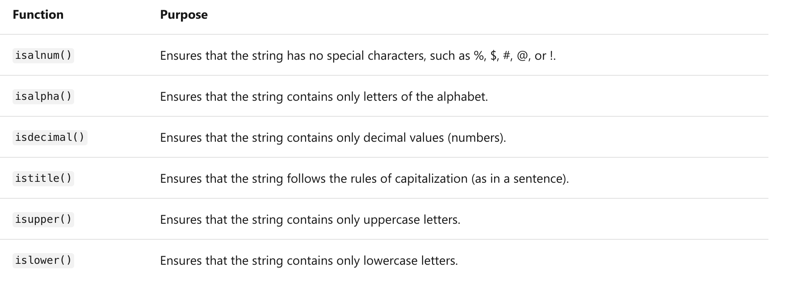
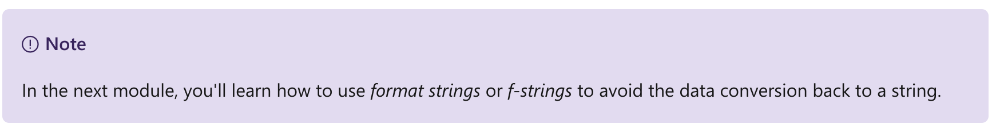
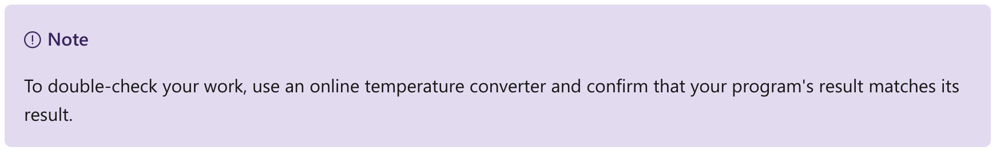
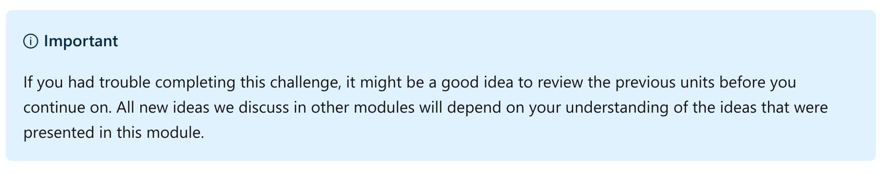
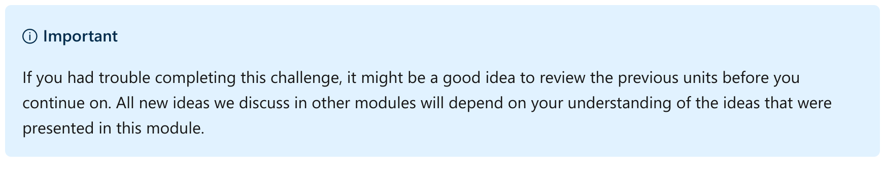
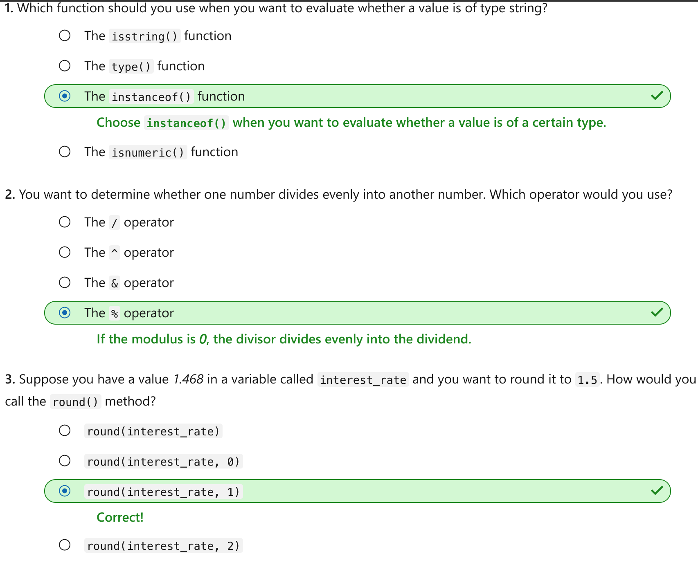

This notebook is refer from the Microsoft resources: [Take your first steps with Python](https://docs.microsoft.com/en-us/learn/paths/python-first-steps/).

### Module 6: Perform mathematical operations on numeric data in Python

Convert user input to numeric values, and use mathematical operators to perform calculations.

### Topic 1: Introduction

Almost every application you build requires that you handle data, whether that data is keyboard input from users or a file containing data that you must process or transform.

You've already seen that you might need to convert data from a string to an integer to perform mathematical calculations. This is a common task.

Let's suppose you're writing a program that performs calculations on numeric data. What happens if you prompt users for numeric keyboard input, but they enter a non-numeric value instead? If you don't account for this possibility, your application will raise an error, the program will abruptly end, and your users might be confused.

To guard against this situation, your program must check to see whether the entered value can be converted to a number before the program attempts the data-type conversion. If the value can't be converted, the program would ask users to try entering the value again.

So, how do you perform a data-type conversion check by using Python?

In this module, you programmatically inspect a value to learn its current data type, and determine whether it can be converted to a different data type, such as an integer. You use the `if` decision statement that you learned about in the preceding module to branch the code execution to either perform the data conversion or display a message to users to enter a different value. By using built-in mathematical operators, you have your program perform addition, subtraction, division, multiplication, and other numeric operations.

By the end of this module, you will be able to build a program that can accept user input, evaluate its data type, add logic that decides how to branch the code execution to handle a variety of situations, and perform a variety of mathematical operations on numeric data.

#### 1.1 Learning objectives

In this module, you will:

- Use the `type()`, `isinstance()`, and `isnumeric()` methods to inspect a value's data type and its suitability for use or conversion to a numeric data type.

- Use mathematical operators to perform basic math operations on numeric data.

- Use the `float` data type to represent values that include fractional values, which are represented by numbers after the decimal point.

#### 1.2 Prerequisites

Before you begin this module, you should:

- Have your Python development environment set up.

- Know how to create, edit, and execute Python code that's stored in a *.py* file.

- Have exposure to the use of input and output functions, such as `print()` and `input()`.

- Know how to create and use variables, and how to perform basic operations on strings, such as concatenation.

- Have some exposure to data-type conversion functions, such as `int()` and `str()`.

If you need to review or learn any of these concepts, visit the previous modules in this learning path.


### Topic 2: Exercise - Determine the data types of values

Python makes it easy to work with data. Every data value has an underlying data type, and that data type determines what you can do with the value. For example, numeric values can be used for mathematical operations. String values can be printed, concatenated, split, and so on.

Python provides several ways for you to evaluate a value to view, evaluate, and convert its data type. There are several built-in functions you can use. You'll learn about all of these functions and techniques in this exercise.

#### 2.1 The `type()` function

In the preceding module, you learned about the `type()` function, which merely displays the data type of a specified value.

#### Step 1 - Create a new working folder and python code file

By using the techniques you learned in previous modules, create a new folder for your work in this module. For example, you might create a folder named *python-numeric-operations*.

Inside that folder, create a file for this exercise. For example, you might create a file named *exercise1.py*.

When it's time to run your code, you can use the Python Tools for Visual Studio Code integration by selecting the green arrow, or you can use a command in the integrated terminal by using techniques you learned about in previous modules.

#### Step 2 - Write code that utilizes the `type()` function to the code file

Add the following lines of code to print the data type for various values. When you're finished, your code should match the following example:

Python:

```
print(type('7'))
print(type(7))
print(type(7.1))
```

By using the techniques you learned in previous modules, run the code file that you added this code to. You should see the following output:

Output:

```
<class 'str'>
<class 'int'>  
<class 'float'>
```

For now, you can think of the term *class* as merely *classification*. Soon, you'll learn more about Python classes and objects, and you'll come to understand the ramifications of the term *class* in Python.

More germane to this exercise, there are three data types:

- **str**: The data type for strings. Strings can contain all alphanumeric characters. Strings can be short (just a few characters) or very long (an entire paragraph of textual data).

- **int**: The data type for integer values, which can be any non-fractional number, positive or negative.

- **float**: The data type for float values, which can include fractional values represented as numbers that include a decimal point and numbers after the decimal.

The `type()` function merely examines the value you pass it as an input parameter (the word between the parentheses) and returns the data type. It's a great tool to use as you're learning about Python and how it works with values under the hood. However, for real applications, there are more useful ways at getting to this information.

#### 2.2 The `isinstance()` function

The next technique uses the isinstance() function, which allows you to assert that you expect a value to be a certain data type. The `isinstance()` function tells you whether the value is what you expected. It returns the value `True` if your expectation is correct and `False` if it's incorrect.

#### Step 3 - Comment out the previous code and add code that utilizes the `isinstance()` function to the code file

In your code file, comment out all the code that you wrote previously by adding a number sign (**#**), followed by a space, at the beginning of each line.

Next, add code that uses `isinstance()` to check the data type of the various values. When you're finished, your code file should look like this:

Python:

```
# print(type('7'))
# print(type(7))
# print(type(7.1))

print(isinstance('7', str))
print(isinstance(7, int))
print(isinstance(7.1, float))

print(isinstance(7, str))
print(isinstance('7', int))
print(isinstance('7.1', float))
```

When you run the code, you should see the following output:

Output:

```
True
True 
True 
False
False
False
```

The `isinstance()` function returns a Boolean value. Unlike the previous technique you used when you checked a value using the `type()` function and used the equality operator, `isinstance()` accomplishes the same result more succinctly.

You'll explore the term *is an instance of* in an upcoming module that explores classes and objects. But for now, you can think of it as an easy way to compare a value and the data type that you expect it to be.

#### 2.3 Can you create a Boolean expression by using the `type()` function?

You might be wondering whether using the following code is the same as using the `isinstance()` function:

Python:

```
print(type('7') == str)
print(type(7) == int)
print(type(7.1) == float)

print(type(7) == str)
print(type('7') == int)
print(type('7.1') == float)
```

The short answer is "yes." In these simple cases, they are roughly equivalent. However, as you learn more about classes and objects, you'll see that **this code might not give you the expected results in more complicated scenarios**. We recommend that you do not use the `type()` function with the intent to check for equality.

Although the type() and isinstance() functions both allow you to evaluate the current data type, you need to use a different technique to help you understand whether a specified value *could be converted* to a different type. In the next unit, you'll learn about a third technique that allows you to do that.

#### 2.4 What is the relationship between data types and variables?

It's important to understand that the data type is part of the *value*. The data type is not part of the variable that you might use to access the value. A variable can point to any value, regardless of the value's data type.

Python:

```
x = 'a string'
print(type(x))
x = 7
print(type(x))
x = False 
print(type(x))
```

When you run the code, you should see the following output:

Output:

```
<class 'str'>
<class 'int'>
<class 'bool'>
```

In this code example, the only thing that changed was the literal value that you pointed the variable `x` to. No data conversion was required to switch from having `x` point to a string in the first line of code and then to an integer or Boolean value in the next lines of code.

This is an important distinction in Python, and a key difference from other programming languages.

#### 2.5 Recap

You learned some important ideas in this unit:

- The `type()` function returns the data type of a specified value.

- The `instanceof()` function allows you to check to see whether a value is an instance of a specified data type.

- The `float` data type is for numeric values containing fractional values that are represented as numbers after the decimal point.

- Values have data types, and variables do not. A variable is merely pointed to a value, and it can point to any value of any data type.


### Topic 3: Exercise - Determine whether a string can be converted to a number

In the preceding module, you built an example that allows users to input two values. Your program would add the values together after converting them by using the `int()` function.

Python:

```
first_value = int(input('First Number: '))
second_value = int(input('Second number: '))
sum = first_value + second_value
print("Sum: " + str(sum))
```

As we pointed out in this module's introduction, it's possible for users to enter a value that can't be converted to a numeric data type. Consider what happens when someone enters the value Bob instead of a numeric value.

Output:

```
First Number: 6
Second Number: Bob
Traceback (most recent call last):
  File "c:/python/numeric-operations-datatypes/exercise1.py", line 2, in <module>
    second_number = int(input())
ValueError: invalid literal for int() with base 10: 'Bob'
```

#### 3.1 What went wrong?

This code accounts for only the best case scenario: that users would enter a value within a certain range of values, namely, a numeric value. Developers learn to anticipate that input from users or other systems (including files generated by other programs) might be out of the acceptable range of values. Sometimes, we call this approach "treating input as evil," which is the programming equivalent of "defensive driving."

Armed with a healthy skepticism, you need to perform data-type and value checks on the data before you perform actual operations on or with the data.

#### 3.2 What happens next?

In this exercise, you write code that takes the first step toward determining the right course of action. If the value can't be converted into a number, you need to stop the program, tell users that the value they entered is invalid, and ask them to try again.

Before you can do this, you need to learn more about data types, which are built-in functions that allow you to determine the data type of a value. You need to know how to work with Boolean expressions as a precursor to testing values. And you need to learn how to branch your code to handle scenarios where your data can't be used as is.

#### 3.3 How do you solve the problem?

At the beginning of this unit, we described the fundamental problem as an issue of trust. You trusted that users would input a value that could be used as a number.

To remedy this, you need to perform a few additional steps. First, check the user input to see whether it can be converted into an `int`. If it can be converted, go ahead and convert it. However, if it can't be converted, you need to explain the problem.

How can you determine whether the user input is numeric, even though the `input()` function always returns a string value? And how can you determine the data type of a value?

#### 3.4 Use the `isnumeric()` function

At the outset, you wanted a way to determine whether the entered value could be converted into a numeric value so that you can perform mathematical operations on it. The `isnumeric()` function returns a Boolean value if the string value can be converted into a numeric value.

#### Step 1 - Create a new Python code file

Use the techniques you learned in previous modules to add a new code file in the current folder that's dedicated to this module. For example, you might create a file named *exercise2.py*.

#### Step 2 - Add code that uses the `isnumeric()` function to determine whether a string can be converted into a number

In the new code file, add the following code:

Python:

```
numeric_value = '7'
print(numeric_value.isnumeric())

string_value = 'Bob'
print(string_value.isnumeric())
```

Notice that the `isnumeric()` function works unlike the other functions you've used so far. You access the function by using the *member accessor operator* dot character (**.**). This simply means that the function is not general purpose, and it can be used only on a string data type. There's a bit more to it than that, and you'll learn more about class members in an upcoming module.

Functions that supply additional functionality and are accessible to any value of a specified data type are called *helper functions* because they're built-in helpers that help you use or understand more about the contents of the string value itself.

If you run this code, you'll see the following output:

Output:

```
True
False
```

Both `numeric_value` and `string_value` point to string values, but the `isnumeric()` function tells you that one of them, `numeric_value`, could be converted and used as an `int` or `float` data type. You'll use `numeric_value` in a moment to build a more robust program that accepts user input for mathematical processing.

#### 3.5 Other `is__()` functions

The Python `str` data type supports many similar helper functions. As you're getting started, some of the most useful ones include:



You'll work with some of these functions in another module that's devoted to working with strings.

#### 3.6 Combine `isnumeric()` with an `if` statement

In the preceding module, you used the `if ... elif ... else` statement to branch code execution. Now, apply what you've already learned about user input, data types, and the `isnumeric()` helper function to check whether the input can be converted before the program attempts the conversion.

The `if` statement allows you to perform a *gate* on the input. A gate is a programming term that refers to a check on data to ensure that it's in the proper format before the program continues.

#### Step 3 - Comment out code from the previous steps, and then rewrite it to gate the keyboard input by using an `if` statement and the `isnumeric()` function

Update your code to match the following code listing:

Python:

```
first_value = input('First Number: ')

if first_value.isnumeric() == False:
    print('Value is not a number.')
    exit()

second_value = input('Second Number: ')

if second_value.isnumeric() == False:
    print('Value is not a number.')
    exit()

first_value = int(first_value)
second_value = int(second_value)

sum = first_value + second_value
print('Sum: ' + str(sum))
```

Here you use `isnumeric()`, looking for the Boolean expression to return a *False*. If it returns a *True* (that is, if `isnumeric()` is *False*), you print a message and `exit()`. Otherwise, you continue on with the program.

The `exit()` method terminates the program immediately. This method is useful when you want to end the program without processing any additional lines of code. In this case, you want to end the program when you know that the conversion of the user input to `int` will be unsuccessful. When you learn about looping structures in Python, you can repeatedly prompt users for a different value until they enter a numeric value.

If you run the code and users provide a numeric answer to the `input()`, it should return a valid sum of the numbers.

Output:

```
First Number: 4
Second Number: 5
Sum: 9
```

If you run the code and users provide a non-numeric answer to the prompts, you'll get a predictable response as the program ends.

Output:

```
First Number: 5
Second Number: bob
Value is not a number.
```

There's no doubt that the *gated* approach requires more lines of code. However, your program is more resilient and less likely to raise an error in real world usage. You could reduce the lines of code slightly by combining both of your calls to `isnumeric()` on the same line of code by using the `or` operator.

#### Step 4 - Update the code example to use the logical `or` operator

Update the code example to use the logical `or` operator. Make sure that your code matches the following code listing:

Python:

```
first_value = input('First Number: ')
second_value = input('Second Number: ')

if first_value.isnumeric() == False or second_value.isnumeric() == False:
    print('Please enter numbers only.')
    exit()

first_value = int(first_value)
second_value = int(second_value)

sum = first_value + second_value
print('Sum: ' + str(sum))
```

Execute the application a few times, and try various combinations to test your changes.

#### 3.7 Recap

- The `isnumeric()` allows you to check to see whether a value can be converted to an `int` or `float`.

- The `isnumeric()` function is an example of a *helper function* because it supports the use of a data type such as `str`. You access these types of functions by using the *member accessor operator* dot character (**.**).

- Use the `exit()` function to end the execution of your program immediately.

- Sometimes, you can use the logical `or` operator to reduce the amount of code you have to write to implement your gated checks.

- A helper function operates on a value of a specified type, providing helpful utilities that allow you to perform common operations on values that belong to that data type.

- Every data type supports some helper functions. You briefly looked at a few `str` helper functions that help you understand the contents of your string values.


### Topic 4: Exercise - Perform mathematical operations on numbers

Until now, you've been concerned with getting the data into the proper format so that you can perform mathematical operations on the numbers. Besides simple arithmetic, you haven't yet explored the other kinds of operations you can perform on numbers.

In this unit, we look at several mathematical operations that use Python operators.

Other, more complex operations are available from the Python math module. After you learn how to use other modules from the [Python Standard Library](https://docs.python.org/3/library/math.html), you'll understand how to take advantage of this added set of functionality.

You can obtain additional mathematical operations and data science and visualization functionality from third-party open source libraries, such as Pandas, NumPy, SciPy, Matplotlib, and many others. Later, you'll utilize some of these libraries in more advanced modules on Microsoft Learn.

In this exercise, you learn about operators that allow you to perform typical mathematical operations on numeric data.

#### Step 1 - Create a new file

Use the techniques you learned in previous modules to add a new code file in the current folder that's dedicated to this module. For example, you might create a file named *exercise3.py*.

#### Step 2 - Write code that performs various mathematical operations in the new code file

In the new code file, add the following code:

Python:

```
first_value = 5
second_value = 4

sum = first_value + second_value
difference = first_value - second_value
product = first_value * second_value
quotient = first_value / second_value
modulus = first_value % second_value
exponent = first_value ** second_value 

print('Sum: ' + str(sum))
print('Difference: ' + str(difference))
print('Product: ' + str(product))
print('Quotient: ' + str(quotient))
print('Modulus: ' + str(modulus))
print('Exponent: ' + str(exponent))
```

Many of the operators are obvious but if you're not sure, they're listed here:

- `+`: Addition operator

- `-`: Subtraction operator

- `*`: Multiplication operator

- `/`: Division operator

- `%`: Modulus operator, which gives you the remainder (if any) after you divide one value into another. It's useful to know whether one value is evenly divisible by the other.

- `**`: Exponent operator. For example, "5 to the fourth power" is expressed as `5 * 5 * 5 * 5`.



If you run the code, you should see the following output:

Output:

```
Sum: 9
Difference: 1
Product: 20
Quotient: 1.25
Modulus: 1
Exponent: 625
```

Step 3 - Comment out the previous code and add code that allows you to control the default order of operations
Python follows the PEMDAS acronym, which indicates the order in which the operations should be performed.

- **P**arentheses: Resolve operations between parentheses first.

- **E**xponents: Resolve exponents.

- **M**ultiplication: Perform multiplication, from left to right.

- **D**ivision: Perform division, from left to right.

- **A**ddition: Perform addition, from left to right.

- **S**ubtraction: Perform subtraction, from left to right.

To see this operation in action, comment out the previous code in the file, and then add the following lines of code:

Python:

```
print(3 + 4 * 5)
print((3 + 4) * 5)
```

In the first line, you allow the natural order of operations before introducing parentheses to control the order. In the second line, you add parentheses around the first two values to force them to be evaluated first, and then you multiply by the last value.

If you run the code, you'll see the following output.

Output:

```
23
35
```

Take a moment to observe how the placement of parentheses changes the order and, ultimately, the result of mathematical operations.

Step 4 - Comment out the code from previous steps and add code to investigate division more closely
Let's revisit division for a moment. When you perform division, you provide a dividend and a divisor. If these are values are of an `int` data type, they will implicitly result in a quotient of type `float`.

To see this in action, comment out the previous code in the file, and then add the following lines of code:

Python:

```
first_value = 5
second_value = 4

quotient = first_value / second_value

print(type(quotient))
print(quotient)
```

If you run the code, you'll see the following output:

Output:

```
<class 'float'>
1.25
```

Usually, you'll be able to work with both `int` values and `float` values without any trouble. Occasionally, you'll need to convert a `float` into an `int`. Sometimes, this happens implicitly (without your explicit instruction). So, you might want to take control of that process.

#### Step 5 - Comment out the previous code and add code to convert a `float` into an `int`

When you convert a `float` value into an `int` value, you must be aware of truncation.

Comment out the code from the previous steps, and then add the following code listing to the code file:

Python:

```
pi = 3.14
print(type(pi))
print(int(pi))

uptime = 99.99
print(type(uptime))
print(int(uptime))
```

If you run the code, you should see the following output:

Output:

```
<class 'float'>
3
<class 'float'>
99
```

As you can see in the case of the variable called `uptime`, merely using the `int()` function causes the values after the decimal to be removed instead of rounding the entire value up to the next whole number (100).

To avoid truncation, you can use the built-in `round()` function. Update the code you wrote in this step to include a call to the `round()` function. Your code should match the following:

Python:

```
pi = 3.14
print(type(pi))
print(int(pi))
print(round(pi))

uptime = 99.99
print(type(uptime))
print(int(uptime))
print(round(uptime))
```

If you run the code, you should see the following output:

Output:

```
<class 'float'>
3
3
<class 'float'>
99
100
```

The `round()` function provides a way to perform rounding and conversion from a `float` value into an `int` value.

#### Step 6 - Comment out the previous code and add code that rounds to a specific decimal place

You can use the built-in function `round()` to round to a certain number of decimal places, not just the next whole number as you did in the preceding step.

To see this in action, comment out the lines of code that you added in previous steps, and then add the following lines of code:

Python:

```
first_value = round(7.654321, 2)
print(first_value)

second_value = round(9.87654, 3)
print(second_value)
```

By supplying a second argument when you call the `round()` function, you can control the number of decimal places to round to.

To call a function and pass more than one argument, you use a comma (**,**) to separate each argument. As you'll learn when we dive deeper into functions, you can create functions that have optional input parameters. In this case, if you don't supply the second argument, the `round()` function defaults to *0* places after the decimal, which gives you an `int` value.

If you run the code, you'll see the following result:

Output:

```
7.65
9.877
```

#### Recap

Here are a few important ideas to keep in mind from this unit:

- Operators are mini shortcut functions that perform an operation on one or more operands (literal or variable values, and so forth).

- There are built-in mathematical operators for most common needs. More advanced mathematical operations have been addressed by the math module in the Python Standard Library. Other third-party, open source libraries cover a wide range of functionality that's needed in data science, data visualization, and machine learning.

- The order of mathematical operations in Python follows the rules of PEMDAS.

- When you convert from a value of type `float` to a value of type `int`, values after the decimal are truncated and lost. Use the `round()` function to control how values are rounded.

- Some functions are defined with multiple input parameters. To pass multiple arguments to the function, you use a comma (**,**) between each argument. Sometimes, arguments are optional. In these cases, the function continues to operate, but it uses a default value or alternative implementation.


### Topic 5: Challenge - Convert temperature from Fahrenheit to Celsius

Code challenges throughout these modules will reinforce what you've learned and help you gain some confidence before you continue on.

In this challenge, you use what you've learned about user input and performing mathematical operations on it.

#### Step 1: Add a new file to your working folder

Use the techniques you learned in previous modules to add a new code file in the current folder that's dedicated to this module. For example, you might create a file named *challenge1.py*.

Use this file for the code you'll write in Step 2.

#### Step 2: Write a program to convert temperatures from Fahrenheit to Celsius

The mathematical formula for converting a temperature measured in Fahrenheit to a temperature measured in Celsius is shown in the following code:

```
celsius = (fahrenheit - 32) * 5/9
```

Use this formula to build a program that prompts users for a temperature in Fahrenheit, performs the conversion to Celsius, and then displays the Celsius temperature.

If users enter the value 55 at the prompt, the program should produce the following output:

Output:

```
What is the temperature in fahrenheit?  55
Temperature in celsius is 12
```

However, if users enter a bad value, the program should tell them that there's a problem and then exit. For this scenario, if users enter the value bob at the prompt, your program should produce the following output:

Output:

```
What is the temperature in fahrenheit?  bob
Input is not a number.
```



Whether you get stuck and need to peek at the solution or you finish successfully, continue on to view a solution to this challenge.


### Topic 6: Solution - Convert temperature from Fahrenheit to Celsius

The following code is one possible solution to the challenge presented in the preceding unit.

Python:

```
fahrenheit = input('What is the temperature in Fahrenheit?  ')

if fahrenheit.isnumeric() == False:
    print('Input is not a number.')
    exit()

fahrenheit = int(fahrenheit)

celsius = int((fahrenheit - 32) * 5/9)
print('Temperature in celsius is ' + str(celsius))
```

This code is merely one possible solution, because we didn't specify what to name the variables and other small implementation details.

As long as your program works in the best case scenario, and handles the worst case scenario, you were successful.

If you were successful, congratulations! Continue on to the knowledge check in the next unit.




### Topic 7: Challenge - Build a simple calculator

In this second challenge, you combine what you learned about accepting user input and performing data conversions with what you previously learned about the if...elif...else statement.

Here, you build a limited calculator application that prompts users for two values and a mathematical operation, performs the calculation, and then formats and displays the output.

#### Step 1: Add a new file to your working folder

Use the techniques you learned in previous modules to add a new code file in the current folder that's dedicated to this module. For example, you might create a file named *challenge2.py*.

Use this file for the code you'll write in Step 2.

#### Step 2: Write a program to accept two numbers and an operation, and then perform the operation on the two numbers

Build a simple calculator that accepts a first number, an operation, and a second number.

Here's an example output, where a user has entered 4, *, and 5 at the prompts:

Output:

```
Simple calculator!
First number? 4
Operation? *
Second number? 5
product of 4 * 5 equals 20
```

Your program should accept a symbol, such as the asterisk symbol (*), to perform a multiplication and produce a product. Make sure that you implement logic for the following results:

- Sum

- Difference

- Product

- Quotient

- Exponent

- Modulus

If users fail to enter a numeric value, display the following message:

Output:

```
Please input a number.
```

If users enter an operation that isn't recognized, display the following message:

Output:

```
Operation not recognized.
```

Whether you get stuck and need to peek at the solution or you finish successfully, continue on to view a solution to this challenge.


### Topic 8: Solution - Build a simple calculator

The following code is one possible solution to the challenge from the previous unit.

Python:

```
print('Simple calculator!')

first_number = input('First number? ')

if first_number.isnumeric() == False:
    print('Please input a number.')
    exit()

operation = input('Operation? ')

second_number = input('Second number? ')

if second_number.isnumeric() == False:
    print('Please input a number.')
    exit()

first_number = int(first_number)
second_number = int(second_number)

result = 0
if operation == '+':
    result = first_number + second_number
    label = 'sum'
elif operation == '-':
    result = first_number - second_number
    label = 'difference'
elif operation == '*':
    result = first_number * second_number
    label = 'product'
elif operation == '/':
    result = first_number / second_number
    label = 'quotient'
elif operation == '**':
    result = first_number ** second_number
    label = 'exponent'
elif operation == '%':
    result = first_number % second_number
    label = 'modulus'
else:
    print('Operation not recognized.')
    exit()

print(label + ' of ' + str(first_number) + ' ' + operation + ' ' + str(second_number) + ' equals ' + str(result))
```

This code is merely one possible solution, because we didn't specify the name of variables, the order in which you should perform the gated checks, and other implementation details.

As long as your program can handle all the scenarios outlined in the challenge, you were successful.

Output:

```
First number? 4
Operation? *
Second number? 5
product of 4 * 5 equals 20
```

If you were successful, congratulations! Continue on to the knowledge check in the next unit.




### Topic 9: Check your knowledge




### Topic 10: Summary

Your goal in this module was to write Python code that can handle data that's unusable for the purpose of converting to numeric values and performing mathematical operations.

By using built-in functions to understand the contents of the user input, as well as the `if ... elif ... else` statement, you were able to write code that analyzes the data types of values, use Boolean expressions to branch code, and use various mathematical operators to perform a wide range of operations.

You can now accept user input confidently, knowing that you can inspect and understand its content before you utilize it in your programming logic.


```{r echo=FALSE, eval=FALSE, message=FALSE}
rmarkdown::render(input = "DS06_Python_numeric.Rmd", output_format = "github_document", output_file = "README.md")
```

