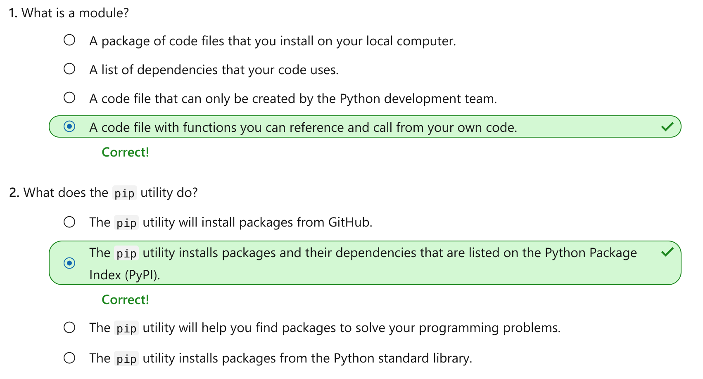

Import standard library modules to add features to Python programs
================

This notebook is refer from the Microsoft resources: [Take your first steps with Python](https://docs.microsoft.com/en-us/learn/paths/python-first-steps/).

### Module 7: Import standard library modules to add features to Python programs

Explore the Python standard library, how to add a module to your program, and how to download third-party packages.

### Topic 1: Introduction

The Python programming language includes a library of functionality that you can use in your own programs. It also includes tools that allow you to install additional third-party, open-source projects that dramatically speed up and simplify Python development.

Imagine that you've been asked to create a program that scrapes data from the internet, processes the information, saves the data to a file, and then uses the FTP internet protocol to send that file to a client's server. If you had to program every detail yourself, it would take a long time. Fortunately, you can use the Python standard library to leverage the work of others who have already written code to make this entire program possible, even trivial.

In this module, you'll explore the Python standard library. You'll learn how to use thousands of pre-built functions spread over hundreds of modules, and how to extend that to leverage the work of the wider software development community. This community has created hundreds of thousands of Python packages that can cover every conceivable need. You'll learn where you can go to research available packages, and how to install these packages locally and include them into your code.

By the end of this module, you will be able to write programs that can harness the power of the Python standard library and the Python community's body of work.

#### 1.1 Learning objectives

In this module, you will:

-   Explore the Python standard library.

-   Add the `include` statement to tell the Python compiler which modules to use in your code.

-   Use the `pip` utility to download third-party, open-source packages.

#### 1.2 Prerequisites

-   A fully set-up Python development environment.

-   An understanding of basic data types, such as strings and `int`, and how to create, set, and get values from a variable.

-   Experience calling methods by using the member access operator `.` and passing arguments to functions.

### Topic 2: Overview of the Python standard library

Before we begin to work with the Python standard library, let's get a clear understanding of exactly what it is, how it relates to the Python programming language, how it's divided into manageable parts, and how to harness it.

#### 2.1 What is the Python standard library?

The Python standard library is a vast collection of functions, types, and services that address a wide array of programming needs. These are not part of the Python language, but the functions are distributed with the Python interpreter, and are available to every Python program.

The library is split up into modules. Some modules are *built-in*, meaning you can start using them without notifying the Python compiler ahead of time. Other modules must be imported first.

Some of the code in those modules is written in the C programming language, which can address a lower-level set of operating system and hardware functionality than Python. The developers of Python use this low-level access to the computer's memory, processor, file system, operating system, and so on, to implement efficient features. Because C is a lower-level programming language, it is powerful, but also more complicated than Python. It often requires a significant amount of code to accomplish tasks that are trivial in Python. By packaging up C code and making it available to Python, you get the best of both worlds.

#### 2.2 What is a module?

A *module* is simply a code file. Later in this module, we'll build a module so you can get some experience working with them. The modules that are a part of the Python standard library are complex and rich with features, but ultimately, they are just code files.

When we refer to a module, we might be referencing the concept of a module (as a code file) or the functionality supported by the code file. For example, when we refer to the `zipfile` module, we are referring to the collection of functions that support compressing and decompressing file data using the ZIP archive standard.

What can you do with the standard library? The standard library spans a wide spectrum of functionality, including:

-   Date and time modules

-   Numeric and mathematical modules

-   File system modules

-   Operating system modules

-   Modules for reading and writing specific data formats, such as HTML, XML, and JSON

-   Modules for working with Internet protocols, such as HTTP, SMTP, FTP, and so on

-   Modules for working with multimedia data, such as sound and video

-   Modules for working with localized information, such as presenting currency and dates

-   And many more

For a complete listing of modules in the Python standard library, see [The Python Standard Library](https://docs.python.org/3/library/).

#### 2.3 Built-in functions versus importing modules

There's some debate as to the exact meaning of a built-in function. Generally speaking, it's a function that has been built into the Python interpreter. They are usually functions that are used so often that it would be laborious to import them each time you need them. For example, given that almost every Python program needs to print() something, it makes sense to include that as a built-in function.

Other features and functions are useful, but are only needed occasionally. In these cases, you can tell the Python compiler that you expect to use them in your program by using the `import` statement in an exercise in this module.

With third-party packages (often open-source libraries of functionalities built by a community of volunteer developers), you first need to download and install the libraries locally, then use an `import` statement to tell the Python compiler that you intend to use the functions in your code. You use a Python command-line utility called `pip` to install a package locally for use in your program. We'll install, import, and call functions from a package in an exercise in this module.

#### 2.4 How can I find what I'm looking for?

With such a massive number of modules in the Python standard library, not to mention across all the third-party libraries that are available, finding the right module might feel a bit daunting.

First, you do not need to learn it all. There's no way you can read all the standard library documentation, much less the documentation from all other popular Python libraries, so don't even try. In time, you'll become familiar with a subset of modules and libraries that affect the kind of work you are tasked with.

Second, you should start by searching for a solution to the specific problem you're trying to solve. While you may not have all the details worked out in your mind, you should be able to formulate a good set of keywords to describe the problem.

After you can clearly state your problem, the next step is to become a detective. You'll turn to search engines to look for candidate solutions. It's likely that there are a dozen different ways to solve your problem. You may spend a few minutes, hours, or even a day reviewing the approaches to solving the problem. And it's likely that some of those approaches will require modules from the Python standard library, third-party packages, or both.

You might wonder if it's *cheating* to search for the solution. Are you somehow less of a programmer for not knowing everything? Not at all. Everyone does it; especially experienced professional developers. There's both a rich community and a proud tradition of developers helping other developers online. No one can know everything.

Admittedly, you should understand the Python language well. If you copy code from blogs, articles, or videos, then you should spend time understanding what it does and figure out how to incorporate it into your work as if it were your own. But you should never feel guilty about *stealing* someone's approach to solving a given problem. That's why they posted it on the internet!

#### 2.5 Recap

-   A module is a file containing functions that implement functionality. The Python standard library is made up of over 200 modules containing thousands of functions.

-   Some important, commonly used functions are built directly into the Python compiler and interpreter.

-   You must use an `import` statement to tell the Python compiler which modules in the Python standard library contain the functions, types, services, and so on, that you will be using in your code.

-   Searching online is a valid way to discover the modules and functions from the Python standard library (and other third-party packages) that can be combined to solve a programming problem that you're facing.

### Topic 3: Exercise - Use an include statement to utilize a standard library module

In this exercise, you'll use the `random` module to generate a random value. This is useful when building simulations or games to introduce randomness. The important takeaway is how to use the `import` and `import ...` as statements in your programs.

#### Step 1 - Create a new working folder and python code file

Using the techniques you learned in previous modules, create a new folder for your work in this module. For example, you might create a folder named `python-standard-library`.

Inside that folder, create a file for this exercise. For example, you might create a file named `exercise1.py`.

When you're instructed to run your code, you can use the Python Tools for Visual Studio Code integration by selecting the green arrow. Or you can use a command in the integrated terminal by using techniques we learned about in previous modules.

#### Step 2 - Import the `random` module from the Python standard library

The syntax of the `import` statement is simple. You must use the `import` statement before you actually attempt to use the functions contained within the module you are importing. Also, by convention, you should add the `import` statement to the top of your code file before any other code.

Add the following `import` statement to your code file.

Python:

    import random

#### Step 3 - Type the word `random` and the member access operator to view IntelliSense

Even without reading the documentation for the `random` module closely, you can explore its functions, constants, and service by using IntelliSense in Visual Studio Code. IntelliSense will pop up as you type in the code editor providing contextual prompts that display your best options. You can navigate by typing the first letters of the option you want to use, or you can navigate by selecting the `up arrow` and `down arrow`. The highlighted option will display documentation to the right side in a separate pop-up window. After you find the option you want to use, you can select the `enter` or `tab` keys to automatically type the remainder of the word for you.

To invoke IntelliSense for the `random` module, type the next line of code in the code listing below. Pause after you type the member access operator `.` after the identifier `random`.

Python:

    import random
    roll = random.

If you stopped typing at the `.` symbol, you should see the IntelliSense window display all of the functions available from the `random` module.

You can learn a lot about the functionality of a module by merely perusing its functions. Locate the `randint` function by selecting the `up arrow` and `down arrow` keys. After you find it, what you see in your copy of Visual Studio Code should match the following.

Now select the `enter` or `tab` keys to automatically type the remainder of the function name `randint` for you.

Next, type the opening parenthesis symbol `(` to display IntelliSense again. This time, it displays the fact that the `randint` function takes two input arguments that define the range, "including both endpoints."

When you're defining a range of values in programming, "inclusive" usually means that the value you supply is in bounds. "Exclusive" means the value you supply is out of bounds. So, if we want a random value between 1 and 10, short form IntelliSense documentation says we can define those by passing in the values `1` and `10` as arguments.

So, the entire line of code should match the following code listing.

Python:

    roll = random.randint(1, 10)

#### Step 4 - Add code to print the value generated by the random module

Complete the code example by adding a `print()` statement that formats the line using an f-string. Make sure your code matches the following code listing.

Python:

    import random
    roll = random.randint(1, 10)
    print(f'You rolled {roll}.')

When you run the code, you should see the following output (the number will be random).

Output:

    You rolled 3.

The number will likely change each time you run the program.

#### Step 5 - Modify your code to create an alias for the name of the module

You might not like using the module name `random` throughout your code. It might not describe the role you want the module to play in your program, or you might already be using the identifier `random` in your program and using it again will cause a conflict. In these cases, you can add the `as` clause to your `import` statement to create an alias.

Modify your code to match the following code listing.

Python:

    import random as alias
    roll = alias.randint(1, 10)
    print(f'You rolled {roll}')

In this specific example, the name `random` is descriptive enough; however, for the purpose of illustration, you may want to alias the name. You can now access the functionality of the random module by using the identifier `alias`.

When you run the program, you will see the same random value printed again.

Output:

    You rolled 6.

We chose the identifier `alias` to illustrate the concept, but you are free to use any valid identifier using the same naming rules as Python variables.

Let's change the name of the alias. Replace the identifier `alias` with the identifier `dice`.

Python:

    import random as dice
    roll = dice.randint(1, 10)
    print(f'You rolled {roll}')

When you run the program, it should still work.

#### Recap

-   Use the `import` statement to include a package from the Python standard library in your program. All of the module's functionality is available through the use of the member access operator `.`.

-   In Visual Studio Code, the IntelliSense feature can show you the members (functions, constants, and services) that are available after typing the member access operator.

-   Use the `import ... as` statement to create an alias for the module if it will help describe its role in your software system.

-   The `random` package provides a way to generate a random value. This will come in handy as we build more interesting code examples in upcoming Microsoft Learn modules.

### Topic 4: Exercise - Install a third-party package using pip

While the Python standard library has extensive support for a wide array of features, it can't possibly address every possible solution. Fortunately, an open-source software community has created thousands of packages that fill in the gaps.

In this exercise, you'll use pip, a utility that accesses a popular Python package index named Python Package Index (PyPI). Combining the two, you can find packages you need for just about any purpose imaginable.

Suppose you want to enhance your output with emoticons, like a smiley face or thumbs up symbol. The Python standard library does not support that. However, you can find candidate packages available on PyPI and use `pip` to install a package locally for development.

#### 4.1 What is a Python package?

A Python package is a means of organizing, collecting, and distributing code so that it can be used by other developers. Packages provide a hierarchical folder and file system means of organizing your code, and allow dependencies to be distributed along with your code as well.

Creating packages is beyond the scope of this module, but you should at least know what it is and how `pip` installs both the package you need and the dependencies it relies on.

#### 4.2 What is a dependency?

A dependency is any separate package that your code needs in order to function properly. Suppose you wanted to create a package with some functionality that you think would benefit others. One of the steps required when you package your code is to specify the name and version of the packages you depend on in a manifest file named `setup.py`. When another developer wants to use your package, they'll use `pip`. The `pip` utility will look at the manifest and also install (or update) any required dependencies you specified so that your package will work properly on their computer.

#### Step 1 - Add a code file to your working directory for this exercise

Assuming you're continuing from the previous unit, use the techniques you learned in previous modules to add a new code file in the current folder dedicated to this module. For example, you might create a file named `exercise2.py`.

#### Step 2 - Navigate in your web browser to the Python Package Index (PyPI)

In your web browser, navigate to the [Python Package Index](https://pypi.org/).

The PyPI boasts over 200,000 different projects. Use the search bar on the home page to search for the term "emoji." This will return 16 pages worth of search results.

You are looking for the project called "emoji," which should be one of the top results. You can find the direct hyperlink at the following URL:

<https://pypi.org/project/emoji/>

This URL displays a project description, example, installation instructions, the license, authors, and more.

We're interested in the installation instructions and example code.

#### Step 3 - Use `pip` to install the `emoji` package

Back in the Visual Studio Code terminal, enter the following command on Linux and macOS.

Bash:

    pip install emoji

On Linux and macOS, if you get a message that you do not have sufficient privileges, then you must use the super user account. Enter the following command.

Bash:

    sudo pip install emoji

If you're on Windows, you may need to use the py utility to execute pip. Try the following command on Windows.

cmd:

    py -m pip install emoji

#### Step 4 - Add code to import and call the new package's functionality

The example code on the PyPI page demonstrates how to use the `emoji` package's `emojize` function to encode a string representation of an emoticon that can be displayed by the `print()` function.

Using a similar technique to what we learned in the previous unit, add the following code to `import` the package you installed, and call the function that will encode the emoticon.

Python:

    import emoji
    message = emoji.emojize('Howdy :sun_with_face:')
    print(message)

When you execute the code, you should see the following output.

#### 4.3 Recap

-   Visit PyPI to find candidate packages that address your programming need instead of trying to build the code logic yourself. Use information from the PyPI package documentation to install and use the package's functionality in your program.

-   Use the `pip install <packagename>` command to install a package locally along with all of its dependencies.

### Topic 5: Knowledge check

### Topic 6: Summary

Our goal was to explore and use the Python standard library in our own programs, and learn how to find solutions to common software development problems in the Python community at large.

We imported the `random` module from the Python standard library to generate random numbers by calling a function in that module. We explored the module by using IntelliSense in Visual Studio Code, and saw how we can learn about each function in the module by consulting the short form documentation in IntelliSense. We searched for solutions to our needs by using the Python Package Index (PyPI), and then we used the pip utility to install a package locally and call a function in that package.

Without this rich ecosystem to leverage, we would need to build everything ourselves, which would be time consuming and error prone. It would also require a vast knowledge of Python before we could be productive. Fortunately, this massive collection of functionality from Python's creators and the community enables us to build programs more quickly and easily.
