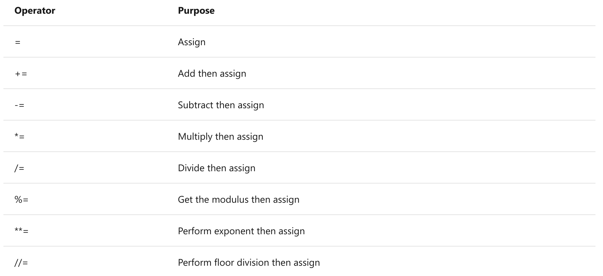
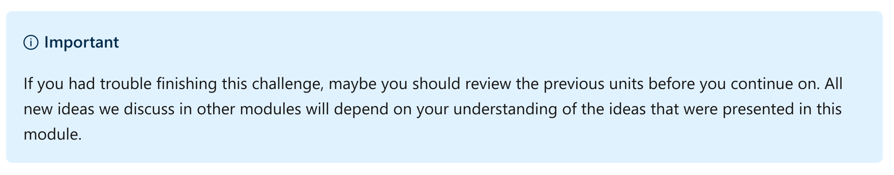
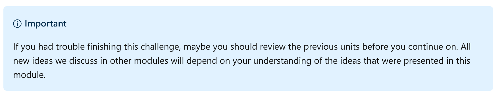
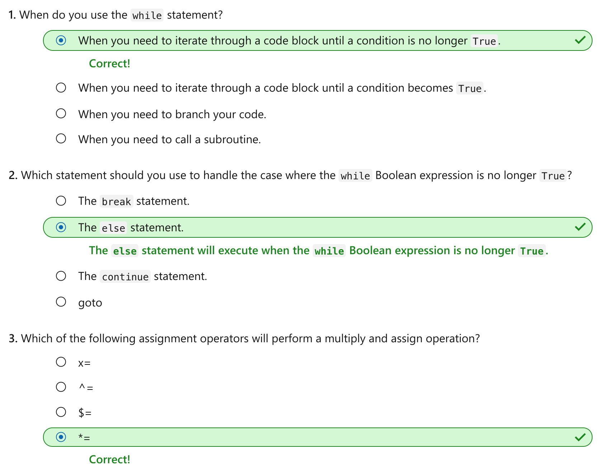

Iterate through code blocks by using the while statement
================

This notebook is refer from the Microsoft resources: [Take your first steps with Python](https://docs.microsoft.com/en-us/learn/paths/python-first-steps/).

### Module 7: Iterate through code blocks by using the while statement

Use the `while` statement and related Python code constructs to add looping logic to your programs.

### Topic 1: Introduction

In addition to branching code execution, often it's necessary to repeat code execution until a certain condition is met. This process is called iteration in programming terminology.

Suppose you need to prompt a user for input, and you continue prompting them until they enter a value that's within an acceptable range of values. Or suppose you need to read each line of a data file until you reach the end of the file. In these situations, you'll use the `while` statement, which creates a looping structure in your code. With a `while` statement, the code execution iterates until a condition is met, at which point the path of execution continues through the remainder of your program.

In this module, you'll use the `while` statement to iterate through a code block. You'll add other statements like `break`, `continue`, and `else` to further control the flow of code execution. You'll use new assignment operators to perform mathematical operations that also assign the new value back into the variable--a frequent pattern in many looping statements.

By the end of this module, you'll be able to build programs that control the flow of code with looping structures.

#### 1.1 Learning objectives

In this module, you will:

-   Use the `while` statement to iterate through a code block.

-   Use the `break`, `continue`, and `else` statements to further control iteration.

-   Use alternate assignment operators to perform mathematical operations that also assign values.

#### 1.2 Prerequisites

-   You should have your Python development environment set up, know how to create a working folder and code files, and know how to run the code in a code file.

-   You should understand data types like str and int and know how to define, set, and get values from a variable.

-   You should understand what a code block is and how to define one.

-   You should understand how to include a module from the Python Standard Library.

-   You should have experience using if statements and the string's isnumeric() helper method to evaluate user input.

### Topic 2: Exercise - The while statement

In this exercise, we'll use the `while` statement to build a small game that will keep looping over a code block with the game logic required to generate and evaluate a random value.

#### Step 1: Create a new working folder and Python code file

Using the techniques you learned in previous modules, create a new folder for your work in this module. For example, you might create a folder named `python-while`.

Inside that folder, create a file for this exercise. For example, you might create a file named `exercise1.py`.

When it's time to run your code in the steps of the exercises, you can use the Python Tools for Visual Studio Code integration by selecting the green arrow. Or you can use a command in the integrated terminal by using techniques you learned about in previous modules.

#### Step 2: Add code to loop through a code block by using the while statement

Add the following code listing to your new file:

Python:

    import random 

    roll = 0
    count = 0

    while roll != 5:
      count = count + 1
      roll = random.randint(1, 5)
      print(roll)

    print(f'It took {count} rolls to roll a 5!')

The `while` statement has three parts:

-   The `while` keyword

-   A Boolean expression

-   An end-of-statement colon symbol `:`

Also important is the code block beneath the `while` statement. We've looked at code blocks in other modules. This code block belongs to the while statement and will continue to be repeatedly executed until the Boolean expression evaluates to `False`.

In this case, we use the `random` module's `randint()` function to generate a random number between 1 and 5. We use the `roll` variable to hold the current value of the randomly generated number. We use the `count` variable to keep track of how many times we've called the `randint()` function.

Each time we run the code block, the value of `roll` is set to a new random number between 1 and 5. After the last line of the code block runs, the Python interpreter checks the Boolean expression again. If the new value of `roll` is still not 5, the process is repeated in a loop until the Boolean expression evaluates to `False`. In other words, once roll equals 5, the Boolean expression is `False`. The execution path exits the loop and continues with the rest of the program.

Each time we ran the code block, we incremented the value of `count` by `1`, so we know how many times our code performed the loop.

When you run the code, you should see similar output:

Output:

    3
    1
    4
    2
    4
    1
    5
    It took 8 rolls to roll a 5!

Using a `while` statement with the `random` module could be the basis for many mini-games. Let's build a slightly more interactive version in the next step.

#### Step 3: Use the optional statements break and else

In certain situations, you might want to break out of the while statement prematurely. For example, you might prompt the user for input. If they enter a certain character or term, you might want to exit the loop that circumvents the normal flow.

Update the code from the previous step to match the following code listing:

Python:

    import random 

    roll = 0
    count = 0

    print('First person to roll a 5 wins!')
    while roll != 5:
      
      name = input('Enter a name, or \'q\' to quit:  ' )
      if name == 'q':
        break
      
      count = count + 1
      roll = random.randint(1, 5)
      print(f'{name} rolled {roll}')
    else:
        print(f'{name} Wins!!!')

    print(f'You rolled the dice {count} times.')

In this version of our mini-game, we prompt the user for a name. Each time a new name is entered, a random value is generated (a "roll"). The first person to roll a `5` wins.

If the player continues to enter names until a `5` is rolled, the Boolean expression is no longer `True`. Then the code execution path skips to the `else` statement to print the winning message.

When you run the code and keep entering names, you should eventually see similar output:

Output:

    First person to roll a 5 wins!
    Enter a name, or 'q' to quit:  Grant
    Grant rolled 2
    Enter a name, or 'q' to quit:  Charlee
    Charlee rolled 5
    Charlee Wins!!!
    You rolled the dice 2 times.

We allow the player to exit the game prematurely by typing the letter `q` instead of a name. We use an `if` statement to check the value the user typed in. If they entered `q`, we call the `break` statement.

The `break` statement instructs the Python interpreter to exit the loop and continue running the code after the `while` statement's code block. In this case, the `else` statement is skipped--there's no winner.

When you run the code but enter a `q` at some point, you see similar output:

Output:

    First person to roll a 5 wins!
    Enter a name, or 'q' to quit:  Bob
    Bob rolled 4
    Enter a name, or 'q' to quit:  Beth
    Beth rolled 3
    Enter a name, or 'q' to quit:  Conrad
    Conrad rolled 1
    Enter a name, or 'q' to quit:  q
    You rolled the dice 3 times.

Both `break` and `else` are optional statements in the `while` looping structure.

#### Step 4: Update the code example to handle the case where the user enters nothing by using the continue statement

Let's expand our previous example. Let's make sure that the player doesn't enter an empty string. In other words, if the user selects Enter without entering any other keystrokes (or merely selects the Spacebar), we want to ignore that entry and prompt the user again to enter a name.

Python:

    import random 

    roll = 0
    count = 0

    print('First person to roll a 5 wins!')
    while roll != 5:
      name = input('Enter a name, or \'q\' to quit:  ' )

      if name.strip() == '':
        continue

      if name.strip() == 'q':
          break
      
      count = count + 1
      roll = random.randint(1, 5)
      print(f'{name} rolled {roll}')
    else:
        print(f'{name} Wins!!!')

    print(f'You rolled the dice {count} times.')

In this case, we perform a gated check on the value entered by the user. After we strip out the empty spaces by using the string helper method `strip()`, the `name` variable is empty. Then we use the `continue` keyword to skip the remainder of the code block and go back to the top, where we evaluate the Boolean expression and continue looping through the code block.

By using a gated check, we can avoid the possibility that our program creates rolls when there's no name.

When you run the code and select the Enter key a few times without entering a name, you should see the similar output:

Output:

    First person to roll a 5 wins!
    Enter a name, or 'q' to quit:  Adrian
    Adrian rolled 2
    Enter a name, or 'q' to quit:
    Enter a name, or 'q' to quit:  
    Enter a name, or 'q' to quit:  
    Enter a name, or 'q' to quit:  Judy
    Judy rolled 3
    Enter a name, or 'q' to quit:  Ashley
    Ashley rolled 5
    Ashley Wins!!!
    You rolled the dice 3 times.

#### Recap

-   The `while` statement allows you to create a looping structure that continues to loop through a code block until a Boolean expression evaluates to `False`.

-   Add the `break` statement to exit out of a code block prematurely before the Boolean expression evaluates to `False`.

-   Add the `else` statement to provide a second code block that runs after the `while` statement's Boolean expression evaluates to `False`.

-   Add the `continue` statement to skip over the remainder of the code block and set the execution path back to the Boolean expression.

### Topic 3: Exercise - Assignment operators

We've used the basic assignment operator, a single equal sign symbol `=`, since we assigned a value to our first variable. There are other assignment operators that you should also be aware of.

Incrementing a value in a looping structure is a common operation. In this exercise, you'll learn how to use other assignment operators that will perform a mathematical operation and assign a new value to a variable in a shortened form.

Beyond basic incrementing, there are several potentially useful assignment operators you can employ in your programs.

#### Step 1: Add a new code file for this exercise

Assuming you're continuing from the previous unit, use the techniques you learned in previous modules to add a new code file in the current folder dedicated to this module. For example, you might create a file named exercise2.py.

#### Step 2: Add code to use an increment and assign operator

Python:

    count = 0
    while count != 5:
        count += 1
        print(count)

Let's focus on the first line of code in the code block: `count += 1`. The `+=` operator takes the `current` value of count, adds `1`, and then assigns the new value back into `count`. It's the equivalent of the following line of code:

Python:

    count = count + 1

When you run the code, you should see the following output:

Output:

    1
    2
    3
    4
    5

#### Step 3: Comment out the previous code and add code to increment count by 3

You can increment by any value. Let's increment `count` by `3` until count is no longer `<= 20`.

Comment out the code from the previous step, and add the following code listing:

Python:

    count = 0
    while count <= 20:
        count += 3
        print(count)

When you run the code, you should see the following output:

Output:

    3
    6
    9
    12
    15
    18
    21

#### Step 4: Comment out the previous code and add code that decrements count by 3

You can use the `-=` assignment operator to subtract a value, and then assign it to the variable. What if we want to count backwards from a number until we reach `0`?

Comment out the code from the previous step, and add the following code listing:

Python:

    count = 20
    while count >= 0:
        count -= 3
        print(count)

When you run the code, you should see the following output:

Output:

    17
    14
    11
    8
    5
    2
    -1

#### 3.1 Other assignment operators

There are several additional assignment operators, but their functionality might be less useful in real-world programs. Here's a table of some of the other assignment operators that are available in Python.

#### 3.2 Recap

-   New assignment operators `+=` and `-=` can simplify your increment and decrement operations.

-   There are many additional assignment operators in Python, but they might not be as useful.

### Topic 4: Challenge - Guess a number

Code challenges throughout these modules will reinforce what you've learned and help you gain some confidence before you continue on.

#### Step 1: Add a new code file to your working directory

Assuming you're continuing from the previous unit, use the techniques you learned in previous modules to add a new code file in the current folder dedicated to this module. For example, you might create a file named `challenge1.py`.

#### Step 2: Write the code to implement a number guessing game

Using the techniques we learned in this module, generate a random number between 1 and 5 and allow the user to guess. Keep prompting the user for their guess until they guess correctly. Then, display the number of guesses.

No matter how you do it, your code should produce similar results to the following output (given the randomly generated answer and guesses):

Output:

    Guess a number between 1 and 5: 3
    Guess a number between 1 and 5: 4
    You guessed it in 2 tries!

If the user doesn't enter a numeric value, there's no need to notify the user of their error. Just keep counting each entry as a guess. In the following example output, the user enters strings that can't be converted to numbers, but the program keeps running and keeps tallying the number of guesses.

Output:

    Guess a number between 1 and 5: Beth
    Guess a number between 1 and 5: Charlee
    Guess a number between 1 and 5: 3
    Guess a number between 1 and 5: 4
    Guess a number between 1 and 5: 2
    You guessed it in 5 tries!

Whether you get stuck and need to peek at the solution or you finish successfully, continue on to view a solution to this challenge.

### Topic 5: Solution - Guess a number

The following code is one possible solution for the challenge from the previous unit.

Python:

    import random

    value = random.randint(1, 5)
    count = 0
    guess = 0
    while guess != value:
        count += 1
        guess = input('Guess a number between 1 and 5: ')
        if guess.isnumeric():
            guess = int(guess)
    else:
        print(f'You guessed it in {count} tries!')

This code is only one possible solution. If your solution produces the same result as the challenge by using the while statement, you were successful.

Continue on to the knowledge check in the next unit.

### Topic 6: Challenge - Improved number guessing

Expand the previous challenge to include additional features like hints (too low, too high) and feedback (enter numbers only).

#### Step 1: Add a new code file to your working directory

Assuming you're continuing from the previous unit, use the techniques you learned in previous modules to add a new code file in the current folder dedicated to this module. For example, you might create a file named challenge2.py.

#### Step 2: Write the code to implement an improved number guessing game

Rebuild the number guessing game, but this time:

Display the current guess number.

-   If the guess is too low, tell the user "Your guess is too low, try again!"

-   If the guess is too high, tell the user "Your guess is too high, try again!"

-   If the user enters a nonnumeric value, tell the user "Numbers only, please!"

Also, take note of the output. The prompts and messages have changed when compared to the original challenge.

No matter how you do it, your code should produce the following output (given the randomly generated answer and the guesses).

Output:

    Guess a number between 1 and 10
    Enter guess #1: 5
    Your guess is too low, try again!
    Enter guess #2: 8
    Your guess is too high, try again!
    Enter guess #3: 7
    Your guess is too high, try again!
    Enter guess #4: 6
    You guessed it in 4 tries!

If the user types in a value that isn't numeric, display an error message. In the following example output, the user enters a few strings and is reminded to only enter numbers.

Output:

    Guess a number between 1 and 10
    Enter guess #1: Bob
    Numbers only, please!
    Enter guess #2: Beth
    Numbers only, please!
    Enter guess #3: 5
    You guessed it in 3 tries!

Whether you get stuck and need to peek at the solution or you finish successfully, continue on to view a solution to this challenge.

### Topic 7: Solution - Improved number guessing

The following code is one possible solution for the challenge from the previous unit.

Python:

    import random

    value = random.randint(1, 10)
    count = 0
    guess = 0
    print('Guess a number between 1 and 10')

    while guess != value:
        count += 1
        guess = input(f'Enter guess #{count}: ')

        if guess.isnumeric():
            guess = int(guess)
        else:
            print('Numbers only, please!')
            continue

        if guess > value:
            print('Your guess is too high, try again!')
        elif guess < value:
            print('Your guess is too low, try again!')

    else:
        print(f'You guessed it in {count} tries!')

This code is only one possible solution. You should have used the `while` statement to loop through the game logic and used the `continue` statement to handle the case where the user doesn't enter a numeric value.

Also, you should have kept track and displayed the current guess. You should have provided helpful hints like "too high" and "too low" when the user guessed incorrectly.

Output:

    Guess a number between 1 and 10
    Enter guess #1: 5
    Your guess is too high, try again!
    Enter guess #2: 3
    Your guess is too high, try again!
    Enter guess #3: bob
    Numbers only, please!
    Enter guess #4: 2
    You guessed it in 4 tries!

If you were successful, congratulations! Continue on to the knowledge check in the next unit.

### Topic 8: Knowledge check

### Topic 9: Summary

Our goal was to build a looping structure in Python to iterate through a code block as long as a condition was met.

Using the `while` statement, we implemented a loop that continued to run a code block as long as a Boolean expression evaluated to `True`. We used the `else` statement to perform a code block after the Boolean expression evaluated to `False`. We also added the `break` statement to exit the code block entirely. We added a `continue` statement to modify and set the execution path back to the evaluation of the `while` statement's Boolean expression. We also used new assignment operators to add simple increments and decrements to our programs.
