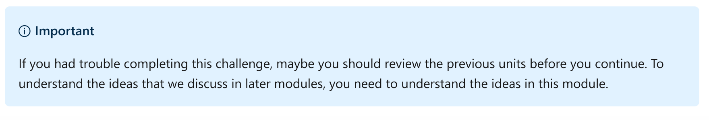
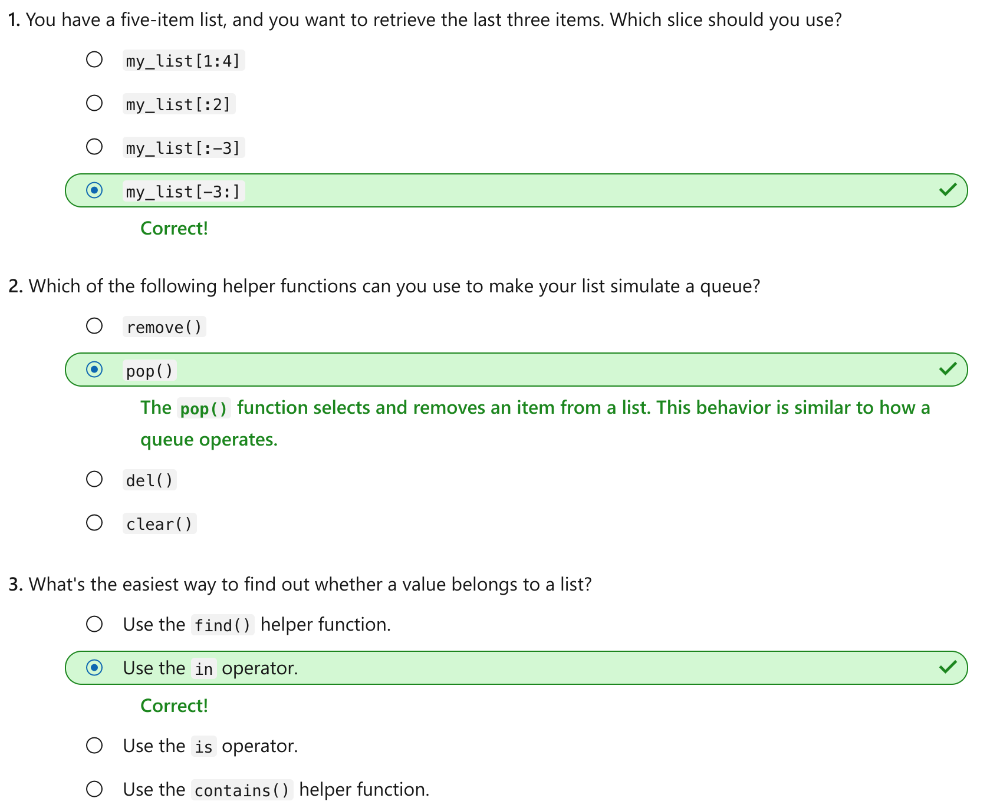

This notebook is refer from the Microsoft resources: [Take your first steps with Python](https://docs.microsoft.com/en-us/learn/paths/python-first-steps/).

### Module 9: Manage a sequence of data by using Python lists

Learn how to use lists to manage a collection of data. Use helper functions to manipulate the list. Use the for statement to iterate through the list.

### Topic 1: Introduction

Often when you build programs in Python, you need to work with a whole set of data, not just one element. In Python, you can work with a collection of data in several ways. One of the most simple and versatile ways is the list. When your data collection is in a list, you can access an individual item or a subset of items, sort and reverse the list order, iterate through the items, and more.

Suppose you need to keep track of the messages and numeric output that another software system generates. You want to look through each value, filtering out some values, saving other values, and so on. In this case, you can manage all of that data in a structure like a list.

In this module, you'll create and initialize values in a list. You'll access individual elements and entire subsets of values in the list. You'll call helper functions to perform operations like adding, removing, or sorting items. And you'll use the `for` statement to iterate through your list and operate on each element in the list.

By the end of this module, you'll be able to control the data that you store in a list.

#### 1.1 Learning objectives

In this module, you will:

- Create lists that contain related data.

- Use indices and slices to get an item or a subset of items from the list.

- Use helper functions to add and remove items from the list and to do other list-related actions.

- Iterate through the list by using the `for` statement.

#### 1.2 Prerequisites

- A local Python development setup where you can create a working folder for your code, add code files, and execute those code files from the command line or your code editor.

- Experience with data types like `str` and `int`, variables, and so on.

- Familiarity with importing the `random` module and how to call module functions like `randint()`.


### Topic 2: Exercise - Work with lists of data

A list allows you to collect data into a single structure. The items in the list can be of any data type. By using a list, you can:

- Add and remove items in various ways.

- Reference single items or slices of items (sublists).

- Loop through each item in a list, as you'll see in the next unit.

Lists are a popular way to manage related data in your applications.

In this exercise, you'll work with lists of data. In other modules, we'll explore similar data structures. These data structures include the set, dictionary, tuple, and range.

#### Step 1 - Create a new working folder and a Python code file

Use the techniques that you learned in previous modules to create a new folder for your work in this module. For example, you might create a folder named *python-lists*.

Inside that folder, create a file for this exercise. For example, you might create a file named *exercise1.py*.

To execute code in the exercises, you can use the Python tools for Visual Studio Code integration by selecting the green arrow. Or you can use a command in the integrated terminal by using techniques that you learned in previous modules.

#### Step 2 - Create a list of values

Write code to create a list of colors. Then print the list and its type to the console. Add the code from the following code listing to your new exercise file:

Python:

```
colors = ['red', 'green', 'blue', 'yellow', 'orange', 'purple', 'brown']

print(colors)
print(type(colors))
```

When you execute the code, you should see the following output:

Output:

```
['red', 'green', 'blue', 'yellow', 'orange', 'purple', 'brown']
<class 'list'>
```

You define a list by using a set of square brackets (`[]`). Inside the brackets, you add values. Separate the values with commas.

A single identifier is your reference to all of the items in the list. In this case, the identifier is the variable `colors`. Later in this exercise, you'll see ways to retrieve, add, and remove items.

It's important to understand that you **can add values of any data type to a list**. In the following code listing, we add a string, float, integer, and Boolean value into a single list.

Python:

```
sundry = ['John', 3.14, 7, False]
print(sundry)
print(type(sundry))
```

If you execute the code, the output is as we expect: each value in the list is unchanged, and the data type is still `list`. Here's the output:

Output:

```
['John', 3.14, 7, False]
<class 'list'>
```

It's possible to add lots of data types to a list, but typically it's not preferable or practical. When building real programs, you usually want list items to share a common purpose or use. For this reason, you'll use the `colors` list for this exercise.

You can create an empty list like so:

Python:

```
my_list = []
```

Creating an empty list comes in handy when you can't initialize your list with values. Instead, you must add elements by using logic in your program. You'll see how to use this method later in this exercise.

#### Step 3 - Use an index to access individual elements

First, comment out the last two lines of code that print the contents of the `colors` list. Also comment out the line of code that prints out the `type()` of the `colors` list.

Next, add three lines of code that use a set of square brackets to access individual elements of the `colors` list. Update your code to match the following code listing:

Python:

```
colors = ['red', 'green', 'blue', 'yellow', 'orange', 'purple', 'brown']

# print(colors)
# print(type(colors))

print(f'0-based indexing into the list ... second item: {colors[1]}')

print(f'Last item of the list: {colors[-1]}')

print(f'Next to last item in the list: {colors[-2]}')
```

In this context, the square brackets allow us to use a zero-based numeric value to access an element of the list. So when we use the index `[0]`, we access the first element. When we use the index `[1]`, we access the second element, and so on.

We can also use negative numbers as indexes to count backward from the end of the list. So when we use the index `[-1]`, we access the last item. When we use the index `[-2]`, we access the next-to-last item, and so on.

When you execute the code, you should see the following output:

Output:

```
0-based indexing into the list ... second item: green
Last item of the list: brown
Next to last item in the list: purple
```

Here's an attempt to access an element by using an index that doesn't exist in your list:

Python:

```
colors = ['red', 'green', 'blue']
print(colors[3])
```

This attempt yields an error:

Output:

```
IndexError: list index out of range
```

#### Step 4 - Create a slice

A *slice* defines a range of elements by using a special syntax. At first glance, it looks similar to the syntax that uses an index to access a single element of the list. But the slice syntax uses a colon (`:`). The colon separates the beginning of the slice, on the left, and the end of the slice, on the right.

Comment out the code that you added in the previous step. Then add new code that prints several example slices.

Python:

```
colors = ['red', 'green', 'blue', 'yellow', 'orange', 'purple', 'brown']

# print(f'0-based indexing into the list ... second item: {colors[1]}')

# print(f'Last item of the list: {colors[-1]}')

# print(f'Next to last item in the list: {colors[-2]}')

print('\nPrint a SLICE, starting at index 2 and excluding index 5:')
print(colors[2:5])
print(type(colors[2:5]))

print('\nPrint a slice, starting at index 0 to index 3:')
print(colors[:3])

print('\nPrint a slice, starting a index 4 to the end of the list:')
print(colors[4:])

print('\nPrint a slice, from the 4th from the end up until the last item:')
print(colors[-4:-1])
```

As we saw in the first `print()` statement, the value on the left side of the colon is *inclusive*. So the slice includes the element at that index. The value on the right side of the colon is *exclusive*. So the slice doesn't contain the element at that index.

If you don't define an index on the left side of the colon, then the slice will start at the beginning of the list. If you don't define an index on the right side of the colon, then the slice will continue to the end of the list.

As you can see from the last example, you can use negative values. Negative values let you work from the end of the list. Using this method can be bewildering at first, but keep in mind that the same rules you learned still apply. If you define the slice as `[-4:-1]`, then the slice contains the last four items in the list.

When you execute the code, you should see the following output:

Output:

```
Print a SLICE, starting at index 2 and excluding index 5:
['blue', 'yellow', 'orange']
<class 'list'>

Print a slice, starting at index 0 to index 3:
['red', 'green', 'blue']

Print a slice, starting a index 4 to the end of the list:
['orange', 'purple', 'brown']

Print a slice, from the 4th from the end up until the last item:
['yellow', 'orange', 'purple']
```

#### Step 5 - Reverse and sort the list

Just like other data types that we worked with in previous modules, lists have several helper functions. These functions help you do certain operations on the list itself.

Comment out the code that you added in the previous section. Then add the following code to reverse the list's order and sort it alphabetically.

Python:

```
colors.reverse()
print(colors)

colors.sort()
print(colors)
```

Calling these functions permanently changes the order in which the elements of the list are stored in memory.

When you execute the code, you should see the following output:

Output:

```
['brown', 'purple', 'orange', 'yellow', 'blue', 'green', 'red']
['blue', 'brown', 'green', 'orange', 'purple', 'red', 'yellow']
```

#### Step 6 - Treat the list like a queue

A *queue* is a special term in programming that refers to a list that stores items in the order in which they were added. Queues are useful when you need to do some calculation logic on many items in a specific order. After you add items to the list, you remove them for processing one by one.

A *pop* operation removes an item from the queue for processing. You can remove an item from the beginning of the list ("first in, first out", or FIFO). Or you can remove an item from the end of the list ("last in, first out", or LIFO).

The `pop()` helper function allows you to select an item from the list by using its index. The first item is `0`, and the last item is `-1`.

Comment out the code that you added in the previous section. Then add the following code:

Python:

```
print(colors)

color = colors.pop(0)
print('popped', color)

print(colors)
```

The `pop()` helper function takes the item at the index that you pass in as an argument. It removes the item from the list and assigns it to a variable for processing. In this case, we don't do any real processing on the item. We merely print it. The third line of code prints the new contents of the list. You can see that the first item is no longer present.

Output:

```
['red', 'green', 'blue', 'yellow', 'orange', 'purple', 'brown']
popped red
['green', 'blue', 'yellow', 'orange', 'purple', 'brown']
```

#### Step 6 - Add and remove elements from a list

If you simply need to manage the items in the list, you can use the `append()` and `remove()` helper functions.

Comment out the code that you added in the previous section. Then add the following code:

Python:

```
print(colors)

colors.append('black')
colors.append('white')

colors.remove('yellow')
colors.remove('orange')

print(colors)
```

The `append()` helper function adds an item to the list. The `remove()` helper function removes an item from the list.

When you execute the code, you should see the following output:

Output:

```
['red', 'green', 'blue', 'yellow', 'orange', 'purple', 'brown']
['red', 'green', 'blue', 'purple', 'brown', 'black', 'white']
```

Here, we try to remove an item that doesn't exist in the list:

Python:

```
colors.remove('whatever')
```

This code yields the following error:

Output:

```
ValueError: list.remove(x): x not in list
```

#### Step 7 - Combine a new list with an existing list

To combine a list with the first list, you can use the `extend()` helper function.

Comment out the code that you added in the previous section. Then add the following code:

Python:

```
new_colors = ['lime', 'gray']
colors.extend(new_colors)
print(colors)
```

The `extend()` helper function adds elements from a list that you pass in as an argument.

When you execute the code, you should see the following output:

Output:

```
['red', 'green', 'blue', 'yellow', 'orange', 'purple', 'brown']
['red', 'green', 'blue', 'yellow', 'orange', 'purple', 'brown', 'lime', 'gray']
```

#### Step 8 - Clear all items from a list

To remove all items from a list, call the `clear()` function.

Comment out the code that you added in the previous section. Then add the following code:

Python:

```
colors.clear()
print(colors)
```

When you execute the code, you should see the following output:

Output:

```
['red', 'green', 'blue', 'yellow', 'orange', 'purple', 'brown']
[]
```

#### Recap

- Lists are data structures that are intended to collect related data in your programs. The data can be of any type. But elements are usually of the same data type because they serve a similar purpose in your programs.

- Create a list by using square brackets. Use a comma to separate each item.

- Access individual elements inside the list by using square brackets and a zero-based index. Access the first item in the list by using index `0`. Access the last item in the list by using index `-1`. Access items relative to the end of the list by using other negative numbers as indexes.

- Create slices by using square brackets and a colon. The colon separates the beginning of the slice, on the left, from the end of the slice, on the right.

- Use helper functions like `pop()`, append()`, `remove()`, `extend()`, and `clear()` to change the items in a list.


### Topic 3: Exercise - Iterate through lists by using the for statement

Most collections are iterable. They have an internal implementation that allows you to iterate through each item in the collection one by one, by using a for statement. In this module, we'll iterate through a Python list.

#### Step 1 - Add a file for this exercise

Use the techniques that you learned in previous modules to add a new code file in this module's folder. For example, you might create a file named *exercise2.py*.

#### Step 2 - Test a value for inclusion in a list

The `in` keyword allows us to iterate through each item in a list. But we can also use it as a standalone operator to test whether an item belongs to a list.

What if we want to know if a certain number is part of a list of numbers? We can iterate through each number and then use an `if` statement to see if we find the value. But a better approach uses the `in` or `not in` operators to test the item for inclusion.

Add the following code to your new code file:

Python:

```
numbers = [1, 3, 5]

print(5 in numbers)
print(8 in numbers)

print(5 not in numbers)
print(8 not in numbers)
```

When you execute the code, you should see the following output:

Output:

```
True
False
False
True
```

#### Step 3 - Loop through a list

The `for` statement allows us to iterate through each item in a list. The `for` statement includes:

- The `for` keyword.

- The variable name that will hold the next item in the list. This variable is available in the code block that follows.

- The `in` keyword.

- The variable name of the list.

- The colon symbol (`:`), which ends the statement.

The part after the `for` statement is just as important. There, you define a code block that will be executed for each item in the list. The current item's value is set to a variable in the `for` statement. It's available in the body of the code block.

Comment out the code from the previous section. Then add the following code listing:

Python:

```
cities = ["Chicago", "London", "Tokyo"]

for city in cities:
  print(city)
```

In this example, we merely print each item in the list, one item per line. But you can see the basic structure of the `for` loop and how all of the parts work.

When you execute the code, you should see the following output:

Output:

```
Chicago
London
Tokyo
```

#### Step 4 - Break out of a `for` loop

The `for` statement has features similar to the `while` statement, which we explored in another module.

The `break` statement allows you to break out of the `for` iteration. In this example, we break out of the loop after we find a value that exceeds a specific threshold. After we break out, we can filter the original list.

Comment out the code from the previous section. Then add the following code listing:

Python:

```
numbers = [42, 77, 16, 101, 23, 8, 4, 15, 55]
numbers.sort()

for number in numbers:
  if number > 42:
    break
  print(number)
```

When you execute the code, you should see the following output:

Output:

```
4
8
15
16
23
42
```

#### Step 5 - Use an `else` statement

If you didn't break out of the loop and you want to execute code only after each item in the list has been processed, then you can use the `else` statement. In the following example, we'll print the phrase `No numbers greater than 90` only if each number in our random list of five numbers is below the value `90`.

Comment out the code from the previous section. Then add the following code listing:

Python:

```
import random
numbers = []

while len(numbers) < 5:
  numbers.append(random.randint(1, 100))

for number in numbers:
  print(number)
  if number >= 90:
    print('Found at least one number greater than 90')
    break
else:
  print('No numbers greater than 90')

print('Complete')
```

When you execute the code, you might see something like the following output. Your output will differ because the generated numbers are random.

Output:

```
82
60
84
29
49
No numbers greater than 90
```

If one of the random numbers is 90 or greater, you see something like the following output. Again, your output will differ because the generated numbers are random.

Output:

```
37
70
2
69
95
Found at least one number greater than 90
Complete
```

#### Step 6 - Use a continue statement

Use the `continue` statement in a code block to skip the remaining logic and move to the next item in a list in a `for` statement.

In this section, we build a short program that filters out a list. The list contains both `int` and `string`. We want to create a new list that contains only the `str` values. We use the `continue` statement to move to the next item in the list instead of adding the current item to the filtered list.

Comment out the code from the previous section. Then add the following code listing:

Python:

```
values = ["laptop", 7, "phone", 3, "dslr", 5]
equipment = []

for value in values:
  if isinstance(value, str) == False:
    continue
  equipment.append(value)

print(equipment)
```

When you execute the code, you should see the following output:

Output:

```
laptop
phone
dslr
```

#### Step 7 - Create nested `for` loops

Nesting one `for` loop inside of another `for` loop is a common way to generate a combination of values.

Suppose we're building a program for card playing. We want to create one card for each combination of a suit and a rank. We could hard-code all 52 values in a deck of cards. Or we could generate a deck of cards by first creating a list of suits and a list of ranks and then using a nested `for` loop.

Comment out the code from the previous section. Then add the following code listing:

Python:

```
suits = ["Hearts", "Spades", "Clubs", "Diamonds"]
ranks = ["2", "3", "4", "5", "6", "7", "8", "9", "10", "Jack", "Queen", "King", "Ace"]

for  suit in suits:
  for rank in ranks:
    print(f'{rank} of {suit}')
```

When you execute the code, you should see the following output:

Output:

```
2 of Hearts
3 of Hearts
4 of Hearts
5 of Hearts
6 of Hearts
7 of Hearts
8 of Hearts
9 of Hearts
10 of Hearts
Jack of Hearts
Queen of Hearts
King of Hearts
Ace of Hearts
2 of Spades
3 of Spades
4 of Spades
5 of Spades
6 of Spades
7 of Spades
8 of Spades
9 of Spades
10 of Spades
Jack of Spades
Queen of Spades
King of Spades
Ace of Spades
2 of Clubs
3 of Clubs
4 of Clubs
5 of Clubs
6 of Clubs
7 of Clubs
8 of Clubs
9 of Clubs
10 of Clubs
Jack of Clubs
Queen of Clubs
King of Clubs
Ace of Clubs
2 of Diamonds
3 of Diamonds
4 of Diamonds
5 of Diamonds
6 of Diamonds
7 of Diamonds
8 of Diamonds
9 of Diamonds
10 of Diamonds
Jack of Diamonds
Queen of Diamonds
King of Diamonds
Ace of Diamonds
```

This technique will come in handy when we work on a challenge later in this module.

#### Step 8 - Choose randomly from a list

Suppose you want to retrieve a sampling of all values in a list. By using the `random` module, you can call the `choice()` function to randomly select an item from a list. Or you can call the `choices()` function to randomly select a number of items from a list.

Comment out the code from the previous section. Then add the following code listing:

Python:

```
import random

numbers = [42, 77, 16, 101, 23, 8, 4, 15, 55]
selected_number = random.choice(numbers)
print(selected_number)

selected_numbers = random.choices(numbers, k=3)
print(selected_numbers)
```

When you execute the code, you should see something like the following output. Your output will differ because the selected items are random.

Output:

```
101
[77, 4, 8]
```

This technique will also prove useful when we work on a challenge later in this module.

#### Recap

- Use the `in` and `not in` keywords as part of a Boolean expression to test whether a value is part of a list.

- Use the `for` statement to iterate through all items in a list. Also use the statement to execute a code block that puts the current item in scope to be inspected in the logic of the code block.

- Use the `continue` statement to skip the remaining code block logic and continue to the next list item that's assigned by the `for` statement.

- Use the `break` statement to break out of the `for` statement prematurely.

- Use the `else` statement to create a code block that executes after you use the `for` statement to iterate through all items in the list.

- Nest `for` statements to create a list of every combination of two lists.

- Use the `random` module's `choice()` and `choices()` functions to select one or many items from the list, respectively.


### Topic 4: Challenge - Deal a deck of cards

Throughout these learning modules, code challenges like this one reinforce what you've learned and help you gain confidence before you continue.

#### Step 1 - Add a new file for this challenge

Use the techniques that you learned in previous modules to add a new code file. Add it to the folder that's dedicated to this module. For example, you might create a file named challenge1.py.

#### Step 2 - Create a list for a standard deck of cards

Use the technique from the previous unit to list every combination of suit and rank in a set of 52 cards. Instead of just printing the value of the card, add the card to a list that represents a deck of cards.

When you finish, display the number of cards in the deck by using the function that provides a count of items in the list.

Output:

```
There are 52 cards in the deck.
```

#### Step 3 - Randomly choose five cards to add to a player's hand

Next, create a second list for the results of a deal. To simulate the dealing of five random cards, use the appropriate method to choose a card. Add the card to the list that represents the player's hand. Remove the card from the list that represents the deck.

Before you simulate the deal, print this message:

Output:

```
Dealing ...
```

After you simulate the deal, print out the number of cards in the list that represents the deck. Finally, print out the cards in the player's hand.

When the process is complete, you should see something like the following output. Your output will differ because the cards are dealt randomly.

Output:

```
There are 52 cards in the deck.
Dealing ...
There are 47 cards in the deck.
Player has the following cards in their hand:
['Jack of Hearts', 'Queen of Hearts', '4 of Spades', 'Ace of Hearts', '9 of Diamonds']
```

If you finish successfully or you get stuck and need to peek at the solution, continue to view a solution to this challenge.


### Topic 5: Solution - Deal a deck of cards

The following code is one possible solution for the challenge in the previous unit.

Python:

```
import random

suits = ["Hearts", "Spades", "Clubs", "Diamonds"]
ranks = ["2", "3", "4", "5", "6", "7", "8", "9", "10", "Jack", "Queen", "King", "Ace"]
deck = []

for  suit in suits:
  for rank in ranks:
    deck.append(f'{rank} of {suit}')

print(f'There are {len(deck)} cards in the deck.')

print('Dealing ...')

hand = []

while len(hand) < 5:
    card = random.choice(deck)
    deck.remove(card)
    hand.append(card)

print(f'There are {len(deck)} cards in the deck.')
print('Player has the following cards in their hand:')
print(hand)
```

This code is just one possible solution. As long as your result matched the output, and each time you executed the program a different set of cards was dealt to the player, then you were successful.

If you succeeded, congratulations! Continue to the knowledge check in the next unit.




### Topic 6: Knowledge check




### Topic 7: Summary

Our goal in this module was to manage values in a list. We managed values to:

- Work with the values in aggregate.

- Filter and sort the list.

- Add and remove items from the list.

- Iterate through the list.

We used Python syntax to initialize a new list and retrieve one or more items from the list.

We used helper functions to:

- Append and remove items from the list.

- Sort the list.

- Reverse the items in the list.

- Clear the list.

We used the `for` statement to iterate through each item in the list and process the list in the code block that followed.

Finally, we learned how to choose randomly from a list and to evaluate whether a value belonged to the list.


```{r echo=FALSE, eval=FALSE, message=FALSE}
rmarkdown::render(input = "DS09_Python_list.Rmd", output_format = "github_document", output_file = "README.md")
```

