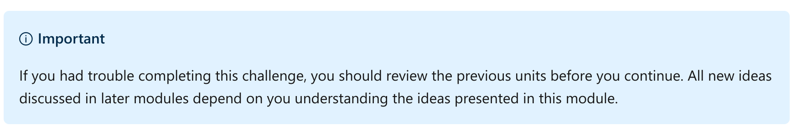
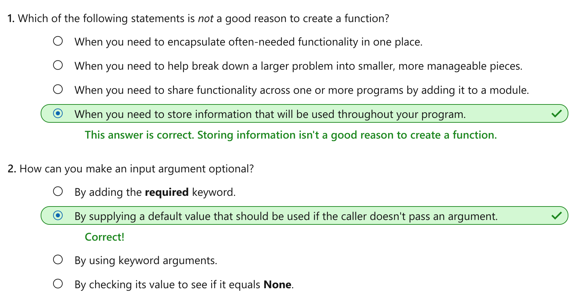

Create reusable functionality with functions in Python
================

This notebook is refer from the Microsoft resources: [Take your first steps with Python](https://docs.microsoft.com/en-us/learn/paths/python-first-steps/).

### Module 10: Create reusable functionality with functions in Python

Define functions to create encapsulated modular code that accept input and return results.

### Topic 1: Introduction

Large programs can require hundreds, thousands, or even millions of lines of code.

After your program grows to about 50 lines of code, you'll need a better way to organize it.

Assume you write or paste the same code in multiple places throughout your program. What if that repeated code needs to change because of either faulty logic or changed requirements? You'd need to search through your entire program and make changes in multiple places.

Functions can lessen your pain. They're one of the first building blocks you'll learn to help you build and maintain larger programs.

In this module, you'll build functions that accept input arguments and return values. You'll learn advanced techniques to build functions that can accept many different input types. And finally, you'll build modules that host functions that you can import into your programs.

By the end of this module, you'll be able to create functions and modules to help manage your code as you build larger programs.

#### 1.1 Learning objectives

In this module, you'll:

-   Define functions that encapsulate functionality.

-   Add input parameters to functions so that they can be called using input arguments.

-   Return values from functions.

-   Create modules to host functions that can be imported into other code files.

#### 1.2 Prerequisites

-   A local Python development environment set up to run Python 3 using a code editor like Visual Studio Code

-   Knowledge of how to run a code script using either a command line or your local Python development environment

-   Basic Python knowledge that includes an understanding of types, variables, value assignment, function calls, passing arguments, and module import

### Topic 2: Exercise - Define a function

**A function is a block of code with a name**. Since it has a name, your program can call it from another location in your code. The execution path flows into that block of code. After the function execution is complete, the execution path returns to the line of code that called the function and continues.

Functions provide a basic building block for creating modular code. Such code is more easily reused across your entire program. As you'll learn later, you can separate functions into modules for greater portability and use in other programs.

#### 2.1 When should I use a function?

When you're just starting a new program, you'll likely write all your code in a single script file. Everyone has written code this way. But after your code grows to 50 lines or more, it becomes difficult to understand and change.

Python functions help lessen some of those challenges.

First, use functions to keep your program understandable. Each function should contain a single task or responsibility in your program. Ideally, each function is short. Some developers suggest a function should be about six lines of code. If the number of lines grows larger, perhaps the function is taking on too much responsibility. Keeping functions short and focused helps you and others understand your code more quickly.

Second, use functions to keep your program manageable. If you need to update some functionality of your program, you find the functions that implement that functionality and update them. Using a good name for each function helps you quickly find the functionality you need among thousands of lines of code.

Third, use functions to keep your program more easily written. To compose an entire app, have that app call functions as needed from a main function in your app's logic. (A main function is sometimes called a controller or manager.) Such design helps you understand the flow of the app's execution path and helps you update your program or add new functionality.

Fourth, use functions to keep parts of your program reusable.

-   If you're rewriting a passage of code multiple times in a program, you might want to extract that code into a function. Your program would then call the function from everywhere you need it.

-   If the code has a problem or needs some other change, you can update it in one spot rather than search for it everywhere.

-   If you're copying and pasting code, you might consider that you have an opportunity to create a function. So when should you use functions? Anytime you begin to build a nontrivial program. Functions help you encapsulate functionality in one place, compose your program, update your code, and add new features.

#### 2.2 What you'll build in this exercise

In this exercise, you'll learn how to create and call functions, return values from functions, and supply arguments as input parameters to functions.

#### Step 1 - Create a new working folder and Python code file

Using the techniques you learned in previous modules, create a new folder named python-functions for your work in this module. Inside that folder, create a new file named *exercise1.py* for this exercise.

When you're ready to run your code, you can use the integrated Python tools for Visual Studio Code by selecting the green arrow. Or you can use a command in the integrated terminal with techniques you learned in previous modules.

#### Step 2 - Add code to the code file to create and call a small function

Add the following code to your new code file. The code defines the simple function say\_hello() then calls the function.

Python:

    def say_hello():
      print('Hello World!')

    say_hello()

Here you created your first function. The function has five parts:

-   The `def` keyword.

-   A function name. It should follow the same naming rules you use for variables.

-   A pair of parentheses symbols (`()`). Input parameters are defined within these parentheses.

-   A colon symbol (`:`) to end the function's signature.

-   A code block below the signature. This block is the body of the function. It runs when the function is called.

Below the function's code block, the function is called by using its name `say_hello` and the method invocation operator (`()`).

When you run the code, you should see the following output:

Output:

    Hello World!

The other critical part of defining and calling functions is the location of the function definition and the function call. The definition must appear before the call. The following code is trouble because it tries to call the function before defining it:

Python:

    say_hello()

    def say_hello():
      print('Hello World!')

If you ran the code, you'd see the following error:

Output:

    NameError: name 'say_hello' is not defined

#### Step 3 - Update the code from the previous step and add code to accept an input parameter

Next, create a new version of your function that's a bit more useful. Change the code from the previous step into the following code listing:

Python:

    def say_hello(name):
      print(f'Hello {name}!')

    say_hello('Bob')

This version of the function is more useful because it lets the caller specify who to say "Hello" to. To specify a name, the caller passes it as an argument to the `say_hello()` function.

Define the `say_hello()` function as you did before. But between the parentheses (`()`), specify the input parameter `name`. This parameter lets the caller pass an argument to the function. The function then uses that value in its body via the variable `name`.

When called, the function receives the string `'Bob'` that was passed as an argument to the `say_hello()` function.

When you run the code, you should see the following output:

    Hello Bob!

#### Step 4 - Modify the function call to leave out the argument

Because of how you defined your function, an argument is required.

Update the code by removing the string that is passed as an argument. The call should now match the following code listing:

Python:

    say_hello()

When you run the code, you should see the following output:

Output:

    TypeError: say_hello() missing 1 required positional argument: 'name'

When you define an input parameter as part of your function, an argument is required. You can make the argument optional by supplying a default value that is used if the caller doesn't pass an argument.

Update the code example again. This time, change the input parameter definition to set a default value, and then add a call to `say_hello()`. The code calls the function both with and without an input parameter. Your code should match the following listing:

Python:

    def say_hello(name='World'):
      print(f'Hello {name}!')

    say_hello()
    say_hello('Bob')

The first call to `say_hello()` uses the default value of the input parameter, while the second call supplies its own value.

When you run the code, you should see the following output:

Output:

    Hello World!
    Hello Bob!

#### Step 5 - Update the code example to include a second optional input parameter

Function definitions can have multiple input parameters. To define them, separate each pair of parameters with a comma symbol (`,`).

You can also use the value **None** when defining the default value for an input parameter. This use lets a function check for the value **None** in its body and print an appropriate message.

Update the exercise code to match the following code listing:

Python:

    def say_hello(name='World', greeting=None):
      if greeting == None:
        print(f'Hello {name}!')
      else:
        print(f'{greeting} {name}!')

    say_hello()
    say_hello('Bob')
    say_hello(greeting='Howdy')
    say_hello('Bob', 'Howdy')

When you run the code, you should see the following output:

Output:

    Hello World!
    Hello Bob!
    Howdy World!
    Howdy Bob!

Here you added the `greeting` input parameter and set its default value to `None`. This value is a special keyword that represents the **NoneType** object.

Run this line of code:

Python:

    print(type(None))

You should see the following output:

Output:

    <class 'NoneType'>

**None** represents an unknown or indeterminate value. It's not the same as an empty string, the Boolean value **False**, the number zero, or any other value. The value just isn't there. In this case, **None** is the perfect way to represent a value that doesn't exist so that your function can test for it.

In this step, you added two new calls to `say_hello`:

Python:

    say_hello(greeting='Howdy')
    say_hello('Bob', 'Howdy')

The first new call skips over name and relies on its default value. The call also specifies the parameter name greeting and sets its value with the assignment operator (=).

The second new call passes both arguments into the function.

As you can see, there are many variations available to create and use input parameters in your functions.

#### Step 6 - Comment out the code from the previous steps and add a new function that returns a value

Now that you've learned about defining input parameters, create a function that returns a single value by using the **return** keyword.

Comment out the code from the previous steps and add the following code:

Python:

    def add_two_numbers(x, y):
        return x + y

    add_two_numbers(4, 6)
    result = add_two_numbers(5, 7)
    print(result)

When you run the code, you should see the following output:

Output:

    12

Here you created the new function `add_two_numbers()` that accepts two input parameters. It then does an addition operation on those parameters in the function body and returns the sum.

When writing a function call, you can ignore the returned value. (Although in this case, that doesn't seem useful.) Or you can assign it to a variable you'd use just like any other variable in your program.

#### Step 7 - Comment out the code from the previous steps and add a new function that returns a list

While you can return only a single value from a function, that value can be a list that contains multiple other values.

Comment out the code from the previous step and add the following code listing:

Python:

    def create_deck():
      suits = ["Hearts", "Spades", "Clubs", "Diamonds"]
      ranks = ["2", "3", "4", "5", "6", "7", "8", "9", "10", "Jack", "Queen", "King", "Ace"]
      deck = []

      for  suit in suits:
        for rank in ranks:
          deck.append(f'{rank} of {suit}')

      return deck

    my_deck = create_deck()
    print(len(my_deck))

You might recognize this code from an earlier module. This code generates 52 cards by combining every suit and rank from a typical deck of cards. As the function generates each combination, it appends the string to an empty list named `deck`. The function returns that list.

When you run the code, you should see the following output:

Output:

    52

#### Step 8 - Comment out the code from the previous steps and add a new function that demonstrates variable scope in a function

Scope is a value's accessibility inside and outside a code structure like a function's code block. This step of the exercise will help you understand the scope of variables declared both inside and outside a function.

Comment out the code from the previous step and add the following code listing:

Python:

    def some_function():
        value = 10

    print(value)

This first version of your code defines a variable named `value` but doesn't return `value`. Instead, you just want to see if your code can access `value` outside the function's code block.

When you run the code, you should see the following output:

Output:

    NameError: name 'value' is not defined

Your code can't access `value` outside the code block in which it was declared and initialized. The variable is hidden and unavailable outside the code block.

What if your code defines a variable of the same name outside the function's code block and then attempts to use or return it from inside the code block?

Update the exercise code to match the following code listing:

Python:

    value = 1

    def some_function():
        value = 10
        return value

    print(value)

Here your code sets `value` to `1`. Inside `some_function()`, the code uses the same variable name and sets the value to `10`. You can even try to have the function return the new `value` variable. But what happens when the code prints value?

When you run the code, you should see the following output:

Output:

    1

You might think this output makes sense. Because the code never ran `some_function()`, the function's body never had a chance to run.

Continue the experiment. Have the code actually call `some_function()` and see if that changes `value`. Update the exercise code to match the following code listing:

Python:

    value = 1

    def some_function():
        value = 10
        return value

    print(value)
    some_function()
    print(value)

Now the code prints value before and after it calls `some_function()`.

When you run the code, you should see the following output:

Output:

    1
    1

The moral of the story: **variables defined outside a function don't affect variables defined inside a function** unless your code returns the inside value and then uses it. The scope of a function's variables is sealed off and hidden from code outside the function and the other way around.

#### 2.3 Recap

In this exercise, you learned about functions.

-   A function is a code block with a name. You can define your own functions and use them as units of modularity and reusability. Think of a function as having a single responsibility. If a function starts doing more than one job, perhaps you should split the function.

-   The **def** keyword defines a function. Create a name for the function using the same naming rules that you learned for variables. Use parentheses to define input parameters.

-   A function has zero or more input parameters. Separate input parameters with commas. A parameter is required unless you provide an optional default value.

-   The **None** keyword indicates that a variable has an indeterminate or unknowable value.

-   Scope is the visibility of a value inside and outside a function's code block. Functions have their own scope that is private and hidden from code outside those functions.

### Topic 3: Exercise - Add arbitrary argument lists and keyword arguments to functions

In the previous unit, you got your first chance to create your own functions. You created functions with multiple input parameters and input parameters with default values.

You have additional options for input parameters. These options include arbitrary arguments lists and keyword (or named) arguments.

#### Step 1 - Add a new file for this exercise to your working directory

This unit assumes you're continuing from the previous unit. Use the techniques you learned in previous modules to add a new code file in the folder dedicated to this module. Name the new file *exercise2.py*.

#### Step 2 - Add code that creates a function accepting an arbitrary arguments list

Add the following code to your new code file:

Python:

    def print_args(*args):
      for arg in args:
        print(f'arg = {arg}')

    print_args('a')
    print_args('a', 'b')
    print_args('a', 'b', 'c')

Here you create the `print_args()` function that accepts an arbitrary arguments list as defined by the `*args` input parameter. A caller of this function can pass any number of arguments into the function. The function then uses the `args` variable to access all the arguments. That variable stores a collection of the arguments that the function can iterate through.

After the function definition, the code calls `print_args()` three times, passing in a different value each time.

When you run the code, you should see the following output:

Output:

    arg = a
    arg = a
    arg = b
    arg = a
    arg = b
    arg = c

Use arbitrary arguments lists in functions when you don't know how many arguments callers will pass but want the functions to handle whatever is passed. Your code will likely need to iterate through each item in `args` and sum, concatenate, or do some other aggregate operation on those items.

But what is the data type of `args`? Comment out the iteration statement and add `print` statements that display the content and data type of `args`.

Python:

    def print_args(*args):
      #for arg in args:
      #  print(f'arg = {arg}')
      print(args)
      print(type(args))

    print_args('a')
    print_args('a', 'b')
    print_args('a', 'b', 'c')

When you run the code, you should see the following output:

Output:

    ('a',)
    <class 'tuple'>
    ('a', 'b')
    <class 'tuple'>
    ('a', 'b', 'c')
    <class 'tuple'>

An arbitrary arguments list isn't of type **list** but rather is of type **tuple**.

What is a tuple? In short, it's just like a list with a few differences. **The most notable difference is that you can't modify the contents of a tuple**. In the current code sample, the function can't call **append()** or **remove()**, call **sort()** or **reverse()**, or assign a new value to an element.

For example, your code can't do this assignment:

Python:

    args[0] = 'z'

Such code produces this error:

Output:

    TypeError: 'tuple' object does not support item assignment

#### Step 3 - Comment out the code from the previous step and add code that accepts keyword arguments

Keyword arguments, which are also known as named arguments, are similar to arbitrary arguments lists. Callers can pass any number of keyword arguments. Each argument must specify its name along with its value.

Comment out the code from the previous step and add the following code listing:

Python:

    def print_keyword_args(**kwargs):

      third = kwargs.get('third', None)
      if third != None:
        print('third arg =', third)

    print_keyword_args(first='a')
    print_keyword_args(first='b', second='c')
    print_keyword_args(first='d', second='e', third='f')

In this case, the code calls the `print_keyword_args()` function three times. Each time, it passes in one or more keyword arguments like `first='a'`. The function body can access a specific existing argument by using the `kwargs.get()` method.

Each call to `kwargs.get()` passes in a name and a default value. In the current example, the function looks for a keyword named `'third'`. If `'third'` doesn't exist in `kwargs`, the variable `third` is set to the default value `None`.

When you run the code, you should see the following output:

Output:

    third arg = f

This approach provides a flexible way for a caller to pass in arguments. The downside is that you must rely on a function's documentation or source code to understand what that function expects. If you didn't already know that you could (or should) pass an argument called `third`, you might never understand how to use the function correctly.

#### Step 4 - Update the code example to iterate through each keyword and value

Next, you'll learn how to iterate through each keyword and value in `kwargs`.

Update the exercise code to match the following code listing:

Python:

    def print_keyword_args(**kwargs):

      print('\n')

      for key, value in kwargs.items():
        print(f'{key} = {value}')

      third = kwargs.get('third', None)
      if third != None:
        print('third arg =', third)

    print_keyword_args(first='a')
    print_keyword_args(first='b', second='c')
    print_keyword_args(first='d', second='e', third='f')

You added a `for` statement to iterate through the collection. If you're familiar with using a `for` statement to iterate through a **list** object, you might wonder how this code works:

Python:

    for key, value in kwargs.items():

In this case, you're working with not a **list** object but rather a **dict** object or **dictionary**. A dictionary is like a list, except **each item has two parts**: a name (or key) and a value. You'll learn more about dictionaries in another module. In your code example, `key` is set to an argument's keyword, and `value` is set to that argument's value.

When you run the code, you should see the following output:

Output:

    first = a 

    first = b 
    second = c

    first = d
    second = e
    third = f
    third arg = f

#### Step 5 - Update the code example to print the value of kwargs and its data type

To see the data type of kwargs, update the exercise code to match the following code listing:

Python:

    def print_keyword_args(**kwargs):

      print('\n')
      print(kwargs)
      print(type(kwargs))

      for key, value in kwargs.items():
        print(f'{key} = {value}')

      third = kwargs.get('third', None)
      if third != None:
        print('third arg =', third)

    print_keyword_args(first='a')
    print_keyword_args(first='b', second='c')
    print_keyword_args(first='d', second='e', third='f')

When you run the code, you should see the following output:

Output:

    {'first': 'a'}
    <class 'dict'>
    first = a

    {'first': 'b', 'second': 'c'}
    <class 'dict'>
    first = b
    second = c

    {'first': 'd', 'second': 'e', 'third': 'f'}
    <class 'dict'>
    first = d
    second = e
    third = f
    third arg = f

The dictionary is defined using braces symbols (`{}`). Each item in the dictionary follows the format `'<name>': '<value>'`. You also see that the data type of `kwargs` is `dict`.

#### Recap

In this exercise, you learned a few ways to make your functions more flexible.

-   You can define functions that use arbitrary arguments lists. A list lets a caller pass in any number of arguments. In the previous examples, the `args` input parameter manages the entries as **tuple** values.

-   You can define functions that use keyword or named arguments. A caller can pass in any number of named arguments. In the previous examples, the `kwargs` input parameter manages the entries as **dict** values.

### Topic 4: Exercise - Define a module

Now that you now know how to create functions, create your own module to hold one or more functions.

You learned about Python modules in a previous Microsoft Learn module. A Python module is just a code file containing files, constants, or services. You can split a program into multiple code files to increase code modularity and reuse across the entire program. Modules even let multiple programs share the same code.

This exercise uses a module to separate code you might use in multiple apps. The module separates code that implements your card deck from code that uses the card deck.

#### Step 1 - Create a new file in the working folder for this exercise

This unit assumes you're continuing from the previous unit. Use the techniques you learned in previous modules to add a new code file in the folder dedicated to this module. Name the new file *exercise3.py*.

#### Step 2 - Create another new file in the working folder for a new module named deck

In the same working folder as the *exercise3.py* file, create another file called *deck.py*.

#### Step 3 - Add code to create a deck of cards in the new deck module

Add the following code to the *deck.py* file. This code is similar to what you created in the module where you learned about lists. The `create_deck()` function returns a list called `deck`. The list contains 52 strings that represent every combination of suit and rank in a standard deck of cards.

Python:

    def create_deck():
      suits = ["Hearts", "Spades", "Clubs", "Diamonds"]
      ranks = ["2", "3", "4", "5", "6", "7", "8", "9", "10", "Jack", "Queen", "King", "Ace"]
      deck = []

      for  suit in suits:
        for rank in ranks:
          deck.append(f'{rank} of {suit}')

      return deck

#### Step 4 - Add code to the exercise3 code file that calls the `create_deck()` method of the `deck` module

In the exercise3.py file, add the following code.

Python:

    import deck

    cards = deck.create_deck()

    for card in cards:
      print(card)

This code consumes the deck module and its functionality.

The first line of code imports the `deck` module. The second line of code calls the `create_deck()` function of the `deck` module.

When you run the code, it should print the list of cards.

#### Recap

In this exercise, you learned how to create your own modules.

-   Create a module to separate out reusable code in a modular way. A Python module is a code file. By placing functions in a module, you make that code usable from other code files both inside and outside your programs.

-   Use the **import** statement to access a module's functions.

### Topic 5: Challenge - Fill in the missing functions

Code challenges throughout these modules reinforce what you learned and help you gain some confidence before continuing.

In this challenge, you'll create a new module containing functions that let the provided code work as expected.

#### Step 1 - Create a new code file for this challenge

Use the techniques you learned in previous modules to add a new code file in the current folder dedicated to this module. Name the file *challenge.py*.

#### Step 2 - Copy the starter code into the new file

Copy the following code into the new *challenge.py* file:

Python:

    import processor

    my_list = [5, 'Dan', '4', 7, 'Steve', 'Amy', 'Rhonda', 4, '9', 'Jill', 7, 'Kim']
    my_bad_list = 5

    numbers = processor.process_numbers(my_list)
    print(numbers)

    names = processor.process_names(my_list)
    print(names)

    numbers = processor.process_numbers(my_bad_list)
    print(numbers)

    names = processor.process_names(my_bad_list)
    print(names)

#### Step 3 - Make sure you follow the rules of the challenge

Rule 1: You can't modify the code in the challenge.py file at all. Instead, create a new module named processor.py in the same working folder.

Rule 2: After you finish, running the challenge.py file must produce the following output:

Output:

    [4, 4, 5, 7, 7, 9]
    ['Amy', 'Dan', 'Jill', 'Kim', 'Rhonda', 'Steve']
    []
    []

Rule 3: The `process_numbers()` function must select all numeric values, even those values that are strings, and return them as a list. The values must be converted to numbers and included in the returned list. The list must be sorted. The function must handle the possibility that the input parameter isn't formatted as a list. In that case, it must return an empty list.

Rule 4: The `process_names()` function must select all string values that aren't numeric and return them as a list. The list must be sorted. The function must handle the possibility that the input parameter isn't formatted as a list. In that case, it must return an empty list.

Whether you get stuck and need to peek at the solution or you finish successfully, continue on to view a solution to this challenge.

### Topic 6: Solutions - Fill in the missing functions

The following code is one possible solution for the challenge from the previous unit.

First, create a new code file named *processor.py* in the same working directory.

Then create the following two functions in that file:

Python:

    def process_numbers(unprocessed_list):
        
        processed_list = []
        if isinstance(unprocessed_list, list) == False:
            return processed_list
        
        for item in unprocessed_list:
            if isinstance(item, int):
                processed_list.append(item)
            elif isinstance(item, str):
                if item.isnumeric():
                    converted_item = int(item)
                    processed_list.append(converted_item)
        
        processed_list.sort()
        return processed_list

    def process_names(unprocessed_list):
        
        processed_list = []

        if isinstance(unprocessed_list, list) == False:
            return processed_list
        
        for item in unprocessed_list:
            if isinstance(item, str):
                if item.isnumeric() == False:
                    processed_list.append(item)
        
        processed_list.sort()
        return processed_list

Now when you run the code in your *challenge.py* file, you should get the correct output.

This code is merely one possible solution because we didn't specify details about the implementation of the functions in the `processor` module. As long as the `process_numbers()` and `process_names()` functions fulfill the requirements in the previous unit, you're successful.

If you're successful, congratulations! Continue to the knowledge check in the next unit.

### Topic 7: Knowledge check

### Topic 8: Summary

Our goal was for you to use functions that help you write and manage hundreds or thousands of lines of code when you work on large programs.

In this module, you:

-   Defined Python functions to encapsulate functionality into named code blocks.

-   Added input parameters to your functions for increased flexibility.

-   Assigned default values to input parameters and learned how to tell whether the input parameters have a value by comparing them to **None**.

-   Defined functions that accept a variable number of input parameters, both unnamed and named.

-   Defined functions that return a result after the code logic processes the input.

-   Added functions to modules and imported modules into your code.

Without functions and modules, it would be impossible to build larger, more interesting programs.
