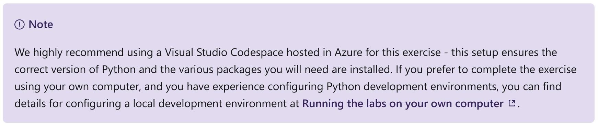

Explore and analyze data with Python
================

This notebook is refer from the Microsoft resources: [Create machine learning models](\https://docs.microsoft.com/en-gb/learn/paths/create-machine-learn-models/).

### Trophy 2: Create machine learning models

Machine learning is the foundation for predictive modeling and artificial intelligence. Learn the core principles of machine learning and how to use common tools and frameworks to train, evaluate, and use machine learning models.

### Module 1: Explore and analyze data with Python

Data exploration and analysis is at the core of data science. Data scientists require skills in languages like Python to explore, visualize, and manipulate data.

### Topic 1: Introduction

Unsurprisingly, the role of a data scientist primarily involves exploring and analyzing data. The results of this analysis might form the basis of a report or a machine learning model; but it all begins with data.

Usually, a data analysis project is designed to establish insights around a particular scenario or to test a hypothesis. For example, suppose a university professor collects data from data science students, including the number of lectures attended, the hours spent studying, and the final grade achieved on the end of term exam. The professor could then take a sample of the data and analyze it to determine if there is a relationship between the amount of study a student undertakes and the final grade they achieve. They might use the data to test a hypothesis that only students who study for a minimum number of hours can expect to achieve a passing grade; or even prepare the data to train a machine learning model that predicts a student's grade based on their study habits.

### Topic 2: Exercise - Explore data

Data exploration and analysis is typically an *iterative* process, in which the data scientist takes a sample of data, and performs the following kinds of task to analyze it and test hypotheses:

-   Clean data to handle errors, missing values, and other issues.

-   Apply statistical techniques to better understand the data, and how the sample might be expected to represent the real-world population of data, allowing for random variation.

-   Visualize data to determine relationships between variables, and in the case of a machine learning project, identify *features* that are potentially predictive of the *label*.

-   Derive new features from existing ones that might better encapsulate relationships within the data.

-   Revise the hypothesis and repeat the process.

Data scientists can use a variety of tools and techniques to explore, visualize, and manipulate data. One of the most common ways in which data scientists work with data is to use the Python language and some specific packages for data processing.

#### 2.1 Try for yourself

The best way to learn about exploring and preparing data is to try it for yourself, so that's what you'll do in this exercise. To complete the exercise, you'll need:

-   A Microsoft Azure subscription.

-   A Visual Studio Codespace based on the **MicrosoftDocs/ml-basics** GitHub repository.

If you don't already have an Azure subscription, you can sign up for a free trial at <https://azure.microsoft.com/free/> .

If you have not already created a Codespace based on the **MicrosoftDocs/ml-basics** repository, complete the following steps to do so:

1.  Open [Visual Studio Codespaces](https://online.visualstudio.com/environments/new?name=ml-basics&repo=MicrosoftDocs%2Fml-basics) in a new browser tab; and if prompted, sign in using the Microsoft account associated with your Azure subscription.

2.  Create a Codespace with the following settings (if you don't already have a Visual Studio Codespaces billing plan, you'll be prompted to create one):

    -   **Codespace Name**: A name for your Codespace - for example, ml-basics.

    -   **Git Repository**: MicrosoftDocs/ml-basics

    -   **Instance Type**: Standard (Linux) 4 cores, 8GB RAM

    -   **Suspend idle Codespace after**: 30 minutes

3.  Wait for the Codespace to be created. This will take around 3 minutes. You'll see the following things happen:

    -   A script will initialize and configure your Codespace.

    -   A list of notebook (.ipynb) files will appear in the pane on the left.

4.  After preparation is complete, you can close the **Welcome** pane, and any others that have opened during setup. You can also change the color scheme to suit your preference - just click the ⚙ icon at the bottom left and select a new Color Theme. A light color theme may make it easier to read the Python code in the notebooks.

5.  After you've created the environment, open the **Data Exploration.ipynb** notebook and follow the instructions it contains. If a page welcoming you to the Python extension is displayed, close it.

When you've finished working through the notebook, return to this module and move on to the next unit to check your knowledge.

### Topic 3: Knowledge check

### Topic 4: Summary

In this module, you learned how to use Python to explore, visualize, and manipulate data. Data exploration is at the core of data science, and is a key element in data analysis and machine learning.

In the hands-on exercise in this module, you used Python in Visual Studio Code. Visual Studio Code has comprehensive support for the Python language and utilities, such as Jupyter Notebooks. For more information about using Python on Visual Studio Code, see the [Visual Studio Code documentation](https://code.visualstudio.com/docs/languages/python).
