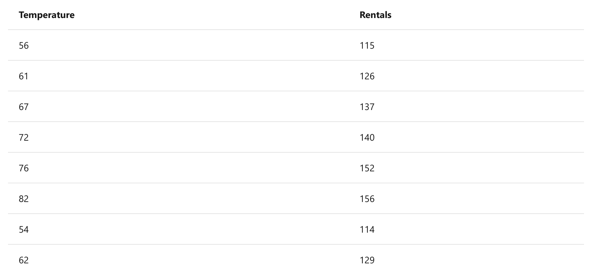
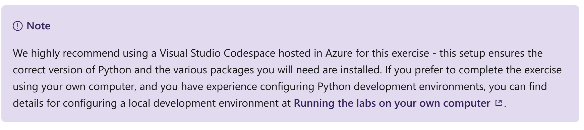
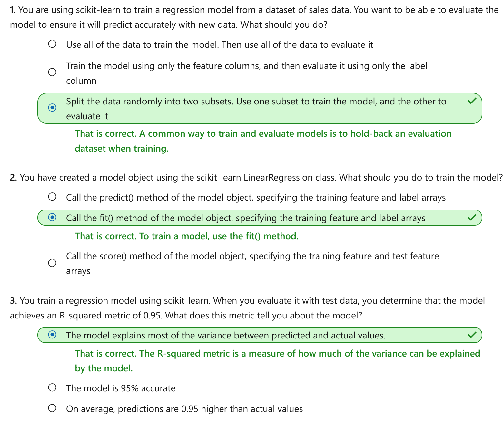

Train and evaluate regression models
================

This notebook is refer from the Microsoft resources: [Create machine learning models](\https://docs.microsoft.com/en-gb/learn/paths/create-machine-learn-models/).

### Module 1: Train and evaluate regression models

Regression is a commonly used kind of machine learning for predicting numeric values.

### Topic 1: Introduction

*Regression* is a form of machine learning in which the goal is to create a model that can predict a numeric, quantifiable value; such as a price, amount, size, or other scalar number.

For example, a company that rents bicycles might want to predict the expected number of rentals in a given day, based on the season, day of the week, weather conditions, and so on.

#### 1.1 Training and evaluating a regression model

Regression works by establishing a relationship between variables in the data that represent characteristics (known as the features) of the thing being observed, and the variable we're trying to predict (known as the label). In this case, we're observing information about days, so the features include things like the day of the week, month, temperature, rainfall, and so on; and the label is the number of bicycle rentals.

To train the model, we start with a data sample containing the features as well as known values for the label - so in this case we need historic data that includes dates, weather conditions, and the number of bicycle rentals. We'll then split this data sample into two subsets:

-   A training dataset to which we'll apply an algorithm that determines a function encapsulating the relationship between the feature values and the known label values.

-   A validation or test dataset that we can use to evaluate the model by using it to generate predictions for the label and comparing them to the actual known label values.

The use of historic data with known label values to train a model makes regression an example of supervised machine learning.

#### 1.2 A simple example

Let's take a simple example to see how the training and evaluation process works in principle. Suppose we simplify the scenario so that we use a single feature, average daily temperature, to predict the bicycle rentals label.

We start with some data that includes known values for the average daily temperature feature and the bicycle rentals label.

Now we'll take the first five of these observations and use them to train a regression model. Our goal is to find a function (let's call it f) that we can apply to the temperature feature (which we'll call x) to calculate the rentals label (which we'll call y). In other words, we need to define the following function: f(x) = y.

Let's start by plotting the training values for x and y on a chart:

Now we need to fit these values to a function, allowing for some random variation. You can probably see that the plotted points form an almost straight diagonal line - in other words, there's an apparent linear relationship between x and y, so we need to find a linear function that's the best fit for the data sample. There are various algorithms we can use to determine this function, which will ultimately find a straight line with minimal overall variance from the plotted points; like this:

The line represents a linear function that can be used with any value of x to apply the slope of the line and its intercept (where the line crosses the y axis when x is 0) to calculate y. In this case, if we extended the line to the left we'd find that when x is 0, y is around 20, and the slope of the line is such that for each unit of x you move along to the right, y increases by around 1.7. Our f function therefore can be calculated as 20 + 1.7x.

Now that we've defined our predictive function, we can use it to predict labels for the validation data we held back and compare the predicted values (which we typically indicate with the symbol ŷ, or "y-hat") with the actual known y values.

The plotted points that are on the function line are the predicted ŷ values calculated by the function, and the other plotted points are the actual y values. There are various ways we can measure the variance between the predicted and actual values, and we can use these metrics to evaluate how well the model predicts.

### Topic 2: Exercise - Train and evaluate a regression model

Calculating a regression line for a simple binomial (two-variable) function from first principles is possible, but involves some mathematical effort. When you consider a real-world dataset in which x is not a single feature value such as temperature, but a vector of multiple variables such as temperature, day of week, month, rainfall, and so on; the calculations become more complex.

For this reason, data scientists generally use specialized machine learning frameworks to perform model training and evaluation. Such frameworks encapsulate common algorithms and provide useful functions for preparing data, fitting data to a model, and calculating model evaluation metrics.

#### 2.1 Try for yourself

One of the most commonly used machine learning frameworks for Python is scikit-learn, and in this hands-on exercise, you'll use scikit-learn to train and evaluate a regression model. To complete the exercise, you'll need:

-   A Microsoft Azure subscription.

-   A Visual Studio Codespace based on the MicrosoftDocs/ml-basics GitHub repository.

If you don't already have an Azure subscription, you can sign up for a free trial at <https://azure.microsoft.com/free/>.

If you have not already created a Codespace based on the MicrosoftDocs/ml-basics repository, complete the following steps to do so:

1.  Open [Visual Studio Codespaces](https://online.visualstudio.com/environments/new?name=ml-basics&repo=MicrosoftDocs%2Fml-basics) in a new browser tab; and if prompted, sign in using the Microsoft account associated with your Azure subscription.

2.  Create a Codespace with the following settings (if you don't already have a Visual Studio Codespaces billing plan, you'll be prompted to create one):

    -   Codespace Name: A name for your Codespace - for example, ml-basics.

    -   Git Repository: MicrosoftDocs/ml-basics

    -   Instance Type: Standard (Linux) 4 cores, 8GB RAM

    -   Suspend idle Codespace after: 30 minutes

3.  Wait for the Codespace to be created. This will take around 3 minutes. You'll see the following things happen:

    -   A script will initialize and configure your Codespace.

    -   A list of notebook (.ipynb) files will appear in the pane on the left.

4.  After preparation is complete, you can close the Welcome pane, and any others that have opened during setup. You can also change the color scheme to suit your preference - just click the ⚙ icon at the bottom left and select a new Color Theme. A light color theme may make it easier to read the Python code in the notebooks.

After you've created the environment, open the Regression.ipynb notebook and follow the instructions it contains. If a page welcoming you to the Python extension is displayed, close it.

When you've finished working through the notebook, return to this module and move on to the next unit to check your knowledge.

### Topic 3: Knowledge check

### Topic 4: Summary

In this module, you learned how regression can be used to create a machine learning model that predicts numeric values. You then used the scikit-learn framework in Python to train and evaluate a regression model.

While scikit-learn is a popular framework for writing code to train regression models, you can also create machine learning solutions for regression using the graphical tools in Microsoft Azure Machine Learning. You can learn more about no-code development of regression models using Azure Machine Learning in the \[Create a Regression Model with [Azure Machine Learning designer](https://docs.microsoft.com/en-us/learn/modules/create-regression-model-azure-machine-learning-designer/) module.
