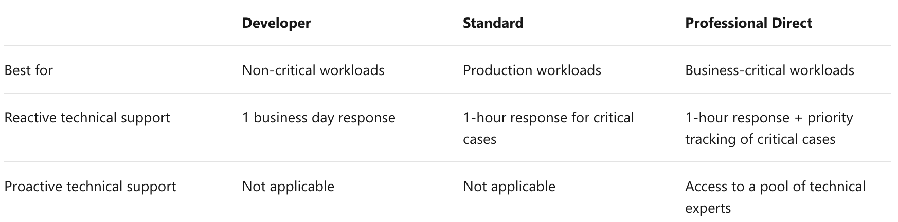
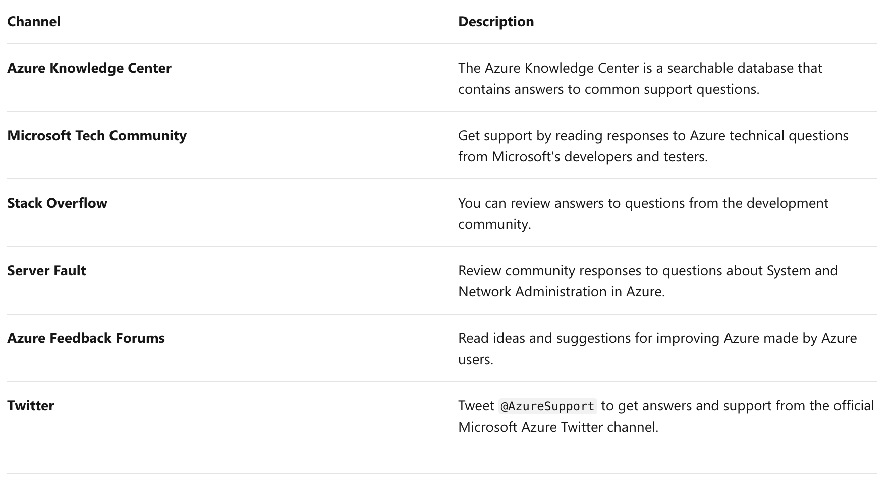
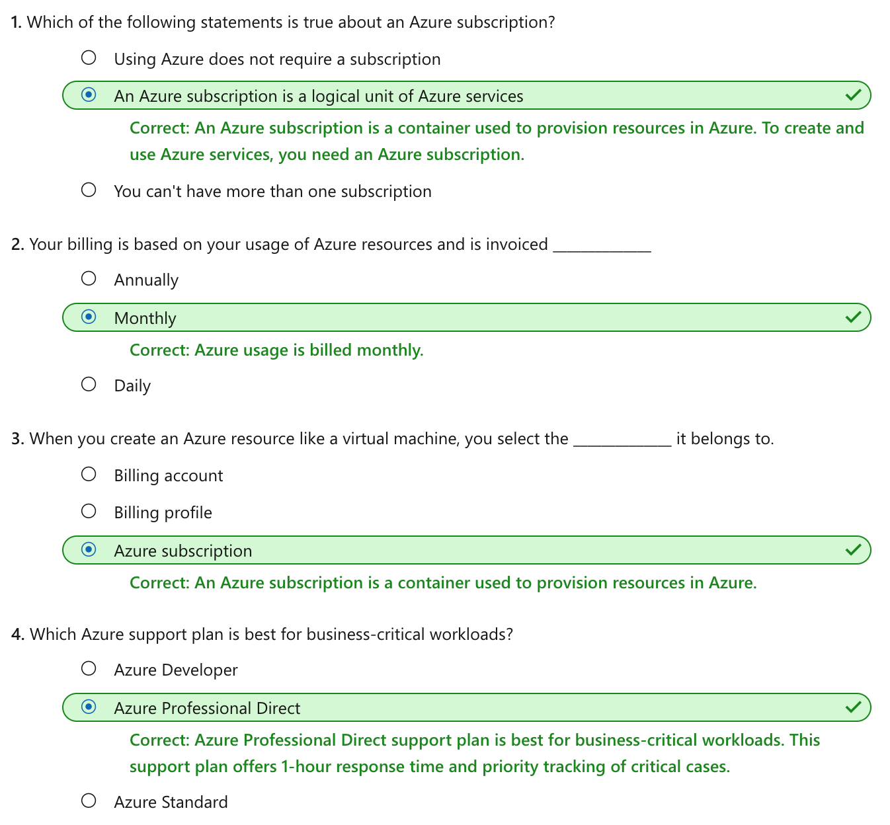

This notebook is refer from the Microsoft resources: [Azure fundamentals](https://docs.microsoft.com/en-gb/learn/paths/azure-fundamentals/).

The first step to using Azure is to sign up. You may sign up directly through Azure.com, with the help of a Microsoft representative, or through a partner. If you’re new to Azure, you may sign up for an Azure free account to start exploring with $200 USD free credit and free services.

### Topic 1: Introduction

To create and use Azure services, you need an Azure subscription. When you sign up, an Azure subscription is created for you. It allows you to build and deploy cloud-based applications, use sophisticated artificial intelligence services, and extract essential insights from your data.

#### 1.1 Learning objectives

In this module, you will:

- Learn about Azure sign-up options including Azure free account.

- Create an Azure free account.

- Understand how billing works in Azure.

- Learn about different support options.

#### 1.2 Prerequisites

- Knowledge of basic cloud computing terms and concepts

- A valid credit card to register for an Azure free account (optional)


### Topic 2: Create an Azure account

You can purchase Azure access directly from Microsoft by signing up on the Azure website or through a Microsoft representative. You can also purchase Azure access through a Microsoft partner. Cloud Solution Provider partners offer a range of complete managed cloud solutions for Azure.

If you're new to Azure, you can sign up for a free account on the Azure website to start exploring at no cost to you. Once you're ready, you can choose to upgrade and start paying for the Azure services you use above the free amounts.

#### 2.1 What is the Azure free account?

The Azure free account includes **free access** to popular Azure products for **12 months**, **$200 USD credit** to spend for the **first 30 days**, and access to more than 25 products that are always free. This is an excellent way for new users to get started and explore. To sign up, you need a phone number, a credit card, and a Microsoft or GitHub account. Credit card information is used for identity verification only. You won't be charged for any services until you upgrade.

#### 2.2 Azure purchasing options

With flexible purchasing options, you can choose the option that works best for you. Use one of the following three ways to buy Azure:

- Azure.com: Buying directly through Azure.com is the fastest and easiest way for organizations of all sizes to get started with Azure. You can manage your Azure deployments and usage yourself and get a monthly bill from Microsoft for the services used.

- Microsoft representative: Buying Azure through a Microsoft representative is intended for large organizations or customers who already work with one. You'll also manage your Azure deployments and usage yourself and get a monthly bill from Microsoft for the services used.

- Microsoft partner: If you buy Azure as a managed service through your partner, your partner will provide you with access to Azure, manage your billing, and provide support.


### Topic 3: Exercise - Create an Azure account

To create and use Azure services, you first need to sign up. If you’ve never tried or paid for Azure before, you can sign up for the Azure free account.

You'll need a valid credit card to create your Azure free account. This card is used for identity validation only. Your card won't be charged until you choose to upgrade.

#### 3.1 Sign up for a free account

1. In a web browser, go to https://azure.microsoft.com/free.

2. Scroll down through the page to learn more about the benefits and free services available.

3. Select **Start free**.

4. Sign in with your Microsoft or GitHub account or create a free Microsoft account.

5. On the **About you** page, select your correct country or region. Enter your first and last name, email address, and phone number. Depending on your country, you might see additional fields, such as a VAT number. Select Next to continue.

6. On the **Identity verification by phone** screen, select your country code, and type the number of a telephone to which you have immediate access.

7. You have the option of text or callback to obtain a verification code. Select the relevant button, type the code in the **Verification code** box, and select **Verify code**.

8. If the verification code is correct, you're asked to enter details of a valid credit card. Enter the card information and select **Next**.

9 The last step is to review the agreement and privacy statement then select **Sign up**.


### Topic 4: Understand Azure billing

With Azure, you only pay for what you use. You'll receive a monthly invoice with payment instructions provided. You may organize your invoice into line items that make sense to you and meet your **budget** and **cost tracking** needs. You also can get set up for multiple invoices. Let's take a look at how this works.

#### 4.1 Azure subscription

When you sign up, an Azure subscription is created by default. An Azure subscription is a logical container used to provision resources in Azure. It holds the details of all your resources like virtual machines (VMs), databases, and more. When you create an Azure resource like a VM, you identify the subscription it belongs to. As you use the VM, the usage of the VM is aggregated and billed monthly.

#### 4.2 Create additional Azure subscriptions

You might want to create additional subscriptions for resource or billing management purposes. For example, you might choose to create additional subscriptions to separate:

- **Environments**: When managing your resources, you can choose to create subscriptions to set up separate environments for development and testing, security, or to isolate data for compliance reasons. This is particularly useful because **resource access control** occurs at the subscription level.

- **Organizational structures**: You can create subscriptions to **reflect different organizational structures**. For example, you could limit a team to lower-cost resources, while allowing the IT department a full range. This design allows you to manage and control access to the resources that users provision within each subscription.

- **Billing**: You might want to also create additional subscriptions for billing purposes. Because costs are first aggregated at the subscription level, you might want to create subscriptions to manage and track costs based on your needs. For instance, you might want to create a subscription for your production workloads and another subscription for your development and testing workloads.

You might also need additional subscriptions due to:

- **Subscription limits**: Subscriptions are bound to some hard limitations. For example, **the maximum number of Express Route circuits per subscription is 10**. Those limits should be considered as you create subscriptions on your account. If there is a need to go over those limits in particular scenarios, then you might need additional subscriptions.

#### 4.3 Customize billing to meet your needs

If you have multiple subscriptions, you can organize them into invoice sections. Each invoice section is a line item on the invoice that shows the charges incurred that month. For example, you might need a single invoice for your organization but want to organize charges by department, team, or project.

Depending on your needs, you can set up multiple invoices within the same billing account. To do this, create additional billing profiles. Each billing profile has its own monthly invoice and payment method.

The following diagram shows an overview of how billing is structured. If you've previously signed up for Azure or if your organization has an Enterprise Agreement, your billing might be set up differently.


### Topic 5: Azure support options

If you have questions around Azure services or curious about its capabilities, we have a variety of resources to help you find answers to your questions. Let's look at these support resources.

#### 5.1 Azure free support resources

You have 24/7 access to the *online documentation*, *community support*, and *new Azure capabilities demo videos* on YouTube. Created by Azure engineers, these demo videos are available on *Azure Friday*, *Microsoft Mechanics*, and *Azure portal how-to videos playlists*. As an Azure customer, the following free support resources are available to you as well.

- *Billing and subscription* management support

- *Azure Quickstart Center*, a guided experience in the Azure portal available to anyone who wants to improve their knowledge of Azure

- *Azure Service Health* gives you insights on issues related to your Azure services

- *Azure Advisor* gives you personalized recommendations on how to optimize your cost and performance

#### 5.2 Azure support plans

Azure offers customers reactive and proactive technical support. Choose the support plan that best meet your needs. You can purchase the support plan on the Azure website or Azure portal. If you are working with a Microsoft representative or partner, you can purchase a support plan from them. Microsoft also provides support plans that cover Azure, Office 365 and Dynamics 365. Talk to your Microsoft representative or partner for more details.



#### 5.3 Azure community support

Ask questions, get answers, and connect with Microsoft engineers and community experts.




### Topic 6: Knowledge check




### Topic 7: Summary

We have covered several important topics in this module.

- You have learned about *Azure purchasing options* and the Azure free account.

- You have created an Azure free account and learned how to sign in using that account.

- You have seen how *billing*, *subscriptions*, and *support* are managed in Azure.


```{r echo=FALSE, eval=FALSE, message=FALSE}
rmarkdown::render(input = "F02_azure_account.Rmd", output_format = "github_document", output_file = "README.md")
```

