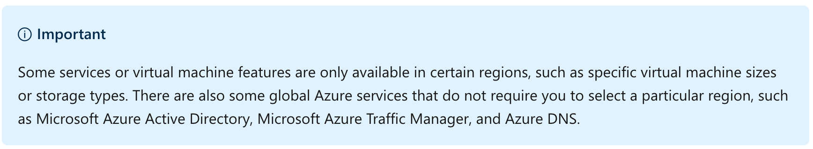
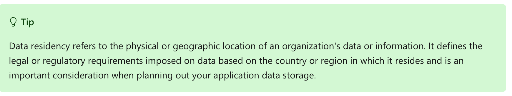
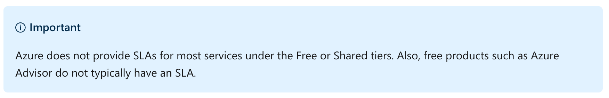
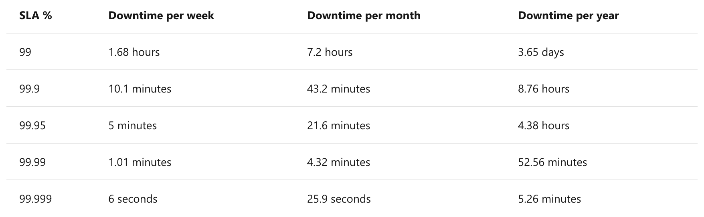
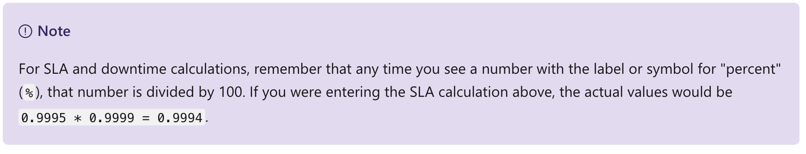
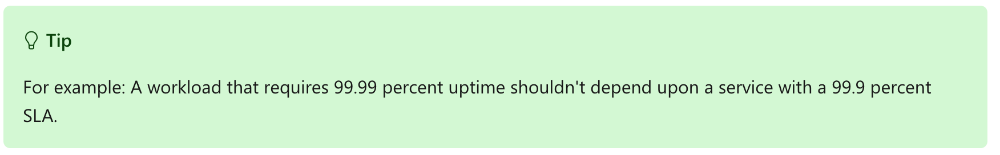
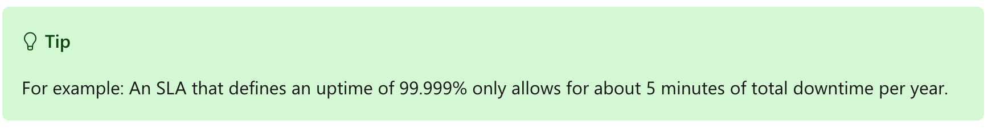
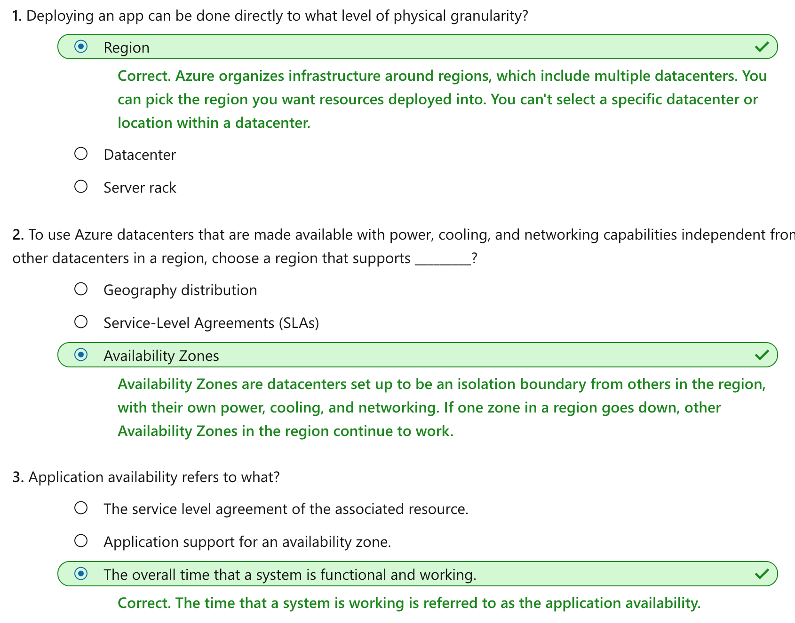

This notebook is refer from the Microsoft resources: [Azure fundamentals](https://docs.microsoft.com/en-gb/learn/paths/azure-fundamentals/).

Azure provides a global network of secure datacenters you can deploy your services into. Learn about the physical architecture of Azure, how redundancy is provided, and what service guarantees Microsoft provides.

### Topic 1: Introduction

You're a small business owner with a great set of web-based services that your clients love. The one difficulty you face is some clients are experiencing a network lag accessing your services from distant locations. This problem used to be expensive to solve - requiring new data centers and costly networks to connect them. The emergence of cloud computing has made the solution easy.

Microsoft Azure provides a reliable, redundant, energy-efficient infrastructure that spans more than 100 highly secure facilities worldwide, linked by one of the largest networks on earth. Azure allows you to gain **global reach** with **local presence**, keep your data secure and compliant with local laws, and have a reduced carbon footprint with Microsoft's environment-friendly datacenters.

#### 1.1 Learning objectives

In this module, you will:

- Explore the physical structure of Azure infrastructure

- Understand the service level agreements provided by Azure

- Learn how to provide service level agreements for your apps


### Topic 2: Understand Datacenters and Regions in Azure

Microsoft Azure is made up of datacenters located around the globe. When you leverage a service or create a resource such as a *SQL database* or *virtual machine*, you are using physical equipment in one or more of these locations.

The specific datacenters aren't exposed to end users directly; instead, Azure organizes them into regions.

#### 2.1 What is a region?

A **region** is a **geographical area on the planet** containing at least one, but potentially multiple datacenters that are nearby and networked together with a **low-latency network**. Azure intelligently assigns and controls the resources within each region to **ensure workloads are appropriately balanced**.

When you deploy a resource in Azure, you will often need to choose the region where you want your resource deployed.



A few examples of regions are West US, Canada Central, West Europe, Australia East, and Japan West. Here's a view of all the available regions as of February 2020:


#### 2.2 Why is this important?

Azure has more global regions than any other cloud provider. This gives you the flexibility to bring applications closer to your users no matter where they are. It also provides **better scalability**, **redundancy**, and **preserves data residency** for your services.

#### 2.3 Special Azure regions

Azure has specialized regions that you might want to use when building out your applications for compliance or legal purposes. These include:

- US DoD Central, US Gov Virginia, US Gov Iowa and more: These are physical and logical network-isolated instances of Azure for US government agencies and partners. These datacenters are operated by screened US persons and include additional compliance certifications.

- China East, China North and more: These regions are available through a unique partnership between Microsoft and 21Vianet, whereby Microsoft does not directly maintain the datacenters.

Regions are what you use to identify the location for your resources, but there are two other terms you should also be aware of: **geographies** and **availability zones**.


### Topic 3: Understand Geographies in Azure

Azure divides the world into geographies that are defined by geopolitical boundaries or country borders. An Azure geography is a discrete market typically containing two or more regions that preserve data residency and compliance boundaries. This division has several benefits.

- Geographies allow customers with **specific** data residency and compliance needs to keep their data and applications close.

- Geographies ensure that data residency, sovereignty, compliance, and resiliency requirements are **honored within geographical boundaries**.

- Geographies are fault-tolerant to withstand **complete region failure** through their connection to dedicated **high-capacity networking infrastructure**.



Geographies are broken up into the following areas:

- Americas

- Europe

- Asia Pacific

- Middle East and Africa

Each region belongs to a single geography and has specific service availability, compliance, and data residency/sovereignty rules applied to it. Check the documentation for more information (a link is available in the summary unit).


### Topic 4: Understand Availability Zones in Azure

You want to ensure your services and data are redundant so you can protect your information in case of failure. When you are hosting your infrastructure, this requires creating duplicate hardware environments. Azure can help make your app highly available through Availability Zones.

#### 4.1 What is an Availability Zone?

Availability Zones are physically separate datacenters within an Azure region.

Each Availability Zone is made up of one or more datacenters equipped with independent power, cooling, and networking. It is set up to be an isolation boundary. If one zone goes down, the other continues working. Availability Zones are connected through high-speed, private fiber-optic networks.


#### 4.2 Supported regions

Not every region has support for Availability Zones. The following regions have a **minimum of three separate zones** to ensure resiliency.

- Central US

- East US 2

- West US 2

- West Europe

- France Central

- North Europe

- Southeast Asia


#### 4.3 Using Availability Zones in your apps

You can use Availability Zones to run mission-critical applications and build high-availability into your application architecture by **co-locating** your compute, storage, networking, and data resources within a zone and replicating in other zones. Keep in mind that there could be a cost to duplicating your services and transferring data between zones.

Availability Zones are primarily for VMs, managed disks, load balancers, and SQL databases. Azure services that support Availability Zones fall into two categories:

- **Zonal services** – you pin the resource to a specific zone (for example, virtual machines, managed disks, IP addresses)

- **Zone-redundant services** – platform replicates automatically across zones (for example, zone-redundant storage, SQL Database).

Check the documentation to determine which elements of your architecture you can associate with an Availability Zone.


### Topic 5: Understand Region Pairs in Azure

Availability zones are created using one or more datacenters, and there is a minimum of three zones within a single region. However, it's possible that a large enough *disaster* could cause an outage large enough to affect even two datacenters. That's why Azure also creates **region pairs**.

#### 5.1 What is a region pair?

**Each Azure region is always paired with another region within the same geography** (such as US, Europe, or Asia) at least **300 miles away**. This approach allows for the replication of resources (such as virtual machine storage) across a geography that helps reduce the likelihood of interruptions due to events such as natural disasters, civil unrest, power outages, or physical network outages affecting both regions at once. **If a region in a pair was affected by a natural disaster, for instance, services would automatically fail over to the other region in its region pair**.

Examples of region pairs in Azure are West US paired with East US, and SouthEast Asia paired with East Asia.


Since the pair of regions is **directly connected** and far enough apart to be **isolated from regional disasters**, you can use them to provide reliable services and data redundancy. Some services offer automatic geo-redundant storage using region pairs.

Additional advantages of region pairs include:

- If there's an extensive Azure outage, one region out of every pair is prioritized to make sure at least one is **restored as quick as possible** for applications hosted in that region pair.

- Planned Azure updates are rolled out to paired regions one region at a time to **minimize downtime and risk** of application outage.

- **Data continues to reside within the same geography** as its pair (except for Brazil South) for tax and law enforcement jurisdiction purposes.

Having a broadly distributed set of datacenters allows Azure to provide a **high guarantee of availability**. Let's explore what that means.


### Topic 6: Understand Service-Level Agreements for Azure

Microsoft maintains its commitment to providing customers with high-quality products and services by adhering to comprehensive operational policies, standards, and practices. Formal documents called Service-Level Agreements (SLAs) capture the specific terms that define the performance standards that apply to Azure.

- SLAs describe Microsoft's commitment to providing Azure customers with specific performance standards.

- There are SLAs for individual Azure products and services.

- SLAs also specify what happens if a service or product fails to perform to a governing SLA's specification.



#### 6.1 SLAs for Azure products and services

There are three key characteristics of SLAs for Azure products and services:

1. Performance Targets

2. Uptime and Connectivity Guarantees

3. Service credits

##### 6.1.1 Performance Targets

An SLA defines performance targets for an Azure product or service. The performance targets that an SLA defines are specific to each Azure product and service. For example, performance targets for some Azure services are expressed as uptime guarantees or connectivity rates.

##### 6.1.2 Uptime and Connectivity Guarantees

A typical SLA specifies performance-target commitments that range from 99.9 percent ("three nines") to 99.999 percent ("five nines"), for each corresponding Azure product or service. These targets can apply to such performance criteria as uptime or response times for services.

The following table lists the potential cumulative downtime for various SLA levels over different durations:



For example, the SLA for the Azure Cosmos DB (Database) service SLA offers 99.999 percent uptime, which includes **low-latency commitments** of less than 10 milliseconds on DB read operations as well as on DB write operations.

##### 6.1.3 Service Credits

SLAs also describe how Microsoft will respond if an Azure product or service fails to perform to its governing SLA's specification.

For example, customers may have a discount applied to their Azure bill, as compensation for an under-performing Azure product or service. The table below explains this example in more detail.

The first column in the table below shows monthly uptime percentage SLA targets for a single instance Azure Virtual Machine. The second column shows the corresponding service credit amount you receive if the actual uptime is less than the specified SLA target for that month.


### Topic 7: Compose SLAs across services

When combining SLAs across different service offerings, the resultant SLA is called a Composite SLA. The resulting composite SLA can provide higher or lower uptime values, depending on your application architecture.

#### 7.1 Calculating downtime

Consider an App Service web app that writes to Azure SQL Database. These Azure services currently have the following SLAs:


In this example, if either service fails the whole application will fail. In general, the individual probability values for each service are independent. However, the composite SLA value for this application is:

```
99.95 percent × 99.99 percent = 99.94 percent
```



This means the **combined probability of failure** is higher than the individual SLA values. This isn't surprising, because an application that relies on multiple services has more potential failure points.

Conversely, you can improve the composite SLA by creating independent fallback paths. For example, if the SQL Database is unavailable, you can put transactions into a queue for processing at a later time.


With this design, the application is still available even if it can't connect to the database. However, it fails if both the database and the queue fail simultaneously.

If the expected percentage of time for a simultaneous failure is **0.0001 × 0.001**, the composite SLA for this combined path of a database or queue would be:

```
1.0 − (0.0001 × 0.001) = 99.99999 percent
```

Therefore, if we add the queue to our web app, the total composite SLA is:

```
99.95 percent × 99.99999 percent = ~99.95 percent
```

Notice we've improved our SLA behavior. However, there are **trade-offs** to using this approach: the application logic is more complicated, you are **paying more** to add the queue support, and there may be **data-consistency** issues you'll have to deal with due to retry behavior.


### Topic 8: Improve your app reliability in Azure

You can use SLAs to evaluate how your Azure solutions meet business requirements and the needs of your clients and users. By creating your own SLAs, you can set performance targets to suit your specific Azure application. This approach is known as an Application SLA.

#### 8.1 Understand your app requirements

Building an **efficient and reliable** Azure solution requires **knowing your workload requirements**. You can then select Azure products and services, and provision resources according to those requirements. It's important to understand the Azure SLAs that define performance targets for the Azure products and services within your solution. This understanding will help you create achievable Application SLAs.

**In a distributed system, failures will happen. Hardware can fail**. The network can have transient failures. It's rare for an entire service or region to experience a disruption, but even this must be planned for.

#### 8.2 Resiliency

**Resiliency is the ability of a system to recover from failures and continue to function**. It's not about avoiding failures, but responding to failures in a way that avoids downtime or data loss. **The goal of resiliency is to return the application to a fully functioning state following a failure**. **High availability and disaster recovery are two crucial components of resiliency**.

When designing your architecture you need to design for resiliency, and you should perform a *Failure Mode Analysis (FMA)*. **The goal of an FMA is to identify possible points of failure and to define how the application will respond to those failures**.

#### 8.3 Cost and complexity vs. high availability

**Availability refers to the time that a system is functional and working**. Maximizing availability requires implementing measures to prevent possible service failures. However, devising preventative measures can be difficult and expensive, and often results in complex solutions.

**As your solution grows in complexity, you will have more services depending on each other**. Therefore, **you might overlook possible failure points in your solution if you have several interdependent services**.



Most providers prefer to maximize the availability of their Azure solutions by minimizing downtime. However, as you increase availability, you also increase the **cost** and **complexity** of your solution.



**The risk of potential downtime is cumulative across various SLA levels**, which means that complex solutions can face greater availability challenges. Therefore, how critical high-availability is to your requirements will determine how you handle the addition of complexity and cost to your application SLAs.

#### 8.4 Considerations for defining application SLAs

- If your application SLA defines four 9's (99.99%) performance targets, recovering from failures by manual intervention may not be enough to fulfill your SLA. Your Azure solution must be self-diagnosing and self-healing instead.

- It is difficult to respond to failures quickly enough to meet SLA performance targets above four 9's.

- Carefully consider the time window against which your application SLA performance targets are measured. The smaller the time window, the tighter the tolerances. If you define your application SLA as hourly or daily uptime, you need to understand these tighter tolerances might not allow for achievable performance targets.


### Topic 9: Summary

Microsoft provides more global presence than any other cloud provider with over 54 regions distributed worldwide. This infrastructure gives you the scale needed to bring your applications closer to users around the world. Azure also has dedicated regions to support government use and applications that need to be deployed in China so you can ensure data security and residency and meet compliance and resilience requirements for your customers no matter what type of business requirements you have.

#### 9.1 Learn more

Visit the following links to learn more about some of the topics we explored in this module.

- [Azure regions](https://azure.microsoft.com/global-infrastructure/regions/)

- [Azure geographies](https://azure.microsoft.com/global-infrastructure/geographies/)

- [Azure Service Level Agreements](https://azure.microsoft.com/support/legal/sla/summary/)

- [Designing resilient applications for Azure](https://docs.microsoft.com/azure/architecture/resiliency/)

- [Criteria for choosing an Azure compute service](https://docs.microsoft.com/azure/architecture/guide/technology-choices/compute-comparison#availability)

#### 9.2 Check your knowledge




```{r echo=FALSE, eval=FALSE, message=FALSE}
rmarkdown::render(input = "F04_cloud_architecture.Rmd", output_format = "github_document", output_file = "README.md")
```

