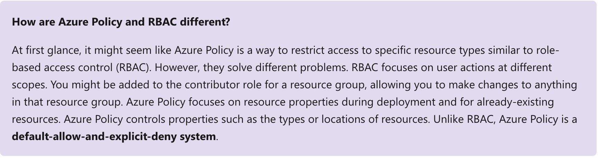
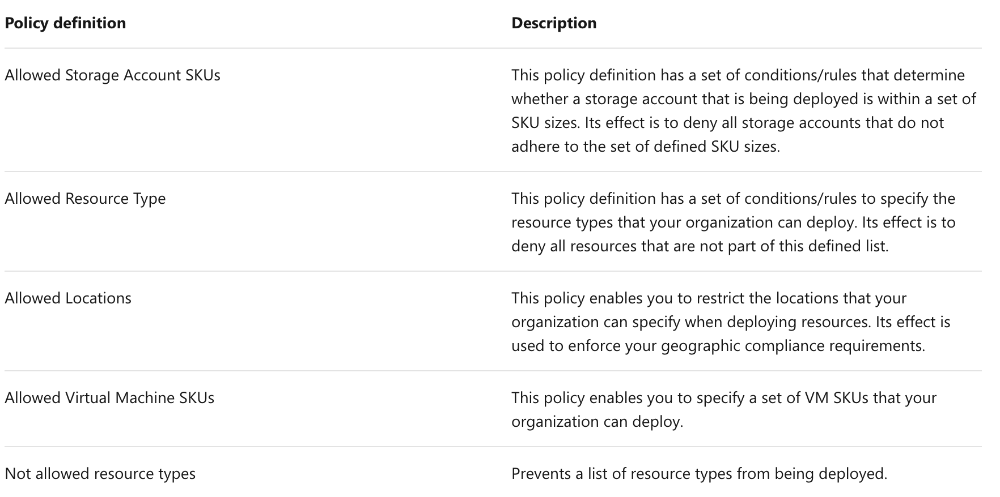
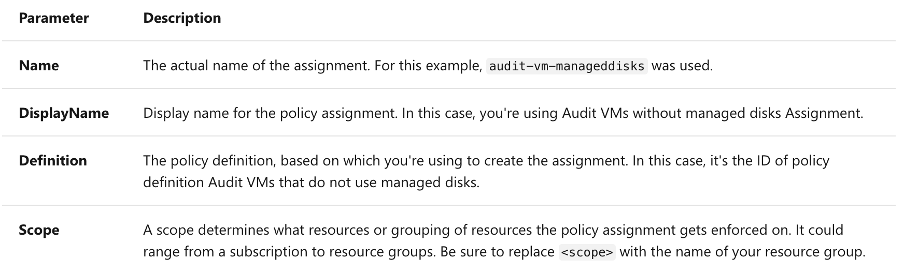
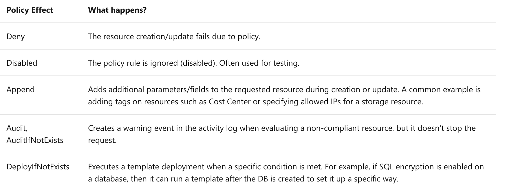
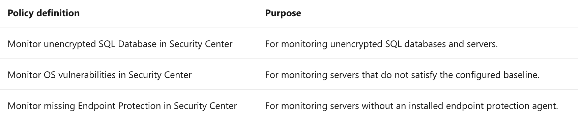
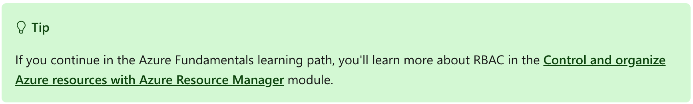
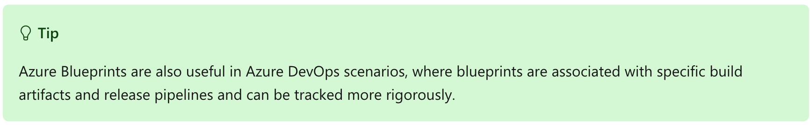
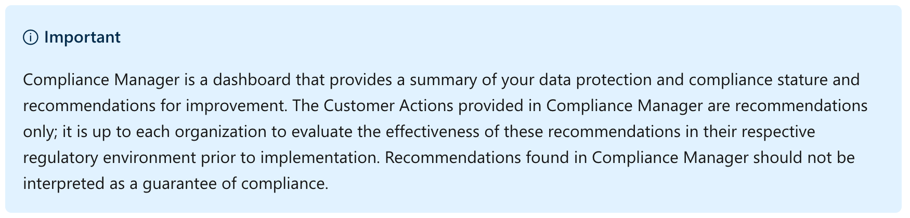
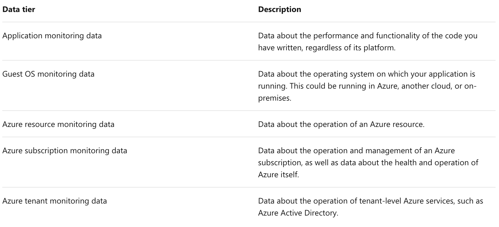
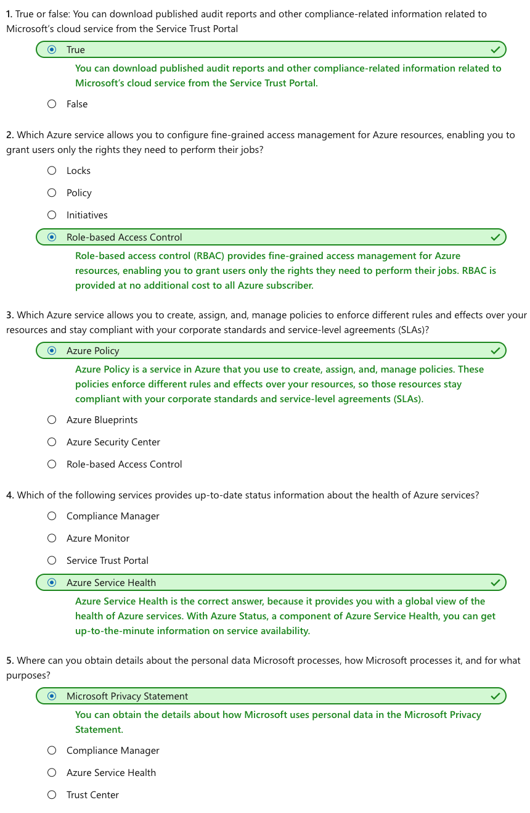

This notebook is refer from the Microsoft resources: [Azure fundamentals](https://docs.microsoft.com/en-gb/learn/paths/azure-fundamentals/).

Learn about governance and management in Azure services.

### Topic 1: Introduction

Good IT governance involves planning your initiatives and setting priorities on a strategic level to help manage and prevent issues.

You need good governance when:

- You have multiple engineering teams working in Azure

- You have multiple subscriptions in your tenant

- You have regulatory requirements that must be enforced

- You want to ensure standards are followed for all IT allocated resources

You could enforce standards by not allowing teams to directly create Azure resources - and instead have the IT team define and deploy all cloud-based assets. This approach is often the solution in on-premises situations, but this requirement reduces the team agility and ability to innovate. Instead, Azure provides several tools you can use to enforce and validate your standards, while still allowing your engineering teams to create and own their own resources in the cloud.

In addition to providing IT standards, you need to be able to monitor your resources to make sure they are responsive and performing properly. Azure provides several built-in features to track and analyze your resource utilization and performance.

In this module, you will:

- Apply policies to control and audit resource creation

- Learn how role-based security can fine-tune access to your resources

- Understand Microsoft's policies and privacy guarantees

- Learn how to monitor your resources


### Topic 2: Define IT compliance with Azure Policy

Planning out a consistent cloud infrastructure starts with setting up policy. **Your policies will enforce your rules for created resources**, so your infrastructure stays compliant with your corporate standards, cost requirements, and any service-level agreements (SLAs) you have with your customers.

{width=8% heigth=8%}

**Azure Policy** is an Azure service you use to **create, assign and, manage policies**. These policies enforce different rules and effects over your resources so that those resources **stay compliant with your corporate standards and service level agreements**. Azure Policy meets this need by evaluating your resources for noncompliance with assigned policies. For example, you might have a policy that allows virtual machines of only a certain size in your environment. After this policy is implemented, new and existing resources are evaluated for compliance. With the right type of policy, existing resources can be brought into compliance.

Imagine we allow anyone in our organization to create virtual machines (VMs). We want to control costs, so the administrator of our Azure tenant defines a policy that prohibits the creation of any VM with more than 4 CPUs. Once the policy is implemented, Azure Policy will stop anyone from creating a new VM outside the list of allowed stock keeping units (SKUs). Also, if you try to update an existing VM, it will be checked against policy. Finally, Azure Policy will audit all the existing VMs in our organization to ensure our policy is enforced. It can audit non-compliant resources, alter the resource properties, or stop the resource from being created. You can even integrate Azure Policy with Azure DevOps, by applying any continuous integration and delivery pipeline policies that affect the pre-deployment and post-deployment of your applications.



#### 2.1 Creating a policy

The process of creating and implementing an Azure Policy begins with creating a policy definition. Every policy definition has conditions under which it is enforced. And, it has an accompanying effect that takes place if the conditions are met. To apply a policy, you will:

1. Create a policy definition

2. Assign a definition to a scope of resources

3. View policy evaluation results

##### 2.1.1 What is a policy definition?

**A policy definition expresses what to evaluate and what action to take**. For example, you could ensure all public websites are secured with HTTPS, prevent a particular storage type from being created, or force a specific version of SQL Server to be used.

Here are some of the most common policy definitions you can apply.



The policy definition itself is represented as a JSON file - you can use one of the pre-defined definitions in the portal or create your own (either modifying an existing one or starting from scratch). There are [hundreds of samples available on GitHub](https://github.com/Azure/azure-policy).

JSON:

```
{
  "if": {
    "allOf": [
      {
        "field": "type",
        "equals": "Microsoft.Compute/virtualMachines"
      },
      {
        "not": {
          "field": "Microsoft.Compute/virtualMachines/sku.name",
          "in": "[parameters('listOfAllowedSKUs')]"
        }
      }
    ]
  },
  "then": {
    "effect": "Deny"
  }
}
```

Notice the `[parameters('listofAllowedSKUs')]` value; this value is a replacement token that will be filled in when the policy definition is applied to a scope. When a parameter is defined, it's given a name and optionally given a value.

##### 2.1.2 Applying Azure policy

To apply a policy, we can use the Azure portal, or one of the command-line tools such as Azure PowerShell by adding the `Microsoft.PolicyInsights` extension.

PowerShell:

```
# Register the resource provider if it's not already registered
Register-AzResourceProvider -ProviderNamespace 'Microsoft.PolicyInsights'
```

Once we have registered the provider, we can create a policy assignment. For example, here's a policy definition that identifies virtual machines not using managed disks.

PowerShell:

```
# Get a reference to the resource group that will be the scope of the assignment
$rg = Get-AzResourceGroup -Name '<resourceGroupName>'

# Get a reference to the built-in policy definition that will be assigned
$definition = Get-AzPolicyDefinition | Where-Object { $_.Properties.DisplayName -eq 'Audit VMs that do not use managed disks' }

# Create the policy assignment with the built-in definition against your resource group
New-AzPolicyAssignment -Name 'audit-vm-manageddisks' -DisplayName 'Audit VMs without managed disks Assignment' -Scope $rg.ResourceId -PolicyDefinition $definition
```

The preceding commands use the following information:



##### 2.1.3 Identifying non-compliant resources

We can use the applied policy definition to identify resources that aren't compliant with the policy assignment through the Azure portal

The results match what you see in the Resource compliance tab of a policy assignment in the Azure portal:


Or we can again use the command-line tools to identify the resources in your resource group that are non-compliant to the policy assignment

PowerShell:

```
Get-AzPolicyState -ResourceGroupName $rg.ResourceGroupName -PolicyAssignmentName 'audit-vm-manageddisks' -Filter 'IsCompliant eq false'
```

Here's an example of the output we might get:

Output

```
Timestamp                   : 3/9/19 9:21:29 PM
ResourceId                  : /subscriptions/{subscriptionId}/resourcegroups/{resourceGroupName}/providers/Microsoft.Compute/virtualMachines/{vmId}
PolicyAssignmentId          : /subscriptions/{subscriptionId}/providers/microsoft.authorization/policyassignments/audit-vm-manageddisks
PolicyDefinitionId          : /providers/Microsoft.Authorization/policyDefinitions/06a78e20-9358-41c9-923c-fb736d382a4d
IsCompliant                 : False
SubscriptionId              : {subscriptionId}
ResourceType                : /Microsoft.Compute/virtualMachines
ResourceTags                : tbd
PolicyAssignmentName        : audit-vm-manageddisks
PolicyAssignmentOwner       : tbd
PolicyAssignmentScope       : /subscriptions/{subscriptionId}
PolicyDefinitionName        : 06a78e20-9358-41c9-923c-fb736d382a4d
PolicyDefinitionAction      : audit
PolicyDefinitionCategory    : Compute
ManagementGroupIds          : {managementGroupId}
```

##### 2.1.4 Assign a definition to a scope of resources

Once you've defined one or more policy definitions, you'll need to assign them. **A policy assignment is a policy definition that has been assigned to take place within a specific scope**.

This scope could range from a full subscription down to a resource group. **Policy assignments are inherited by all child resources**. **This inheritance means that if a policy is applied to a resource group, it is applied to all the resources within that resource group**. **However, you can exclude a subscope from the policy assignment**. For example, we could enforce a policy for an entire subscription and then exclude a few select resource groups.

You can assign any of these policies through the Azure portal, PowerShell, or Azure CLI. When you assign a policy definition, you will need to supply any parameters that are defined.


##### 2.1.5 Policy effects

Requests to create or update a resource through Azure Resource Manager are evaluated by Azure Policy first. Policy creates a list of all assignments that apply to the resource and then evaluates the resource against each definition. Policy processes several of the effects before handing the request to the appropriate Resource Provider to avoid any unnecessary processing if the resource violates policy.

Each policy definition in Azure Policy has a single effect. That effect determines what happens when the associated policy rule is matched. When that happens, Azure Policy will take a specific action based on the assigned effect.



##### 2.1.6 View policy evaluation results

Azure Policy can allow a resource to be created even if it doesn't pass validation. In these cases, you can have it trigger an audit event that can be viewed in the Azure Policy portal, or through command-line tools. The easiest approach is in the portal as it provides a nice graphical overview that you can explore. You can find the Azure Policy section through the search field or All Services.


From this screen, you can spot resources that are not compliant and take action to correct them.

##### 2.1.7 Removing a policy definition

Finally, you can delete policy requirements through the portal, or through the PowerShell command `Remove-AzPolicyAssignment` as shown below.

Powershell:

```
Remove-AzPolicyAssignment -Name 'audit-vm-manageddisks' -Scope '/subscriptions/<subscriptionID>/resourceGroups/<resourceGroupName>'
```


### Topic 3: Organize policy with initiatives

Managing a few policy definitions is easy, but once you have more than a few, you will want to organize them. That's where initiatives come in.

Initiatives work alongside policies in Azure Policy. An initiative definition is a set or group of policy definitions to help track your compliance state for a larger goal. Even if you have a single policy, we recommend using initiatives if you anticipate increasing the number of policies over time.

Like a policy assignment, an initiative assignment is an initiative definition assigned to a specific scope. Initiative assignments reduce the need to make several initiative definitions for each scope. This scope could also range from a management group to a resource group.

Once defined, initiatives can be assigned just as policies can - and they apply all the associated policy definitions.

#### 3.1 Defining initiatives

Initiative definitions simplify the process of managing and assigning policy definitions by grouping a set of policies into a single item. For example, you could create an initiative named Enable Monitoring in Azure Security Center, with a goal to monitor all the available security recommendations in your Azure Security Center.

Under this initiative, you would have the following policy definitions:



You can define initiatives using the Azure portal, or command-line tools. In the portal, you use the "Authoring" section.


### Topic 4: Enterprise governance management

Access management occurs at the Azure subscription level. This control allows an organization to configure each division of the company in a specific fashion based on their responsibilities and requirements. Planning and keeping rules consistent across subscriptions can be challenging without a little help.

Azure Management Groups are containers for managing access, policies, and compliance across multiple Azure subscriptions. Management groups allow you to order your Azure resources hierarchically into collections, which provide a further level of classification that is above the level of subscriptions. All subscriptions within a management group automatically inherit the conditions applied to the management group. Management groups give you enterprise-grade management at a large scale no matter what type of subscriptions you might have.

The following diagram shows an example of creating a hierarchy for governance using management groups.


You might create a hierarchy so you can apply a policy that, for example, limits VM locations to the US West Region for the "Geo Region 1" group. This policy will inherit onto both Enterprise Agreement (EA) subscriptions under that management group and will apply to all VMs under those subscriptions. This security policy cannot be altered by the resource or subscription owner allowing for improved governance.

Another scenario where you would use management groups is to provide user access to multiple subscriptions. By moving many subscriptions under that management group, you can create one role-based access control (RBAC) assignment on the management group that will allow that access to all the subscriptions. One assignment on the management group can enable users to have access to everything they need instead of scripting RBAC rules over different subscriptions.

You can manage your Azure subscriptions more effectively by using Azure Policy and Azure role-based access controls (RBACs). These provide distinct governance conditions that you can apply to each management group. The resources and subscriptions you assign to a management group automatically inherit the conditions that you apply to that management group.




### Topic 5: Define standard resources with Azure Blueprints

Adhering to security or compliance requirements, whether government or industry requirements, can be difficult and time-consuming. To help you with auditing, traceability, and compliance of your deployments, use **Azure Blueprint** artifacts and tools.

{width=8% heigth=8%}

Just as a blueprint allows an engineer or an architect to sketch a project's design parameters, **Azure Blueprints** enables cloud architects and central information technology groups to define a repeatable set of Azure resources that implements and adheres to an organization's standards, patterns, and requirements. Azure Blueprints makes it possible for development teams to rapidly build and deploy new environments with the trust they're building within organizational compliance using a set of built-in components, such as networking, to speed up development and delivery.


Azure Blueprints is a declarative way to orchestrate the deployment of various resource templates and other artifacts, such as:

- Role assignments

- Policy assignments

- Azure Resource Manager templates

- Resource groups



The process of implementing Azure Blueprint consists of the following high-level steps:

- Create an Azure Blueprint

- Assign the blueprint

- Track the blueprint assignments

With Azure Blueprint, the relationship between the blueprint definition (what should be deployed) and the blueprint assignment (what was deployed) is preserved. This connection supports improved deployment tracking and auditing.

The Azure Blueprints service is backed by the globally distributed Azure Cosmos database. Blueprint objects are replicated to multiple Azure regions. This replication provides low latency, high availability, and consistent access to your blueprint objects, regardless of which region Blueprints deploys your resources to.

#### 5.1 How is it different from Resource Manager templates?

The Azure Blueprints service is **designed to help with environment setup**. This setup often consists of a set of *resource groups, policies, role assignments, and Resource Manager template deployments*. A blueprint is a **package** to bring each of these artifact types together and allow you to compose and version that package—including through a CI/CD pipeline. Ultimately, each setup is assigned to a subscription in a single operation that can be audited and tracked.

Nearly everything that you want to include for deployment in Blueprints can be accomplished with a Resource Manager template. However, a Resource Manager template is a document that doesn't exist natively in Azure. Resource Manager templates are stored either locally or in source control. The template gets used for deployments of one or more Azure resources, but once those resources deploy there's no active connection or relationship to the template.

With Blueprints, the relationship between the blueprint definition (what should be deployed) and the blueprint assignment (what was deployed) is preserved. This connection supports improved tracking and auditing of deployments. Blueprints can also upgrade several subscriptions at once that are governed by the same blueprint.

There's no need to choose between a Resource Manager template and a blueprint. Each blueprint can consist of zero or more Resource Manager template artifacts. This support means that previous efforts to develop and maintain a library of Resource Manager templates are reusable in Blueprints.

#### 5.2 How it's different from Azure Policy

A blueprint is a **package or container** for composing focus-specific sets of standards, patterns, and requirements related to the implementation of Azure cloud services, security, and design that can be reused to maintain consistency and compliance.

A policy is a **default-allow and explicit-deny system** focused on resource properties during deployment and for already existing resources. It supports cloud governance by validating that resources within a subscription adhere to requirements and standards.

Including a policy in a blueprint enables the creation of the right pattern or design during assignment of the blueprint. The policy inclusion makes sure that only approved or expected changes can be made to the environment to protect ongoing compliance to the intent of the blueprint.

A policy can be included as one of many artifacts in a blueprint definition. Blueprints also support using parameters with policies and initiatives.


### Topic 6: Explore your service compliance with Compliance Manager

Governing your own resources and how they are used is only part of the solution when using a cloud provider. You also have to understand how the provider manages the underlying resources you are building on.

Microsoft takes this management seriously and provides full transparency with four sources:

1. Microsoft Privacy Statement

2. Microsoft Trust Center

3. Service Trust Portal

4. Compliance Manager

#### 6.1 Microsoft Privacy Statement

The Microsoft privacy statement explains what personal data Microsoft processes, how Microsoft processes it, and for what purposes.

The statement applies to the interactions Microsoft has with you and Microsoft products such as Microsoft services, websites, apps, software, servers, and devices. It is intended to provide openness and honesty about how Microsoft deals with personal data in its products and services.

There is a link to the privacy statement in the summary of this module.

#### 6.2 What is the Microsoft Trust Center?

**Trust Center** is a website resource containing information and details about how Microsoft implements and supports security, privacy, compliance, and transparency in all Microsoft cloud products and services. Trust Center is an important part of the Microsoft Trusted Cloud Initiative, and provides support and resources for the legal and compliance community including:

- In-depth information about security, privacy, compliance offerings, policies, features, and practices across Microsoft cloud products.

- Recommended resources in the form of a curated list of the most applicable and widely used resources for each topic.

- Information specific to key organizational roles, including business managers, tenant admins or data security teams, risk assessment and privacy officers, and legal compliance teams.

- Cross-company document search, which is coming soon and will enable existing cloud service customers to search the Service Trust Portal.

- Direct guidance and support for when you can't find what you're looking for.


#### 6.3 What is the Service Trust Portal?

The **Service Trust Portal** (STP) hosts the Compliance Manager service, and is the Microsoft public site for publishing audit reports and other compliance-related information relevant to Microsoft's cloud services. STP users can download audit reports produced by external auditors and gain insight from Microsoft-authored reports that provide details on how Microsoft builds and operates its cloud services.

STP also includes information about how Microsoft online services can help your organization maintain and track compliance with standards, laws, and regulations, such as:

- ISO

- SOC

- NIST

- FedRAMP

- GDPR


Service Trust Portal is a companion feature to the Trust Center, and allows you to:

- Access audit reports across Microsoft cloud services on a single page.

- Access compliance guides to help you understand how you can use Microsoft cloud service features to manage compliance with various regulations.

- Access trust documents to help you understand how Microsoft cloud services help protect your data.

#### 6.4 Compliance Manager

**Compliance Manager** is a workflow-based risk assessment dashboard within the Service Trust Portal that enables you to track, assign, and verify your organization's regulatory compliance activities related to Microsoft professional services and Microsoft cloud services such as Office 365, Dynamics 365, and Azure.

Compliance Manager provides the following features:

- Combines the following three items:

    1. Detailed information provided by Microsoft to auditors and regulators, as part of various third-party audits of Microsoft 's cloud services against various standards (for example, ISO 27001, ISO 27018, and NIST).

    2. Information that Microsoft compiles internally for its compliance with regulations (such as HIPAA and the EU GDPR).

    3. An organization's self-assessment of their own compliance with these standards and regulations.

- Enables you to assign, track, and record compliance and assessment-related activities, which can help your organization cross team barriers to achieve your organization's compliance goals.

- Provides a Compliance Score to help you track your progress and prioritize auditing controls that will help reduce your organization's exposure to risk.

- Provides a secure repository in which to upload and manage evidence and other artifacts related to compliance activities.

- Produces richly detailed reports in Microsoft Excel that document the compliance activities performed by Microsoft and your organization, which can be provided to auditors, regulators, and other compliance stakeholders.


Compliance Manager provides ongoing risk assessments with a reference of risk-based scores for regulations and standards displayed in a dashboard view. Alternatively, you can create assessments for the regulations or standards that matter more to your organization.

As part of the risk assessment, Compliance Manager also provides recommended actions you can take to improve your regulatory compliance. You can view all action items, or select the action items that correspond with a specific certification.




### Topic 7: Monitor your service health

Defining policy and access provides fine-grained control over resources in your cloud IT infrastructure. Once those resources are deployed, you will want to know about any issues or performance problems they might encounter.

Azure provides two primary services to monitor the health of your apps and resources.

1. Azure Monitor

2. Azure Service Health

#### 7.1 Azure Monitor {width=8% heigth=8%}

**Azure Monitor** maximizes the availability and performance of your applications by delivering a comprehensive solution for collecting, analyzing, and acting on telemetry from your cloud and on-premises environments. It helps you understand how your applications are performing and proactively identifies issues affecting them and the resources they depend on.

#### 7.2 Data sources

Azure Monitor can collect data from a variety of sources. You can think of monitoring data for your applications in tiers ranging from your application, any operating system and services it relies on, and down to the platform itself.



#### 7.3 Diagnostic settings

As soon as you create an Azure subscription and start adding resources such as virtual machines and web apps, Azure Monitor starts collecting data. Activity Logs record when resources are created or modified and Metrics tell you how the resource is performing and the resources that it's consuming.

You can extend the data you're collecting into the actual operation of the resources by enabling **diagnostics** and adding an agent to compute resources. Under resource settings, you can enable Diagnostics

- Enable guest-level monitoring

- Performance counters: collect performance data

- Event Logs: enable various event logs

- Crash Dumps: enable or disable

- Sinks: send your diagnostic data to other services for more analysis

- Agent: configure agent settings

#### 7.4 Getting more data from your apps

Data monitoring is only useful if it improves your visibility of the operations in your computing environment. Azure Monitor includes several features and tools that provide valuable insights into your applications, and the other resources they may depend on.

**Application Insights** is a service that *monitors the availability, performance, and usage of your web applications, whether they're hosted in the cloud or on-premises*. It leverages the powerful data analysis platform in Log Analytics to provide you with deeper insights into your application's operations. Application Insights can diagnose errors without waiting for a user to report them. Application Insights includes connection points to a variety of development tools, and integrates with Microsoft Visual Studio to support your DevOps processes.

**Azure Monitor for containers** is a service that is *designed to monitor the performance of container workloads, which are deployed to managed Kubernetes clusters, hosted on Azure Kubernetes Service (AKS)*. It gives you performance visibility by collecting memory and processor metrics from controllers, nodes, and containers, which are available in Kubernetes through the metrics API. Container logs are also collected.

**Azure Monitor for VMs** is a service that *monitors your Azure VMs at scale, by analyzing the performance and health of your Windows and Linux VMs* (including their different processes and interconnected dependencies on other resources, and external processes). Azure Monitor for VMs includes support for monitoring performance and application dependencies for VMs hosted on-premises, and for VMs hosted with other cloud providers.

Integrating any, or all, of these monitoring services with Azure Service Health has additional benefits. Staying informed of the health status of Azure services will help you understand if, and when, an issue affecting an Azure service is impacting your environment. What may seem like a localized problem could be the result of a more widespread issue, and Azure Service Health provides this kind of insight. Azure Service Health identifies any issues with Azure services that might affect your application. Azure Service Health also helps you to plan for scheduled maintenance.

#### 7.5 Responding to alert conditions

In addition to allowing you to analyze your monitoring data interactively, an effective monitoring solution must respond proactively to any critical conditions that are identified within the data it collects. This might involve, for example, sending a text or email to an administrator who is responsible for investigating an issue, or launching an automated process that attempts to correct an error condition.

**Alerts**. Azure Monitor proactively notifies you of critical conditions using alerts, and can potentially attempt to take corrective actions. Alert rules based on metrics can provide alerts in almost real-time, based on numeric values. Alert rules based on logs allow for complex logic across data, from multiple sources.

**Autoscale**. Azure Monitor uses Autoscale to ensure that you have the right amount of resources running to manage the load on your application effectively. Autoscale enables you to create rules that use metrics, collected by Azure Monitor, to determine when to automatically add resources to handle increases in load. Autoscale can also help reduce your Azure costs by removing resources that are not being used. You can specify a minimum and maximum number of instances, and provide the logic that determines when Autoscale should increase or decrease resources.

#### 7.6 Visualize monitoring data

Visualizations, such as charts and tables, are effective tools for summarizing monitoring data and for presenting data to different audiences. Azure Monitor has its own features for visualizing monitoring data, and it leverages other Azure services for publishing data for different audiences. Other tools you may use for visualizing data, for particular audiences and scenarios, include:

- Dashboards

- Views

- Power BI

#### 7.7 Integrate with other services

You'll often need to integrate Azure Monitor with other systems, and build customized solutions that use your monitoring data. Other Azure services can work with Azure Monitor to provide this integration.

#### 7.8 Azure Service Health {width=8% heigth=8%}

**Azure Service Health** is a suite of experiences that provide personalized guidance and support when issues with Azure services affect you. It can notify you, help you understand the impact of issues, and keep you updated as the issue is resolved. Azure Service Health can also help you prepare for planned maintenance and changes that could affect the availability of your resources.

Azure Service Health is composed of the following views.

**Azure Status** *provides a global view of the health state of Azure services*. With Azure Status, you can get up-to-the-minute information on service availability. Everyone has access to Azure Status and can view all services that report their health state.

**Service Health** *provides you with a customizable dashboard that tracks the state of your Azure services in the regions where you use them*. In this dashboard, you can track active events such as ongoing service issues, upcoming planned maintenance, or relevant Health advisories. When events become inactive, they are placed in your Health history for up to 90 days. Finally, you can use the Service Health dashboard to create and manage service Health alerts, which notify you whenever there are service issues that affect you.

**Resource Health** helps you diagnose and obtain support when an Azure service issue affects your resources. It provides you with details about the current and past state of your resources. It also provides technical support to help you mitigate problems. In contrast to Azure Status, which informs you about service problems that affect a broad set of Azure customers, Resource Health gives you a personalized dashboard of your resources' health. Resource Health shows you times, in the past, when your resources were unavailable because of Azure service problems. It's then easier for you to understand if an SLA was violated.

Together, the Azure Service Health components provide you with a comprehensive view of the health status of Azure, at the level of granularity that is most relevant to you.


### Topic 8: Summary

In this module you've learned about Azure **governance methodologies**, **monitoring** and **reporting** in Azure, and **privacy**, **compliance**, and **data protection standards** in Azure.

#### 8.1 Learn More

Here are some places to go to learn more about what we've covered today:

- [Microsoft Privacy Statement](https://privacy.microsoft.com/privacystatement)

- [Microsoft Trust Center](https://www.microsoft.com/trustcenter)

- [Service Trust Portal](https://aka.ms/STP)

- [Azure Service Health](https://azure.microsoft.com/features/service-health/)

- [Azure Monitor](https://azure.microsoft.com/services/monitor/)

- [Azure Status](https://azure.microsoft.com/status/)

#### 8.2 Check your knowledge




```{r echo=FALSE, eval=FALSE, message=FALSE}
rmarkdown::render(input = "F10_azure_monitor.Rmd", output_format = "github_document", output_file = "README.md")
```

