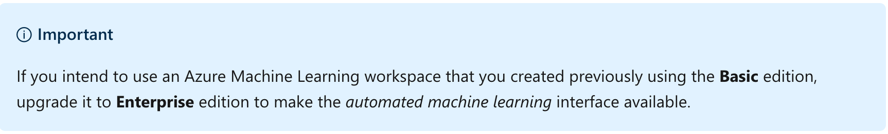
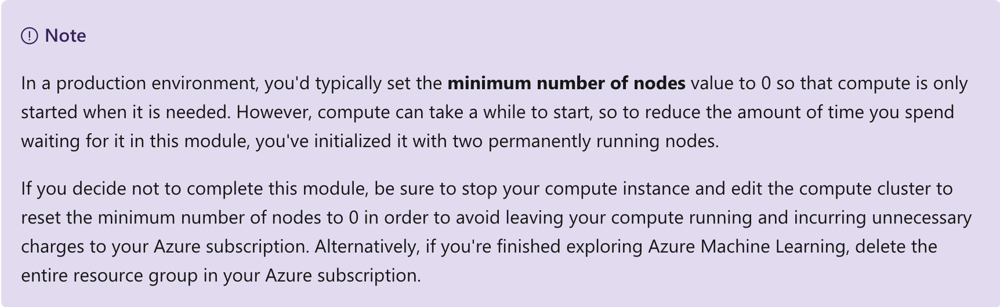
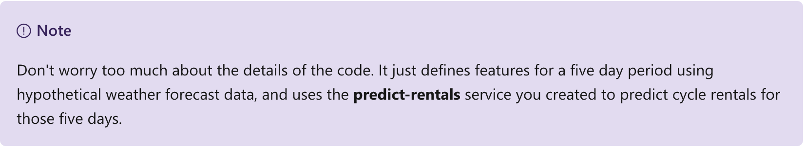
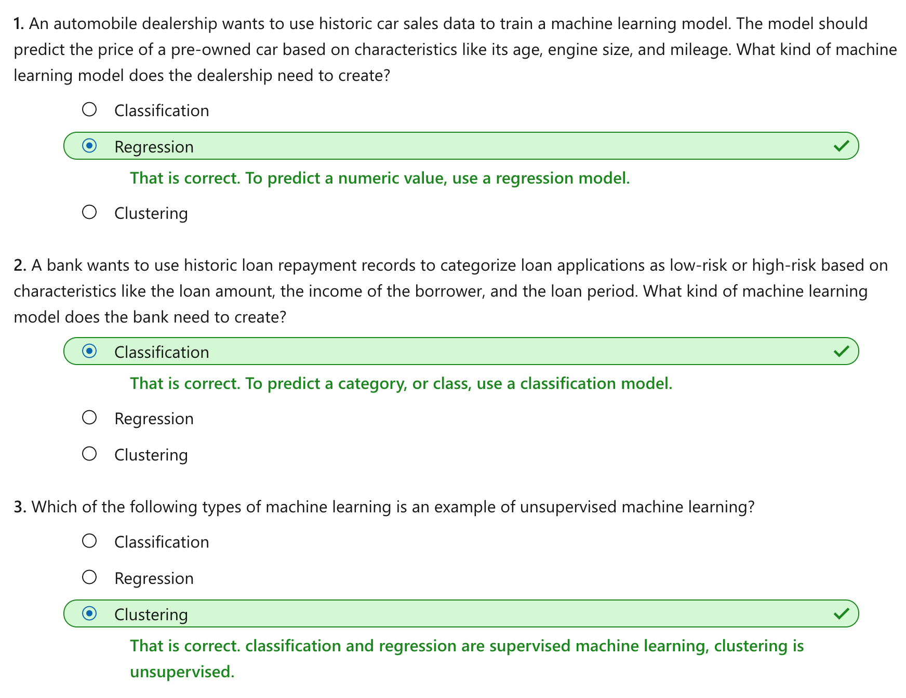

This notebook is refer from the Microsoft resources: [Create no-code predictive models with Azure Machine Learning](https://docs.microsoft.com/en-gb/learn/paths/create-no-code-predictive-models-azure-machine-learning/).

### Trophy 2: Create no-code predictive models with Azure Machine Learning

Machine learning is at the core of artificial intelligence, and many modern applications and services depend on predictive machine learning models. Learn how to use Azure Machine Learning to create and publish models without writing code.

### Module 1: Use automated machine learning in Azure Machine Learning

Training a machine learning model is an iterative process that requires time and compute resources. Automated machine learning can help make it easier.

### Topic 1: Introduction

*Machine Learning* is the foundation for most artificial intelligence solutions, and the creation of an intelligent solution often begins with the use of machine learning to train a predictive model using historic data that you have collected.

In this module, you'll learn how to:

- Identify different kinds of machine learning model.

- Use the automated machine learning capability of Azure Machine Learning to train and deploy a predictive model.

To complete this module, you'll need a Microsoft Azure subscription. If you don't already have one, you can sign up for a free trial at https://azure.microsoft.com


### Topic 2: What is machine learning?

Machine learning is a technique that uses mathematics and statistics to create a model that can predict unknown values.


For example, suppose *Adventure Works Cycles* is a business that rents cycles in a city. The business could use historic data to train a model that predicts daily rental demand in order to make sure sufficient staff and cycles are available.

To do this, Adventure Works could create a machine learning model that takes information about a specific day (the day of week, the anticipated weather conditions, and so on) as an input, and predicts the expected number of rentals as an output.

Mathematically, you can think of machine learning as a way of defining a function (let's call it $f$) that operates on one or more *features* of something (which we'll call $x$) to calculate a predicted $label(y)$ - like this:

$$
f(x) =y
$$

In this bicycle rental example, the details about a given day (day of the week, weather, and so on) are the $features (x)$, the number of rentals for that day is the $label (y)$, and the function ($f$) that calculates the number of rentals based on the information about the day is encapsulated in a machine learning model.

The specific operation that the $f$ function performs on $x$ to calculate $y$ depends on a number of factors, including the type of model you're trying to create and the specific algorithm used to train the model. Additionally in most cases, the data used to train the machine learning model requires some pre-processing before model training can be performed.

#### 2.1 Azure Machine Learning

Training and deploying an effective machine learning model involves a lot of work, much of it time-consuming and resource-intensive. Azure Machine Learning is a cloud-based service that helps simplify some of the tasks and reduce the time it takes to prepare data, train a model, and deploy a predictive service. In the rest of this unit, you'll explore Azure Machine Learning, and in particular its *automated machine learning* capability.


### Topic 3: Create an Azure Machine Learning workspace

Data scientists expend a lot of effort exploring and pre-processing data, and trying various types of model-training algorithm to produce accurate models, which is time consuming, and often makes inefficient use of expensive compute hardware.

Azure Machine Learning is a cloud-based platform for building and operating machine learning solutions in Azure. It includes a wide range of features and capabilities that help data scientists prepare data, train models, publish predictive services, and monitor their usage. Most importantly, it helps data scientists increase their efficiency by automating many of the time-consuming tasks associated with training models; and it enables them to use cloud-based compute resources that scale effectively to handle large volumes of data while incurring costs only when actually used.

#### 3.1 Create an Azure Machine Learning workspace

To use Azure Machine Learning, you create a workspace in your Azure subscription. You can then use this workspace to manage data, compute resources, code, models, and other artifacts related to your machine learning workloads.

Follow these steps to create a workspace:

1. Sign into the [Azure portal](https://portal.azure.com/) using your Microsoft credentials.

2. Select **＋Create a resource**, search for **Machine Learning**, and create a new **Machine Learning** resource the following settings:

    - **Workspace Name**: A unique name of your choice
    
    - **Subscription**: Your Azure subscription
    
    - **Resource group**: Create a new resource group with a unique name

    - **Location**: Choose any available location

    - **Workspace edition**: Enterprise
    
3. Wait for your workspace to be created (it can take a few minutes). Then go to it in the portal.

4. On the **Overview** page for your workspace, launch Azure Machine Learning studio (or open a new browser tab and navigate to https://ml.azure.com ), and sign into Azure Machine Learning studio using your Microsoft account.

5. In Azure Machine Learning studio, toggle the ☰ icon at the top left to view the various pages in the interface. You can use these pages to manage the resources in your workspace.



You can manage your workspace using the Azure portal, but for data scientists and Machine Learning operations engineers, Azure Machine Learning studio provides a more focused user interface for managing workspace resources.


### Topic 4: Create compute resources

After you have created an Azure Machine Learning workspace, you can use it to manage the various assets and resources you need to create machine learning solutions. At its core, Azure Machine Learning is a platform for training and managing machine learning models, for which you need compute on which to run the training process.

#### 4.1 Create compute targets

Compute targets are cloud-based resources on which you can run model training and data exploration processes.

1. In [Azure Machine Learning studio](https://ml.azure.com/), view the **Compute** page (under **Manage**). This is where you manage the compute targets for your data science activities. There are four kinds of compute resource you can create:

    - **Compute Instances**: Development workstations that data scientists can use to work with data and models.
    
    - **Compute Clusters**: Scalable clusters of virtual machines for on-demand processing of experiment code.

    - **Inference Clusters**: Deployment targets for predictive services that use your trained models.

    - **Attached Compute**: Links to existing Azure compute resources, such as Virtual Machines or Azure Databricks clusters.

2. On the **Compute Instances** tab, add a new compute instance with the following settings. You'll use this as a workstation from which to test your model:

    - **Compute name**: enter a unique name

    - **Virtual Machine type**: CPU

    - **Virtual Machine size**: Standard_DS2_v2
    
3. While the compute instance is being created, switch to the **Compute Clusters** tab, and add a new compute cluster with the following settings. You'll use this to train a machine learning model:

    - **Compute name**: enter a unique name
    
    - **Virtual Machine size**: Standard_DS2_v2

    - **Virtual Machine priority**: Dedicated

    - **Minimum number of nodes**: 2

    - **Maximum number of nodes**: 2

    - **Idle seconds before scale down**: 120



The compute targets will take some time to be created. You can move onto the next unit while you wait.


### Topic 5: Explore data

Machine learning models must be trained with existing data. In this case, you'll use a dataset of historical bicycle rental details to train a model that predicts the number of bicycle rentals that should be expected on a given day, based on seasonal and meteorological features.

#### 5.1 Create a dataset

In Azure Machine Learning, data for model training and other operations is usually encapsulated in an object called a *dataset*.

1. in [Azure Machine Learning studio](https://ml.azure.com/), view the **Datasets** page (under **Assets**), and create a new dataset **from web files** with the following settings:

    - **Basic Info**:

        - **Web URL**: https://aka.ms/bike-rentals
         
        - **Name**: bike-rentals

        - **Dataset type**: Tabular

        - **Description**: Bicycle rental data

    - **Settings and preview**:

        - **File format**: Delimited

        - **Delimiter**: Comma

        - **Encoding**: UTF-8
        
        - **Column headers**: Use headers from first file
        
        - **Skip rows**: None
        
    - **Schema**:

        - Include all columns other than **Path**
        
        - Review the automatically detected types
        
    - **Confirm details**:

        - Do not profile the dataset after creation

2. After the dataset has been created, open it and view the Explore page to see a sample of the data. This data contains historical features and labels for bike rentals.

**Citation**: This data is derived from [Capital Bikeshare](https://www.capitalbikeshare.com/system-data) and is used in accordance with the published data [license agreement](https://www.capitalbikeshare.com/data-license-agreement).


### Topic 6: Train a machine learning model

Azure Machine Learning includes an **automated machine learning** capability that leverages the scalability of cloud compute to automatically try multiple pre-processing techniques and model-training algorithms in parallel to find the best performing model for your data.

#### 6.1 Run an automated machine learning experiment

In Azure Machine Learning, operations that you run are called **experiments**. Follow the steps below to run an experiment that uses automated machine learning to train a regression model that predicts bicycle rentals.

1. In [Azure Machine Learning studio](https://ml.azure.com/), view the **Automated ML** page (under **Author**).

2. Create a **New Automated ML run** with the following settings:

    - **Select dataset**:

        - **Dataset**: bike-rentals

    - **Configure run**:

        - **New experiment name**: auto-train-bike-rental

        - **Target column**: rentals (this is the label the model will be trained to predict)

        - **Training compute target**: the compute cluster you created previously

    - **Task type and settings**:

        - **Task type**: Regression (the model will predict a numeric value)

        - **Additional configuration settings**:

            - **Primary metric**: Normalized root mean square error (more about this metric later!)

            - **Explain best model**: Unselected - this option causes automated machine learning to calculate feature importance for the best model; making it possible to determine the influence of each feature on the predicted label.

            - **Blocked algorithms**: Block all other than RandomForest and LightGBM - normally you'd want to try as many as possible, but doing so can take a long time!

        - **Featurization settings**:

            - **Enable featurization**: Selected (this causes Azure Machine Learning to automatically preprocess the features before training.)

#### 6.2 Review the best model

Although you canceled the automated machine learning run, some models were trained; so you can review the best performing one.

1. On the **Details** tab of the automated machine learning run, note the best model summary.

2. Select the **Algorithm name** for the best model to view its details.

    The best model is identified based on the evaluation metric you specified (Normalized root mean square error). To calculate this metric, the training process used some of the data to train the model, and applied a technique called cross-validation to iteratively test the trained model with data it wasn't trained with and compare the predicted value with the actual known value. The difference between the predicted and actual value (known as the residuals) indicates the amount of error in the model, and this particular performance metric is calculated by squaring the errors across all of the test cases, finding the mean of these squares, and then taking the square root. What all of this means is that smaller this value is, the more accurately the model is predicting.

3. Next to the Normalized root mean square error value, select **View all other metrics** to see values of other possible evaluation metrics for a regression model.

4. Select the **Metrics** tab and select the **residuals** and **predicted_true** charts. Then review the charts that show the performance of the model by comparing the predicted values against the true values, and showing the residuals (differences between predicted and actual values) as a histogram.

The **Residual Histogram** shows the frequency of residual value ranges. Residuals represent variance between predicted and true values that can't be explained by the model - in other words, errors; so what you should hope to see is that the most frequently occurring residual values are clustered around 0 (in other words, most of the errors are small), with fewer errors at the extreme ends of the scale.


The **Predicted vs. True** chart should show a diagonal trend in which the predicted value correlates closely to the true value. A dotted line shows how a perfect model should perform, and the closer the line for your model's average predicted value is to this, the better its performance. A histogram below the line chart shows the distribution of true values.


### Topic 7: Deploy a model as a service

After you've used automated machine learning to train some models, you can deploy the best performing model as a service for client applications to use.

#### 7.1 Deploy a predictive service

In Azure Machine Learning, you can deploy a service as an Azure Container Instances (ACI) or to an Azure Kubernetes Service (AKS) cluster. For production scenarios, an AKS deployment is recommended, for which you must create an *inference cluster* compute target. In this exercise, you'll use an ACI service, which is a suitable deployment target for testing, and does not require you to create an inference cluster.

1. In [Azure Machine Learning studio](https://ml.azure.com/), on the **Automated ML** page, select the run for your automated machine learning experiment and view the **Details** tab.

2. Select the algorithm name for the best model. Then, on the Model tab, use the Deploy button to deploy the model with the following settings:

    - **Name**: predict-rentals

    - **Description**: Predict cycle rentals
    
    - **Compute type**: ACI
    
    - **Enable authentication**: Selected
    
3. Wait for the deployment to start - this may take a few seconds. Then, in the **Model summary** section, observe the **Deploy status** for the **predict-rentals** service, which should be **Running**. Wait for this status to change to **Successful**. You may need to select **↻ Refresh** periodically.

4. In Azure Machine Learning studio, view the **Endpoints** page and select the **predict-rentals** real-time endpoint. Then select the **Consume** tab and note the following information there. You need this information to connect to your deployed service from a client application.

    - The REST endpoint for your service

    - the Primary Key for your service
    
Note that you can use the ⧉ link next to these values to copy them to the clipboard.

#### 7.2 Test the deployed service

Now that you've deployed a service, you can test it using some simple code.

1. With the **Consume** page for the **predict-rentals** service page open in your browser, open a new browser tab and open a second instance of [Azure Machine Learning studio](https://ml.azure.com/). Then in the new tab, view the **Notebooks** page. On the **Notebooks** page, create a new file with the following settings:

    - **File name**: bike_test.ipynb

    - **File type**: Notebook

    - **Overwrite if already exists**: Selected

    - **Select target directory**: Select the folder with your user name under **User files**
    
2. When the new notebook has been created, ensure that the compute instance you created previously is selected in the **Compute** box, and that it has a status of **Running**.

3. Edit the notebook inline, and in the cell that has been created in the notebook, paste the following code:

Python:

```
endpoint = 'YOUR_ENDPOINT' #Replace with your endpoint
key = 'YOUR_KEY' #Replace with your key

import json
import requests

#An array of features based on five-day weather forecast
x = [[1,1,2022,1,0,6,0,2,0.344167,0.363625,0.805833,0.160446],
    [2,1,2022,1,0,0,0,2,0.363478,0.353739,0.696087,0.248539],
    [3,1,2022,1,0,1,1,1,0.196364,0.189405,0.437273,0.248309],
    [4,1,2022,1,0,2,1,1,0.2,0.212122,0.590435,0.160296],
    [5,1,2022,1,0,3,1,1,0.226957,0.22927,0.436957,0.1869]]

#Convert the array to JSON format
input_json = json.dumps({"data": x})

#Set the content type and authentication for the request
headers = {"Content-Type":"application/json",
        "Authorization":"Bearer " + key}

#Send the request
response = requests.post(endpoint, input_json, headers=headers)

#If we got a valid response, display the predictions
if response.status_code == 200:
    y = json.loads(response.json())
    print("Predictions:")
    for i in range(len(x)):
        print (" Day: {}. Predicted rentals: {}".format(i+1, max(0, round(y["result"][i]))))
else:
    print(response)
```



4. Switch to the browser tab containing the Consume page for the predict-rentals service, and copy the **REST endpoint** for your service. The switch back to the tab containing the notebook and paste the key into the code, replacing **YOUR_ENDPOINT**.

5. Switch to the browser tab containing the Consume page for the predict-rentals service, and copy the **Primary Key** for your service. The switch back to the tab containing the notebook and paste the key into the code, replacing **YOUR_KEY**.

6. Save the notebook, Then use the ▷ button next to the cell to run the code.

7. Verify that predicted number of rentals for each day in the five day period are returned.


### Topic 8: Knowledge check




### Topic 9: Summary

In this module, you explored machine learning and learned how to use the automated machine learning capability of Azure Machine Learning to train and deploy a predictive model.

#### 9.1 Reset resources

The web service you created is hosted in an *Azure Container Instance*. If you don't intend to experiment with it further, you should delete the endpoint to avoid accruing unnecessary Azure charges. You should also stop the training cluster and compute instance resources until you need them again.

1. In [Azure Machine Learning studio](https://ml.azure.com/), on the **Endpoints** tab, select the **predict-rentals** endpoint. Then select Delete (🗑) and confirm that you want to delete the endpoint.

2. On the C**ompute **page, on the C**ompute Instances **tab, select your compute instance and then select S**top.**

3. On the C**ompute **page, on the C**ompute clusters **tab, open your compute cluster and select E**dit.** Then set the M**inimum number of nodes **setting to 0** **and select U**pdate.**

If you have finished exploring Azure Machine Learning, you can delete the resource group containing your Azure Machine Learning workspace from your Azure subscription:

1. In the A[zure portal ](https://portal.azure.com/) in the R**esource groups **page, open the resource group you specified when creating your Azure Machine Learning workspace.

2. Click D**elete resource group,** type the resource group name to confirm you want to delete it, and select D**elete.**


