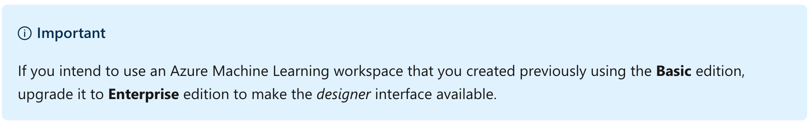
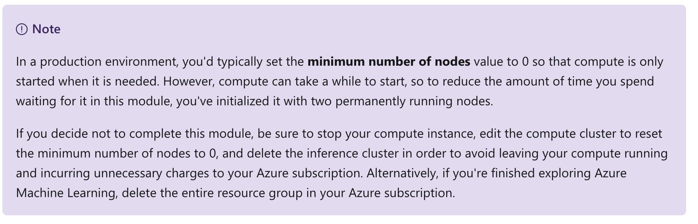
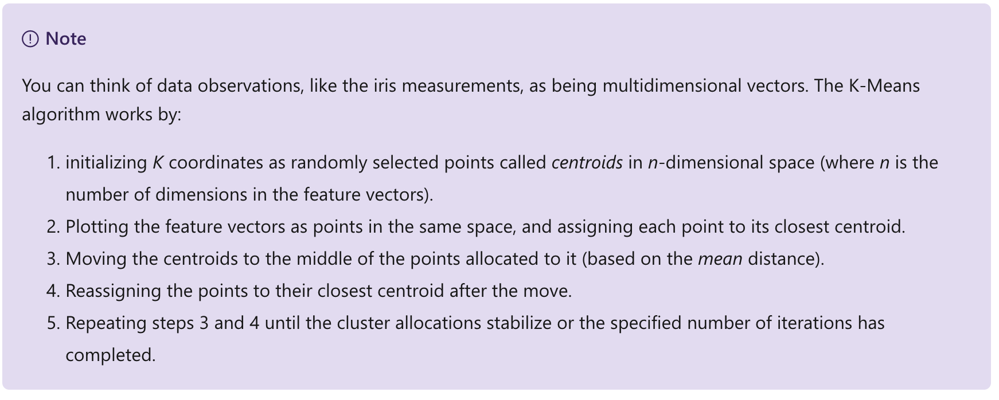
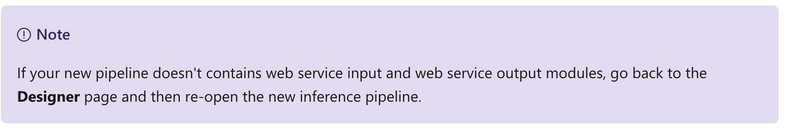
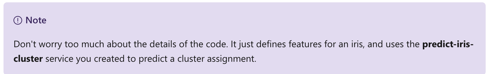
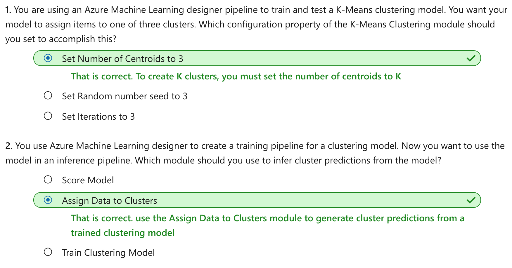

This notebook is refer from the Microsoft resources: [Create no-code predictive models with Azure Machine Learning](https://docs.microsoft.com/en-gb/learn/paths/create-no-code-predictive-models-azure-machine-learning/).

### Module 4: Create a Clustering Model with Azure Machine Learning designer

Clustering is an unsupervised machine learning technique used to group similar entities based on their features. Learn how to create clustering models using Azure Machine Learning designer.


### Topic 1: Introduction

*Clustering* is a form of machine learning that is used to group similar items into clusters based on their features. For example, a botanist might take measurements of plants, and group them based on similarities in their proportions.


Clustering is an example of unsupervised machine learning, in which you train a model to separate items into clusters based purely on their characteristics, or *features*. There is no previously known cluster value (or *label*) from which to train the model.

You can use Microsoft Azure Machine Learning designer to create clustering models by using a drag and drop visual interface, without needing to write any code.

In this module, you'll learn how to:

- Use Azure Machine Learning designer to train a clustering model.

- Use a clustering model for inferencing.

- Deploy a clustering model as a service.

To complete this module, you'll need a Microsoft Azure subscription. If you don't already have one, you can sign up for a free trial at https://azure.microsoft.com.


### Topic 2: Create an Azure Machine Learning workspace

Azure Machine Learning is a cloud-based platform for building and operating machine learning solutions in Azure. It includes a wide range of features and capabilities that help data scientists prepare data, train models, publish predictive services, and monitor their usage. One of these features is a visual interface called designer, that you can use to train, test, and deploy machine learning models without writing any code.

#### 2.1 Create an Azure Machine Learning workspace

To use Azure Machine Learning, you create a *workspace* in your Azure subscription. You can then use this workspace to manage data, compute resources, code, models, and other artifacts related to your machine learning workloads.

If you do not already have one, follow these steps to create a workspace:

1. Sign into the [Azure portal](https://portal.azure.com/) using your Microsoft credentials.

2. Select **＋Create a resource**, search for *Machine Learning*, and create a new **Machine Learning** resource the following settings:

    - **Workspace Name**: A unique name of your choice

    - **Subscription**: Your Azure subscription

    - **Resource group**: Create a new resource group with a unique name

    - **Location**: Choose any available location

    - **Workspace edition**: Enterprise

3. Wait for your workspace to be created (it can take a few minutes). Then go to it in the portal.

4. On the **Overview** page for your workspace, launch Azure Machine Learning Studio (or open a new browser tab and navigate to https://ml.azure.com ), and sign into Azure Machine Learning studio using your Microsoft account.

5. In Azure Machine Learning studio, toggle the ☰ icon at the top left to view the various pages in the interface. You can use these pages to manage the resources in your workspace.

You can manage your workspace using the Azure portal, but for data scientists and Machine Learning operations engineers, Azure Machine Learning studio provides a more focused user interface for managing workspace resources.




### Topic 3: Create compute resources

To train and deploy models using Azure Machine Learning designer, you need compute on which to run the training process, test the model, and host the model in a deployed service.

#### 3.1 Create compute targets

Compute targets are cloud-based resources on which you can run model training and data exploration processes.

1. In [Azure Machine Learning studio](https://ml.azure.com/), view the **Compute** page (under **Manage**). This is where you manage the compute targets for your data science activities. There are four kinds of compute resource you can create:

    - **Compute Instances**: Development workstations that data scientists can use to work with data and models.

    - **Compute Clusters**: Scalable clusters of virtual machines for on-demand processing of experiment code.

    - **Inference Clusters**: Deployment targets for predictive services that use your trained models.

    - **Attached Compute**: Links to existing Azure compute resources, such as Virtual Machines or Azure Databricks clusters.

2. On the **Compute Instances** tab, add a new compute instance with the following settings. You'll use this to test your model:

    - **Compute name**: enter a unique name
    
    - **Virtual Machine type**: CPU
    
    - **Virtual Machine size**: Standard_DS2_v2
    
3. While the compute instance is being created, switch to the **Compute Clusters** tab, and add a new compute cluster with the following settings. You'll use this to train a machine learning model:

    - **Compute name**: enter a unique name

    - **Virtual Machine size**: Standard_DS2_v2

    - **Virtual Machine priority**: Dedicated

    - **Minimum number of nodes**: 2

    - **Maximum number of nodes**: 2

    - **Idle seconds before scale down**: 120

4. While the compute cluster is being created, switch to the **Inference Clusters** tab, and add a new cluster with the following settings. You'll use this to deploy your model as a service.

    - **Compute name**: enter a unique name

    - **Kubernetes Service**: Create new

    - **Region**: Select a different region than the one used for your workspace

    - **Virtual Machine size**: Standard_DS2_v2 (Use the filter to find this in the list)

    - **Cluster purpose**: Dev-test

    - **Number of nodes**: 2

    - **Network configuration**: Basic

    - **Enable SSL configuration**: Unselected
    
Verify that the inference cluster is in the *Creating* state - it will take a while to be created, so leave it for now.



The compute targets will take some time to be created. You can move onto the next unit while you wait.


### Topic 4: Explore data

To train a clustering model, you need a dataset that includes multiple observations of the items you want to cluster, including numeric features that can be used to determine similarities between individual cases that will help separate them into clusters.

#### 4.1 Create a dataset

In Azure Machine Learning, data for model training and other operations is usually encapsulated in an object called a *dataset*. In this module, you'll use a well-known dataset that includes measurements for three species of iris flower.

1. In [Azure Machine Learning studio](https://ml.azure.com/), view the **Datasets** page. Datasets represent specific data files or tables that you plan to work with in Azure ML.

2. Create a dataset from web files, using the following settings:

    - **Basic Info**:

        - **Web URL**: http://archive.ics.uci.edu/ml/machine-learning-databases/iris/iris.data

        - **Name**: iris

        - **Dataset type**: Tabular

        - **Description**: Iris data
        
    - **Settings and preview**:

        - **File format**: Delimited

        - **Delimiter**: Comma

        - **Encoding**: UTF-8

        - **Column headers**: No headers

        - **Skip rows**: None

    - **Schema**:

        - Include all columns other than Path

        - Review the automatically detected types

    - **Confirm details**:

        - Do not profile the dataset after creation

3. After the dataset has been created, open it and view the **Explore** page to see a sample of the data. This data represents measurements of the sepal length, sepal width, petal length, and petal width for multiple observations of iris flowers. There are three species of iris represented in the dataset, Setosa, Versicolor, and Virginica.
 


You can learn more about the Iris dataset at https://archive.ics.uci.edu/ml/datasets/Iris.

#### 4.2 Create a pipeline

To get started with Azure machine Learning designer, first you must create a pipeline and add the dataset you want to work with.

1. In [Azure Machine Learning studio](https://ml.azure.com/) for your workspace, view the **Designer** page and create a new pipeline.

2. In the **Settings** pane, change the default pipeline name (**Pipeline-Created-on-date**) to **Iris Training** (if the **Settings** pane is not visible, click the ⚙ icon next to the pipeline name at the top).

3. Note that you need to specify a compute target on which to run the pipeline. In the **Settings** pane, click **Select compute target** and select the compute cluster you created previously.

4. On the left side of the designer, select the **Datasets** (⌕) tab, expand the **Datasets** section, and drag the **iris** dataset you created in the previous exercise onto the canvas.

5. Select the **iris** module on the canvas, and view its settings (the settings pane for the dataset may open automatically and cover the canvas). Then on the **outputs** tab, in the **Dataset output** section, click the **Visualize** icon (which looks like a column chart).

6. Review the schema of the data, noting that you can see the distributions of the various columns as histograms. The dataset contains measurements of sepals and petals for three different species of iris flower, and consists of the following five columns:

    - **Column1**: Sepal length

    - **Column2**: Sepal width

    - **Column3**: Petal length

    - **Column4**: Sepal width

    - **Column5**: Species indicator (0:"Setosa", 1:"Versicolor", 2:"Virginica")

7. Close the iris visualization, and then close or resize its settings pane using the X or ↗↙ icon so you can see the dataset on the pipeline canvas.

8. In the pane on the left, view the **Modules** (⊞) tab and expand the **Data Transformation** section, which contains a wide range of modules you can use to transform data before model training.

9. To cluster the iris observations, we're going to use only the sepal and petal measurements - we'll ignore the species column. So, drag a **Select Columns in Dataset** module to the canvas, below the **iris** module and connect the output at the bottom of the **iris** module to the input at the top of the **Select Columns in Dataset** module, like this:


10. Select the **Select Columns in Dataset** module, and in its **Settings** pane on the right, select **Edit column**. Then in the Select columns window, select **By name** and use the + links to select the column names Column1, Column2, Column3, and Column4; like this:
include column names **Column1**, **Column2**, **Column3**, and **Column4**


11. Save the **Select columns in a dataset** module settings. Now that you have selected the features you want to use from the dataset, you're ready to use them to train a clustering model.


### Topic 5: Create and run a training pipeline

After you've used data transformations to prepare the data, you can use it to train a machine learning model.

#### 5.1 Add training modules

To train a clustering model, you need to apply a clustering algorithm to the data, using only the features that you have selected for clustering. You'll train the model with a subset of the data, and use the rest to test the trained model.

In this exercise, you're going to extend the **Iris Training** pipeline as shown here:


Follow the steps below, using the image above for reference as you add and configure the required modules.

1. Open the **Iris Training** pipeline, if it's not already open.

2. In the pane on the left, on the **Modules** tab, in the **Data Transformations** section, drag a **Split Data** module onto the canvas under the **Select Columns in Dataset** module. Then connect the output of the **Select Columns in Dataset** module to the input of the **Split Data** module.

3. Select the **Split Data** module, and configure its settings as follows:

    - **Splitting mode**: Split Rows

    - **Fraction of rows in the first output dataset**: 0.7

    - **Random seed**: 123

    - **Stratified split**: False

4. Expand the **Model Training** section in the pane on the left, and drag a **Train Clustering Model** module to the canvas, under the **Split Data** module. Then connect the *Result dataset1* (left) output of the **Split Data** module to the *Dataset* (right) input of the **Train Clustering Model** module.

5. The clustering model should assign clusters to the data items by using all of the features you selected from the original dataset. Select the **Train Clustering Model** module and in its settings pane, on the **Parameters** tab, select **Edit Columns** and use the **With rules** option to include all columns; like this:


6. The model we're training will use the features to group the data into clusters, so we need to train the model using a *clustering* algorithm. Expand the **Machine Learning Algorithms** section, and under **Clustering**, drag a **K-Means Clustering** module to the canvas, to the left of the **iris** dataset and above the **Train Clustering Model** module. Then connect its output to the **Untrained model** (left) input of the **Train Clustering Model** module.

7. The *K-Means* algorithm groups items into the number of clusters you specify - a value referred to as **K**. Select the **K-Means Clustering** module and in its settings pane, on the **Parameters** tab, set the **Number of centroids** parameter to **3**.



8. After using 70% of the data to train the clustering model, you can use the remaining 30% to test it by using the model to assign the data to clusters. Expand the **Model Scoring & Evaluation** section and drag an **Assign Data to Clusters** module to the canvas, below the **Train Clustering Model** module. Then connect the **Trained model** (left) output of the **Train Clustering Model** module to the **Trained model** (left) input of the **Assign Data to Clusters** module; and connect the **Results dataset2** (right) output of the **Split Data** module to the **Dataset** (right) input of the **Assign Data to Clusters** module.

9. Ensure your pipeline looks like this:


#### 5.2 Run the training pipeline

Now you're ready to run the training pipeline and train the model.

1. Select **Submit**, and run the pipeline using a new experiment named **iris-training** on your compute cluster.

2. Wait for the experiment run to finish. This may take 5 minutes or more.

3. When the experiment run has finished, select the **Assign Data to Clusters** module and in its settings pane, on the **Outputs + Logs** tab, under **Data outputs** in the **Results dataset** section, use the **Visualize** icon to view the results.

4. Scroll to the right, and note the **Assignments** column, which contains the cluster (0, 1, or 2) to which each row is assigned. There are also new columns indicating the distance from the point representing this row to the centers of each of the clusters - the cluster to which the point is closest is the one to which it is assigned.

5. Close the **Assign Data to Clusters** visualization, and then close or resize the settings pane using the X or ↗↙ icon.

The model is predicting clusters for the iris observations, but how reliable are its predictions? To assess that, you need to evaluate the model.


### Topic 6: Evaluate a clustering model

Evaluating a clustering model is made difficult by the fact that there are no previously known true values for the cluster assignments. A successful clustering model is one that achieves a good level of separation between the items in each cluster, so we need metrics to help us measure that separation.

#### 6.1 Add an Evaluate Model module

1. Open the **Iris Training** pipeline you created in the previous unit if it's not already open.

2. In the pane on the left, on the **Modules** tab, in the **Model Scoring & Evaluation** section, drag an **Evaluate Model** module to the canvas, under the **Assign Data to Clusters** module, and connect the output of the **Assign Data to Clusters** module to the **Scored dataset** (left) input of the **Evaluate Model** module.

3. Ensure your pipeline looks like this:


4. Select **Submit**, and run the pipeline using the existing experiment named **iris-training**.

5. Wait for the experiment run to finish.

6. When the experiment run has finished, select the **Evaluate Model** module and in the settings pane, on the **Outputs + Logs** tab, under **Data outputs** in the **Evaluation results** section, use the **Visualize** icon to view the performance metrics. These metrics can help data scientists assess how well the model separates the clusters. They include a row of metrics for each cluster, and a summary row for a combined evaluation. The metrics in each row are:

    - **Average Distance to Other Center**: This indicates how close, on average, each point in the cluster is to the centroids of all other clusters.

    - **Average Distance to Cluster Center**: This indicates how close, on average, each point in the cluster is to the centroid of the cluster.

    - **Number of Points**: The number of points assigned to the cluster.

    - **Maximal Distance to Cluster Center**: The sum of the distances between each point and the centroid of that point’s cluster. If this number is high, the cluster may be widely dispersed. This statistic in combination with the **Average Distance to Cluster Center** helps you determine the cluster’s *spread*.

7. Close the **Evaluate Model result visualization** window.

Now that you have a working clustering model, you can use it to assign new data to clusters in an inference pipeline.


### Topic 7: Create an inference pipeline

After creating and running a pipeline to train the clustering model, you can create an inference pipeline that uses the model to assign new data observations to clusters. This will form the basis for a predictive service that you can publish for applications to use.

#### 7.1 Create an inference pipeline

1. In Azure Machine Learning Studio, click the **Designer** page to view all of the pipelines you have created. Then open the **Iris Training** pipeline you created previously.

2. In the **Create inference pipeline** drop-down list, click **Real-time inference pipeline**. After a few seconds, a new version of your pipeline named **Iris Training-real time inference** will be opened.

3. Rename the new pipeline to **Predict Iris Cluster**, and then review the new pipeline. It contains a web service input for new data to be submitted, and a web service output to return results. The clustering model is encapsulated in this pipeline based on the statistics from your training data, and will be used to score the new data.



You are going to make the following changes to the inference pipeline:


    - Replace the **iris** dataset with an **Enter Data Manually** module that does not include the species column (**Column5**).

    - Remove the **Select Columns in Dataset** module, which is now redundant.

    - Connect the **web Service Input** and **Enter Data Manually** modules (which represent inputs for data to be clustered) to the **Assign Data to Clusters** module.

    - Remove the **Evaluate Model** module.

    Follow the remaining steps below, using the image and information above for reference as you modify the pipeline.

4. The inference pipeline assumes that new data will match the schema of the original training data, so the **iris** dataset from the training pipeline is included. However, this input data includes a column for the iris species, which the model does not use. Delete both the **iris** dataset and the **Select Columns in Dataset** modules, and replace them with an **Enter Data Manually** module from the **Data Input and Output** section of the **Modules** tab. Then modify the settings of the **Enter Data Manually** module to use the following CSV input, which includes feature values for three new iris observations:

CSV:

```
Column1,Column2,Column3,Column4
4.9,3.0,1.4,0.2
6.4,3.2,4.5,1.5
5.9,3.0,5.1,1.8
```

5. Connect the outputs from both the **Web Service Input** and **Enter Data Manually** modules to the Dataset (right) input of the **Assign Data to Clusters** module.

6. Delete the **Evaluate Model** module.

7. Verify that your pipeline looks similar to the following:


8. Submit the pipeline as a new experiment named **predict-iris-cluster** on your compute cluster. This may take a while!

9. When the pipeline has finished, visualize the **Results dataset** output of the **Assign Data to Clusters** module to see the predicted cluster assignments and metrics for the three iris observations in the input data.

Your inference pipeline assigns iris observations to clusters based on their features. Now you're ready to publish the pipeline so that client applications can use it.


### Topic 8: Deploy a predictive service

After you've created and tested an inference pipeline for real-time inferencing, you can publish it as a service for client applications to use.

To publish a real-time inference pipeline as a service, you must deploy it to an Azure Kubernetes Service (AKS) cluster. In this exercise, you'll use the AKS inference cluster you created previously in this module.

#### 8.1 Deploy a service

1. View the **Predict Iris Cluster** inference pipeline you created in the previous unit.

2. At the top right, select **Deploy**, and set up a new real-time endpoint named **predict-iris-cluster** on the inference cluster you created previously.

3. Wait for the web service to be deployed - this can take several minutes. The deployment status is shown at the top left of the designer interface.

#### 8.2 Test the service

Now you can test your deployed service from a client application - in this case, you'll use the code in the cell below to simulate a client application.

1. On the **Endpoints** page, open the **predict-iris-cluster** real-time endpoint.

2. When the **predict-iris-cluster** endpoint opens, view the **Consume** tab and note the following information there. You need this to connect to your deployed service from a client application.

    - The REST endpoint for your service

    - the Primary Key for your service

3. Note that you can use the ⧉ link next to these values to copy them to the clipboard.

4. With the **Consume** page for the **predict-iris-cluster** service page open in your browser, open a new browser tab and open a second instance of [Azure Machine Learning studio](https://ml.azure.com/). Then in the new tab, view the **Notebooks** page.

5. On the **Notebooks** page, create a new file with the following settings:

    - **File name**: iris_test.ipynb

    - File type: Notebook

    - **Overwrite if already exists**: Selected

    - **Select target directory**: Select the folder with your user name under User files
    
6. When the new notebook has been created, ensure that the compute instance you created previously is selected in the **Compute** box, and that it has a status of **Running**.

7. Edit the notebook inline, and in the cell that has been created in the notebook, paste the following code:

Python:

```
endpoint = 'YOUR_ENDPOINT' #Replace with your endpoint
key = 'YOUR_KEY' #Replace with your key

import urllib.request
import json
import os

data = {
    "Inputs": {
        "WebServiceInput0":
        [
            {
                    'Column1': 4.9,
                    'Column2': 3.0,
                    'Column3': 1.4,
                    'Column4': 0.2,
            },
        ],
    },
    "GlobalParameters":  {
    }
}

body = str.encode(json.dumps(data))


headers = {'Content-Type':'application/json', 'Authorization':('Bearer '+ key)}

req = urllib.request.Request(endpoint, body, headers)

try:
    response = urllib.request.urlopen(req)
    result = response.read()
    json_result = json.loads(result)
    output = json_result["Results"]["WebServiceOutput0"][0]
    print('Cluster: {}'.format(output["Assignments"]))

except urllib.error.HTTPError as error:
    print("The request failed with status code: " + str(error.code))

    # Print the headers to help debug
    print(error.info())
    print(json.loads(error.read().decode("utf8", 'ignore')))
```



8. Switch to the browser tab containing the **Consume** page for the **predict-iris-cluster** service, and copy the REST endpoint for your service. The switch back to the tab containing the notebook and paste the key into the code, replacing YOUR_ENDPOINT.

9. Switch to the browser tab containing the **Consume** page for the **predict-iris-cluster** service, and copy the Primary Key for your service. The switch back to the tab containing the notebook and paste the key into the code, replacing YOUR_KEY.

10. Save the notebook, Then use the ▷ button next to the cell to run the code.

11. Verify that predicted cluster is returned.


### Topic 9: Knowledge check




### Topic 10: Summary

In this module, you learned how to use Azure Machine Learning designer to train and publish a clustering model.

#### 10.1 Reset resources

The web service you created is hosted in an *Azure Kubernetes Cluster*. If you don't intend to experiment with it further, you should delete the endpoint and cluster to avoid accruing unnecessary Azure charges. You should also stop the compute instance until you need it again.

1. In [Azure Machine Learning studio](https://ml.azure.com/), on the **Endpoints** tab, select the **predict-iris-cluster** endpoint. Then select **Delete** (🗑) and confirm that you want to delete the endpoint.

2. On the **Compute** page, on the **Compute Instances** tab, select your compute instance and then select **Stop**.

3. On the **Compute** page, on the **Compute clusters** tab, open your compute cluster and select **Edit**. Then set the **Minimum number of nodes** setting to **0** and select **Update**.

4. On the **Compute** page, on the **Inference clusters** tab, select your inference cluster and select **Delete**, and confirm you want to delete the cluster.

If you have finished exploring Azure Machine Learning, you can delete the resource group containing your Azure Machine Learning workspace from your Azure subscription:

1. In the [Azure portal](https://portal.azure.com/), in the **Resource groups** page, open the resource group you specified when creating your Azure Machine Learning workspace.

2. Click **Delete resource group**, type the resource group name to confirm you want to delete it, and select **Delete**.


