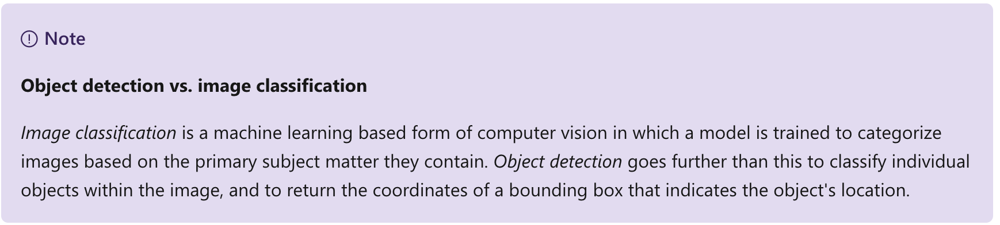
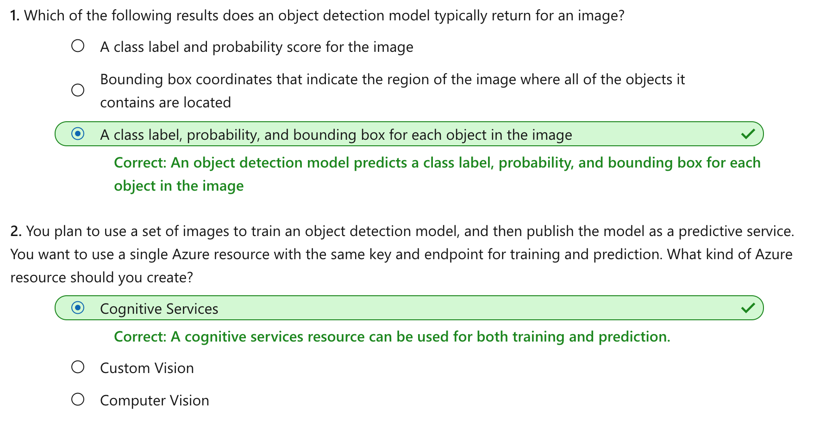

This notebook is refer from the Microsoft resources: [Explore computer vision in Microsoft Azure](https://docs.microsoft.com/en-gb/learn/paths/explore-computer-vision-microsoft-azure/).

### Module 3: Detect objects in images with the Custom Vision service

Object detection is a form of computer vision in which artificial intelligence (AI) agents can identify and locate specific types of object in an image or camera feed.

### Topic 1: Introduction

*Object detection* is a form of machine learning based computer vision in which a model is trained to **recognize individual types of object in an image**, and to **identify their location in the image**.

For example, consider the following image:

An object detection model might be used to identify the individual objects in this image and return the following information:

Notice that an object detection model returns the following information:

- The *class* of each object identified in the image.

- The *probability score* of the object classification (which you can interpret as the confidence of the predicted class being correct)

- The coordinates of a *bounding box* for each object.

#### 1.1 Uses of object detection

Some sample applications of object detection include:

- Evaluating the safety of a building by looking for fire extinguishers or other emergency equipment.

- Creating software for self-driving cars or vehicles with *lane assist* capabilities.

- Medical imaging such as an MRI or x-rays that can detect known objects for medical diagnosis.

### Topic 2: Get started with object detection on Azure

You can create an object detection machine learning model by using advanced deep learning techniques. However, this approach requires significant expertise and a large volume of training data. The **Custom Vision** cognitive service in Azure enables you to create object detection models that meet the needs of many computer vision scenarios with **minimal deep learning expertise and fewer training images**.

#### 2.1 Azure resources for Custom Vision

Creating an object detection solution with Custom Vision consists of three main tasks. First you **must use upload and tag images**, then you can train the model, and finally you **must publish the model** so that client applications can use it to generate predictions.

For each of these tasks, you need a resource in your Azure subscription. You can use the following types of resource:

- **Custom Vision**: A dedicated resource for the custom vision service, which can be either a *training* or a *prediction* resource.

- **Cognitive Services**: A general cognitive services resource that includes Custom Vision along with many other cognitive services. You can use this type of resource for *training*, *prediction*, or *both*.

The separation of training and prediction resources is useful when you want to track resource utilization for model training separately from client applications using the model to predict image classes. However, it can make development of an image classification solution a little confusing.

The simplest approach is to use a general Cognitive Services resource for both training and prediction. This means you only need to concern yourself with one *endpoint* (the HTTP address at which your service is hosted) and *key* (a secret value used by client applications to authenticate themselves).

If you choose to create a Custom Vision resource, you will be prompted to choose *training*, *prediction*, or *both* - and it's important to note that if you choose "both", then **two** resources are created - one for training and one for prediction.

It's also possible to take a mix-and-match approach in which you use a dedicated Custom Vision resource for training, but deploy your model to a Cognitive Services resource for prediction. For this to work, the training and prediction resources **must be created in the same region**.

#### 2.2 Image tagging

Before you can train an object detection model, **you must tag the classes and bounding box coordinates in a set of training images**. This process can be time-consuming, but the *Custom Vision portal* provides a graphical interface that makes it straightforward. The interface will automatically suggest areas of the image where discrete objects are detected, and you can apply a class label to these suggested bounding boxes or drag to adjust the bounding box area. Additionally, after tagging and training with an initial dataset, the Computer Vision service can use smart tagging to suggest classes and bounding boxes for images you add to the training dataset.

Key considerations when tagging training images for object detection are ensuring that you have sufficient images of the objects in question, preferably from multiple angles; and making sure that the bounding boxes are defined tightly around each object.

#### 2.3 Model training and evaluation

To train the model, you can use the Custom Vision portal, or if you have the necessary coding experience you can use one of the Custom Vision service programming language-specific software development kits (SDKs). Training an object detection model can take some time, depending on the number of training images, classes, and objects within each image.

Model training process is an iterative process in which the Custom Vision service repeatedly trains the model using some of the data, but holds some back to evaluates the model. At the end of the training process, the performance for the trained model is indicated by the following evaluation metrics:

- **Precision**: What percentage of class predictions did the model correctly identify? For example, if there are 10 images of apples, and the model found 7 of them, then the precision is 0.7 (70%).

- **Recall**: What percentage of the class predictions made by the model were correct? For example, if the model predicted that 10 images are oranges, of which eight were actually oranges, then the recall is 0.8 (80%).

- **Mean Average Precision (mAP)**: An overall metric that takes into account both precision and recall across all classes)

#### 2.4 Using the model for prediction

After you've trained the model, and you're satisfied with its evaluated performance, you can publish the model to your prediction resource. When you publish the model, you can assign it a name (the default is "IterationX", where X is the number of times you have trained the model).

To use you model, client application developers need the following information:

- **Project ID**: The unique ID of the Custom Vision project you created to train the model.

- **Model name**: The name you assigned to the model during publishing.

- **Prediction endpoint**: The HTTP address of the endpoints for the prediction resource to which you published the model (not the training resource).

- **Prediction key**: The authentication key for the prediction resource to which you published the model (not the training resource).

### Topic 3: Exercise - Create an object detection solution

The best way to learn about object detection with the Custom Vision service is to explore it for yourself.

#### 3.1 Before you start

To complete this exercise, you'll need the following:

- A Microsoft Azure subscription. If you don't already have one, you can sign up for a free trial at https://azure.microsoft.com.

- A Visual Studio Codespace based on the **MicrosoftDocs/ai-fundamental** GitHub repository. This service provides a hosted instance of Visual Studio Code, in which you'll be able to run the notebooks for the lab exercises.

If you haven't already created a Visual Studio Codespace based on the **MicrosoftDocs/ai-fundamentals** repository, follow these steps to create one:

1. Open [Visual Studio Codespaces](https://online.visualstudio.com/environments/new?name=ai-fundamentals&repo=MicrosoftDocs%2Fai-fundamentals) in a new browser tab; and if prompted, sign in using the Microsoft account associated with your Azure subscription.

2. Create a Codespace with the following settings (if you don't already have a Visual Studio Codespaces billing plan, you'll be prompted to create one):

    - **Codespace Name**: A name for your codespace - for example, **ai-fundamentals**.

    - **Git Repository**: MicrosoftDocs/ai-fundamentals

    - **Instance Type**: Standard (Linux) 4 cores, 8GB RAM

    - **Suspend idle Codespace after**: 30 minutes
    
3. Wait for the codespace to be created. This will take around 3 minutes, during which time:

    - A script will initialize and configure your codespace.
    
    - A list of notebook (.ipynb) files will appear in the pane on the left.
4. After the Codespace has been created, you can close the **Welcome** and **Creation Log** panes. You can also change the color scheme to suit your preference - just click the ⚙ icon at the bottom left and select a new **Color Theme**. A light color theme is recommended to make it easier to read the Python code in the notebooks.

#### 3.2 Exercise notebook

After you have set up the Visual Studio environment, open the **Object Detection.ipynb** notebook to complete the exercise.

### Topic 4: Knowledge check

### Topic 5: Summary

Detecting objects in images has proven a key element in many applications that help improve safety, provide better medical imaging diagnostics, manage stock levels for inventory management, and even help preserve wildlife. The object detection capabilities in the Custom Vision service make is easy to develop models to support these kinds of scenario.

You can find out more about the Custom Vision service in the service [documentation](https://docs.microsoft.com/en-us/azure/cognitive-services/custom-vision-service).

