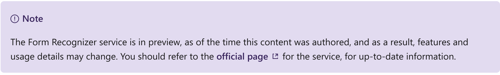
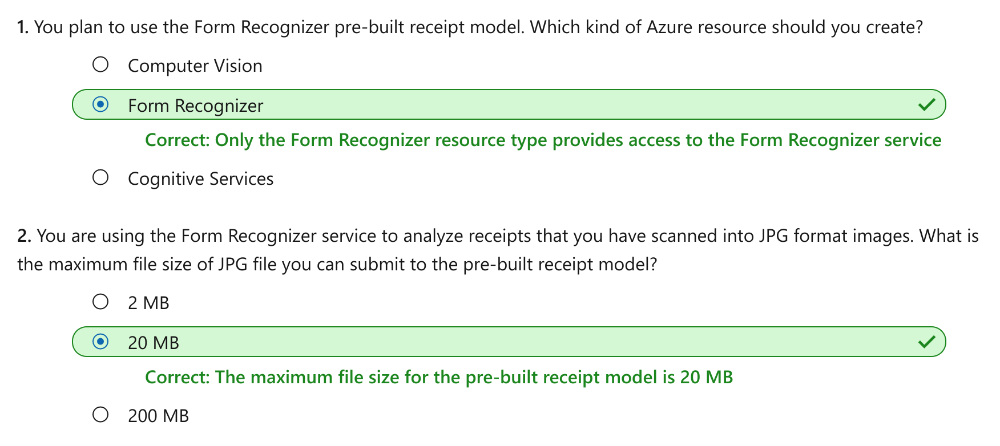

This notebook is refer from the Microsoft resources: [Explore computer vision in Microsoft Azure](https://docs.microsoft.com/en-gb/learn/paths/explore-computer-vision-microsoft-azure/).

### Module 5: Analyze receipts with the Form Recognizer service

Processing invoices and receipts is a common task in many business scenarios. Increasingly, organizations are turning to artificial intelligence (AI) to automate data extraction from scanned receipts.

### Topic 1: Introduction

A common problem in many organizations is the need to process receipt or invoice data. For example, a company might require expense claims to be submitted electronically with scanned receipts, or invoices might need to be digitized and routed to the correct accounts department.

It's relatively easy to scan receipts to create digital images or PDF documents, and it's possible to use optical character recognition (OCR) technologies to extract the text contents from the digitized documents. However, typically someone still needs to review the extracted text to make sense of the information it contains.

For example, consider the following receipt.

The receipt contains information that might be required for an expense claim, including:

- The name, address, and telephone number of the merchant.

- The date and time of the purchase.

- The quantity and price of each item purchased.

- The subtotal, tax, and total amounts.

Increasingly, organizations with large volumes of receipts and invoices to process are looking for artificial intelligence (AI) solutions that can not only extract the text data from receipts, but also intelligently interpret the information they contain.

### Topic 2: Get started with receipt analysis on Azure

The **Form Recognizer** service in Azure provides intelligent form processing capabilities that you can use to automate the processing of data in documents such as forms, invoices, and receipts. It combines state-of-the-art optical character recognition (OCR) with predictive models that can interpret form data by:

- Matching field names to values.

- Processing tables of data.

- Identifying specific types of field, such as dates, telephone numbers, addresses, totals, and others.

Form Recognizer supports automated document processing through:

- **Custom models**, which enable you to extract what are known as key/value pairs and table data from forms. Custom models are trained using your own data, which helps to tailor this model to your specific forms. Staring with only five samples of your forms, you can train the custom model. After the first training exercise, you can evaluate the results and consider if you need to add more samples and re train.

- **A pre-built receipt model** that is provided out-of-the-box, and is trained to recognize and extract data from sales receipts.

#### 2.1 Azure resources for Form Recognizer

To use the Form recognizer service, you must create a **Form Recognizer** resource in your Azure subscription.

After the resource has been created, you can create client applications that use its **key** and **endpoint** to connect submit forms for analysis.

#### 2.2 Using the pre-built receipt model

Currently the pre-built receipt model is designed to recognize common receipts, in English, that are common to the USA. Examples are receipts used at restaurants, retail locations, and gas stations. The model is able to extract key information from the receipt slip:

- time of transaction

- date of transaction

- merchant information

- taxes paid

- receipt totals

- other pertinent information that may be present on the receipt

- all text on the receipt is recognized and returned as well

The pre-built receipt model does specify input requirements. Adherence to the following input criteria will yield the best results when using the model.

- Images must be JPEG, PNG, BMP, PDF, or TIFF formats

- File size must be less than 20 MB

- Image size between 50 x 50 pixels and 10000 x 10000 pixels

- For PDF documents, no larger than 17 inches x 17 inches

There is a free tier subscription plan for the receipt model along with paid subscriptions. For the free tier, only the first 200 pages will be processed when passing in PDF or TIFF formatted documents.

### Topic 3: Exercise - Analyze receipts with Form Recognizer

The best way to learn how to process receipts with the Form Recognizer service is to explore it for yourself.

#### 3.1 Before you start

To complete this exercise, you'll need the following:

- A Microsoft Azure subscription. If you don't already have one, you can sign up for a free trial at https://azure.microsoft.com.

- A Visual Studio Codespace based on the **MicrosoftDocs/ai-fundamentals** GitHub repository. This service provides a hosted instance of Visual Studio Code, in which you'll be able to run the notebooks for the lab exercises.

If you haven't already created a Visual Studio Codespace based on the **MicrosoftDocs/ai-fundamentals** repository, follow these steps to create one:

1. Open [Visual Studio Codespaces](https://online.visualstudio.com/environments/new?name=ai-fundamentals&repo=MicrosoftDocs%2Fai-fundamentals) in a new browser tab; and if prompted, sign in using the Microsoft account associated with your Azure subscription.

2. Create a Codespace with the following settings (if you don't already have a Visual Studio Codespaces billing plan, you'll be prompted to create one):

    - **Codespace Name**: A name for your codespace - for example, **ai-fundamentals**.

    - **Git Repository**: MicrosoftDocs/ai-fundamentals

    - **Instance Type**: Standard (Linux) 4 cores, 8GB RAM

    - **Suspend idle Codespace after**: 30 minutes
    
3. Wait for the codespace to be created. This will take around 3 minutes, during which time:

    - A script will initialize and configure your codespace.

    - A list of notebook (.ipynb) files will appear in the pane on the left.
    
4. After the Codespace has been created, you can close the **Welcome** and **Creation Log** panes. You can also change the color scheme to suit your preference - just click the ⚙ icon at the bottom left and select a new **Color Theme**. A light color theme is recommended to make it easier to read the Python code in the notebooks.

#### 3.2 Exercise notebook

After you have set up the Visual Studio environment, open the **Receipts with Form Recognizer.ipynb** notebook to complete the exercise.

### Topic 4: Knowledge check

### Topic 5: Summary

The pre-built receipt model is a part of the Form Recognizer service. It is optimized to extract information from receipts. Capable of reading from restaurant, retail, and gas company receipts, it can help automate expense workflows for businesses by extracting key data from the receipts.

You can find out more about reading text with the Computer Vision service in the [service documentation](https://docs.microsoft.com/en-us/azure/cognitive-services/form-recognizer).

