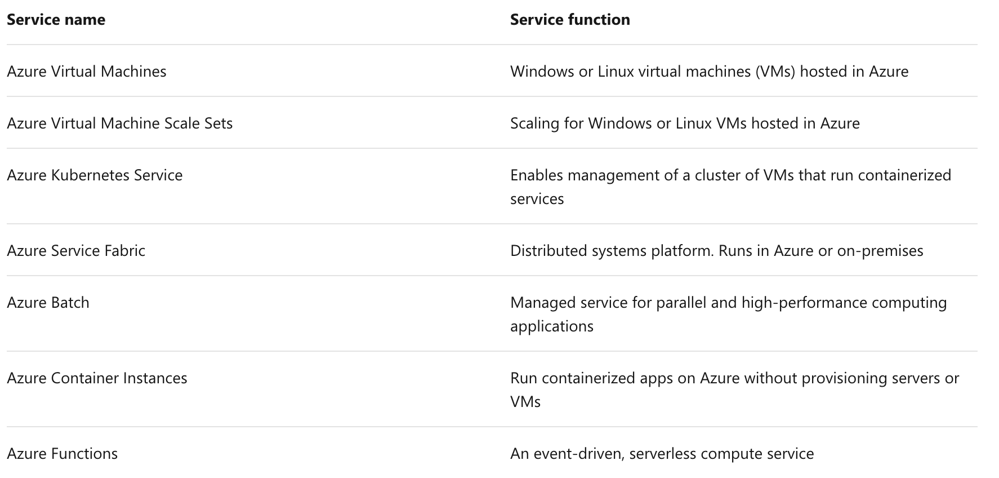
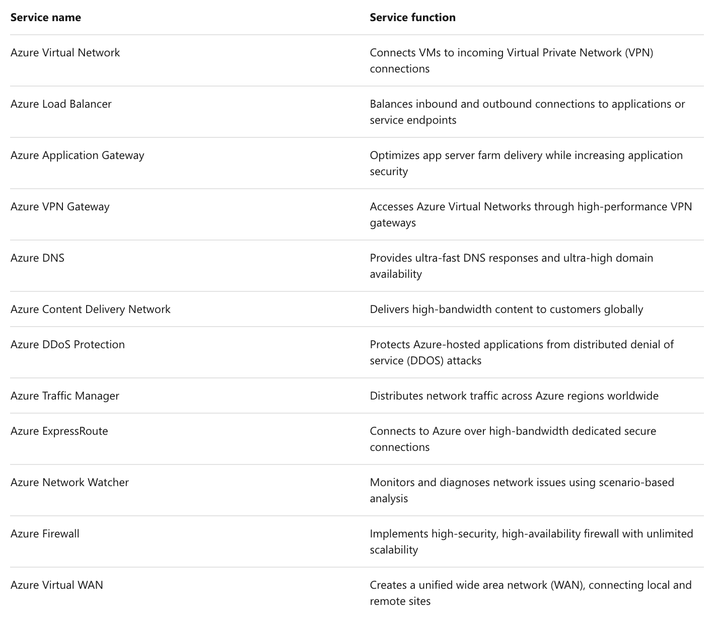
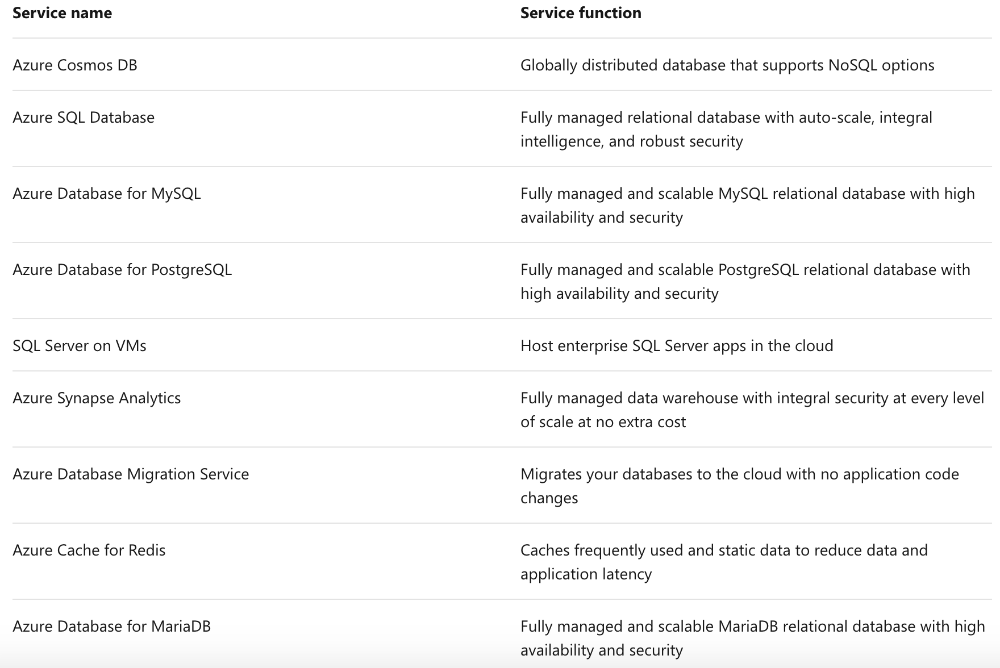
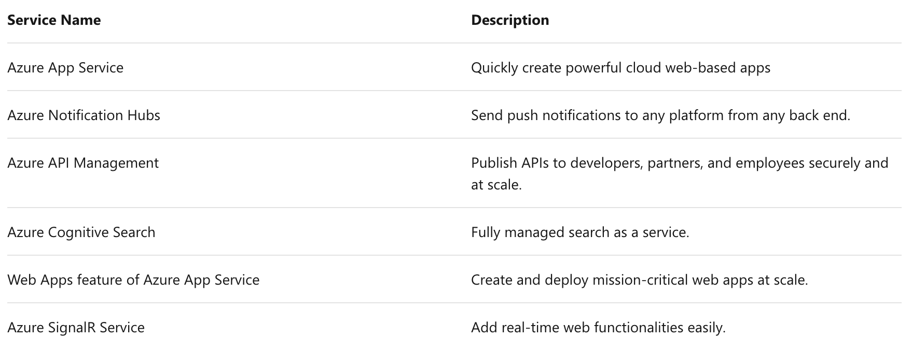
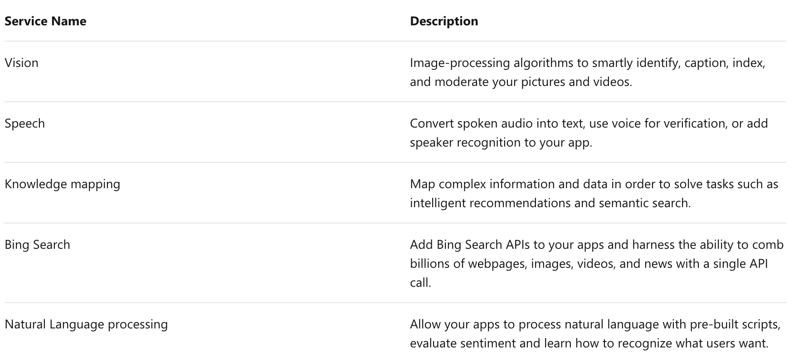
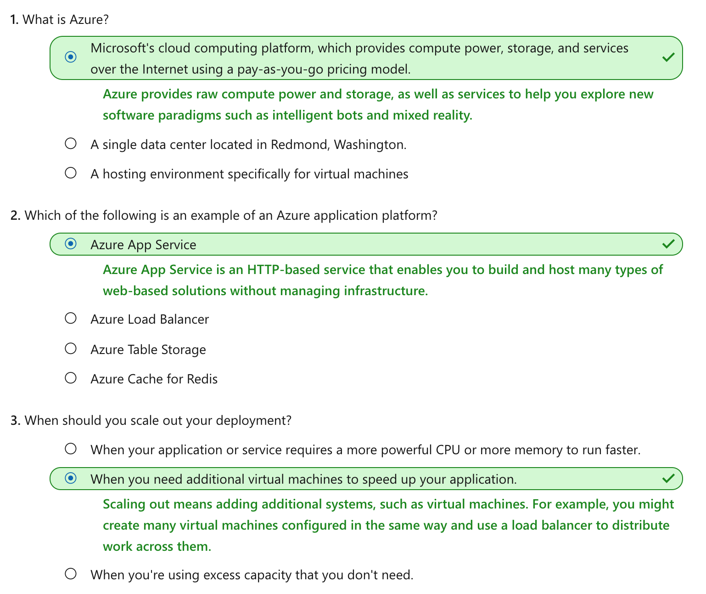

Core Cloud Services - Introduction to Azure
================

This notebook is refer from the Microsoft resources: [Azure fundamentals](https://docs.microsoft.com/en-gb/learn/paths/azure-fundamentals/).

Get started with Azure by creating and configuring your first website in the cloud.

### Topic 1: Introduction

You've heard buzzwords about the cloud—scale, elasticity, microservices. Perhaps you've seen other companies be successful with the cloud and wondered how it could help you meet your business challenges or even grow your career. Did you know that more than 90% of Fortune 500 companies run on the Microsoft Cloud?

The cloud helps power your everyday life, and it's often present in ways you don't even realize. In this new connected world, we believe technology creates opportunity. To keep up with today's ever-changing digital world, understanding cloud technology can help align your career to this exciting revolution.

In less time than it takes to eat lunch, you'll create and configure your first website on Azure, a foundational building block of everything from digital transformation to the next big startup.

In this module, you will:

-   Learn **what** Microsoft Azure is and **how** it relates to cloud computing

-   **Deploy** and **configure** a web server

-   Learn how to **scale** up your server to give you more compute power

-   Use Azure Cloud Shell to **interact** with your web server

### Topic 2: What is Azure?

Azure is Microsoft's **cloud computing platform**. Azure is a continually expanding set of cloud services that help your organization meet your current and future business challenges. Azure gives you the freedom to build, manage, and deploy applications on a massive global network using your favorite tools and frameworks.

Before we go further, let's briefly define cloud computing.

#### 2.1 What is cloud computing? 

Cloud computing is the delivery of computing services over the Internet using a **pay-as-you-go** pricing model. Put another way; it's a way to **rent compute power and storage from someone else's data center**.

Instead of maintaining CPUs and storage in your data center, you rent them for the time that you need them. The cloud provider takes care of maintaining the underlying infrastructure for you.

You can treat cloud resources like you would your resources in your own data center. When you're done using them, you give them back. You're billed only for what you use.

While this approach is great, the real value of the cloud is that it enables you to quickly solve your toughest business challenges and bring cutting edge solutions to your users.

#### 2.2 Why should I move to the cloud? 

The cloud helps you move faster and innovate in ways that were once nearly impossible.

In our ever-changing digital world, two trends emerge:

-   Teams are delivering new features to their users at record speeds.

-   End users expect an increasingly rich and immersive experience with their devices and with software.

Software releases were once scheduled in terms of months or even years. Today, teams are releasing features in smaller batches. Releases are now often scheduled in terms of days or weeks. Some teams even deliver software updates continuously—sometimes with multiple releases within the same day.

Think of all the ways you interact with devices that you couldn't do just a few years ago. Many devices can recognize your face and respond to voice commands. Augmented reality changes the way you interact with the physical world. Household appliances are even beginning to act intelligently. These technologies are just a few examples, many of which are powered by the cloud.

To power your services and deliver innovative and novel user experiences more quickly, the cloud provides on-demand access to:

-   A nearly **limitless** pool of raw compute, storage, and networking components.

-   **Speech recognition** and other **cognitive services** that help make your application stand out from the crowd.

-   **Analytics services** that enable you to make sense of telemetry data coming back from your software and devices.

#### 2.3 What can I do on Azure? 

Azure provides over 100 services that enable you to do everything from running your existing applications on virtual machines to exploring new software paradigms such as **intelligent bots** and **mixed reality**.

Many teams start exploring the cloud by moving their existing applications to virtual machines that run in Azure. While migrating your existing apps to virtual machines is a good start, the cloud is more than just "a different place to run your virtual machines".

For example, Azure provides **AI and machine-learning services** that can naturally communicate with your users through **vision, hearing, and speech**. It also provides storage solutions that dynamically grow to accommodate massive amounts of data. Azure services enable solutions that are not feasible without the power of the cloud.

### Topic 3: Tour of Azure services

Azure can help you tackle tough business challenges. You bring your requirements, creativity, and favorite software development tools. Azure brings a massive global infrastructure that's always available for you to build your applications on.

Let's take a quick tour of the high-level services Azure offers.

#### 3.1 Azure services

Here's a big-picture view of the available services and features in Azure.

Let's take a closer look at the most commonly used categories:

-   Compute

-   Networking

-   Storage

-   Mobile

-   Databases

-   Web

-   Internet of Things

-   Big Data

-   Artificial Intelligence

-   DevOps

##### 3.1.1 Compute

Compute services are often one of the primary reasons why companies move to the Azure platform. Azure provides a range of options for hosting applications and services. Here are some examples of compute services in Azure:

##### 3.1.2 Networking

Linking compute resources and providing access to applications is the key function of Azure networking. Networking functionality in Azure includes a range of options to connect the outside world to services and features in the global Microsoft Azure datacenters.

Azure networking facilities have the following features:

##### 3.1.3 Storage

Azure provides four main types of storage services. These services are:

These services all share several common characteristics:

-   **Durable** and highly available with redundancy and replication.

-   **Secure** through automatic encryption and role-based access control.

-   **Scalable** with virtually unlimited storage.

-   **Managed**, handling maintenance and any critical problems for you.

-   **Accessible** from anywhere in the world over HTTP or HTTPS.

##### 3.1.4 Mobile

Azure enables developers to create mobile backend services for iOS, Android, and Windows apps quickly and easily. Features that used to take time and increase project risks, such as adding corporate sign-in and then connecting to on-premises resources such as SAP, Oracle, SQL Server, and SharePoint, are now simple to include.

Other features of this service include:

-   Offline data synchronization.

-   Connectivity to on-premises data.

-   Broadcasting push notifications.

-   Autoscaling to match business needs.

##### 3.1.5 Databases

Azure provides multiple database services to store a wide variety of data types and volumes. And with global connectivity, this data is available to users instantly.

##### 3.1.6 Web

Having a great web experience is critical in today's business world. Azure includes first-class support to build and host web apps and HTTP-based web services. The Azure services focused on web hosting include:

##### 3.1.7 Internet of Things

People are able to access more information than ever before. It began with personal digital assistants (PDAs), then morphed into smartphones. Now there are smart watches, smart thermostats, even smart refrigerators. Personal computers used to be the norm. Now the internet allows any item that's online-capable to access valuable information. **This ability for devices to garner and then relay information for data analysis is referred to as the Internet of Things (IoT)**.

There are a number of services that can assist and drive end-to-end solutions for IoT on Azure.

##### 3.1.8 Big Data

Data comes in all formats and sizes. When we talk about Big Data, we're referring to **large volumes** of data. Data from weather systems, communications systems, genomic research, imaging platforms, and many other scenarios generate hundreds of gigabytes of data. This amount of data makes it hard to analyze and make decisions. It's often so large that traditional forms of processing and analysis are no longer appropriate.

Open source **cluster** technologies have been developed to deal with these large data sets. Microsoft Azure supports a broad range of technologies and services to provide big data and analytic solutions.

##### 3.1.9 Artificial Intelligence

Artificial Intelligence, in the context of cloud computing, is based around a broad range of services, the core of which is Machine Learning. Machine Learning is a data science technique that allows computers to use existing data to forecast future behaviors, outcomes, and trends. Using machine learning, computers learn without being explicitly programmed.

Forecasts or predictions from machine learning can make apps and devices smarter. For example, when you shop online, machine learning helps recommend other products you might like based on what you've purchased. Or when your credit card is swiped, machine learning compares the transaction to a database of transactions and helps detect fraud. And when your robot vacuum cleaner vacuums a room, machine learning helps it decide whether the job is done.

Some of the most common Artificial Intelligence and Machine Learning service types in Azure are:

A closely related set of products are the cognitive services. These are pre-built APIs you can leverage in your applications to solve complex problems.

##### 3.1.10 DevOps

DevOps (Development and Operations) brings together people, processes, and technology, automating software delivery to provide continuous value to your users. Azure DevOps Services allows you to create build and release pipelines that provide continuous integration, delivery, and deployment for your applications. You can integrate repositories and application tests, perform application monitoring, and work with build artifacts. You can also work with and backlog items for tracking, automate infrastructure deployment and integrate a range of third-party tools and services such as Jenkins and Chef. All of these functions and many more are closely integrated with Azure to allow for consistent, repeatable deployments for your applications to provide streamlined build and release processes.

Some of the main DevOps services available with Azure are Azure DevOps Services and Azure DevTest Labs.

### Topic 4: Exercise - Create a website hosted in Azure

As a technology professional, you likely have expertise in a specific area. Perhaps you're a storage admin or virtualization expert, or maybe you focus on the latest security practices. If you're a student, you may still be exploring what interests you most.

No matter your role, most people get started with the cloud by creating a website. Here you'll deploy a website hosted in an App Service.

Let's review some basic terms and get your first website up and running.

#### 4.1 What is an App Service?

Azure App Service is an HTTP-based service that enables you to build and host many types of web-based solutions without managing infrastructure. For example, you can host web apps, mobile back ends, and RESTful APIs in several supported programming languages. Applications developed in .NET, .NET Core, Java, Ruby, Node.js, PHP, or Python can run in and scale with ease on both Windows and Linux-based environments.

We aim to create a website in less than the time it takes to eat lunch. Therefore, we're not going to write any code and will instead deploy a predefined application from the Microsoft Azure Marketplace.

#### 4.2 What is the Microsoft Azure Marketplace?

The Microsoft Azure Marketplace is an online store that hosts applications that are certified and optimized to run in Azure. Many types of applications are available, ranging from AI + Machine Learning to Web applications. As you'll see in a couple of minutes, deployments from the store are done via the Azure portal using a wizard-style user interface. This user interface makes evaluating different solutions easy.

We're going to use one of the WordPress application options from the Azure Marketplace for our website.

#### 4.3 Creating resources in Azure

Typically, the first thing we'd do is to create a resource group to hold all the things that we need to create. The resource group allows us to administer all the services, disks, network interfaces, and other elements that potentially make up our solution as a unit. We can use the Azure portal to create and manage our solution's resource groups. However, keep in mind that you can also manage resources via a command line using the Azure CLI. The Azure CLI is a useful option should you need to automate the process in the future.

In the free Azure sandbox environment, you'll use the pre-created resource group **learn-6d691a9f-2e9e-45de-b18f-fdcdac189424**, and you don't need to do this step.

#### 4.4 Choosing a location

The free sandbox allows you to create resources in a subset of the Azure global regions. Select a region from this list when you create resources:

-   westus2

-   southcentralus

-   centralus

-   eastus

-   westeurope

-   southeastasia

-   japaneast

-   brazilsouth

-   australiasoutheast

-   centralindia

#### 4.5 Create a WordPress website

1.  If you haven't already, verify that you have activated the sandbox above. Activating the sandbox will allocate the subscription and resource group you will use in this exercise. This step is required for any Microsoft Learn exercises that use a sandbox.

2.  Sign in to the Azure portal using the same account you activated the sandbox with.

1.  Expand the left-hand navigation panel.

2.  From the top of the Azure portal navigation list, select **Create a resource**.

This option takes you to the **Azure Marketplace**.

1.  The Azure Marketplace has many services, solutions, and resources available for you to use. Since we know that we want to install WordPress, we can do a quick search for it. In the **Search the Marketplace** box above the listed application options, type in **WordPress**. Select the default WordPress option from the list of options available.

1.  In the newly presented panel, you'll typically find additional information about the item you're about to install, including the publisher, a brief description of the resource, and links to more information. Make sure to review this information. Select Create to begin the process to **create** a WordPress app.

1.  Next, you're presented several options to configure your deployment. Enter the following information:

    1.  **App Name**: Choose a unique value for the App name. It will form part of a Fully Qualified Domain Name (FQDN).

    2.  **Subscription**: Make sure the **Concierge Subscription** is selected.

    3.  **Resource Group**: Select the **Use existing** radio button, then select the **learn-6d691a9f-2e9e-45de-b18f-fdcdac189424** resource group from the drop-down list.

    4.  **Database Provider**: Select **MySQL in App**.

    5.  **App Service plan/location**: You'll change the App Service plan in the next step.

    6.  **Application Insights**: Leave at the default configuration.

    7.  Your configuration should look like this:

    Your configuration should look like this:

1.  Now let's configure the App Service plan to use a specific pricing tier. The App Service plan specifies the compute resources and location for the web app. Select **App Service plan/location**.

1.  In the **App Service plan panel**, select **Create new**.

1.  In the **New App Service plan panel**, enter a **name** for the new service plan.

2.  For **Location**, pick **Central US** to make sure we pick a region that allows the service plan you will pick. Normally, you would pick the region that is closest to your customers while offering the services you need.

3.  Select **Pricing tier** to see the performance and feature options of the various types of service plans.

4.  The **Spec Picker** allows us to select a new pricing tier for our application. This screen opens to the Production tab, with the S1 pricing tier selected. We'll select a new pricing tier from the Dev / Test tab for our website.

Select the **Dev / Test** tab and select the **F1** pricing tier. Then select Apply.

1.  Back on the **New App Service plan** panel, select **OK** to create the new plan and close the panel.

2.  Finally, select the **Create** button to start the deployment of your new site.

#### 4.6 Verify your website is running

The deployment of the new website can take a few minutes to complete, and you're welcome to explore the portal further on your own.

We can track the progress of the deployment at any time.

1.  Select the **notification bell** icon at the top of the portal. If your browser window width is smaller, it may be shown when you click on the ellipsis (...) icon at the top right.

1.  Select **Deployment in progress...** to see the details about all the resources that are created.

Notice how resources are listed as they're created and the status changes to a green check as each component in the deployment completes.

1.  Once the deployment status message change to **Your deployment is complete**, you'll notice the status in the notification dialogue changes to **Deployment succeeded**. Select **Go to resource** to navigate to the App Service overview.

1.  Find the URL in the Overview section.

Copy the **URL** information. Open a new tab in your browser and use the information to browse to your new WordPress site. You can now configure your WordPress website and add content.

### Topic 5: Exercise - Configure an App Service

Recall from earlier, that we're using an App Service to run our WordPress application. Here we'll look at additional information exposed about our application and explore some of the available options to configure our website.

Let's have a look at some of this information.

1.  Open the Azure portal .

2.  From the left-hand navigation menu, select **Dashboard** to access a list of all resources in your subscription. You may have to click the menu icon to show the navigation choices.

1.  Select the **App Service** with the name you chose it in the previous exercise.

1.  By default, the app service's overview is displayed, if not select **Overview**.

1.  Scroll down in the overview view to where you can see the graphs for your newly created website. These graphs provide statistics about the number of requests received by our website, the amount of data in, data out, and the number of errors encountered on the site.

The information displayed here is near real-time data and gives a quick overview of the performance of your website. Problems with the site's performance will manifest in these graphs as early warnings.

#### 5.1 What is scale?

Suppose you deployed your website and it becomes popular. By looking at the graphs in the overview, you realize that your site can't effectively manage all the requests it's receiving. To solve the problem, you'll need to increase the server's hardware capacity.

Scale refers to adding network bandwidth, memory, storage, or compute power to achieve better performance.

You may have heard the terms **scaling up** and **scaling out**.

**Scaling up**, or vertical scaling means to **increase** the **memory**, **storage**, or **compute power** on an existing virtual machine. For example, you can add additional memory to a web or database server to make it run faster.

**Scaling out**, or horizontal scaling means to **add extra virtual machines** to power your application. For example, you might create many virtual machines configured in exactly the same way and use a load balancer to distribute work across them.

When you have more time, feel free to go through each section and explore the various options available.

#### 5.2 How to change the App Service configuration

The App Services has many configurable options available and groups these options in sections of functionality.

The first section displayed is a group of common options you'd access to get a view of the health of your application. However, each following section provides additional functionality and information.

For example, the **Settings** section gives you access to configure various aspects such as application settings, backups, custom domains, TLS/SSL settings, options to scale up the resources of the application, and so on.

#### 5.3 Scale up your App Service

1.  In the **Settings** configuration section for your app service, select **Scale up (App service plan)**.

1.  Notice that there are three workload categories to choose from in the configuration pane. These three categories make it easier to decide the type of workload we'll run.

Within each category, there are pricing tiers that will allow us to scale the resources available to our App service. These pricing tiers give us access to the additional features mentioned above.

We'll leave the configuration on the F1 tier, but know that this pane is where you can go to make scaling adjustments in your app service if you have changes in load for your application.

Let's now take a look at how to use the Cloud Shell to configure Azure resources, such as App Service.

### Topic 6: Exercise - Access an App Service using Azure Cloud Shell

The Azure portal offers a convenient **user interface** to *search*, *install*, and *access* the various Azure offerings available. You'll find, however, some of these tasks are repetitive and are candidates for automation using a command-line enabled interface.

#### 6.1 What is Azure Cloud Shell?

Azure Cloud Shell is a **browser-based command-line** experience for managing and developing Azure resources. Think of Cloud Shell as an interactive console that you run in the cloud.

Cloud Shell provides two experiences to choose from, **Bash** and **PowerShell**. Both include access to the Azure command-line interface called Azure CLI and to Azure PowerShell.

You can use any Azure management interface, including the Azure portal, Azure CLI, and Azure PowerShell, to manage Azure resources. For learning purposes, here you'll use the Azure CLI to start and stop the WordPress site we created earlier.

Suppose you have several websites deployed and want to stop or start each of these websites without accessing each App service individually using the portal. This effort is an easy task that you can convert into a script using Cloud Shell and Azure CLI.

In this exercise, you'll use the Cloud Shell window shown side by side with the exercise instructions. When normally accessing the Cloud Shell from within the Azure portal, you'll click the Cloud Shell icon from the top navigation bar. This icon is sometimes within the ellipsis (...) menu icon next to your profile.

For this exercise, we'll use the Cloud Shell experience as part of our sandbox implementation.

1.  Our first step is to make sure that we work with the correct Azure subscription before we change any settings. We'll use the `az account list` list command. By default, the command returns a JSON string. However, we'll format the output as a table to make the information easier to work with. Run the following command.

Azure CLI:

    az account list --output table

1.  Recall that we used a pre-created resource group called **learn-5f08148d-b5aa-4aa6-8393-8165ef04776b** when we created our website. However, if you ever need to list all the resource groups in a subscription, then you'll run the `az group list` command.

Azure CLI:

    az group list --output table

1.  Next, we'll list all the resources in the **learn-5f08148d-b5aa-4aa6-8393-8165ef04776b** using the `az resource list` command. The command will return a list of resources. By specifying, `--resource-type` we can filter the result to include only the resource information related to websites.

Run the following command.

Azure CLI:

    az resource list \
        --resource-group learn-5f08148d-b5aa-4aa6-8393-8165ef04776b \
        --resource-type Microsoft.Web/sites

Here an example of the command's output:

JSON:

    {
    "id": "/subscriptions/xxxxxxxx-xxxx-xxxx-xxxx-xxxxxxxxxxx/resourceGroups/learn-5f08148d-b5aa-4aa6-8393-8165ef04776b/providers/Microsoft.Web/sites/BlogFor",
    "identity": null,
    "kind": "app",
    "location": "centralus",
    "managedBy": null,
    "name": "MyWebApp",
    "plan": null,
    "properties": null,
    "resourceGroup": "learn-5f08148d-b5aa-4aa6-8393-8165ef04776b",
    "sku": null,
    "tags": null,
    "type": "Microsoft.Web/sites"
    }

Copy the value of `name`. We'll use it in the next steps to first stop and then start our website.

1.  We'll use the `az webapp stop` command to stop the web application running in our app service. Replace `<web app name>` with the name of your web app you copied, then run this command to stop your web app.

Azure CLI:

    az webapp stop \
        --resource-group learn-5f08148d-b5aa-4aa6-8393-8165ef04776b \
        --name <web app name>

1.  Open the website in a new browser tab. You'll find the URL to the site in the overview of the App service in the portal. You'll see a message in your browser that reads:

1.  Finally, let's start the web app by running the `az webapp start` command. Replace `<web app name>` with the name of your web app you copied, then run this command to start your web app.

Azure CLI:

    az webapp start \
        --resource-group learn-5f08148d-b5aa-4aa6-8393-8165ef04776b \
        --name <web app name>

1.  Switch back to the tab for your website and refresh the page. Your website will be available after a couple of seconds.

### Topic 7: Knowledge Check

### Topic 8: Summary

Nice work! With your first website under your belt, you now have a sense of how Azure works and how easy it is to bring up a system, configure some software, and tear everything down when it's no longer needed.

Azure provides services that can help transform the way your organization delivers new features to your users in ways you simply can't do without the power of the cloud.

#### 8.1 Clean up

The sandbox automatically cleans up your resources when you're finished with this module.

When you're working in your own subscription, it's a good idea at the end of a project to identify whether you still need the resources you created. Resources left running can cost you money. You can delete resources individually or delete the resource group to delete the entire set of resources.

#### 8.2 Continue your Azure journey

Microsoft Learn provides learning paths based on your role and interests.

You've taken your first step on the *Azure fundamentals* learning path. Keep going to learn how Azure services such as compute, storage, networking, and security can help you unlock the power of the cloud and create that next great breakthrough idea.

If you're currently an AWS user and would like to learn more about Azure services, refer to our *article on comparing AWS to Azure services* on the Azure Architecture Center.
