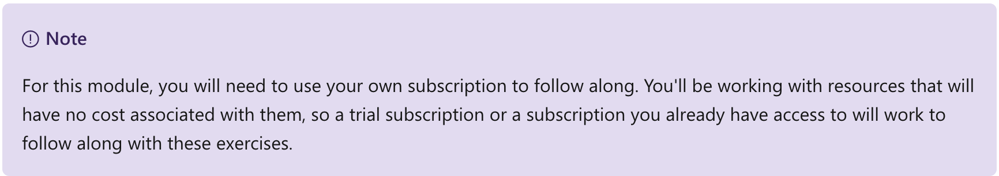

This notebook is refer from the Microsoft resources: [Azure fundamentals](https://docs.microsoft.com/en-gb/learn/paths/azure-fundamentals/).

Use Azure Resource Manager to organize resources, enforce standards, and protect critical assets from deletion.

### Topic 1: Introduction

Imagine you've joined a company who has been moving to the cloud. This movement happened organically across different departments, and resulted in a lack of awareness of what's already been created and where everything is. There's no ability to easily determine who owns which resources. There's no enforcement of standards for things like resource names, resource sizes, and geographic locations. There's also been several instances where critical resources were inadvertently deleted, causing business-critical outages.

Your manager has asked you to head up an effort to put some order into the chaos, but you're new to Azure and aren't entirely sure what you can do to make this better.

Azure Resource Manager has a number of features that you can use to organize resources, enforce standards, and protect critical Azure resources from accidental deletion. You'll take a tour through these features, and show how you can use them to your advantage.

#### Learning objectives

In this module, you will:

- Use resource groups to organize Azure resources

- Use tags to organize resources

- Apply policies to enforce standards in your Azure environments

- Use resource locks to protect critical Azure resources from accidental deletion

### Topic 2: Principles of resource groups

### Topic 3: Use tagging to organize resources

### Topic 4: Use policies to enforce standards

### Topic 5: Secure resources with role-based access control

### Topic 6: Use resource locks to protect resources

### Topic 7: Check your Knowledge

### Topic 8: Summary

