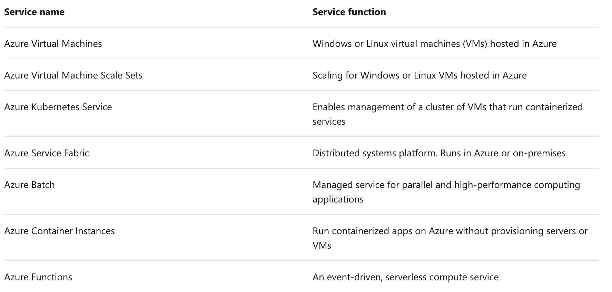
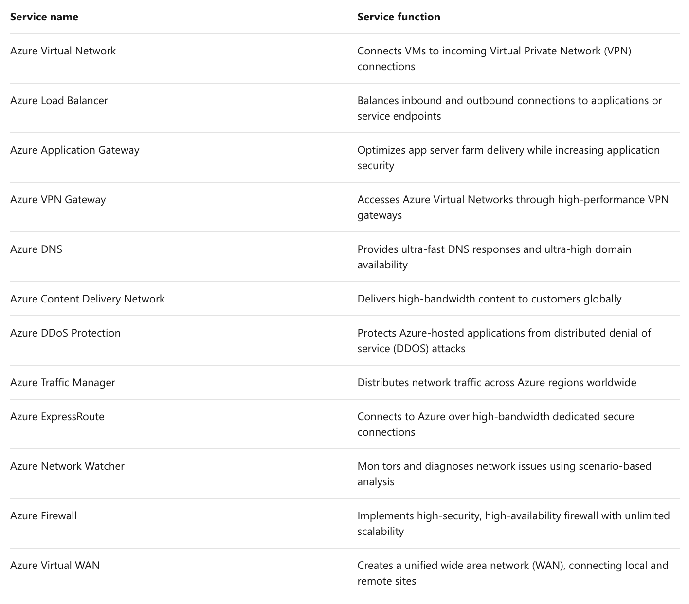
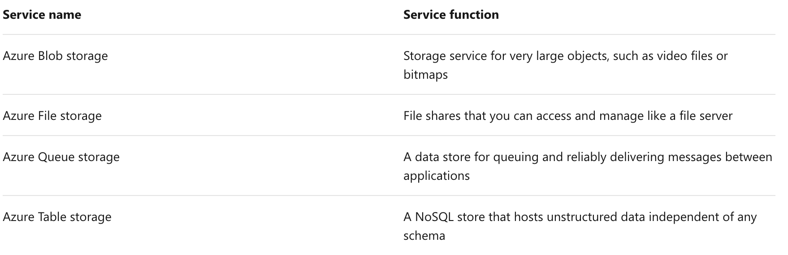
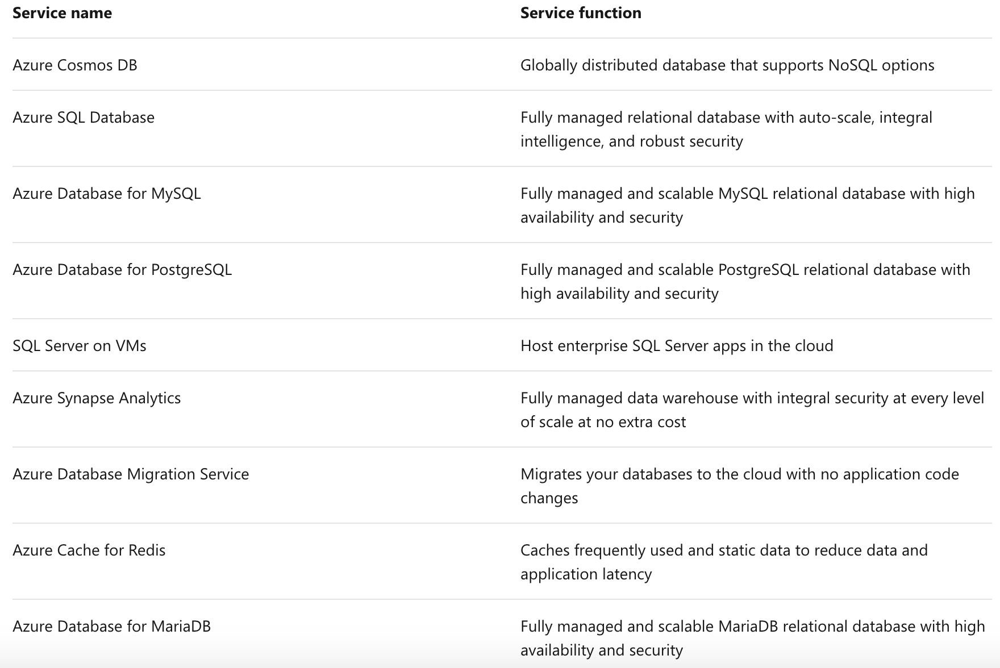
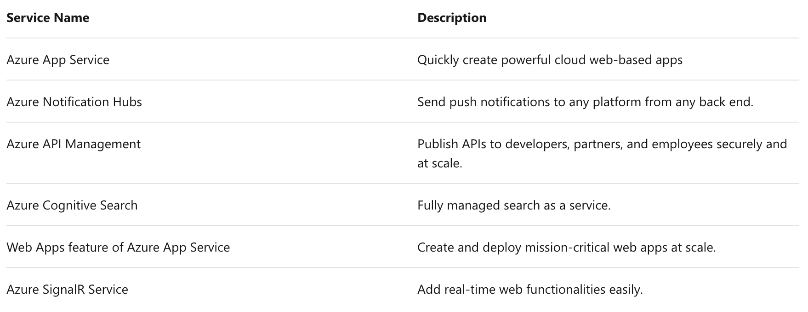
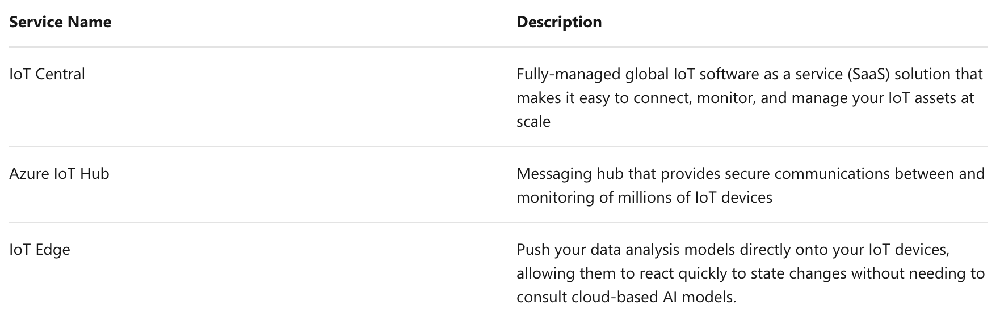
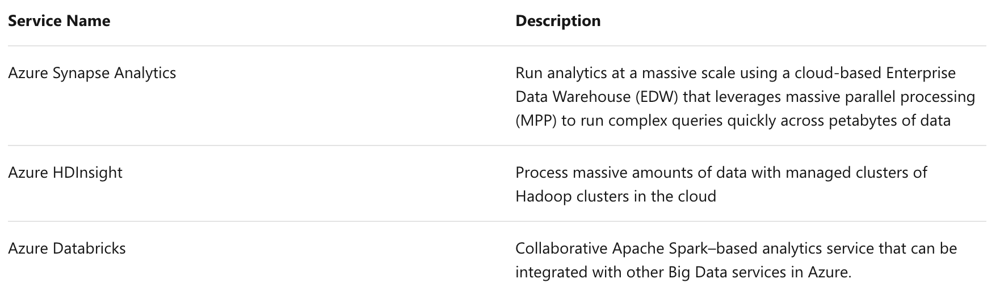
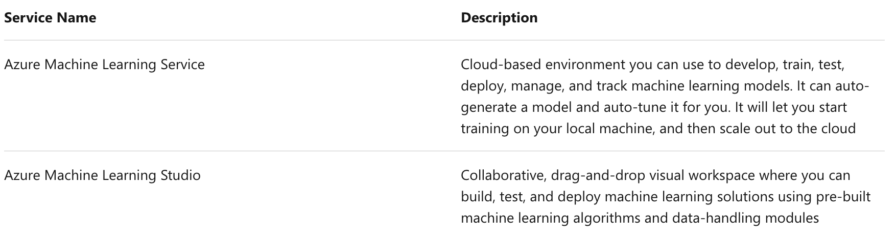
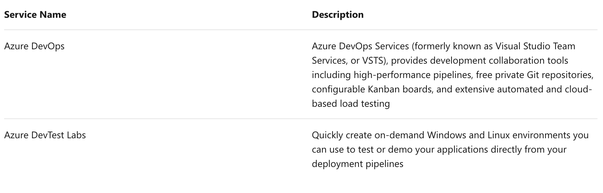

This notebook is refer from the Microsoft resources: [Azure fundamentals](https://docs.microsoft.com/en-gb/learn/paths/azure-fundamentals/).

### Topic 1: Introduction

You've heard buzzwords about the cloud—scale, elasticity, microservices. Perhaps you've seen other companies be successful with the cloud and wondered how it could help you meet your business challenges or even grow your career. Did you know that more than 90% of Fortune 500 companies run on the Microsoft Cloud?

The cloud helps power your everyday life, and it's often present in ways you don't even realize. In this new connected world, we believe technology creates opportunity. To keep up with today's ever-changing digital world, understanding cloud technology can help align your career to this exciting revolution.

In less time than it takes to eat lunch, you'll create and configure your first website on Azure, a foundational building block of everything from digital transformation to the next big startup.

In this module, you will:

- Learn **what** Microsoft Azure is and **how** it relates to cloud computing

- **Deploy** and **configure** a web server

- Learn how to **scale** up your server to give you more compute power

- Use Azure Cloud Shell to **interact** with your web server

### Topic 2: What is Azure?

Azure is Microsoft's **cloud computing platform**. Azure is a continually expanding set of cloud services that help your organization meet your current and future business challenges. Azure gives you the freedom to build, manage, and deploy applications on a massive global network using your favorite tools and frameworks.

Before we go further, let's briefly define cloud computing.

#### 2.1 What is cloud computing? {width=10% heigth=10%}

Cloud computing is the delivery of computing services over the Internet using a **pay-as-you-go** pricing model. Put another way; it's a way to **rent compute power and storage from someone else's data center**.

Instead of maintaining CPUs and storage in your data center, you rent them for the time that you need them. The cloud provider takes care of maintaining the underlying infrastructure for you.

You can treat cloud resources like you would your resources in your own data center. When you're done using them, you give them back. You're billed only for what you use.

While this approach is great, the real value of the cloud is that it enables you to quickly solve your toughest business challenges and bring cutting edge solutions to your users.

#### 2.2 Why should I move to the cloud? {width=10% heigth=10%}

The cloud helps you move faster and innovate in ways that were once nearly impossible.

In our ever-changing digital world, two trends emerge:

- Teams are delivering new features to their users at record speeds.

- End users expect an increasingly rich and immersive experience with their devices and with software.

Software releases were once scheduled in terms of months or even years. Today, teams are releasing features in smaller batches. Releases are now often scheduled in terms of days or weeks. Some teams even deliver software updates continuously—sometimes with multiple releases within the same day.

Think of all the ways you interact with devices that you couldn't do just a few years ago. Many devices can recognize your face and respond to voice commands. Augmented reality changes the way you interact with the physical world. Household appliances are even beginning to act intelligently. These technologies are just a few examples, many of which are powered by the cloud.

To power your services and deliver innovative and novel user experiences more quickly, the cloud provides on-demand access to:

- A nearly **limitless** pool of raw compute, storage, and networking components.

- **Speech recognition** and other **cognitive services** that help make your application stand out from the crowd.

- **Analytics services** that enable you to make sense of telemetry data coming back from your software and devices.

#### 2.3 What can I do on Azure? {width=10% heigth=10%}

Azure provides over 100 services that enable you to do everything from running your existing applications on virtual machines to exploring new software paradigms such as **intelligent bots** and **mixed reality**.

Many teams start exploring the cloud by moving their existing applications to virtual machines that run in Azure. While migrating your existing apps to virtual machines is a good start, the cloud is more than just "a different place to run your virtual machines".

For example, Azure provides **AI and machine-learning services** that can naturally communicate with your users through **vision, hearing, and speech**. It also provides storage solutions that dynamically grow to accommodate massive amounts of data. Azure services enable solutions that are not feasible without the power of the cloud.

### Topic 3: Tour of Azure services

Azure can help you tackle tough business challenges. You bring your requirements, creativity, and favorite software development tools. Azure brings a massive global infrastructure that's always available for you to build your applications on.

Let's take a quick tour of the high-level services Azure offers.

#### 3.1 Azure services

Here's a big-picture view of the available services and features in Azure.

Let's take a closer look at the most commonly used categories:

- Compute

- Networking

- Storage

- Mobile

- Databases

- Web

- Internet of Things

- Big Data

- Artificial Intelligence

- DevOps

##### 3.1.1 Compute

Compute services are often one of the primary reasons why companies move to the Azure platform. Azure provides a range of options for hosting applications and services. Here are some examples of compute services in Azure:

##### 3.1.2 Networking

Linking compute resources and providing access to applications is the key function of Azure networking. Networking functionality in Azure includes a range of options to connect the outside world to services and features in the global Microsoft Azure datacenters.

Azure networking facilities have the following features:

##### 3.1.3 Storage

Azure provides four main types of storage services. These services are:

These services all share several common characteristics:

- **Durable** and highly available with redundancy and replication.

- **Secure** through automatic encryption and role-based access control.

- **Scalable** with virtually unlimited storage.

- **Managed**, handling maintenance and any critical problems for you.

- **Accessible** from anywhere in the world over HTTP or HTTPS.

##### 3.1.4 Mobile

Azure enables developers to create mobile backend services for iOS, Android, and Windows apps quickly and easily. Features that used to take time and increase project risks, such as adding corporate sign-in and then connecting to on-premises resources such as SAP, Oracle, SQL Server, and SharePoint, are now simple to include.

Other features of this service include:

- Offline data synchronization.

- Connectivity to on-premises data.

- Broadcasting push notifications.

- Autoscaling to match business needs.

##### 3.1.5 Databases

Azure provides multiple database services to store a wide variety of data types and volumes. And with global connectivity, this data is available to users instantly.

##### 3.1.6 Web

Having a great web experience is critical in today's business world. Azure includes first-class support to build and host web apps and HTTP-based web services. The Azure services focused on web hosting include:

##### 3.1.7 Internet of Things

People are able to access more information than ever before. It began with personal digital assistants (PDAs), then morphed into smartphones. Now there are smart watches, smart thermostats, even smart refrigerators. Personal computers used to be the norm. Now the internet allows any item that's online-capable to access valuable information. **This ability for devices to garner and then relay information for data analysis is referred to as the Internet of Things (IoT)**.

There are a number of services that can assist and drive end-to-end solutions for IoT on Azure.

##### 3.1.8 Big Data

Data comes in all formats and sizes. When we talk about Big Data, we're referring to **large volumes** of data. Data from weather systems, communications systems, genomic research, imaging platforms, and many other scenarios generate hundreds of gigabytes of data. This amount of data makes it hard to analyze and make decisions. It's often so large that traditional forms of processing and analysis are no longer appropriate.

Open source **cluster** technologies have been developed to deal with these large data sets. Microsoft Azure supports a broad range of technologies and services to provide big data and analytic solutions.

##### 3.1.9 Artificial Intelligence

Artificial Intelligence, in the context of cloud computing, is based around a broad range of services, the core of which is Machine Learning. Machine Learning is a data science technique that allows computers to use existing data to forecast future behaviors, outcomes, and trends. Using machine learning, computers learn without being explicitly programmed.

Forecasts or predictions from machine learning can make apps and devices smarter. For example, when you shop online, machine learning helps recommend other products you might like based on what you've purchased. Or when your credit card is swiped, machine learning compares the transaction to a database of transactions and helps detect fraud. And when your robot vacuum cleaner vacuums a room, machine learning helps it decide whether the job is done.

Some of the most common Artificial Intelligence and Machine Learning service types in Azure are:

A closely related set of products are the cognitive services. These are pre-built APIs you can leverage in your applications to solve complex problems.

##### 3.1.10 DevOps

DevOps (Development and Operations) brings together people, processes, and technology, automating software delivery to provide continuous value to your users. Azure DevOps Services allows you to create build and release pipelines that provide continuous integration, delivery, and deployment for your applications. You can integrate repositories and application tests, perform application monitoring, and work with build artifacts. You can also work with and backlog items for tracking, automate infrastructure deployment and integrate a range of third-party tools and services such as Jenkins and Chef. All of these functions and many more are closely integrated with Azure to allow for consistent, repeatable deployments for your applications to provide streamlined build and release processes.

Some of the main DevOps services available with Azure are Azure DevOps Services and Azure DevTest Labs.

### Topic 4: Exercise - Create a website hosted in Azure

### Topic 5: Exercise - Configure an App Service

### Topic 6: Exercise - Access an App Service using Azure Cloud Shell

### Topic 7: Knowledge Check

### Topic 8: Summary

